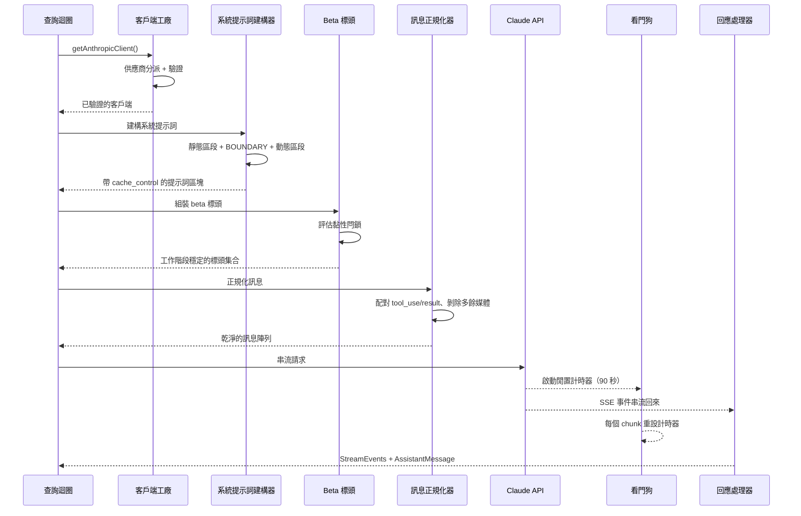
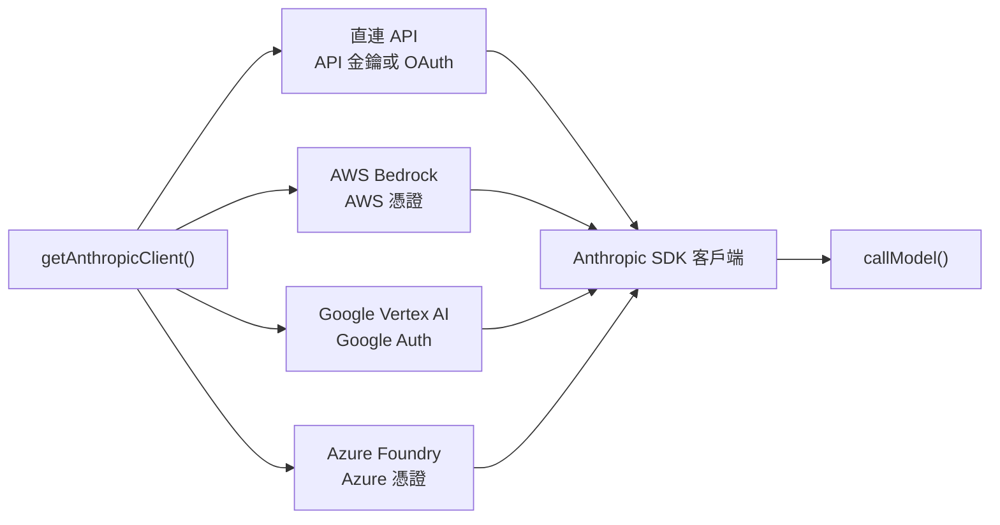
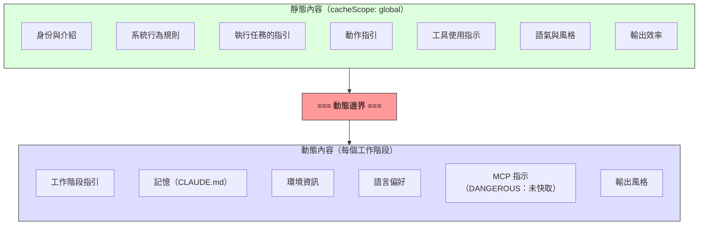

# 第 4 章：API 層

第 3 章確立了狀態存放的位置，以及兩層之間如何溝通。現在我們要追蹤狀態被實際運用時發生的事：系統需要與語言模型對話。Claude Code 裡的一切 —— 啟動序列、狀態系統、權限框架 —— 都是為了服務這個時刻而存在。

這一層處理的失敗模式比系統中任何其他部分都多。它必須透過單一透明介面，路由到四個雲端供應商。它必須以位元組等級的精準度來構建系統提示詞，因為伺服器端提示詞快取的運作方式，只要一個區段放錯位置，就可能讓一份價值 50,000 多個 token 的快取失效。它必須在串流回應時主動偵測失敗，因為 TCP 連線會無聲地死掉。而且它必須維持工作階段穩定的不變量，才不會因為對話中途切換功能旗標，而造成看不見的效能斷崖。

讓我們從頭到尾追蹤一次 API 呼叫。

---

## 多供應商客戶端工廠

`getAnthropicClient()` 函式是所有模型通訊的唯一工廠。它會回傳一個 Anthropic SDK 客戶端，依部署目標所使用的供應商進行設定：

分派完全由環境變數驅動，以固定的優先順序評估。四個供應商特定的 SDK 類別全都透過 `as unknown as Anthropic` 被強制轉型為 `Anthropic`。原始碼中的註解誠實得令人耳目一新：「我們一直在對回傳型別說謊。」這種刻意的型別抹除意味著每個消費者都看到統一的介面。其他的程式碼從來不會依供應商分支。

每個供應商 SDK 都是動態匯入的 —— `AnthropicBedrock`、`AnthropicFoundry`、`AnthropicVertex` 都是帶有自己依賴樹的沉重模組。動態匯入確保未使用的供應商永遠不會載入。

供應商的選擇是在啟動時決定，並儲存於啟動 `STATE` 之中。查詢迴圈從不檢查目前啟用的是哪個供應商。從直連 API 切換到 Bedrock 是設定變更，不是程式碼變更。

### buildFetch 包裝器

每個對外的 fetch 都會被包裝，以注入一個 `x-client-request-id` 標頭 —— 每次請求產生的 UUID。當請求逾時時，伺服器永遠不會為回應指派 request ID。沒有客戶端這一側的 ID，API 團隊就無法將逾時事件與伺服器端的日誌關聯起來。這個標頭彌補了這個落差。它只會送到 Anthropic 第一方的端點 —— 第三方供應商可能會拒絕未知的標頭。

---

## 系統提示詞的構建

系統提示詞是整個系統中對快取最敏感的產物。Claude 的 API 提供伺服器端提示詞快取：跨請求相同的提示詞前綴可以被快取，同時節省延遲與成本。一個 200K token 的對話可能有 50-70K token 與上一回合完全相同。讓那個快取失效，會迫使伺服器重新處理所有內容。

### 動態邊界標記

提示詞被建構為一個字串區段的陣列，中間有一條關鍵的分界線：

邊界之前的一切跨工作階段、使用者與組織都相同 —— 它享有最高等級的伺服器端快取。邊界之後的一切則包含使用者特定的內容，會降級為每個工作階段的快取。

區段的命名慣例刻意很吵。新增一個區段時必須在 `systemPromptSection`（安全、可快取）與 `DANGEROUS_uncachedSystemPromptSection`（會破壞快取，需要理由字串）之間做選擇。`_reason` 參數在執行期不會被使用，但它作為強制性的文件 —— 每個會破壞快取的區段都在原始碼中帶著它的正當理由。

### 2^N 問題

`prompts.ts` 中有一段註解解釋了為什麼有條件的區段必須放到邊界之後：

> 這裡的每個條件都是執行期的一個 bit，否則會讓 Blake2b 前綴雜湊的變體倍增（2^N）。

邊界之前的每個布林條件，都會讓全域快取的獨特項目數量翻倍。三個條件產生 8 種變體；五個產生 32 種。靜態區段刻意不帶任何條件。編譯期的功能旗標（由打包器解析）在邊界之前是可以接受的。執行期檢查（這是 Haiku 嗎？使用者是否啟用自動模式？）必須放到邊界之後。

這是那種在你違反之前看不見的限制。一位立意良善的工程師，在邊界之前加入一個受使用者設定控制的區段，可能會無聲地把全域快取碎片化，讓整個機群的提示詞處理成本翻倍。

---

## 串流

### 直接使用原始 SSE，而非 SDK 的抽象

串流實作使用原始的 `Stream<BetaRawMessageStreamEvent>`，而不是 SDK 較高層的 `BetaMessageStream`。原因：`BetaMessageStream` 會在每個 `input_json_delta` 事件上呼叫 `partialParse()`。對於帶有大型 JSON 輸入的工具呼叫（上百行的檔案編輯），這會在每個 chunk 上從頭開始重新解析不斷成長的 JSON 字串 —— O(n^2) 的行為。Claude Code 自己處理工具輸入的累積，所以部分解析完全是浪費。

### 閒置看門狗

TCP 連線可能在沒有通知的情況下死掉。伺服器可能崩潰、負載平衡器可能無聲地切斷連線，或公司的代理伺服器可能逾時。SDK 的請求逾時只涵蓋最初的 fetch —— 一旦 HTTP 200 抵達，逾時就算滿足了。如果串流的本體停下來，沒有東西會察覺。

看門狗的做法：一個 `setTimeout`，每收到一個 chunk 就重設一次。如果 90 秒內沒有 chunk 到達，串流就會被中止，系統會退回到非串流的重試。45 秒的時間點會觸發一則警告。當看門狗觸發時，會連同 client request ID 一起記錄事件以便關聯。

### 非串流後備

當串流在回應中途失敗時（網路錯誤、停滯、截斷），系統會退回到同步的 `messages.create()` 呼叫。這能處理代理伺服器回傳 HTTP 200 卻帶著非 SSE 本體的情況，或者 SSE 串流在中途被截斷的情況。

當串流工具執行處於啟用狀態時，後備機制可以被停用，因為後備會重新執行整個請求，有可能讓工具執行兩次。

---

## 提示詞快取系統

### 三個層級

提示詞快取在三個層級上運作：

**短暫快取**（預設）：每個工作階段的快取，具有伺服器定義的 TTL（約 5 分鐘）。所有使用者都能獲得。

**1 小時 TTL**：符合資格的使用者能取得延長快取。資格由訂閱狀態決定，並在啟動狀態中被閂鎖 —— 第 3 章提到的 `promptCache1hEligible` 黏性閂鎖確保工作階段中途的超額翻轉不會改變 TTL。

**全域範圍**：系統提示詞快取項目取得跨工作階段、跨組織的共享。提示詞的靜態部分對所有 Claude Code 使用者都相同，因此單一快取副本就能服務所有人。當存在 MCP 工具時全域範圍會被停用，因為 MCP 工具定義是使用者特定的，會把快取碎片化為數百萬個獨特前綴。

### 黏性閂鎖的實際運作

第 3 章那五個黏性閂鎖會在這裡、在請求構建期間被評估。每個閂鎖一開始是 `null`，一旦被設為 `true`，整個工作階段都會保持 `true`。閂鎖區塊上方的註解說得很精準：「動態 beta 標頭的黏性開啟閂鎖。每個標頭一旦首次被送出，就會在工作階段的其餘時間持續被送出，這樣工作階段中途的切換就不會改變伺服器端的快取鍵，也就不會讓約 50-70K 個 token 的快取失效。」

關於閂鎖模式的完整解釋、五個具體的閂鎖，以及為什麼「永遠送出所有標頭」不是正確的解法，請參閱第 3 章第 3.1 節。

---

## queryModel 產生器

`queryModel()` 函式是一個非同步產生器（約 700 行），負責協調整個 API 呼叫的生命週期。它會產出 `StreamEvent`、`AssistantMessage` 以及 `SystemAPIErrorMessage` 物件。

請求的組裝遵循一個精心安排的順序：

1. **Kill switch 檢查** —— 針對最昂貴模型層級的安全閥
2. **Beta 標頭組裝** —— 視模型而定，並套用黏性閂鎖
3. **工具 schema 建構** —— 透過 `Promise.all()` 平行進行，延後的工具會被排除，直到被發現為止
4. **訊息正規化** —— 修復孤立的 tool_use/tool_result 不匹配、剝除多餘媒體、移除過時區塊
5. **系統提示詞區塊構建** —— 在動態邊界處分割，指派快取範圍
6. **包裝重試的串流** —— 處理 529（過載）、模型後備、thinking 降級、OAuth 重新整理

### 輸出 token 上限

預設的輸出上限是 8,000 個 token，而不是常見的 32K 或 64K。正式環境的資料顯示 p99 輸出是 4,911 個 token —— 標準上限過度預留了 8-16 倍。當回應碰到上限時（少於 1% 的請求），會在 64K 下乾淨地重試一次。這在整個機群的規模下節省了可觀的成本。

### 錯誤處理與重試

`withRetry()` 函式本身是一個非同步產生器，會產出 `SystemAPIErrorMessage` 事件，讓 UI 可以顯示重試狀態。重試策略：

- **529（過載）**：等待後重試，必要時降級 fast mode
- **模型後備**：主要模型失敗時，嘗試後備模型（例如 Opus 降到 Sonnet）
- **Thinking 降級**：上下文視窗溢位時觸發較小的思考預算
- **OAuth 401**：重新整理 token 並重試一次

產生器模式意味著重試進度（「伺服器過載，5 秒後重試...」）會以事件串流中自然的一部分出現，而不是透過側通道通知。

---

## 實務應用

**把提示詞快取當成架構性的限制，而不是功能開關。** 多數 LLM 應用「開啟」快取。Claude Code 把它當成一個會塑造提示詞排序、區段記憶化、標頭閂鎖與設定管理的設計限制。結構良好的提示詞（命中 50K token 的快取）與結構不良的提示詞（每一回合都重新處理全部內容）之間的差異，是系統中單一最大的成本槓桿。

**為昂貴的緊急出口採用 DANGEROUS 命名慣例。** 當一個程式碼庫有一個容易不小心違反的不變量時，以吵鬧的前綴命名緊急出口會做三件事：讓違反在程式碼審查中可見、強制文件化（那個必要的理由參數），並對安全預設產生心理摩擦。這可以推廣到快取之外，任何具有隱形成本的操作都適用。

**用看門狗而非單純的逾時來建構串流。** SDK 的請求逾時在 HTTP 200 時就滿足了，但回應本體可能在任何時刻停止抵達。一個在每個 chunk 上都重設的 `setTimeout` 能抓到這種情況。非串流後備機制處理的是企業環境中比你預期更常見的代理伺服器失敗模式（HTTP 200 卻帶著非 SSE 本體、串流中途截斷）。

**讓重試策略以產出為基礎，而不是以例外為基礎。** 把重試包裝器做成一個會產出狀態事件的非同步產生器，呼叫者就能把重試進度以事件串流中自然的一部分來呈現。模型後備模式（Opus 失敗就試 Sonnet）對正式環境的韌性特別有用。

**把快速路徑與完整的管線分開。** 不是每個 API 呼叫都需要工具搜尋、advisor 整合、思考預算與串流基礎設施。Claude Code 的 `queryHaiku()` 函式為內部操作（壓縮、分類）提供了一條精簡路徑，跳過所有與 agentic 相關的顧慮。一個帶有簡化介面的獨立函式能防止複雜性意外滲漏。

---

## 前瞻

API 層坐落在後續一切的基礎之上。第 5 章將展示查詢迴圈如何利用串流回應來驅動工具執行 —— 包括工具如何在模型完成其回應之前就開始執行。第 6 章將解釋壓縮系統在對話接近上下文上限時如何保持快取效率。第 7 章將展示每個 agent 執行緒如何擁有自己的訊息陣列與請求鏈。

這些系統全都繼承了這裡所確立的限制：把快取穩定性當作架構不變量、透過客戶端工廠達成的供應商透明度，以及透過閂鎖系統達成的工作階段穩定設定。API 層不只是送出請求 —— 它定義了其他每個系統賴以運作的規則。
