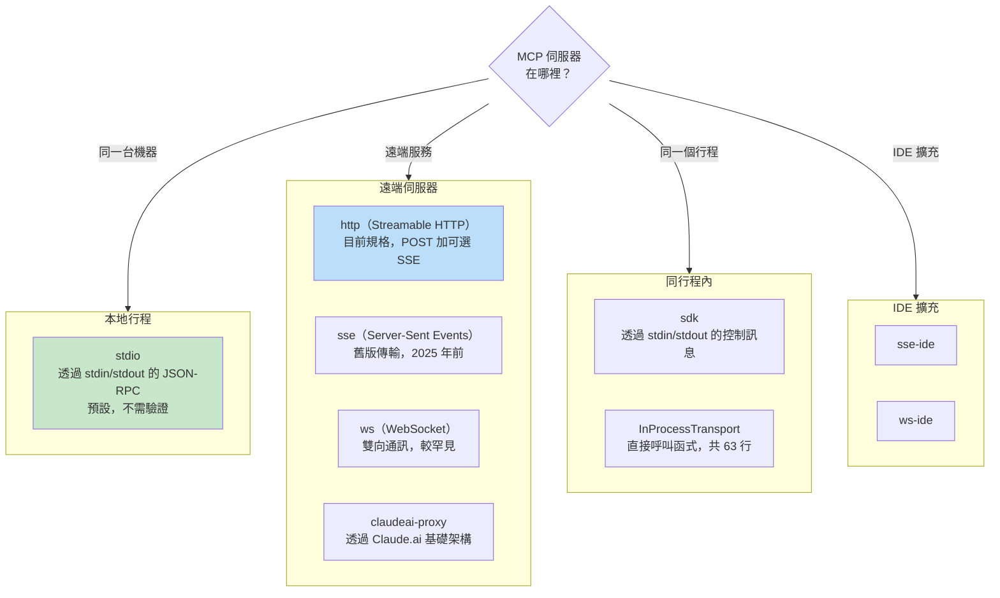
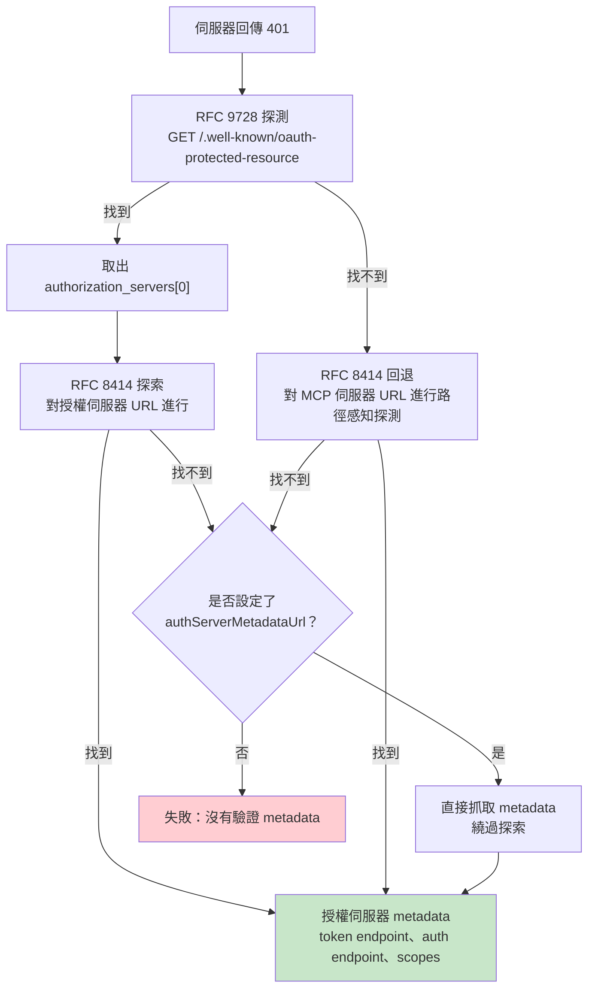

# 第 15 章：MCP —— 通用工具協定

## 為什麼 MCP 的重要性超越 Claude Code

本書其他章節都在談 Claude Code 的內部結構，這一章不太一樣。Model Context Protocol（模型上下文協定）是一份開放規格，任何 agent 都可以實作，而 Claude Code 的 MCP 子系統是目前現存最完整的生產級客戶端之一。如果你正在打造一個需要呼叫外部工具的 agent —— 無論用什麼語言、跑在哪個模型上 —— 本章的模式都可以直接套用。

核心命題很直白：MCP 以 JSON-RPC 2.0 定義了一套協定，用於在客戶端（agent）與伺服器（工具提供者）之間進行工具探索與呼叫。客戶端送出 `tools/list` 來發現某個伺服器提供哪些工具，然後用 `tools/call` 執行。伺服器以名稱、描述以及輸入的 JSON Schema 來描述每個工具。整個契約就這麼簡單。其他一切 —— 傳輸選擇、驗證、組態載入、工具名稱正規化 —— 都是把一份乾淨的規格變成能在真實世界存活的產品所需的工程工作。

Claude Code 的 MCP 實作橫跨四個核心檔案：`types.ts`、`client.ts`、`auth.ts` 與 `InProcessTransport.ts`。它們合起來支援八種傳輸類型、七種組態範疇、跨兩份 RFC 的 OAuth 探索，以及一層工具包裝，讓 MCP 工具與內建工具在模型眼中無法區分 —— 使用的是第 6 章介紹的同一個 `Tool` 介面。本章會逐層拆解。

---

## 八種傳輸類型

任何 MCP 整合的第一個設計決定，就是客戶端要如何與伺服器溝通。Claude Code 支援八種傳輸設定：



有三個設計選擇值得留意。第一，`stdio` 是預設值 —— 當 `type` 未指定時，系統會假設這是一個本地子行程。這與最早期的 MCP 組態保持向後相容。第二，fetch 包裝層層堆疊：timeout 包裝在 step-up 偵測外層，再外層才是基礎 fetch。每一層包裝只處理一個問題。第三，`ws-ide` 分支會依 Bun/Node 執行環境分流 —— Bun 的 `WebSocket` 原生支援 proxy 與 TLS 選項，而 Node 需要 `ws` 套件。

**什麼時候用哪種。** 對本地工具（檔案系統、資料庫、自訂腳本）用 `stdio` —— 沒有網路、沒有驗證，就只是 pipe。對遠端服務，`http`（Streamable HTTP）是目前規格建議。`sse` 是舊版但部署廣泛。`sdk`、IDE 以及 `claudeai-proxy` 類型則分別屬於各自生態系的內部用途。

---

## 組態載入與範疇

MCP 伺服器組態從七個範疇載入、合併、再去重：

| 範疇 | 來源 | 信任等級 |
|-------|--------|-------|
| `local` | 工作目錄下的 `.mcp.json` | 需使用者核可 |
| `user` | `~/.claude.json` 的 mcpServers 欄位 | 使用者自行管理 |
| `project` | 專案層級組態 | 專案共用設定 |
| `enterprise` | 企業管控組態 | 由組織預先核可 |
| `managed` | 外掛提供的伺服器 | 自動探索 |
| `claudeai` | Claude.ai 網頁介面 | 透過網頁預先授權 |
| `dynamic` | 執行階段注入（SDK） | 程式化加入 |

**去重以內容為依據，而非名稱。** 兩個名稱不同但 command 或 URL 相同的伺服器會被視為同一個。`getMcpServerSignature()` 函式會計算一個正規化鍵值：本地伺服器使用 `stdio:["command","arg1"]`，遠端伺服器則使用 `url:https://example.com/mcp`。外掛提供的伺服器如果 signature 與手動組態相同，就會被抑制。

---

## 工具包裝：從 MCP 到 Claude Code

連線成功後，客戶端會呼叫 `tools/list`。每個工具定義會被轉換為 Claude Code 內部的 `Tool` 介面 —— 與內建工具所使用的介面相同。包裝之後，模型無法分辨一個工具是內建還是來自 MCP。

包裝過程有四個階段：

**1. 名稱正規化。** `normalizeNameForMCP()` 會把非法字元替換為底線。完整名稱遵循 `mcp__{serverName}__{toolName}` 的格式。

**2. 描述截斷。** 上限為 2,048 個字元。曾觀察到由 OpenAPI 產生的伺服器把 15 到 60KB 的內容塞進 `tool.description` —— 對單一工具而言，這大約等於每一輪 15,000 個 tokens。

**3. Schema 直通。** 工具的 `inputSchema` 會直接傳給 API，不做轉換，也不在包裝時驗證。Schema 錯誤會在呼叫時才冒出來，而不是註冊時。

**4. Annotation 對應。** MCP annotation 會對應到行為旗標：`readOnlyHint` 標示該工具可以安全地並行執行（如第 7 章串流執行器所述），`destructiveHint` 則會觸發額外的權限審查。這些 annotation 來自 MCP 伺服器 —— 惡意伺服器可能把具破壞性的工具標記為唯讀。這是一條被接受的信任邊界，但值得理解：使用者已主動加入該伺服器，而惡意伺服器把破壞性工具標為唯讀確實是一個實際的攻擊面。系統之所以接受這個取捨，是因為另一個選項 —— 完全忽略 annotation —— 會讓正派的伺服器無法改善使用者體驗。

---

## MCP 伺服器的 OAuth

遠端 MCP 伺服器通常需要驗證。Claude Code 實作了完整的 OAuth 2.0 加 PKCE 流程，包含基於 RFC 的探索、Cross-App Access 以及錯誤主體正規化。

### 探索鏈



`authServerMetadataUrl` 這個逃生出口之所以存在，是因為有些 OAuth 伺服器兩份 RFC 都沒實作。

### Cross-App Access（XAA）

當 MCP 伺服器組態帶有 `oauth.xaa: true` 時，系統會透過 Identity Provider 執行聯邦式 token 交換 —— 一次 IdP 登入可解鎖多個 MCP 伺服器。

### 錯誤主體正規化

`normalizeOAuthErrorBody()` 函式負責處理那些違反規格的 OAuth 伺服器。Slack 對錯誤回應會回傳 HTTP 200，把錯誤埋在 JSON 主體裡。這個函式會窺看 2xx 的 POST 回應主體，當內容符合 `OAuthErrorResponseSchema` 但不符合 `OAuthTokensSchema` 時，就把回應重寫為 HTTP 400。它也會把 Slack 特有的錯誤代碼（`invalid_refresh_token`、`expired_refresh_token`、`token_expired`）正規化為標準的 `invalid_grant`。

---

## 同行程內傳輸

不是每一個 MCP 伺服器都得是獨立行程。`InProcessTransport` 類別可以讓 MCP 伺服器與客戶端跑在同一個行程裡：

```typescript
class InProcessTransport implements Transport {
  async send(message: JSONRPCMessage): Promise<void> {
    if (this.closed) throw new Error('Transport is closed')
    queueMicrotask(() => { this.peer?.onmessage?.(message) })
  }
  async close(): Promise<void> {
    if (this.closed) return
    this.closed = true
    this.onclose?.()
    if (this.peer && !this.peer.closed) {
      this.peer.closed = true
      this.peer.onclose?.()
    }
  }
}
```

整個檔案只有 63 行。有兩個設計決定值得注意。第一，`send()` 透過 `queueMicrotask()` 投遞，避免同步請求 / 回應循環造成的呼叫堆疊過深問題。第二，`close()` 會層層傳遞到 peer，避免出現半開狀態。Chrome MCP 伺服器與 Computer Use MCP 伺服器都採用這個模式。

---

## 連線管理

### 連線狀態

每個 MCP 伺服器連線都處於以下五種狀態之一：`connected`、`failed`、`needs-auth`（附帶 15 分鐘 TTL 快取，避免 30 個伺服器各自獨立地去探索同一個過期 token）、`pending` 或 `disabled`。

### 工作階段過期偵測

MCP 的 Streamable HTTP 傳輸使用 session ID。當伺服器重啟後，請求會回傳 HTTP 404 加上 JSON-RPC 錯誤碼 -32001。`isMcpSessionExpiredError()` 函式會同時檢查這兩個訊號 —— 請注意它是用字串包含來偵測錯誤碼，這很務實但也脆弱：

```typescript
export function isMcpSessionExpiredError(error: Error): boolean {
  const httpStatus = 'code' in error ? (error as any).code : undefined
  if (httpStatus !== 404) return false
  return error.message.includes('"code":-32001') ||
    error.message.includes('"code": -32001')
}
```

偵測到之後，連線快取會被清掉並重試一次呼叫。

### 批次連線

本地伺服器以 3 個為一批建立連線（啟動行程可能會耗盡檔案描述子），遠端伺服器則以 20 個為一批。React context provider `MCPConnectionManager.tsx` 負責管理生命週期，並對目前連線與新組態之間做 diff。

---

## Claude.ai Proxy 傳輸

`claudeai-proxy` 傳輸展示了一個常見的 agent 整合模式：透過中介連線。Claude.ai 訂閱者透過網頁介面設定 MCP「connector」，CLI 再透過 Claude.ai 的基礎架構繞送，由 Claude.ai 負責處理供應商端的 OAuth。

`createClaudeAiProxyFetch()` 函式會在請求發出當下就擷取 `sentToken`，而不是在收到 401 之後才重新讀取。在多個 connector 同時出現 401 的情況下，另一個 connector 的重試可能早就把 token 刷新好了。即使 refresh handler 回傳 false，這個函式也會檢查是否有並行 refresh —— 也就是「ELOCKED 競爭」的情況，另一個 connector 贏得了 lockfile 的競賽。

---

## Timeout 架構

MCP 的 timeout 是分層的，每一層都在防堵不同的失敗模式：

| 層級 | 時長 | 防堵的問題 |
|-------|----------|------------------|
| 連線 | 30 秒 | 連不上或啟動緩慢的伺服器 |
| 單次請求 | 60 秒（每次請求都是全新的） | 過期 timeout 訊號的 bug |
| 工具呼叫 | 約 27.8 小時 | 正當的長時間操作 |
| 驗證 | 每個 OAuth 請求 30 秒 | 連不上的 OAuth 伺服器 |

單次請求的 timeout 特別值得強調。早期實作在連線時只建立一個 `AbortSignal.timeout(60000)`。閒置 60 秒之後，下一次請求會立刻被中止 —— 因為那個訊號早就過期了。修法是：`wrapFetchWithTimeout()` 會為每一次請求建立一個全新的 timeout 訊號。它也會把 `Accept` header 正規化，作為對那些會把這個 header 丟掉的執行環境和 proxy 的最後一道防線。

---

## 實務應用：把 MCP 整合進你自己的 agent

**先從 stdio 開始，之後再加複雜度。** `StdioClientTransport` 會把一切都搞定：spawn、pipe、kill。一行組態、一個傳輸類別，你就擁有了 MCP 工具。

**正規化名稱並截斷描述。** 名稱必須符合 `^[a-zA-Z0-9_-]{1,64}$`。加上 `mcp__{serverName}__` 前綴以避免衝突。把描述限制在 2,048 個字元 —— 不然由 OpenAPI 產生的伺服器會把 context tokens 燒個精光。

**惰性處理驗證。** 除非伺服器回傳 401，否則不要主動嘗試 OAuth。大多數 stdio 伺服器根本不需要驗證。

**為內建伺服器使用同行程內傳輸。** `createLinkedTransportPair()` 可以省掉你自己掌控的伺服器之子行程成本。

**尊重工具 annotation 並淨化輸出。** `readOnlyHint` 啟用並行執行。對回應進行淨化，過濾掉可能誤導模型的惡意 Unicode（雙向覆寫、零寬連接符等）。

MCP 協定刻意保持最小 —— 只有兩個 JSON-RPC 方法。在這兩個方法與一個生產部署之間的一切，都是工程：八種傳輸、七種組態範疇、兩份 OAuth RFC 以及分層 timeout。Claude Code 的實作展示了這樣的工程在規模化時長什麼樣。

下一章檢視當 agent 伸出 localhost 之外會發生什麼事：那些讓 Claude Code 能跑在雲端容器裡、接受瀏覽器的指令，以及把 API 流量隧道穿過會注入憑證的 proxy 的遠端執行協定。
