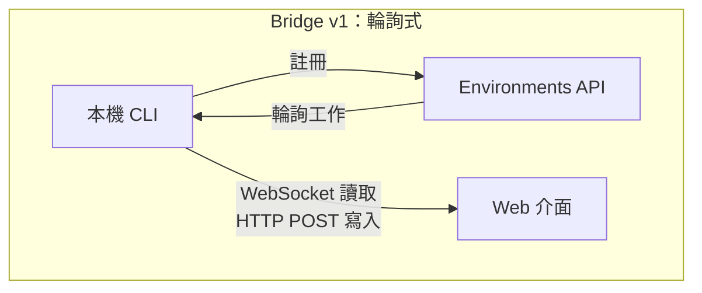
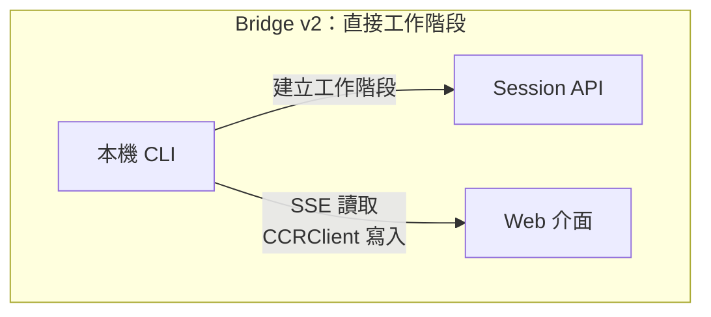
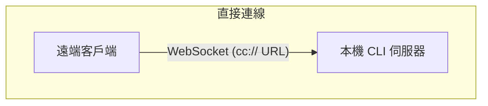
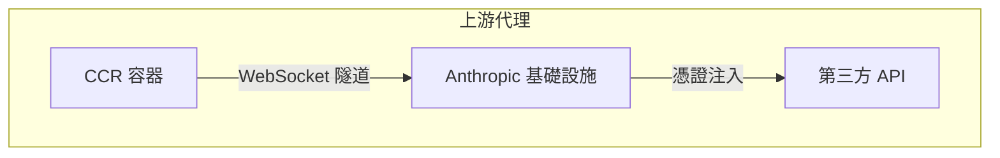

# 第 16 章：遠端執行 (Remote)

## agent 伸向 localhost 之外

到目前為止，每一章都假設 Claude Code 與程式碼存在於同一台機器上。終端機在本機、檔案系統在本機、模型回應串流回一個同時掌控鍵盤與工作目錄的行程。

但只要你想從瀏覽器控制 Claude Code、在雲端容器中執行它，或把它當成 LAN 內的服務對外公開，這個假設就立刻崩潰。agent 需要一種方式來接收來自瀏覽器、行動 app 或自動化管線的指令——把權限提示轉發給不在終端機前的人，並讓它的 API 流量穿過可能會注入憑證、或代替 agent 終結 TLS 的基礎設施。

Claude Code 用四套系統解決這個問題，每一套對應不同的拓樸：

<div class="diagram-grid">









</div>

這些系統共享一套設計哲學：讀取與寫入是非對稱的、重新連線是自動的、失敗會優雅地降級。

---

## Bridge v1：輪詢、分派、生成

v1 橋接器是基於環境的遠端控制系統。當開發者執行 `claude remote-control` 時，CLI 會向 Environments API 註冊、輪詢工作，並為每個工作階段生成一個子行程。

在註冊之前會先跑一連串的前置檢查：執行期功能開關、OAuth token 驗證、組織政策檢查、失效 token 偵測（對同一個過期 token 連續失敗三次後跨行程退避），以及主動 token 更新——這項措施消除了大約 9% 原本會在首次嘗試就失敗的註冊。

註冊完成後，橋接器進入長輪詢迴圈。工作項目以工作階段（內含 `secret` 欄位，包含工作階段 token、API 基底 URL、MCP 設定與環境變數）或健康檢查的形式送達。橋接器會把「沒有工作」的日誌訊息限流為每 100 次空輪詢才輸出一次。

每個工作階段都會生成一個子 Claude Code 行程，透過 stdin/stdout 上的 NDJSON 通訊。權限請求流經橋接器傳輸層送到 Web 介面，由使用者批准或拒絕。整趟往返必須在大約 10-14 秒內完成。

---

## Bridge v2：直接工作階段與 SSE

v2 橋接器把整個 Environments API 層整個拔掉——沒有註冊、沒有輪詢、沒有確認、沒有心跳、沒有註銷。動機在於：v1 要求伺服器在分派工作之前就知道機器的能力。v2 把整個生命週期壓縮成三步：

1. **建立工作階段**：`POST /v1/code/sessions`，帶上 OAuth 憑證。
2. **連接橋接器**：`POST /v1/code/sessions/{id}/bridge`。回傳 `worker_jwt`、`api_base_url` 與 `worker_epoch`。每次呼叫 `/bridge` 都會讓 epoch 遞增——它本身就是註冊。
3. **開啟傳輸**：讀取用 SSE、寫入用 `CCRClient`。

傳輸抽象層（`ReplBridgeTransport`）把 v1 與 v2 統一在同一個介面之後，因此訊息處理不需要知道自己正在跟哪一代對話。

當 SSE 連線因為 401 而中斷時，傳輸層會從新的 `/bridge` 呼叫取得新鮮的憑證重建連線，同時保留序號游標——訊息不會遺失。寫入路徑使用每個實例獨立的 `getAuthToken` closure，而不是整個行程共用的環境變數，避免 JWT 在並行的工作階段之間外洩。

### FlushGate

一個微妙的順序問題：橋接器需要送出對話歷史，同時又要接受來自 Web 介面的即時寫入。如果即時寫入在歷史刷新過程中抵達，訊息可能會以錯誤順序送達。`FlushGate` 會在刷新 POST 期間把即時寫入排入佇列，並在完成後依序排空。

### Token 更新與 Epoch 管理

v2 橋接器會在 worker JWT 過期前主動更新。新的 epoch 告訴伺服器：這仍然是同一個 worker，只是換了憑證。Epoch 不一致（409 回應）的處理相當強硬：兩條連線都會關閉，並以例外向上拋出打斷呼叫方，避免分裂大腦 (split-brain) 的情況。

---

## 訊息路由與回音去重

兩代橋接器都共享 `handleIngressMessage()` 作為中央路由器：

1. 解析 JSON，將控制訊息的 key 正規化。
2. 把 `control_response` 路由到權限處理器，把 `control_request` 路由到請求處理器。
3. 對照 `recentPostedUUIDs`（回音去重）與 `recentInboundUUIDs`（重送去重）檢查 UUID。
4. 轉發通過驗證的使用者訊息。

### BoundedUUIDSet：O(1) 查詢、O(capacity) 記憶體

橋接器有回音問題——訊息可能從讀取串流回彈，或在傳輸層切換期間被送兩次。`BoundedUUIDSet` 是一個以環狀緩衝區為底、FIFO 有界的集合：

```typescript
class BoundedUUIDSet {
  private buffer: string[]
  private set: Set<string>
  private head = 0

  add(uuid: string): void {
    if (this.set.size >= this.capacity) {
      this.set.delete(this.buffer[this.head])
    }
    this.buffer[this.head] = uuid
    this.set.add(uuid)
    this.head = (this.head + 1) % this.capacity
  }

  has(uuid: string): boolean { return this.set.has(uuid) }
}
```

兩個實例並行執行，容量各為 2000。查詢透過 Set 是 O(1)、記憶體透過環狀緩衝區汰換是 O(capacity)、沒有計時器也沒有 TTL。未知的控制請求子類型會得到錯誤回應，而不是沉默——這可避免伺服器癡等一個永遠不會來的回應。

---

## 非對稱設計：持久讀取、HTTP POST 寫入

CCR 協定採用非對稱傳輸：讀取經由持久連線（WebSocket 或 SSE）、寫入經由 HTTP POST。這反映了通訊模式中的一種根本非對稱性。

讀取是高頻、低延遲、由伺服器發起的——在 token 串流期間每秒有數百個小訊息。持久連線是唯一合理的選擇。寫入則是低頻、由客戶端發起，且需要確認——是每分鐘數則訊息，而不是每秒。HTTP POST 提供可靠的傳遞、透過 UUID 實現冪等，並能自然地與負載平衡器整合。

試圖把兩者統一到單一條 WebSocket 上會造成耦合：如果 WebSocket 在寫入過程中斷線，你就得處理重試邏輯，還得區分「沒送出去」與「送出去了但確認遺失」。獨立的通道讓各自都能被獨立最佳化。

---

## 遠端工作階段管理

`SessionsWebSocket` 管理 CCR WebSocket 連線的客戶端端。它的重新連線策略會依據失敗類型做區分：

| 失敗 | 策略 |
|---------|----------|
| 4003（未授權） | 立刻停止，不重試 |
| 4001（找不到工作階段） | 最多 3 次重試，線性退避（在壓縮過程中短暫發生） |
| 其他短暫失敗 | 指數退避，最多 5 次 |

`isSessionsMessage()` 類型守衛接受任何擁有字串 `type` 欄位的物件——刻意放寬。寫死的白名單會在客戶端更新之前默默丟掉新的訊息類型。

---

## 直接連線：本機伺服器

直接連線是最簡單的拓樸：Claude Code 以伺服器身分執行，客戶端透過 WebSocket 連入。沒有雲端中介、沒有 OAuth token。

工作階段有五種狀態：`starting`、`running`、`detached`、`stopping`、`stopped`。中繼資料會持久化到 `~/.claude/server-sessions.json`，以便在伺服器重啟後恢復。`cc://` URL scheme 為本機連線提供乾淨的定址方式。

---

## 上游代理：容器內的憑證注入

上游代理在 CCR 容器內部執行，解決一個特定的問題：在 agent 可能執行不受信任指令的容器裡，為從容器對外送出的 HTTPS 流量注入組織憑證。

設定順序經過仔細安排：

1. 從 `/run/ccr/session_token` 讀取工作階段 token。
2. 透過 Bun FFI 設定 `prctl(PR_SET_DUMPABLE, 0)`——阻擋同一個 UID 對行程堆積 (heap) 做 ptrace。沒有這步，一個被提示詞注入的 `gdb -p $PPID` 就能從記憶體刮到 token。
3. 下載上游代理的 CA 憑證，並串接到系統的 CA bundle。
4. 在一個臨時埠上啟動本機的 CONNECT 到 WebSocket 轉送器。
5. 刪掉 token 檔——token 現在只存在於堆積 (heap) 上。
6. 為所有子行程匯出環境變數。

每一步都採用「失敗開放 (fail open)」：錯誤只會讓代理停用，而不是殺掉工作階段。這是正確的取捨——代理失效意味著某些整合會無法運作，但核心功能仍然可用。

### 手寫 Protobuf 編碼

穿過隧道的位元組會被包在 `UpstreamProxyChunk` protobuf 訊息裡。schema 非常簡單——`message UpstreamProxyChunk { bytes data = 1; }`——Claude Code 用十行程式碼手寫編碼，而不是引入一整個 protobuf runtime：

```typescript
export function encodeChunk(data: Uint8Array): Uint8Array {
  const varint: number[] = []
  let n = data.length
  while (n > 0x7f) { varint.push((n & 0x7f) | 0x80); n >>>= 7 }
  varint.push(n)
  const out = new Uint8Array(1 + varint.length + data.length)
  out[0] = 0x0a  // field 1, wire type 2
  out.set(varint, 1)
  out.set(data, 1 + varint.length)
  return out
}
```

十行程式碼取代整個 protobuf runtime。單一欄位的訊息不值得拉進一個依賴——手寫位元操作的維護負擔遠低於供應鏈風險。

---

## 實務應用：設計遠端 agent 執行

**讀寫通道分離。** 當讀取是高頻串流、寫入是低頻 RPC 時，把它們統一起來只會造成不必要的耦合。讓每條通道獨立地失敗與恢復。

**限制你的去重記憶體用量。** BoundedUUIDSet 模式提供固定記憶體的去重機制。任何「至少一次」傳遞的系統都需要一個有界的去重緩衝區，而不是無界的 Set。

**讓重新連線策略與失敗訊號成正比。** 永久性失敗不該重試；短暫失敗應該加退避重試；模糊的失敗應該用低上限重試。

**在敵對環境中讓機密只存在堆積 (heap) 上。** 從檔案讀取 token、停用 ptrace、再刪掉檔案，能同時消除檔案系統與記憶體檢視這兩條攻擊路徑。

**輔助系統失敗開放。** 上游代理採用失敗開放，因為它提供的是增強功能（憑證注入），不是核心功能（模型推論）。

遠端執行系統體現了一個更深層的原則：agent 的核心迴圈（第 5 章）應該對「指令從哪裡來、結果送到哪裡去」保持無知。橋接器、直接連線與上游代理都是傳輸層。在它們之上的訊息處理、工具執行與權限流程，不管使用者是坐在終端機前、還是在一條 WebSocket 的另一端，都是完全相同的。

下一章將探討另一個營運層面的議題：效能——Claude Code 如何在啟動、渲染、搜尋與 API 成本上，讓每一毫秒與每一個 token 都發揮作用。
