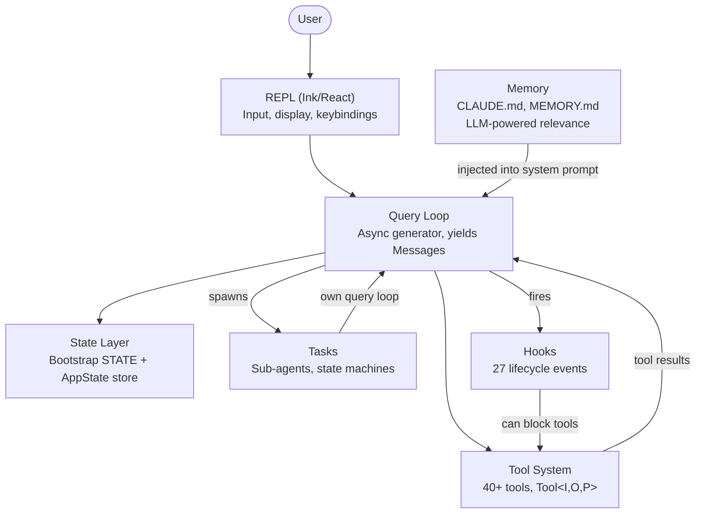
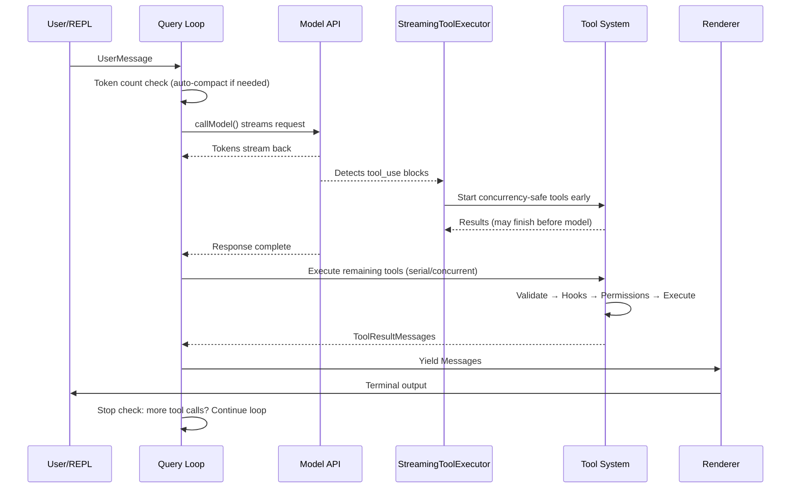
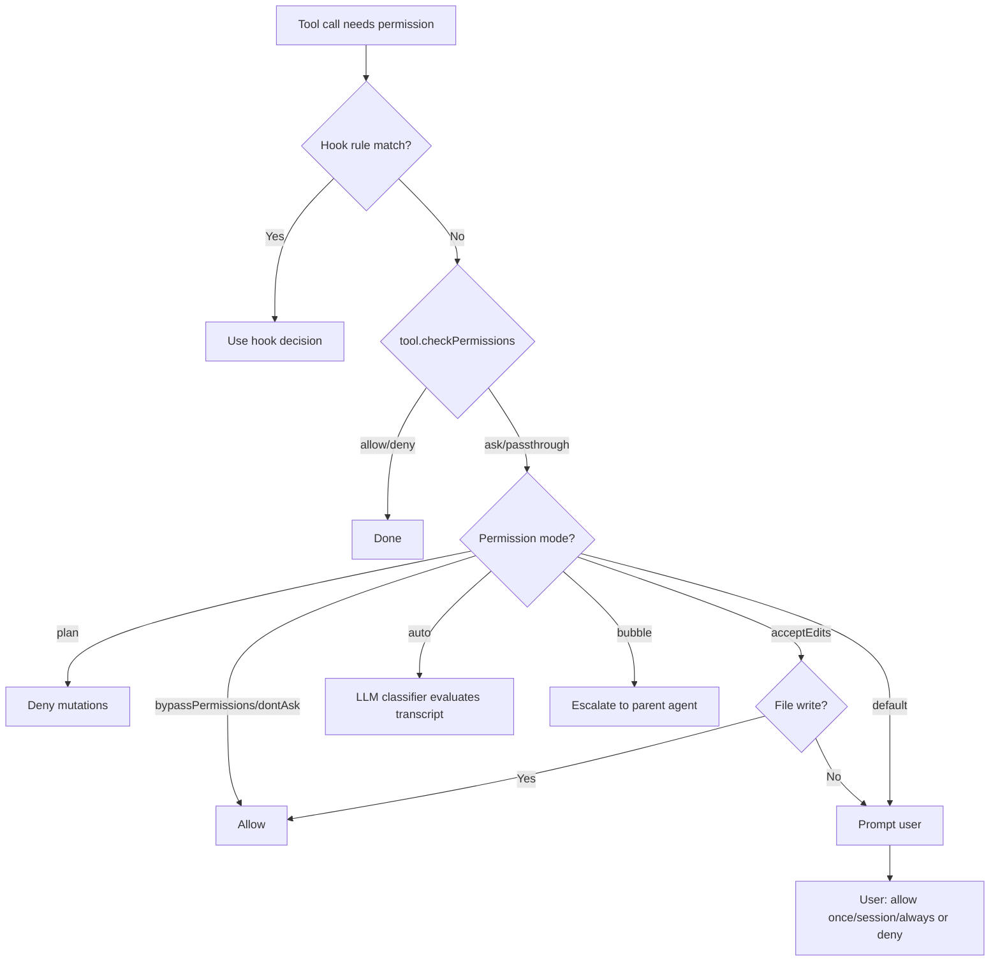
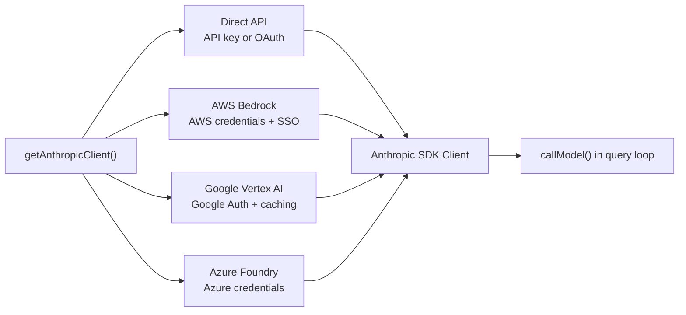
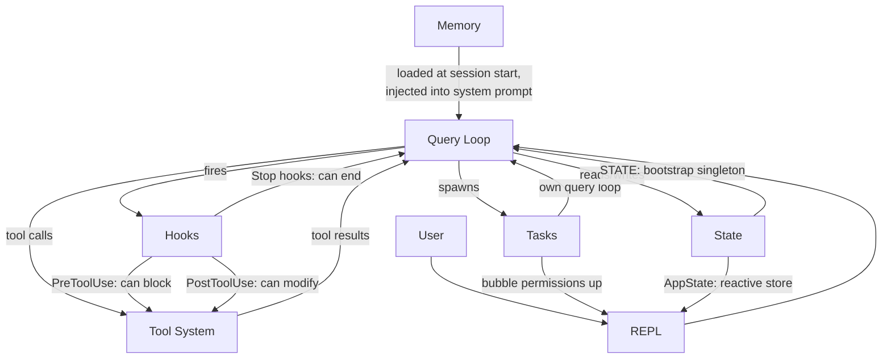

# 第一章：AI Agent 的架構

## 你正在看的是什麼

傳統的 CLI 是一個函式。它接受參數、執行工作、然後退出。`grep` 不會自行決定順便執行 `sed`。`curl` 不會打開一個檔案，然後根據下載的內容去修補它。契約很簡單：一個指令、一個動作、確定性的輸出。

Agentic CLI 打破了這個契約的每一個部分。它接受自然語言 prompt，決定使用哪些工具，按照情境需求以任意順序執行它們，評估結果，然後持續迴圈直到任務完成或使用者中止。這個「程式」不是一個固定的指令序列——它是一個圍繞語言模型的迴圈，在執行時期動態產生自己的指令序列。Tool call 是副作用。模型的推理就是控制流。

Claude Code 是 Anthropic 對這個理念的生產級實作：一個由近兩千個檔案組成的 TypeScript 單體應用，將終端機轉變為由 Claude 驅動的完整開發環境。它已經交付給數十萬名開發者使用，這意味著每一個架構決策都承載著真實世界的後果。本章為你建立心智模型。六個抽象層定義了整個系統。一條資料流將它們串連起來。一旦你內化了從按鍵到最終輸出的黃金路徑，後續每一章都只是對這條路徑某一段的深入剖析。

接下來的內容是一種回溯式的分解——這六個抽象層並非事先在白板上設計出來的。它們是在將生產級 agent 交付給大規模使用者群體的壓力下逐漸浮現的。以它們現在的樣子去理解它們，而非它們被規劃時的樣子，才能為本書後續內容設定正確的期望。

---

## 六大核心抽象層

Claude Code 建構在六個核心抽象層之上。其他所有東西——400 多個工具檔案、fork 出來的終端機渲染器、vim 模擬、成本追蹤器——都是為了支撐這六個抽象層而存在的。



以下是每一個抽象層的功能及其存在的原因。

**1. Query Loop**（`query.ts`，約 1,700 行）。一個 async generator，是整個系統的心跳。它串流模型回應、收集 tool call、執行它們、將結果附加到訊息歷史，然後迴圈。每一次互動——REPL、SDK、sub-agent、headless 模式的 `--print`——都流經這個單一函式。它 yield `Message` 物件供 UI 消費。它的回傳型別是一個名為 `Terminal` 的 discriminated union，精確編碼了迴圈停止的原因：正常完成、使用者中止、token 預算耗盡、stop hook 介入、最大回合數、或不可恢復的錯誤。Generator 模式——而非 callback 或 event emitter——提供了自然的 backpressure、乾淨的取消機制，以及型別化的終止狀態。第五章完整涵蓋迴圈的內部實作。

**2. Tool System**（`Tool.ts`、`tools.ts`、`services/tools/`）。Tool 是 agent 在世界中能做的任何事情：讀取檔案、執行 shell 指令、編輯程式碼、搜尋網頁。這種目的的簡潔性背後隱藏著大量的機制。每個 tool 實作了一個豐富的介面，涵蓋身份識別、schema、執行、權限和渲染。Tool 不僅僅是函式——它們攜帶自己的權限邏輯、並行性宣告、進度回報和 UI 渲染。系統將 tool call 分割為並行和序列批次，而 streaming executor 在模型尚未完成回應之前就開始執行 concurrency-safe 的 tool。第六章涵蓋完整的 tool 介面和執行管線。

**3. Tasks**（`Task.ts`、`tasks/`）。Tasks 是背景工作單元——主要是 sub-agent。它們遵循一個狀態機：`pending -> running -> completed | failed | killed`。`AgentTool` 會產生一個新的 `query()` generator，擁有自己的訊息歷史、tool 集合和權限模式。Tasks 賦予 Claude Code 遞迴能力：一個 agent 可以委派給 sub-agent，sub-agent 又可以進一步委派。

**4. State**（兩層架構）。系統在兩個層級維護狀態。一個可變的 singleton（`STATE`）持有約 80 個 session 級別的基礎設施欄位：工作目錄、模型配置、成本追蹤、遙測計數器、session ID。它在啟動時設定一次，之後直接修改——沒有響應式機制。一個最小的響應式 store（34 行，Zustand 風格）驅動 UI：訊息、輸入模式、tool 核准、進度指示器。這種分離是刻意的：基礎設施狀態很少變化，不需要觸發重新渲染；UI 狀態持續變化，必須觸發重新渲染。第三章深入介紹這個雙層架構。

**5. Memory**（`memdir/`）。Agent 跨 session 的持久化上下文。三個層級：專案級（repo 中的 `CLAUDE.md` 檔案）、使用者級（`~/.claude/MEMORY.md`）、和團隊級（透過 symlink 共享）。在 session 開始時，系統掃描所有記憶檔案、解析 frontmatter，然後由 LLM 選擇哪些記憶與當前對話相關。Memory 就是 Claude Code 「記住」你的 codebase 慣例、架構決策和除錯歷史的方式。

**6. Hooks**（`hooks/`、`utils/hooks/`）。使用者定義的生命週期攔截器，在 4 種執行類型中的 27 個不同事件點觸發：shell 指令、單次 LLM prompt、多回合 agent 對話，以及 HTTP webhook。Hooks 可以阻擋 tool 執行、修改輸入、注入額外上下文，或短路整個 query loop。權限系統本身部分就是透過 hooks 實作的——`PreToolUse` hooks 可以在互動式權限提示觸發之前就拒絕 tool call。

---

## 黃金路徑：從按鍵到輸出

追蹤一個請求在系統中的完整流程。使用者輸入「為登入函式添加錯誤處理」然後按下 Enter。



關於這個流程，有三件事值得注意。

首先，query loop 是一個 generator，不是 callback 鏈。REPL 透過 `for await` 從中拉取訊息，這意味著 backpressure 是自然的——如果 UI 跟不上，generator 就會暫停。這是刻意選擇 generator 而非 event emitter 或 observable stream 的結果。

其次，tool 執行與模型串流是重疊的。`StreamingToolExecutor` 不會等到模型完成才開始執行 concurrency-safe 的 tool。一個 `Read` 呼叫可以在模型仍在產生回應的其餘部分時就完成並回傳結果。這是推測性執行——如果模型的最終輸出使該 tool call 失效（罕見但可能），結果會被丟棄。

第三，整個迴圈是可重入的。當模型發出 tool call 時，結果會被附加到訊息歷史中，迴圈會以更新後的上下文再次呼叫模型。不存在單獨的「tool result 處理」階段——一切都在同一個迴圈中。模型透過不再發出任何 tool call 來決定它何時完成。

---

## 權限系統

Claude Code 在你的機器上執行任意 shell 指令。它編輯你的檔案。它可以產生子程序、發送網路請求、修改你的 git 歷史。沒有權限系統的話，這就是一場安全災難。

系統定義了七種權限模式，從最寬鬆到最嚴格排列：

| 模式 | 行為 |
|------|------|
| `bypassPermissions` | 一切允許。不做任何檢查。僅供內部/測試使用。 |
| `dontAsk` | 全部允許，但仍然記錄日誌。不提示使用者。 |
| `auto` | Transcript 分類器（LLM）決定允許/拒絕。 |
| `acceptEdits` | 檔案編輯自動核准；所有其他變更操作需要提示。 |
| `default` | 標準互動模式。使用者逐一核准每個動作。 |
| `plan` | 唯讀模式。所有變更操作被阻擋。 |
| `bubble` | 將決策上報給父 agent（sub-agent 模式）。 |

當一個 tool call 需要權限時，解析遵循嚴格的鏈式流程：



`auto` 模式值得特別關注。它執行一個獨立的、輕量級的 LLM 呼叫，根據對話 transcript 對 tool 呼叫進行分類。分類器看到 tool 輸入的精簡表示，然後判斷該動作是否與使用者的請求一致。這是讓 Claude Code 能半自主運作的模式——自動核准例行操作，同時標記任何看起來偏離使用者意圖的行為。

Sub-agent 預設為 `bubble` 模式，這意味著它們無法自行核准危險動作。權限請求會向上傳播到父 agent 或最終到使用者。這防止了 sub-agent 在使用者從未看到的情況下靜默執行破壞性指令。

---

## 多供應商架構

Claude Code 透過四條不同的基礎設施路徑與 Claude 通訊，對系統其餘部分完全透明。



關鍵洞察在於 Anthropic SDK 為每個雲端供應商提供了 wrapper 類別，呈現與直接 API client 相同的介面。`getAnthropicClient()` 工廠函式讀取環境變數和配置來決定使用哪個供應商，建構對應的 client，然後回傳。從那一刻起，`callModel()` 和所有其他消費者都將它視為一個通用的 Anthropic client。

供應商選擇在啟動時決定並儲存在 `STATE` 中。Query loop 永遠不會檢查當前啟用的是哪個供應商。這意味著從 Direct API 切換到 Bedrock 是一個配置變更，而非程式碼變更——agent loop、tool system 和權限模型完全與供應商無關。

---

## 建置系統

Claude Code 同時以 Anthropic 內部工具和公開 npm 套件的形式發布。同一份程式碼庫服務兩者，透過編譯時期的 feature flag 控制包含哪些內容。

```typescript
// Conditional imports guarded by feature flags
const reactiveCompact = feature('REACTIVE_COMPACT')
  ? require('./services/compact/reactiveCompact.js')
  : null
```

`feature()` 函式來自 `bun:bundle`，Bun 的內建 bundler API。在建置時期，每個 feature flag 解析為一個 boolean 字面值。Bundler 的 dead code elimination 會在 flag 為 false 時完全移除 `require()` 呼叫——模組永遠不會被載入、不會被包含在 bundle 中、也不會被交付。

這個模式是一致的：一個頂層的 `feature()` guard 包裹一個 `require()` 呼叫。之所以使用 `require()` 而非 `import`，是因為動態 `require()` 在 guard 為 false 時可以被 bundler 完全消除，而動態 `import()` 不行（它回傳一個 Promise，bundler 必須保留）。

這裡有一個值得一提的諷刺之處。早期 npm 發布版本附帶的 source map 包含了 `sourcesContent`——完整的原始 TypeScript 原始碼，包括僅供內部使用的程式碼路徑。Feature flag 成功地移除了執行時期的程式碼，卻把原始碼留在了 source map 中。這就是 Claude Code 的原始碼變得可公開閱讀的原因。

---

## 各元件如何串連

這六個抽象層形成一個依賴圖：



Memory 作為 system prompt 的一部分注入 query loop。Query loop 驅動 tool 執行。Tool 結果作為訊息回饋到 query loop。Tasks 是擁有隔離訊息歷史的遞迴 query loop。Hooks 在定義好的節點攔截 query loop。State 被所有元件讀寫，響應式 store 作為通往 UI 的橋樑。

Query loop 與 tool system 之間的循環依賴是系統的決定性特徵。模型產生 tool call。Tool 執行並產生結果。結果被附加到訊息歷史。模型看到結果並決定下一步要做什麼。這個循環持續進行，直到模型停止產生 tool call，或外部約束（token 預算、最大回合數、使用者中止）終止它。

以下是它們與後續章節的關聯：從輸入到輸出的黃金路徑是貫穿整本書的主線。第二章追蹤系統如何啟動到這條路徑可以執行的狀態。第三章解釋這條路徑讀寫的雙層狀態架構。第四章涵蓋 query loop 呼叫的 API 層。後續每一章都會放大你剛剛看到的端到端路徑中的某一段。

---

## 應用實踐

如果你正在建構一個 agentic 系統——任何由 LLM 在執行時期決定採取什麼動作的系統——以下是 Claude Code 架構中可遷移的模式。

**Generator loop 模式。** 使用 async generator 作為你的 agent loop，而非 callback 或 event emitter。Generator 給你自然的 backpressure（消費者按自己的速度拉取）、乾淨的取消機制（對 generator 呼叫 `.return()`），以及型別化的終止狀態回傳值。它解決的問題是：在基於 callback 的 agent loop 中，很難知道迴圈何時「完成」以及為什麼完成。Generator 讓終止成為型別系統的一等公民。

**自描述的 tool 介面。** 每個 tool 都應該宣告自己的並行安全性、權限需求和渲染行為。不要把這些邏輯放在一個「了解」每個 tool 的中央 orchestrator 中。它解決的問題是：中央 orchestrator 會變成一個 god object，每次新增 tool 都必須更新它。自描述的 tool 線性擴展——新增第 N+1 個 tool 不需要修改任何既有程式碼。

**將基礎設施狀態與響應式狀態分離。** 並非所有狀態都需要觸發 UI 更新。Session 配置、成本追蹤和遙測屬於一個普通的可變物件。訊息歷史、進度指示器和核准佇列屬於響應式 store。它解決的問題是：讓所有東西都變成響應式會對那些在啟動時設定一次、之後被讀取上千次的狀態增加訂閱開銷和複雜度。兩個層級匹配兩種存取模式。

**權限模式，而非權限檢查。** 定義一小組命名模式（plan、default、auto、bypass），並透過模式解析每一個權限決策。不要在 tool 實作中散布 `if (isAllowed)` 檢查。它解決的問題是：不一致的權限執行。當每個 tool 都經過相同的基於模式的解析鏈時，你只需知道當前啟用哪個模式就能推斷系統的安全態勢。

**透過 tasks 實現遞迴 agent 架構。** Sub-agent 應該是同一個 agent loop 的新實例，擁有自己的訊息歷史，而非特殊處理的程式碼路徑。權限升級透過 `bubble` 模式向上流動。它解決的問題是：sub-agent 邏輯與主 agent loop 產生分歧，導致行為和錯誤處理上的細微差異。如果 sub-agent 就是同一個迴圈，它就繼承所有相同的保證。
