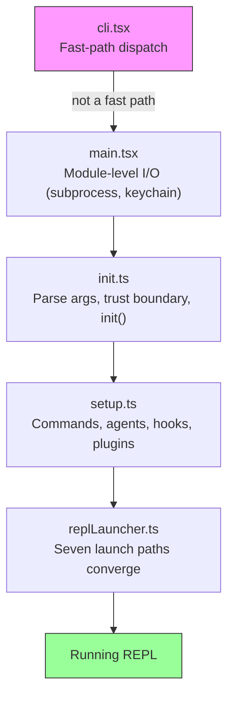
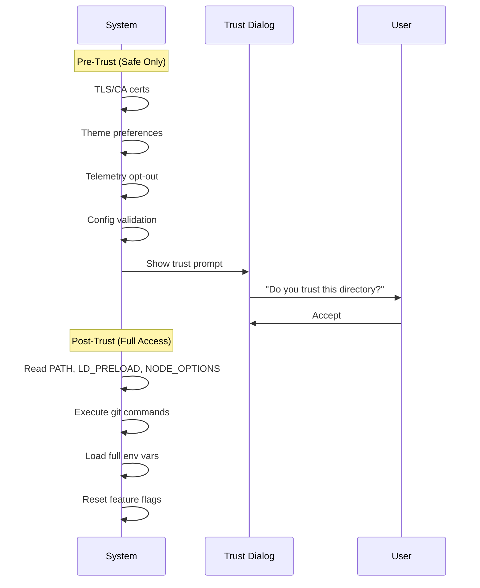

# 第二章：快速啟動 ── Bootstrap 管線

如果第一章給了你 Claude Code 架構的地圖，這一章則給你到達工作狀態的路線。六大抽象中的每個組件 —— query loop、tool 系統、state 層、hooks、memory —— 都必須在使用者看到游標前完成初始化。整個過程的時間預算：300 毫秒。

三百毫秒是人類感知工具「即時」的閾值。超過它，CLI 就會感覺遲鈍。超太多，開發者就會停止使用。本章的一切都是為了守住這條線。

Bootstrap 必須完成四件事：驗證環境、建立安全邊界、配置通訊層、以及渲染 UI。這四件事必須在 300ms 內全部完成。架構上的洞見在於，這四項工作可以部分重疊、精心排序、積極剪裁，以塞進對如此複雜的系統而言看似不可能的時間預算內。

關於方法論的說明：本章中的時間戳是近似值，來源於程式碼庫自身的 profiling 檢查點。它們代表現代硬體上典型的 warm-start 計時。Cold start 會更慢。絕對數字不如相對結構重要：哪些操作重疊、哪些阻塞、哪些被延遲。

---

## 管線的形狀

啟動管線存在於五個檔案中，依序執行。每個檔案都縮小了系統下一步需要做的事情的範圍：



每個檔案在將控制權傳遞給下一個之前，只做最少量的必要工作。`cli.tsx` 嘗試在 import 任何重量級模組之前就退出。`main.tsx` 在 import 求值期間將慢操作作為 side effect 觸發。`init.ts` 解析配置並建立信任邊界。`setup.ts` 註冊能力。`replLauncher.ts` 選擇正確的進入點並啟動 UI。

三種平行化策略使其快速：

1. **模組層級的 subprocess 調度。** 在 *import 求值期間* 將 keychain 和 MDM 讀取作為 side effect 觸發。這些 subprocess 在剩餘約 135ms 的靜態 import 載入期間同步運行。
2. **Setup 中的 Promise 平行化。** Socket 綁定、hook 快照、command 載入、agent 定義載入全部並行執行。
3. **渲染後的延遲預取。** 使用者在輸入第一條訊息之前不需要的一切 —— git status、模型能力、AWS 憑證 —— 都在提示符可見之後才執行。

第四種策略不那麼顯眼但同等重要：**透過 dynamic import 延遲模組求值**。程式碼庫在至少十幾個地方使用 `await import('./module.js')` 來避免在需要之前載入程式碼。OpenTelemetry（400KB + 700KB gRPC）僅在遙測初始化時才載入。React 元件僅在渲染時才載入。每個 dynamic import 用 cold-path 延遲（首次使用時觸發模組求值）換取 hot-path 速度（啟動時不需要為可能永遠不會使用的模組付出代價）。

---

## 階段 0：Fast-Path 調度（cli.tsx）

程序進入的第一個檔案 `cli.tsx`，只有一個任務：判斷是否需要完整的 bootstrap 管線。許多呼叫 —— `claude --version`、`claude --help`、`claude mcp list` —— 只需要一個特定的答案，僅此而已。載入 React、初始化遙測、讀取 keychain、設定 tool 系統都是純粹的浪費。

模式是：檢查 `argv`，動態 import 你需要的 handler，在系統其餘部分載入之前退出。

```typescript
// Pseudocode for the fast-path pattern
if (args.length === 1 && args[0] === '--version') {
  const { printVersion } = await import('./commands/version.js')
  await printVersion()
  process.exit(0)
}
```

大約有十幾條 fast path 涵蓋 version、help、configuration、MCP server 管理和更新檢查。具體細節不重要 —— 模式才重要。每條路徑動態 import 恰好一個模組、呼叫一個函式、然後退出。程式碼庫的其餘部分永遠不會被載入。

這是一個貫穿整個 bootstrap 的原則的第一個實例：**透過更了解意圖來做更少的事**。`argv` 陣列揭示了使用者的意圖。如果意圖是狹窄的，執行路徑也應該是狹窄的。

如果沒有匹配到 fast path，`cli.tsx` 就會落入完整的 `main.tsx` import，真正的啟動開始了。

---

## 階段 1：模組層級 I/O（main.tsx）

當 `main.tsx` 被 import 時，它的模組層級 side effect 在求值期間觸發 —— 在檔案中任何函式被呼叫之前：

```typescript
// These run at import time, not at call time
const mdmPromise = startMDMSubprocess()
const keychainPromise = readKeychainCredentials()
```

當 JavaScript 引擎求值 `main.tsx` 的其餘部分及其傳遞性 import（約 138ms 的模組求值）時，這兩個 promise 已經在執行中。MDM（Mobile Device Management）subprocess 檢查組織安全策略。Keychain 讀取獲取已儲存的憑證。兩者都是 I/O-bound 的操作，否則會串行化在關鍵路徑上。

洞見：模組求值不是閒置時間 —— 它是你可以與 I/O 重疊的時間。當 `main.tsx` 匯出的函式首次被呼叫時，這些 promise 通常已經 resolve 了。

這項技術需要在相關檔案中抑制 ESLint 的 top-level-await 和 side-effect-in-module-scope 規則。程式碼庫有一個自訂的 ESLint 規則，專門針對 `process.env` 存取模式，允許在模組作用域內進行受控的 side effect，同時防止其他地方的不受控 side effect。

---

## 階段 2：解析與信任（init.ts）

`init()` 函式是 memoized 的 —— 多次呼叫是安全的，且返回相同的結果。這很重要，因為多個進入點（REPL、print mode、SDK mode）可能各自呼叫 `init()`，而 memoization 保證它只執行一次。

該函式透過 Commander 解析命令列參數，從多個來源（全域設定、專案設定、環境變數）載入配置，然後到達管線中最重要的邊界。

### 信任邊界

在信任邊界之前，系統在受限模式下運行。之後，完整的能力才可用。這個邊界的存在是因為 Claude Code 讀取環境變數 —— 而環境變數可以被投毒。



信任邊界不是關於使用者信任 Claude Code。而是關於 Claude Code 信任 *環境*。一個惡意的 `.bashrc` 可以設定 `LD_PRELOAD` 來將程式碼注入每個 subprocess。信任對話框確保使用者明確同意在一個可能由他人配置的目錄中操作。

系統有十項不同的信任敏感操作。在使用者接受信任對話框之前，只有安全操作會執行：TLS 憑證配置、主題偏好、遙測退出。在信任之後，系統讀取潛在危險的環境變數（PATH、LD_PRELOAD、NODE_OPTIONS）、執行 git 命令、並套用完整的環境配置。

### preAction Hook

Commander 的 `preAction` hook 是架構上的關鍵樞紐。Commander 解析命令結構（flags、subcommands、positional arguments）*而不* 執行任何東西。`preAction` hook 在解析之後、但在匹配的 command handler 執行之前觸發：

```typescript
program.hook('preAction', async (thisCommand) => {
  await init(thisCommand)
})
```

這種分離意味著 fast-path 命令（在 Commander 載入之前由 `cli.tsx` 處理）永遠不會支付 `init()` 的成本。只有需要完整環境的命令才會觸發初始化。

---

## 階段 3：Setup（setup.ts）

`init()` 完成後，`setup()` 註冊系統需要的所有能力：

```mermaid
gantt
    title Phase 3: Parallel Setup
    dateFormat X
    axisFormat %Lms

    section Sequential
    Commands registration   :0, 5
    section Parallel
    Agent definitions      :5, 15
    Hook registration      :5, 12
    Plugin initialization  :5, 20
    MCP server connections :5, 25
```



Commands、agents、hooks 和 plugins 在可能的情況下全部平行註冊。Setup 階段是系統從「我知道我的配置」轉變為「我擁有所有能力」的地方。Setup 之後，每個 tool 都已註冊、每個 hook 都已連接，系統已準備好處理使用者輸入。

Setup 也處理 security hook 快照。Hook 配置從磁碟讀取一次，凍結為不可變的快照，並在會話的其餘時間使用。磁碟上 hooks 配置檔案的後續修改會被忽略。這防止了攻擊者在會話啟動後修改 hook 規則 —— 凍結的快照是權限決策的唯一真相來源。

---

## 階段 4：啟動（replLauncher.ts）

七條不同的程式碼路徑匯聚在 `replLauncher.ts`：interactive REPL、print mode（`--print`）、SDK mode、resume（`--resume`）、continue（`--continue`）、pipe mode 和 headless。Launcher 檢查 `init()` 產生的配置並調度到正確的進入點。

兩個例子說明了範圍：

**Interactive REPL** —— 標準情況。Launcher 掛載 React/Ink 元件樹、啟動終端渲染器、並進入事件循環。使用者看到提示符，可以開始輸入。

**Print mode**（`--print`）—— 來自 argv 的單一提示。Launcher 建立一個無 React 樹的 headless query loop，執行至完成，將輸出串流到 stdout，然後退出。相同的 agent loop，不同的呈現方式。

重要的細節：所有七條路徑最終都呼叫 `query()` —— 與第一章相同的 agent loop。啟動路徑決定了 loop 如何 *呈現*（interactive terminal、single-shot、SDK protocol），而不是它 *做什麼*。這種匯聚使架構可測試且可預測：無論使用者如何呼叫 Claude Code，核心行為都是相同的。

---

## 啟動時間線

以下是完整管線在時間上的樣貌：

```mermaid
gantt
    title Bootstrap Timeline (~240ms)
    dateFormat X
    axisFormat %Lms

    section Phase 0
    Fast-path check          :0, 5

    section Phase 1
    Module evaluation        :5, 143
    MDM subprocess (parallel) :8, 60
    Keychain read (parallel)  :8, 50

    section Phase 2
    Commander parse          :143, 146
    init()                   :146, 160
    Trust boundary           :160, 175

    section Phase 3
    setup() + parallel registration :175, 210

    section Phase 4
    Launch path selection    :210, 215
    First render             :215, 240
```



關鍵路徑貫穿模組求值（約 138ms 的最長單一階段）、然後是 Commander 解析、init 和 setup。平行 I/O 操作（MDM、keychain）與模組求值重疊，通常在被需要之前就已經 resolve。

### 效能預算

| 階段 | 時間 | 發生了什麼 |
|------|------|-----------|
| Fast-path 檢查 | ~5ms | 檢查 argv，盡早退出 |
| 模組求值 | ~138ms | Import 樹，觸發平行 I/O |
| Commander 解析 | ~3ms | 解析 flags 和 subcommands |
| init() | ~14ms | 配置解析，信任邊界 |
| setup() | ~35ms | Commands、agents、hooks、plugins |
| 啟動 + 首次渲染 | ~25ms | 選擇路徑，掛載 React，首次繪製 |
| **總計** | **~240ms** | 在 300ms 預算內 |

在現代機器上總計約 240ms —— 距離 300ms 預算有 60ms 的餘裕。Cold start（重啟後首次執行、OS cache 為空）可以將模組求值推至 200ms 以上，使總計更接近上限。

---

## 遷移系統

簡要說明 init 期間執行的一個子系統：schema 遷移。Claude Code 將配置和會話資料儲存在本地檔案和目錄中。當格式在版本之間變更時，遷移會在啟動時自動執行。

每個遷移是一個帶有版本號的函式。系統檢查當前 schema 版本與最高遷移版本的對應關係，按順序執行待處理的遷移，並更新版本。遷移是冪等且快速的（操作小型本地檔案，而非資料庫）。整個遷移過程通常在 5ms 內完成。如果遷移失敗，它會記錄錯誤並繼續 —— 對於本地配置而言，可用性優先於嚴格一致性。

---

## 啟動過程對系統設計的啟示

Bootstrap 管線是一個關於縮小範圍的研究。每個階段都縮減了可能性空間：

- 階段 0 從「任意 CLI 呼叫」縮小到「需要完整 bootstrap」
- 階段 1 從「一切都必須載入」縮小到「與 I/O 平行載入」
- 階段 2 從「未知環境」縮小到「已信任、已配置的環境」
- 階段 3 從「無能力」縮小到「完全註冊」
- 階段 4 從「七種可能的模式」縮小到「一條具體的啟動路徑」

當 REPL 渲染時，每個決策都已做出。Query loop 接收一個完全配置好的環境，對於它處於什麼模式、哪些 tool 可用、或哪些權限適用毫無歧義。300ms 預算不僅僅是一個效能目標 —— 它是一個強制函式，防止 bootstrap 變成一個懶惰初始化系統，在其中決策被延遲並分散在整個程式碼庫中。

---

## 實踐應用

**將 I/O 與初始化重疊。** 在模組求值時、在需要之前觸發慢操作（subprocess 生成、憑證讀取、網路檢查）。JavaScript 引擎無論如何都在做同步工作 —— 用那段時間進行平行 I/O。模式：在檔案頂部 `const promise = startSlowThing()`，在使用點 `await promise`。

**盡早縮小範圍。** Bootstrap 管線的五個檔案形成一個漏斗：每個階段都消除了後續階段不需要做的工作。Fast-path 調度是最戲劇性的例子，但這個原則處處適用。如果你能在解析時確定某條程式碼路徑不必要，就跳過它。

**明確建立信任邊界。** 如果你的應用程式從它無法控制的環境讀取（環境變數、配置檔案、shell 設定），在「使用者同意前可安全讀取」和「僅在同意後讀取」之間畫一條清晰的線。信任邊界防止了一類攻擊，在這類攻擊中，惡意環境在使用者有機會評估之前就已經投毒了應用程式。

**Memoize 你的 init 函式。** 使初始化冪等 —— 呼叫兩次產生相同的結果。這消除了當多個進入點可能各自觸發初始化時的排序 bug。Memoization 模式本身很簡單，但消除了整類的重複初始化 bug。

**在讓出控制權之前捕獲早期輸入。** 在事件驅動系統中，初始化期間到達的使用者輸入可能會丟失。Claude Code 在任何 async 工作開始之前從 argv 捕獲初始提示，確保 `claude "fix the bug"` 不會在初始化花費超出預期時間時丟掉提示。
