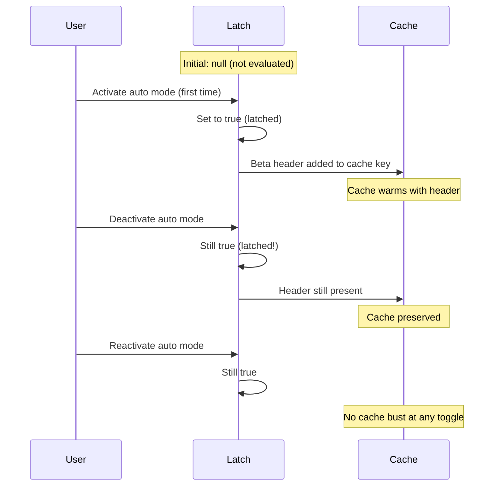
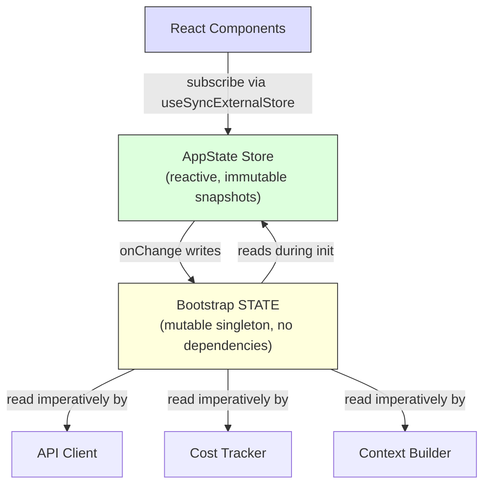

# 第三章：State —— 雙層架構

第二章追蹤了從 process 啟動到首次渲染的 bootstrap 流程。到最後，系統已經擁有完整的環境配置。但配置的是*什麼*？Session ID 存放在哪裡？當前的 model？訊息歷史？Cost tracker？Permission mode？State 住在哪裡，又為什麼住在那裡？

每個長期運行的應用程式終究都會面對這個問題。對於簡單的 CLI 工具，答案很直白——`main()` 裡的幾個變數就好。但 Claude Code 不是簡單的 CLI 工具。它是一個透過 Ink 渲染的 React 應用程式，process 生命週期可能橫跨數小時，有著在任意時間載入的 plugin 系統，API 層必須從快取的 context 中組裝 prompt，cost tracker 需要在 process 重啟後存活，還有數十個基礎設施模組需要讀寫共享資料而不互相 import。

天真的做法——單一全域 store——立刻就會失敗。如果 cost tracker 更新的 store 和驅動 React 重新渲染的 store 是同一個，每次 API 呼叫都會觸發整棵 component tree 的 reconciliation。基礎設施模組（bootstrap、context 建構、cost 追蹤、telemetry）無法 import React。它們在 React mount 之前運行。它們在 React unmount 之後運行。它們運行在完全沒有 component tree 存在的 context 中。把所有東西放進 React-aware 的 store 會在整個 import graph 中製造循環依賴。

Claude Code 用雙層架構解決了這個問題：一個可變的 process singleton 處理基礎設施 state，一個最小化的 reactive store 處理 UI state。本章解釋這兩個層級、橋接它們的 side-effect 系統，以及依賴此基礎的支援子系統。後續每一章都假設你理解 state 住在哪裡、以及為什麼住在那裡。

---

## 3.1 Bootstrap State —— Process Singleton

### 為什麼用可變的 Singleton

Bootstrap state 模組（`bootstrap/state.ts`）是一個在 process 啟動時建立一次的可變物件：

```typescript
const STATE: State = getInitialState()
```

這行程式碼上方的註解寫著：`AND ESPECIALLY HERE`。型別定義上方兩行寫著：`DO NOT ADD MORE STATE HERE - BE JUDICIOUS WITH GLOBAL STATE`。這些註解帶有那種曾經親身體驗過失控全域物件代價的工程師的語氣。

可變 singleton 在這裡是正確的選擇，原因有三。第一，bootstrap state 必須在任何 framework 初始化之前就可用——在 React mount 之前、在 store 建立之前、在 plugin 載入之前。Module-scope 初始化是唯一能保證在 import 時就可用的機制。第二，這些資料本質上是 process-scoped 的：session ID、telemetry 計數器、cost 累加器、快取的路徑。沒有有意義的「前一個 state」可以做 diff，沒有 subscriber 需要通知，沒有 undo history。第三，這個模組必須是 import 依賴圖中的葉節點。如果它 import 了 React、store 或任何 service 模組，就會產生破壞第二章描述的 bootstrap 序列的循環依賴。靠著只依賴 utility 型別和 `node:crypto`，它保持了從任何地方都可以 import 的特性。

### 約 80 個欄位

`State` 型別包含大約 80 個欄位。抽樣檢視便能看出其廣度：

**身份識別與路徑** —— `originalCwd`、`projectRoot`、`cwd`、`sessionId`、`parentSessionId`。`originalCwd` 在 process 啟動時透過 `realpathSync` 解析並做 NFC 正規化，之後永遠不變。

**Cost 與指標** —— `totalCostUSD`、`totalAPIDuration`、`totalLinesAdded`、`totalLinesRemoved`。這些在 session 期間單調遞增，並在退出時持久化到磁碟。

**Telemetry** —— `meter`、`sessionCounter`、`costCounter`、`tokenCounter`。OpenTelemetry 的 handle，全部可為 null（在 telemetry 初始化前為 null）。

**Model 配置** —— `mainLoopModelOverride`、`initialMainLoopModel`。Override 在使用者於 session 中途切換 model 時設定。

**Session 旗標** —— `isInteractive`、`kairosActive`、`sessionTrustAccepted`、`hasExitedPlanMode`。在 session 期間控制行為的 boolean 值。

**Cache 最佳化** —— `promptCache1hAllowlist`、`promptCache1hEligible`、`systemPromptSectionCache`、`cachedClaudeMdContent`。這些存在是為了避免多餘的運算和 prompt cache busting。

### Getter/Setter 模式

`STATE` 物件從不被 export。所有存取都透過大約 100 個獨立的 getter 和 setter 函式：

```typescript
// Pseudocode — illustrates the pattern
export function getProjectRoot(): string {
  return STATE.projectRoot
}

export function setProjectRoot(dir: string): void {
  STATE.projectRoot = dir.normalize('NFC')  // NFC normalization on every path setter
}
```

這個模式強制了封裝、每個路徑 setter 的 NFC 正規化（避免 macOS 上的 Unicode 不匹配）、型別窄化，以及 bootstrap 隔離。代價是冗長——八十個欄位用了上百個函式。但在一個隨意的 mutation 可能搞壞 50,000-token prompt cache 的 codebase 中，明確性勝出。

### Signal 模式

Bootstrap 不能 import listener（它是 DAG 的葉節點），所以使用了一個稱為 `createSignal` 的最小化 pub/sub 原語。`sessionSwitched` signal 恰好只有一個消費者：`concurrentSessions.ts`，它負責保持 PID 檔案同步。Signal 以 `onSessionSwitch = sessionSwitched.subscribe` 的形式暴露，讓呼叫者在 bootstrap 不知道他們是誰的情況下自行註冊。

### 五個 Sticky Latch

Bootstrap state 中最巧妙的欄位是五個 boolean latch，它們遵循相同的模式：一旦某個功能在 session 中首次被啟用，對應的旗標就會在 session 剩餘期間保持 `true`。它們存在的原因都一樣：prompt cache 保存。



Claude 的 API 支援伺服器端的 prompt caching。當連續的請求共享相同的 system prompt 前綴時，伺服器會重用快取的運算。但 cache key 包含 HTTP header 和 request body 欄位。如果某個 beta header 出現在第 N 次請求但不在第 N+1 次，cache 就會被擊穿——即使 prompt 內容完全相同。對於超過 50,000 token 的 system prompt，cache miss 的代價非常高昂。

這五個 latch：

| Latch | 它防止了什麼 |
|-------|-------------|
| `afkModeHeaderLatched` | Shift+Tab auto mode 切換會讓 AFK beta header 時開時關 |
| `fastModeHeaderLatched` | Fast mode cooldown 進出會切換 fast mode header |
| `cacheEditingHeaderLatched` | Remote feature flag 變更會擊穿所有活躍使用者的 cache |
| `thinkingClearLatched` | 在確認的 cache miss（閒置超過 1 小時）時觸發。防止重新啟用 thinking blocks 時擊穿剛預熱的 cache |
| `pendingPostCompaction` | 一次性消耗旗標，用於 telemetry：區分 compaction 引起的 cache miss 與 TTL 過期的 miss |

五個都使用三態型別：`boolean | null`。`null` 初始值表示「尚未評估」。`true` 表示「已鎖定開啟」。一旦設為 `true`，就永遠不會回到 `null` 或 `false`。這就是 latch 的定義特性。

實作模式：

```typescript
function shouldSendBetaHeader(featureCurrentlyActive: boolean): boolean {
  const latched = getAfkModeHeaderLatched()
  if (latched === true) return true       // Already latched -- always send
  if (featureCurrentlyActive) {
    setAfkModeHeaderLatched(true)          // First activation -- latch it
    return true
  }
  return false                             // Never activated -- don't send
}
```

為什麼不直接永遠發送所有 beta header？因為 header 是 cache key 的一部分。發送一個未被識別的 header 會建立不同的 cache namespace。Latch 確保你只在真正需要時進入某個 cache namespace，然後就停留在那裡。

---

## 3.2 AppState —— Reactive Store

### 34 行的實作

UI state store 位於 `state/store.ts`：

Store 的實作大約 30 行：一個對 `state` 變數的 closure、`Object.is` 相等性檢查以防止無意義的更新、同步的 listener 通知，以及一個用於 side effect 的 `onChange` callback。骨架如下：

```typescript
// Pseudocode — illustrates the pattern
function makeStore(initial, onTransition) {
  let current = initial
  const subs = new Set()
  return {
    read:      () => current,
    update:    (fn) => { /* Object.is guard, then notify */ },
    subscribe: (cb) => { subs.add(cb); return () => subs.delete(cb) },
  }
}
```

三十四行。沒有 middleware，沒有 devtools，沒有 time-travel debugging，沒有 action types。只有一個對可變變數的 closure、一個 listener 的 Set，和一個 `Object.is` 相等性檢查。這就是不用 library 的 Zustand。

值得細究的設計決策：

**Updater function 模式。** 沒有 `setState(newValue)` —— 只有 `setState((prev) => next)`。每次 mutation 都接收當前 state 並必須產出下一個 state，消除了並行 mutation 造成的 stale-state bug。

**`Object.is` 相等性檢查。** 如果 updater 回傳相同的 reference，mutation 就是 no-op。不會有 listener 被觸發。不會有 side effect 執行。這對效能至關重要——那些 spread-and-set 但沒有改變值的 component 不會產生重新渲染。

**`onChange` 在 listener 之前觸發。** 可選的 `onChange` callback 接收新舊 state，並在任何 subscriber 被通知之前同步觸發。這用於必須在 UI 重新渲染之前完成的 side effect（見 3.4 節）。

**沒有 middleware，沒有 devtools。** 這不是疏忽。當你的 store 恰好只需要三個操作（get、set、subscribe）、一個 `Object.is` 相等性檢查和一個同步的 `onChange` hook 時，你自己擁有的 34 行程式碼比一個依賴套件更好。你掌控著確切的語意。你能在三十秒內讀完整個實作。

### AppState 型別

`AppState` 型別（約 452 行）是 UI 渲染所需的一切的 shape。大多數欄位都包裹在 `DeepImmutable<>` 中，但對包含 function 型別的欄位有明確的排除：

```typescript
export type AppState = DeepImmutable<{
  settings: SettingsJson
  verbose: boolean
  // ... ~150 more fields
}> & {
  tasks: { [taskId: string]: TaskState }  // Contains abort controllers
  agentNameRegistry: Map<string, AgentId>
}
```

交叉型別讓大多數欄位保持深度不可變，同時豁免持有 function、Map 和可變 ref 的欄位。完全不可變是預設值，在型別系統會與執行時語意衝突的地方有精準的逃生口。

### React 整合

Store 透過 `useSyncExternalStore` 與 React 整合：

```typescript
// Standard React pattern — useSyncExternalStore with a selector
export function useAppState<T>(selector: (state: AppState) => T): T {
  const store = useContext(AppStoreContext)
  return useSyncExternalStore(
    store.subscribe,
    () => selector(store.getState()),
  )
}
```

Selector 必須回傳現有的子物件 reference（而非新建構的物件），`Object.is` 比較才能防止不必要的重新渲染。如果你寫 `useAppState(s => ({ a: s.a, b: s.b }))`，每次 render 都會產生新的物件 reference，component 就會在每次 state 變更時重新渲染。這和 Zustand 使用者面對的是同一個限制——比較更便宜，但 selector 的作者必須理解 reference identity。

---

## 3.3 兩個層級如何關聯

兩個層級透過明確、狹窄的介面溝通。



Bootstrap state 在初始化階段流入 AppState：`getDefaultAppState()` 從磁碟讀取 settings（bootstrap 幫忙定位了它的位置）、檢查 feature flag（bootstrap 已評估過）、並設定初始 model（bootstrap 從 CLI 引數和 settings 解析出來的）。

AppState 透過 side effect 流回 bootstrap state：當使用者變更 model 時，`onChangeAppState` 呼叫 bootstrap 中的 `setMainLoopModelOverride()`。當 settings 變更時，bootstrap 中的 credential cache 會被清除。

但兩個層級從不共享 reference。一個 import bootstrap state 的模組不需要知道 React 的存在。一個讀取 AppState 的 component 不需要知道 process singleton 的存在。

一個具體例子能釐清資料流。當使用者輸入 `/model claude-sonnet-4` 時：

1. Command handler 呼叫 `store.setState(prev => ({ ...prev, mainLoopModel: 'claude-sonnet-4' }))`
2. Store 的 `Object.is` 檢查偵測到變更
3. `onChangeAppState` 觸發，偵測到 model 變更，呼叫 `setMainLoopModelOverride()`（更新 bootstrap）和 `updateSettingsForSource()`（持久化到磁碟）
4. 所有 store subscriber 觸發——React component 重新渲染以顯示新的 model 名稱
5. 下一次 API 呼叫從 bootstrap state 中的 `getMainLoopModelOverride()` 讀取 model

步驟 1-4 是同步的。步驟 5 的 API client 可能在數秒後才運行。但它從 bootstrap state（在步驟 3 中已更新）讀取，而非從 AppState。這就是雙層交接：UI store 是使用者選擇了什麼的 source of truth，但 bootstrap state 是 API client 使用什麼的 source of truth。

DAG 特性——bootstrap 不依賴任何東西、AppState 在初始化時依賴 bootstrap、React 依賴 AppState——由一條 ESLint 規則強制執行，該規則阻止 `bootstrap/state.ts` import 其允許集合之外的模組。

---

## 3.4 Side Effect：onChangeAppState

`onChange` callback 是兩個層級同步的地方。每次 `setState` 呼叫都會觸發 `onChangeAppState`，它接收前後兩個 state 並決定要觸發哪些外部效果。

**Permission mode 同步**是主要的使用案例。在這個集中式 handler 出現之前，permission mode 只有 8 個以上 mutation 路徑中的 2 個會同步到 remote session（CCR）。其他六個——Shift+Tab 循環切換、對話框選項、slash command、rewind、bridge callback——全部都在修改 AppState 時沒有通知 CCR。外部的 metadata 逐漸失去同步。

修復方式：停止在各個 mutation 站點分散通知，改為在一個地方 hook diff。原始碼中的註解列出了每個有問題的 mutation 路徑，並指出「上面那些分散的 callsite 不需要任何改動」。這就是集中式 side effect 的架構優勢——覆蓋是結構性的，而非手動的。

**Model 變更**讓 bootstrap state 與 UI 渲染的內容保持同步。**Settings 變更**清除 credential cache 並重新套用環境變數。**Verbose 切換**和**展開視圖**會被持久化到全域配置。

這個模式——在可 diff 的 state 轉換上集中化 side effect——本質上是將 Observer 模式應用在 state diff 的粒度而非個別事件上。它比分散的 event emission 更具擴展性，因為 side effect 的數量增長速度遠低於 mutation 站點的數量。

---

## 3.5 Context 建構

`context.ts` 中三個 memoize 過的 async 函式建構了每次對話前綴的 system prompt context。每個都是每 session 計算一次，而非每 turn。

`getGitStatus` 平行執行五個 git 命令（`Promise.all`），產出包含當前分支、預設分支、最近 commit 和 working tree 狀態的區塊。`--no-optional-locks` flag 防止 git 取得寫入鎖，避免干擾另一個終端中正在進行的並行 git 操作。

`getUserContext` 載入 CLAUDE.md 內容並透過 `setCachedClaudeMdContent` 快取到 bootstrap state 中。這個 cache 打破了一個循環依賴：auto-mode 分類器需要 CLAUDE.md 的內容，但 CLAUDE.md 的載入經過檔案系統、經過 permission、呼叫分類器。透過快取到 bootstrap state（DAG 的葉節點），循環被打破了。

三個 context 函式都使用 Lodash 的 `memoize`（計算一次，永久快取）而非基於 TTL 的快取。理由是：如果 git status 每五分鐘重新計算，變更就會擊穿伺服器端的 prompt cache。System prompt 甚至告訴 model：「This is the git status at the start of the conversation. Note that this status is a snapshot in time.」

---

## 3.6 Cost 追蹤

每個 API response 都流經 `addToTotalSessionCost`，它累積每個 model 的用量、更新 bootstrap state、回報給 OpenTelemetry，並遞迴處理 advisor tool usage（response 中的巢狀 model 呼叫）。

Cost state 透過存檔與恢復到專案設定檔來存活 process 重啟。Session ID 作為 guard 使用——只有當持久化的 session ID 與正在恢復的 session 匹配時，cost 才會被恢復。

Histogram 使用 reservoir sampling（Algorithm R）在有限記憶體中維持準確的分佈表示。1,024 個項目的 reservoir 產出 p50、p95 和 p99 百分位數。為什麼不用簡單的 running average？因為平均值隱藏了分佈形狀。一個 session 中 95% 的 API 呼叫花 200ms 而 5% 花 10 秒，與所有呼叫都花 690ms 的 session 有相同的平均值，但使用者體驗天差地別。

---

## 3.7 我們學到了什麼

這個 codebase 已經從一個簡單的 CLI 成長為一個擁有約 450 行 state 型別定義、約 80 個 process state 欄位、一套 side-effect 系統、多個持久化邊界和 cache 最佳化 latch 的系統。這些都不是預先設計的。Sticky latch 是在 cache busting 成為可量測的成本問題時才加入的。`onChange` handler 是在發現 8 條 permission 同步路徑中有 6 條壞掉時才集中化的。CLAUDE.md cache 是在循環依賴浮現時才加入的。

這是複雜應用程式中 state 的自然成長模式。雙層架構提供了足夠的結構來收容這種成長——新的 bootstrap 欄位不影響 React 渲染，新的 AppState 欄位不會製造 import 循環——同時保持足夠的彈性來適應原始設計未預見的模式。

---

## 3.8 State 架構總覽

| 屬性 | Bootstrap State | AppState |
|------|----------------|----------|
| **位置** | Module-scope singleton | React context |
| **可變性** | 透過 setter 可變 | 透過 updater 的不可變快照 |
| **訂閱者** | Signal（pub/sub）用於特定事件 | `useSyncExternalStore` 用於 React |
| **可用時機** | Import 時（React 之前） | Provider mount 之後 |
| **持久化** | Process exit handler | 透過 onChange 到磁碟 |
| **相等性** | 不適用（命令式讀取） | `Object.is` reference 檢查 |
| **依賴** | DAG 葉節點（不 import 任何東西） | 從整個 codebase import 型別 |
| **測試重設** | `resetStateForTests()` | 建立新的 store instance |
| **主要消費者** | API client、cost tracker、context builder | React component、side effect |

---

## 應用實踐

**依照存取模式而非領域來分離 state。** Session ID 屬於 singleton，不是因為它抽象上是「基礎設施」，而是因為它必須在 React mount 之前就可讀取、且可在不通知 subscriber 的情況下寫入。Permission mode 屬於 reactive store，因為改變它必須觸發重新渲染和 side effect。讓存取模式驅動層級，架構自然就跟上了。

**Sticky latch 模式。** 任何與 cache 互動的系統（prompt cache、CDN、query cache）都面對同樣的問題：在 session 中途改變 cache key 的 feature toggle 會導致 invalidation。一旦功能被啟用，它對 cache key 的貢獻就在 session 期間保持啟用。三態型別（`boolean | null`，意即「尚未評估 / 開啟 / 永不關閉」）讓意圖不言自明。當 cache 不在你的控制之下時尤其有價值。

**在 state diff 上集中化 side effect。** 當多條程式碼路徑可以改變相同的 state 時，不要在各個 mutation 站點分散通知。Hook store 的 `onChange` callback 並偵測哪些欄位改變了。覆蓋變成結構性的（任何 mutation 都觸發 effect）而非手動的（每個 mutation 站點都必須記得通知）。

**自己擁有的 34 行勝過你不擁有的 library。** 當你的需求恰好是 get、set、subscribe 和一個 change callback 時，最小化的實作給你對語意的完全控制。在一個 state 管理 bug 可能造成真金白銀損失的系統中，這種透明度是有價值的。關鍵洞見是認清你何時*不*需要一個 library。

**有意識地使用 process exit 作為持久化邊界。** 多個子系統在 process exit 時持久化 state。取捨是明確的：非優雅終止（SIGKILL、OOM）會丟失累積的資料。這是可接受的，因為資料是診斷性質而非交易性質，而且對於每 session 遞增數百次的計數器來說，在每次 state 變更時寫入磁碟太昂貴了。

---

本章建立的雙層架構——bootstrap singleton 處理基礎設施、reactive store 處理 UI、side effect 橋接兩者——是後續每一章的基礎。對話迴圈（第四章）從 memoize 過的 builder 讀取 context。工具系統（第五章）從 AppState 檢查 permission。Agent 系統（第八章）在 AppState 中建立 task 項目，同時在 bootstrap state 中追蹤 cost。理解 state 住在哪裡、以及為什麼，是理解這些系統如何運作的先決條件。

有些欄位橫跨邊界。Main loop model 同時存在於兩個層級：AppState 中的 `mainLoopModel`（用於 UI 渲染）和 bootstrap state 中的 `mainLoopModelOverride`（供 API client 使用）。`onChangeAppState` handler 保持它們同步。這種重複是雙層分割的代價。但替代方案——讓 API client import React store，或讓 React component 從 process singleton 讀取——會違反維持架構健全的依賴方向。少量受控的重複，由集中的同步點橋接，好過糾纏不清的依賴圖。
