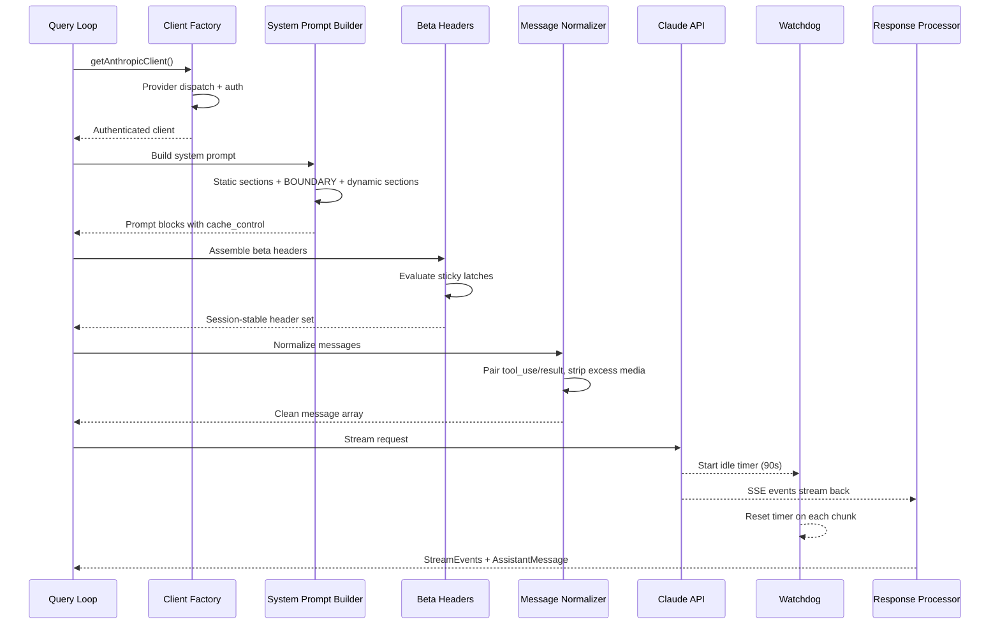
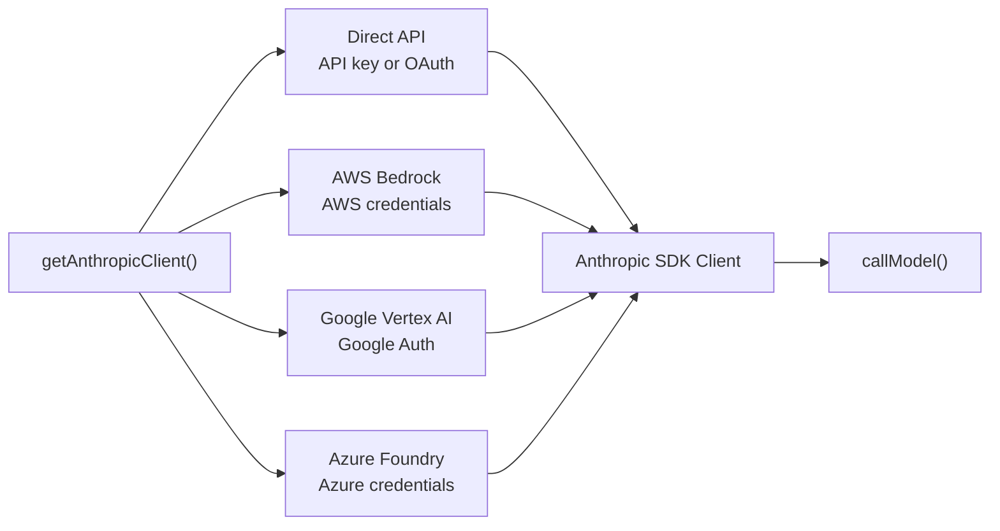
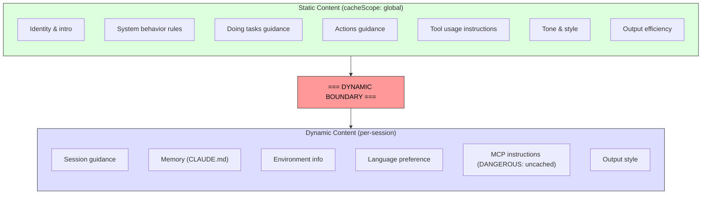

# 第四章：與 Claude 對話 ── API 層

第三章確立了狀態存放的位置以及兩個層級之間的通訊方式。現在我們來追蹤當這些狀態被實際使用時會發生什麼：系統需要與語言模型溝通。Claude Code 中的一切——啟動流程、狀態系統、權限框架——都是為了服務這個時刻而存在的。

這一層處理的故障模式比系統中任何其他部分都多。它必須透過單一透明介面路由到四個雲端供應商。它必須以位元組級別的精確度來建構 system prompt，因為它需要理解伺服器端的 prompt cache 運作方式——一個錯誤放置的區段就能摧毀價值 50,000+ token 的快取。它必須在串流回應時進行主動故障偵測，因為 TCP 連線會靜默地斷開。而且它必須維護 session 穩定的不變量，使得對話進行中的 feature flag 變更不會造成隱形的效能懸崖。

讓我們追蹤一次完整的 API 呼叫，從發起到完成。

---

## 多供應商 Client Factory

`getAnthropicClient()` 函式是所有模型通訊的唯一工廠。它回傳一個針對目標部署供應商設定好的 Anthropic SDK client：

路由分派完全由環境變數驅動，按固定優先順序評估。所有四個供應商專用的 SDK 類別都透過 `as unknown as Anthropic` 轉型為 `Anthropic`。原始碼中的註解出奇地坦誠：「我們一直在對回傳型別說謊。」這種刻意的型別抹除意味著每個消費者看到的都是統一介面。程式碼庫的其餘部分從不根據供應商來分支。

每個供應商 SDK 都是動態匯入的——`AnthropicBedrock`、`AnthropicFoundry`、`AnthropicVertex` 都是帶有各自依賴樹的重量級模組。動態匯入確保未使用的供應商永遠不會被載入。

供應商的選擇在啟動時決定，並儲存在 bootstrap `STATE` 中。查詢迴圈從不檢查當前使用的是哪個供應商。從 Direct API 切換到 Bedrock 是配置變更，不是程式碼變更。

### buildFetch 包裝器

每個對外的 fetch 請求都會被包裝以注入 `x-client-request-id` header——每次請求生成一個 UUID。當請求逾時時，伺服器不會為回應分配 request ID。沒有用戶端側的 ID，API 團隊就無法將逾時與伺服器端日誌關聯起來。這個 header 彌補了這個缺口。它只會發送到 Anthropic 第一方端點——第三方供應商可能會拒絕未知的 header。

---

## System Prompt 建構

System prompt 是整個系統中對快取最敏感的產物。Claude 的 API 提供伺服器端的 prompt caching：跨請求的相同 prompt 前綴可以被快取，節省延遲和成本。一個 200K token 的對話可能有 50-70K token 與前一輪完全相同。摧毀該快取會迫使伺服器重新處理所有內容。

### 動態邊界標記

Prompt 以字串區段的陣列方式建構，其中有一條關鍵的分界線：

邊界之前的所有內容在不同 session、使用者和組織之間都是相同的——它獲得最高層級的伺服器端快取。邊界之後的內容包含使用者特定的資訊，降級為 per-session 快取。

區段的命名慣例刻意採用醒目風格。新增一個區段需要在 `systemPromptSection`（安全、可快取）和 `DANGEROUS_uncachedSystemPromptSection`（破壞快取、需要提供原因字串）之間做出選擇。`_reason` 參數在執行時不會被使用，但它作為強制性文件存在——每個破壞快取的區段都在原始碼中攜帶了自己的理由。

### 2^N 問題

`prompts.ts` 中的一則註解解釋了為什麼條件區段必須放在邊界之後：

> 這裡的每個條件都是一個執行時位元，否則會使 Blake2b 前綴雜湊的變體數量倍增（2^N）。

邊界之前的每個布林條件都會使全域快取條目的數量翻倍。三個條件產生 8 個變體；五個產生 32 個。靜態區段刻意設計為無條件的。編譯時期的 feature flag（由 bundler 解析）可以放在邊界之前。執行時期的檢查（這是 Haiku 嗎？使用者是否啟用了 auto mode？）必須放在邊界之後。

這是那種在你違反它之前完全不可見的約束。一個出於好意的工程師如果在邊界之前加入一個依據使用者設定控制的區段，可能會靜默地碎片化全域快取，使整個叢集的 prompt 處理成本翻倍。

---

## Streaming

### 使用原始 SSE 而非 SDK 抽象

Streaming 實作使用原始的 `Stream<BetaRawMessageStreamEvent>`，而非 SDK 的高階 `BetaMessageStream`。原因是：`BetaMessageStream` 會在每個 `input_json_delta` 事件上呼叫 `partialParse()`。對於帶有大量 JSON 輸入的 tool call（例如包含數百行的檔案編輯），這會在每個 chunk 上從頭重新解析不斷增長的 JSON 字串——O(n²) 行為。Claude Code 自行處理 tool input 的累積，所以 partial parsing 純粹是浪費。

### Idle Watchdog

TCP 連線可能在沒有通知的情況下斷開。伺服器可能崩潰、負載平衡器可能靜默地丟棄連線、或者企業代理伺服器可能逾時。SDK 的 request timeout 只涵蓋初始的 fetch——一旦 HTTP 200 到達，timeout 就已滿足。如果 streaming body 停止傳輸，沒有任何機制能捕捉到它。

Watchdog 的作法是：一個在每次收到 chunk 時重設的 `setTimeout`。如果 90 秒內沒有收到任何 chunk，串流就會被中止，系統會退回到非 streaming 的重試。在 45 秒標記處會發出警告。當 watchdog 觸發時，它會記錄事件以及 client request ID 以供關聯。

### 非 Streaming 回退

當 streaming 在回應過程中失敗（網路錯誤、停滯、截斷）時，系統會退回到同步的 `messages.create()` 呼叫。這處理了代理伺服器回傳 HTTP 200 但帶有非 SSE body 的故障模式，或者在傳輸過程中截斷 SSE 串流的情況。

當 streaming tool execution 正在進行時，可以停用此回退機制，因為回退會重新執行整個請求，可能導致工具被執行兩次。

---

## Prompt Cache 系統

### 三個層級

Prompt caching 在三個層級上運作：

**Ephemeral cache**（預設）：Per-session 快取，具有伺服器定義的 TTL（約 5 分鐘）。所有使用者都能使用。

**1 小時 TTL**：符合資格的使用者獲得延長的快取。資格由訂閱狀態決定，並在 bootstrap state 中鎖定——第三章中的 `promptCache1hEligible` sticky latch 確保了 session 中途的用量超額不會改變 TTL。

**Global scope**：System prompt 快取條目獲得跨 session、跨組織的共享。靜態部分的 prompt 對所有 Claude Code 使用者都是相同的，因此單一份快取副本即可服務所有人。當存在 MCP tools 時，global scope 會被停用，因為 MCP tool 定義是使用者特定的，會將快取碎片化為數百萬個唯一的前綴。

### Sticky Latch 的實際運作

第三章中的五個 sticky latch 在此處被評估，即在請求建構期間。每個 latch 初始為 `null`，一旦被設為 `true`，就在整個 session 期間保持 `true`。Latch 區塊上方的註解十分精確：「用於動態 beta header 的 sticky-on latch。每個 header 一旦首次發送，就會在整個 session 期間持續發送，這樣 session 中途的切換就不會改變伺服器端的 cache key 並摧毀約 50-70K token 的快取。」

完整的 latch 模式說明、五個特定的 latch，以及為什麼「總是發送所有 header」不是正確的解決方案，請參見第三章第 3.1 節。

---

## queryModel Generator

`queryModel()` 函式是一個 async generator（約 700 行），負責協調整個 API 呼叫的生命週期。它 yield `StreamEvent`、`AssistantMessage` 和 `SystemAPIErrorMessage` 物件。

請求的組裝遵循一個精心設計的順序：

1. **Kill switch 檢查** ── 最昂貴模型層級的安全閥
2. **Beta header 組裝** ── 依模型而異，套用 sticky latch
3. **Tool schema 建構** ── 透過 `Promise.all()` 並行處理，deferred tools 在被發現之前不會包含
4. **Message 正規化** ── 修復孤立的 tool_use/tool_result 配對不匹配、移除多餘媒體、清除過時區塊
5. **System prompt block 建構** ── 在動態邊界處分割，指定 cache scope
6. **帶重試包裝的 streaming** ── 處理 529（過載）、模型回退、thinking 降級、OAuth 重新整理

### 輸出 Token 上限

預設的輸出上限是 8,000 token，而非典型的 32K 或 64K。生產數據顯示 p99 輸出為 4,911 token——標準限制過度保留了 8-16 倍。當回應達到上限時（不到 1% 的請求），會以 64K 上限進行一次乾淨的重試。這在叢集規模下節省了顯著的成本。

### 錯誤處理與重試

`withRetry()` 函式本身也是一個 async generator，它 yield `SystemAPIErrorMessage` 事件，讓 UI 可以顯示重試狀態。重試策略包括：

- **529（過載）**：等待並重試，可選擇降級 fast mode
- **模型回退**：主要模型失敗時，嘗試備用模型（例如 Opus 降級到 Sonnet）
- **Thinking 降級**：Context window 溢出觸發縮減的 thinking 預算
- **OAuth 401**：重新整理 token 並重試一次

Generator 模式意味著重試進度（「伺服器過載，5 秒後重試...」）作為事件串流的自然一部分出現，而非側通道通知。

---

## 學以致用

**將 prompt caching 視為架構約束，而非功能開關。** 大多數 LLM 應用程式「開啟」快取。Claude Code 將其視為設計約束，形塑了 prompt 排序、區段記憶化、header latching 和配置管理。一個結構良好的 prompt（對 50K token 命中快取）和結構不良的 prompt（每一輪完全重新處理）之間的差異，是系統中最大的單一成本槓桿。

**對高成本的逃生艙口使用 DANGEROUS 命名慣例。** 當程式碼庫中有一個容易被意外違反的不變量時，用醒目的前綴命名逃生艙口能做到三件事：使違規在 code review 中可見、強制文件化（必需的 reason 參數），以及對安全預設值產生心理摩擦力。這不僅適用於快取，也可推廣到任何具有隱形成本的操作。

**用 watchdog 而非僅用 timeout 來建構 streaming。** SDK 的 request timeout 在 HTTP 200 時就已滿足，但 response body 可能在任何時候停止傳輸。一個在每個 chunk 上重設的 `setTimeout` 能捕捉到這種情況。非 streaming 回退處理了代理伺服器的故障模式（HTTP 200 帶非 SSE body、串流中途截斷），這些在企業環境中比你想像的更常見。

**讓重試策略基於 yield，而非基於 exception。** 透過讓重試包裝器成為一個 yield 狀態事件的 async generator，呼叫者可以將重試進度作為事件串流的自然一部分來顯示。模型回退模式（Opus 失敗，嘗試 Sonnet）對生產環境的韌性特別有用。

**將快速路徑與完整管線分離。** 並非每個 API 呼叫都需要 tool 搜尋、advisor 整合、thinking 預算和 streaming 基礎設施。Claude Code 的 `queryHaiku()` 函式為內部操作（壓縮、分類）提供了精簡路徑，跳過所有 agentic 相關的顧慮。一個具有簡化介面的獨立函式可以防止意外的複雜度洩漏。

---

## 展望

API 層是後續一切內容的基礎。第五章將展示查詢迴圈如何使用 streaming 回應來驅動工具執行——包括工具如何在模型完成回應之前就開始執行。第六章將解釋壓縮系統如何在對話接近 context limit 時維持快取效率。第七章將展示每個 agent 執行緒如何獲得自己的 message 陣列和請求鏈。

所有這些系統都繼承了此處建立的約束：快取穩定性作為架構不變量、透過 client factory 實現的供應商透明性，以及透過 latch 系統實現的 session 穩定配置。API 層不僅僅是發送請求——它定義了所有其他系統運作的規則。
