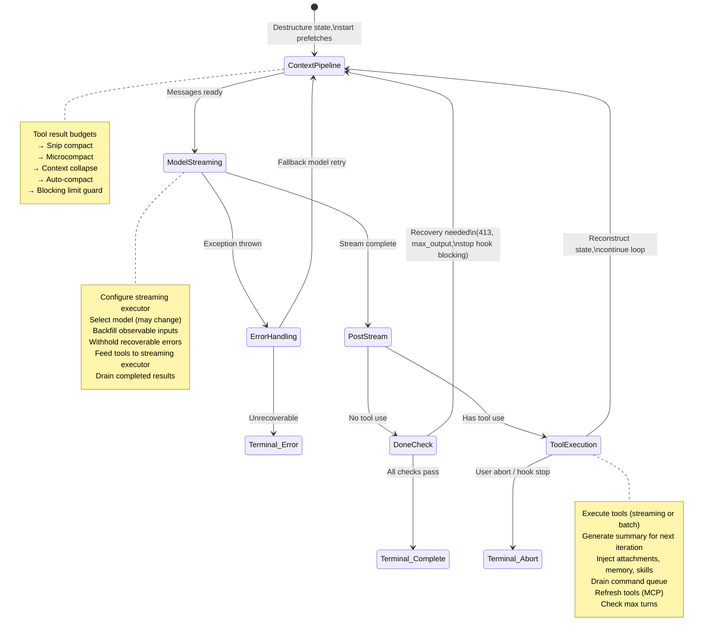
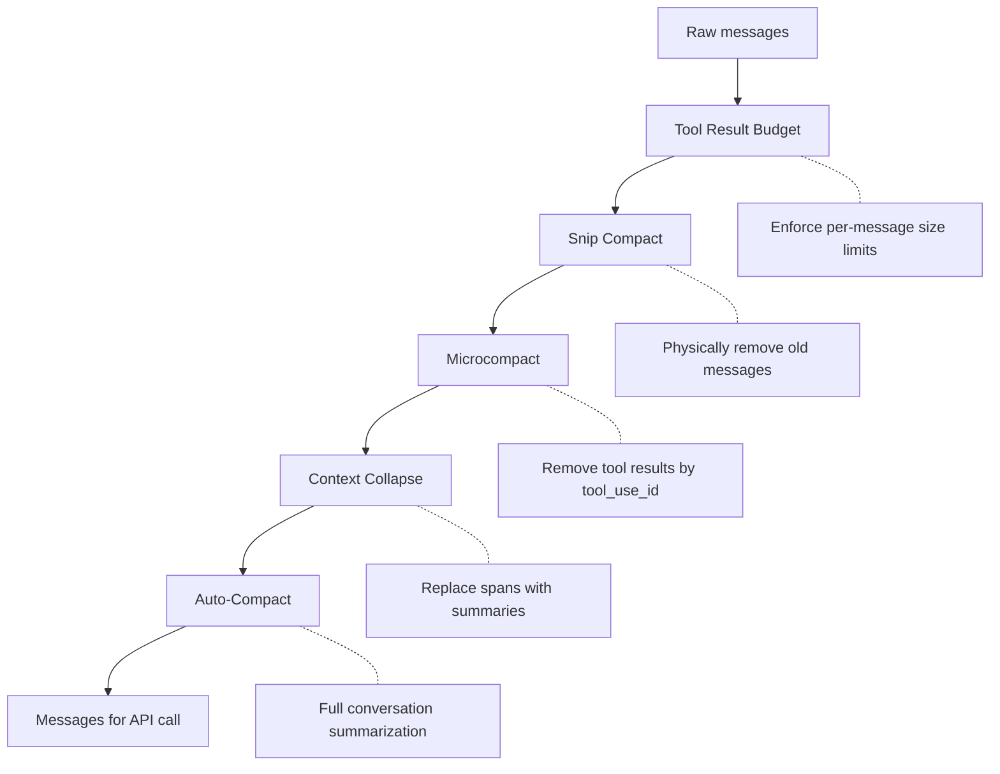
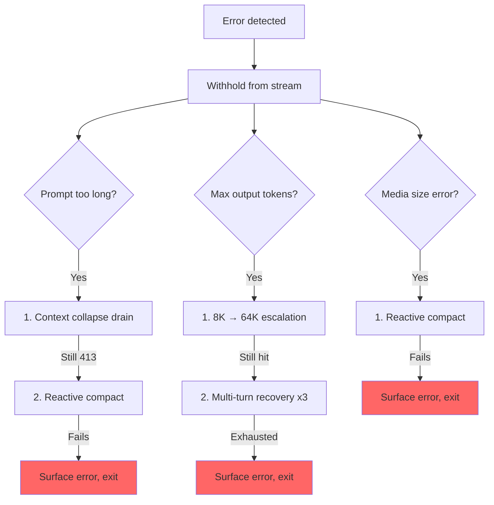

# 第五章：Agent Loop

## 跳動的心臟

第四章展示了 API 層如何將配置轉化為串流 HTTP 請求——客戶端如何建構、system prompt 如何組裝、回應如何以 server-sent events 的形式抵達。那一層處理的是與模型對話的*機制*。但單一 API 呼叫並不是 agent。Agent 是一個迴圈：呼叫模型、執行工具、將結果回饋、再次呼叫模型，直到工作完成。

每個系統都有其重心所在。對資料庫而言，是儲存引擎。對編譯器而言，是中間表示法。對 Claude Code 而言，則是 `query.ts`——一個 1,730 行的單一檔案，包含了驅動每次互動的 async generator，從 REPL 中的第一次按鍵到 headless `--print` 呼叫的最後一次 tool call。

這不是誇大其詞。與模型對話、執行工具、管理上下文、從錯誤中恢復、決定何時停止——這一切只有一條程式碼路徑。那條路徑就是 `query()` 函數。REPL 呼叫它。SDK 呼叫它。Sub-agent 呼叫它。Headless runner 呼叫它。如果你在使用 Claude Code，你就在 `query()` 裡面。

這個檔案很密集，但它的複雜度不同於糾纏不清的繼承階層那種複雜。它的複雜方式更像一艘潛艇：一個船殼配上許多冗餘系統，每一個都是因為大海找到了滲透的方式才加上去的。每個 `if` 分支都有一段故事。每個被抑制的錯誤訊息都代表一個真實的 bug——某個 SDK 消費者在恢復過程中斷線了。每個 circuit breaker 閾值都是針對真實 session 調校的，那些 session 曾在無限迴圈中燒掉數千次 API 呼叫。

本章將完整追蹤整個迴圈，從頭到尾。讀完之後，你不僅會理解發生了什麼，還會明白每個機制為何存在，以及缺少它會導致什麼問題。

---

## 為什麼用 Async Generator

第一個架構問題：為什麼 agent loop 是一個 generator 而不是基於 callback 的 event emitter？

```typescript
// Simplified — shows the concept, not the exact types
async function* agentLoop(params: LoopParams): AsyncGenerator<Message | Event, TerminalReason>
```

實際的簽名會 yield 數種 message 和 event 類型，並回傳一個編碼了迴圈停止原因的 discriminated union。

三個原因，按重要性排列。

**Backpressure。** Event emitter 不管消費者是否準備好就直接發送。Generator 只在消費者呼叫 `.next()` 時才 yield。當 REPL 的 React renderer 正忙著繪製前一幀時，generator 自然暫停。當 SDK 消費者正在處理 tool result 時，generator 等待。不會有 buffer overflow、不會丟失訊息、不會有「快生產者 / 慢消費者」問題。

**Return value 語意。** Generator 的回傳類型是 `Terminal`——一個精確編碼迴圈停止原因的 discriminated union。是正常完成？使用者中止？Token budget 耗盡？Stop hook 介入？Max-turns 限制？不可恢復的模型錯誤？共有 10 種不同的終止狀態。呼叫者不需要訂閱一個 "end" event 然後祈禱 payload 裡有原因。他們透過 `for await...of` 或 `yield*` 得到一個有型別的回傳值。

**透過 `yield*` 實現可組合性。** 外層的 `query()` 函數透過 `yield*` 委派給 `queryLoop()`，透明地轉發每個 yield 的值和最終的 return。像 `handleStopHooks()` 這樣的子 generator 使用相同的模式。這建立了一個乾淨的責任鏈，不需要 callback、不需要 promise 包裹 promise、不需要 event 轉發的樣板程式碼。

這個選擇有代價——JavaScript 中的 async generator 無法「倒轉」或分叉。但 agent loop 不需要這兩者。它是一個嚴格向前推進的狀態機。

還有一個微妙之處：`function*` 語法使函數變成*惰性*的。在第一次 `.next()` 呼叫之前，函數體不會執行。這意味著 `query()` 立即回傳——所有繁重的初始化（config 快照、memory 預取、budget 追蹤器）只在消費者開始拉取值時才發生。在 REPL 中，這意味著 React 渲染管線在迴圈第一行執行之前就已經設定好了。

---

## 呼叫者提供什麼

在追蹤迴圈之前，先了解輸入是什麼會有幫助：

```typescript
// Simplified — illustrates the key fields
type LoopParams = {
  messages: Message[]
  prompt: SystemPrompt
  permissionCheck: CanUseToolFn
  context: ToolUseContext
  source: QuerySource         // 'repl', 'sdk', 'agent:xyz', 'compact', etc.
  maxTurns?: number
  budget?: { total: number }  // API-level task budget
  deps?: LoopDeps             // Injected for testing
}
```

值得注意的欄位：

- **`querySource`**：一個字串鑑別值，如 `'repl_main_thread'`、`'sdk'`、`'agent:xyz'`、`'compact'` 或 `'session_memory'`。許多條件分支依據它做判斷。Compact agent 使用 `querySource: 'compact'`，這樣 blocking limit guard 就不會產生 deadlock（compact agent 需要執行才能*減少* token 數量）。

- **`taskBudget`**：API 層級的 task budget（`output_config.task_budget`）。與 `+500k` 自動繼續的 token budget 功能不同。`total` 是整個 agentic turn 的預算；`remaining` 在每次迭代中根據累計 API 使用量計算，並在 compaction 邊界之間調整。

- **`deps`**：可選的依賴注入。預設為 `productionDeps()`。這是測試替換假模型呼叫、假 compaction 和確定性 UUID 的接縫。

- **`canUseTool`**：一個回傳給定工具是否被允許的函數。這是權限層——它檢查信任設定、hook 決策和當前的權限模式。

---

## 雙層進入點

公開 API 是真正迴圈的薄包裝：

外層函數包裝內層迴圈，追蹤哪些排隊的命令在此 turn 中被消費。當內層迴圈完成後，被消費的命令被標記為 `'completed'`。如果迴圈拋出異常或 generator 透過 `.return()` 被關閉，完成通知永遠不會觸發——一個失敗的 turn 不應該把命令標記為成功處理。在 turn 期間排隊的命令（透過 `/` 斜線命令或 task 通知）在迴圈內部被標記為 `'started'`，在包裝器中被標記為 `'completed'`。如果迴圈拋出異常或 generator 透過 `.return()` 被關閉，完成通知永遠不會觸發。這是刻意的設計——一個失敗的 turn 不應該把命令標記為成功處理。

---

## State 物件

迴圈在一個單一的型別化物件中攜帶其狀態：

```typescript
// Simplified — illustrates the key fields
type LoopState = {
  messages: Message[]
  context: ToolUseContext
  turnCount: number
  transition: Continue | undefined
  // ... plus recovery counters, compaction tracking, pending summaries, etc.
}
```

十個欄位。每一個都有其存在的理由：

| 欄位 | 存在的理由 |
|-------|-----------|
| `messages` | 對話歷史，每次迭代都在增長 |
| `toolUseContext` | 可變上下文：工具、abort controller、agent 狀態、選項 |
| `autoCompactTracking` | 追蹤 compaction 狀態：turn 計數器、turn ID、連續失敗次數、是否已 compact |
| `maxOutputTokensRecoveryCount` | output token 限制的多 turn 恢復嘗試次數（最多 3 次） |
| `hasAttemptedReactiveCompact` | 一次性守衛，防止無限的 reactive compaction 迴圈 |
| `maxOutputTokensOverride` | 在升級期間設為 64K，之後清除 |
| `pendingToolUseSummary` | 前一次迭代的 Haiku 摘要 promise，在當前串流期間 resolve |
| `stopHookActive` | 防止在 blocking retry 後重新執行 stop hook |
| `turnCount` | 單調遞增計數器，與 `maxTurns` 比較 |
| `transition` | 前一次迭代為何繼續——第一次迭代時為 `undefined` |

### 可變迴圈中的不可變 Transition

以下是迴圈中每個 `continue` 語句處出現的模式：

```typescript
const next: State = {
  messages: [...messagesForQuery, ...assistantMessages, ...toolResults],
  toolUseContext: toolUseContextWithQueryTracking,
  autoCompactTracking: tracking,
  turnCount: nextTurnCount,
  maxOutputTokensRecoveryCount: 0,
  hasAttemptedReactiveCompact: false,
  pendingToolUseSummary: nextPendingToolUseSummary,
  maxOutputTokensOverride: undefined,
  stopHookActive,
  transition: { reason: 'next_turn' },
}
state = next
```

每個 continue 點都建構一個完整的新 `State` 物件。不是 `state.messages = newMessages`。不是 `state.turnCount++`。而是完整重建。好處在於每次 transition 都是自我文件化的。你可以閱讀任何一個 `continue` 點，準確地看到哪些欄位改變了、哪些被保留了。新狀態上的 `transition` 欄位記錄了迴圈*為什麼*繼續——測試會斷言這個值，以驗證正確的恢復路徑被觸發了。

---

## 迴圈主體

以下是單次迭代的完整執行流程，壓縮為其骨架：



這就是整個迴圈。Claude Code 中的每一個功能——從 memory 到 sub-agent 到錯誤恢復——都輸入到或消費自這個單一迭代結構。

---

## 上下文管理：四層壓縮

在每次 API 呼叫之前，訊息歷史會經過最多四個上下文管理階段。它們按特定順序執行，而且順序很重要。



### 第 0 層：Tool Result Budget

在任何壓縮之前，`applyToolResultBudget()` 對 tool result 執行每條訊息的大小限制。沒有有限 `maxResultSizeChars` 的工具不受此限制。

### 第 1 層：Snip Compact

最輕量的操作。Snip 從陣列中物理移除舊訊息，yield 一個邊界訊息以向 UI 表示移除。它回報釋放了多少 token，這個數字會被傳遞到 auto-compact 的閾值檢查中。

### 第 2 層：Microcompact

Microcompact 移除不再需要的 tool result，透過 `tool_use_id` 識別。對於 cached microcompact（編輯 API cache），邊界訊息會延遲到 API 回應之後。原因是：客戶端的 token 估算不可靠。API 回應中的實際 `cache_deleted_input_tokens` 才能告訴你真正釋放了多少。

### 第 3 層：Context Collapse

Context collapse 用摘要替換對話中的片段。它在 auto-compact 之前執行，這個順序是刻意的：如果 collapse 將上下文縮減到 auto-compact 閾值以下，auto-compact 就變成 no-op。這保留了細粒度的上下文，而不是用一個單一的整體摘要替換所有內容。

### 第 4 層：Auto-Compact

最重量的操作：它 fork 一個完整的 Claude 對話來摘要歷史。實作有一個 circuit breaker——連續失敗 3 次後，它停止嘗試。這防止了在生產環境中觀察到的噩夢場景：session 卡在 context limit 之上，每天在無限的 compact-fail-retry 迴圈中燒掉 250K 次 API 呼叫。

### Auto-Compact 閾值

閾值源自模型的 context window：

```
effectiveContextWindow = contextWindow - min(modelMaxOutput, 20000)

Thresholds (relative to effectiveContextWindow):
  Auto-compact fires:      effectiveWindow - 13,000
  Blocking limit (hard):   effectiveWindow - 3,000
```

| 常數 | 值 | 用途 |
|------|-----|------|
| `AUTOCOMPACT_BUFFER_TOKENS` | 13,000 | 低於 effective window 的 headroom，用於觸發 auto-compact |
| `MANUAL_COMPACT_BUFFER_TOKENS` | 3,000 | 保留空間讓 `/compact` 仍然可用 |
| `MAX_CONSECUTIVE_AUTOCOMPACT_FAILURES` | 3 | Circuit breaker 閾值 |

13,000 token 的緩衝區意味著 auto-compact 在達到硬限制之前就觸發。Auto-compact 閾值和 blocking limit 之間的間隔是 reactive compact 運作的空間——如果主動式 auto-compact 失敗或被停用，reactive compact 會捕捉 413 錯誤並按需 compact。

### Token 計數

規範函數 `tokenCountWithEstimation` 結合了權威的 API 回報 token 數（來自最近的回應）和對該回應之後新增訊息的粗略估算。估算偏保守——傾向於更高的計數，這意味著 auto-compact 會稍微提早觸發而不是稍微延遲。

---

## 模型串流

### callModel() 迴圈

API 呼叫發生在一個 `while(attemptWithFallback)` 迴圈內，啟用模型 fallback：

```typescript
let attemptWithFallback = true
while (attemptWithFallback) {
  attemptWithFallback = false
  try {
    for await (const message of deps.callModel({ messages, systemPrompt, tools, signal })) {
      // Process each streamed message
    }
  } catch (innerError) {
    if (innerError instanceof FallbackTriggeredError && fallbackModel) {
      currentModel = fallbackModel
      attemptWithFallback = true
      continue
    }
    throw innerError
  }
}
```

啟用後，`StreamingToolExecutor` 在串流期間一收到 `tool_use` block 就開始執行工具——而不是等到完整回應結束後。工具如何被編排成並行批次是第七章的主題。

### Withholding 模式

這是檔案中最重要的模式之一。可恢復的錯誤會從 yield 串流中被抑制：

```typescript
let withheld = false
if (contextCollapse?.isWithheldPromptTooLong(message)) withheld = true
if (reactiveCompact?.isWithheldPromptTooLong(message)) withheld = true
if (isWithheldMaxOutputTokens(message)) withheld = true
if (!withheld) yield yieldMessage
```

為什麼要 withhold？因為 SDK 消費者——Cowork、桌面應用程式——在收到任何帶有 `error` 欄位的訊息時會終止 session。如果你 yield 了一個 prompt-too-long 錯誤然後透過 reactive compaction 成功恢復，消費者已經斷線了。恢復迴圈繼續執行，但沒有人在聽。所以錯誤被 withhold，推入 `assistantMessages` 以便下游恢復檢查能找到它。如果所有恢復路徑都失敗了，被 withhold 的訊息才最終浮出水面。

### 模型 Fallback

當捕捉到 `FallbackTriggeredError`（主要模型負載過高）時，迴圈切換模型並重試。但 thinking signature 是綁定模型的——將一個受保護的 thinking block 從一個模型重放到不同的 fallback 模型會導致 400 錯誤。程式碼在重試前剝離 signature block。所有來自失敗嘗試的孤立 assistant message 都被標記為 tombstone，讓 UI 移除它們。

---

## 錯誤恢復：升級階梯

query.ts 中的錯誤恢復不是單一策略。它是一系列逐漸激進的干預措施，每一個在前一個失敗時觸發。



### 死亡螺旋守衛

最危險的失敗模式是無限迴圈。程式碼有多重守衛：

1. **`hasAttemptedReactiveCompact`**：一次性旗標。Reactive compact 每種錯誤類型只觸發一次。
2. **`MAX_OUTPUT_TOKENS_RECOVERY_LIMIT = 3`**：多 turn 恢復嘗試的硬上限。
3. **Auto-compact 的 circuit breaker**：連續失敗 3 次後，auto-compact 完全停止嘗試。
4. **錯誤回應不執行 stop hook**：程式碼在到達 stop hook 之前就明確 return，當最後一條訊息是 API 錯誤時。註解解釋道："error -> hook blocking -> retry -> error -> ...（hook 每個循環都注入更多 token）。"
5. **跨 stop hook 重試保留 `hasAttemptedReactiveCompact`**：當 stop hook 回傳 blocking 錯誤並強制重試時，reactive compact 守衛被保留。註解記錄了這個 bug："在此處重置為 false 導致了一個燒掉數千次 API 呼叫的無限迴圈。"

這些守衛中的每一個都是因為有人在生產環境中踩到了對應的失敗模式才被加上的。

---

## 實戰範例：「修復 auth.ts 中的 Bug」

為了讓迴圈更具體，讓我們追蹤一個真實互動的三次迭代。

**使用者輸入：** `Fix the null pointer bug in src/auth/validate.ts`

**迭代 1：模型讀取檔案。**

迴圈開始。上下文管理執行（不需要壓縮——對話很短）。模型串流回應："Let me look at the file." 它發出一個 `tool_use` block：`Read({ file_path: "src/auth/validate.ts" })`。Streaming executor 發現這是一個 concurrency-safe 的工具，立即開始執行。當模型完成回應文字時，檔案內容已經在記憶體中了。

Post-stream 處理：模型使用了工具，所以我們進入 tool-use 路徑。Read 結果（帶行號的檔案內容）被推入 `toolResults`。一個 Haiku 摘要 promise 在背景中啟動。狀態以新訊息重建，`transition: { reason: 'next_turn' }`，迴圈繼續。

**迭代 2：模型編輯檔案。**

上下文管理再次執行（仍在閾值以下）。模型串流："I see the bug on line 42 -- `userId` can be null." 它發出 `Edit({ file_path: "src/auth/validate.ts", old_string: "const user = getUser(userId)", new_string: "if (!userId) return { error: 'unauthorized' }\nconst user = getUser(userId)" })`。

Edit 不是 concurrency-safe 的，所以 streaming executor 將其排隊直到回應完成。然後 14 步執行管線啟動：Zod 驗證通過、input backfill 展開路徑、PreToolUse hook 檢查權限（使用者批准）、編輯被套用。迭代 1 的待處理 Haiku 摘要在串流期間 resolve——其結果作為 `ToolUseSummaryMessage` 被 yield。狀態重建，迴圈繼續。

**迭代 3：模型宣告完成。**

模型串流："I've fixed the null pointer bug by adding a guard clause." 沒有 `tool_use` block。我們進入 "done" 路徑。需要 prompt-too-long 恢復嗎？不需要。Max output tokens？沒有。Stop hook 執行——沒有 blocking 錯誤。Token budget 檢查通過。迴圈回傳 `{ reason: 'completed' }`。

總計：三次 API 呼叫、兩次工具執行、一次使用者權限提示。迴圈處理了串流工具執行、與 API 呼叫重疊的 Haiku 摘要、以及完整的權限管線——全部透過同一個 `while(true)` 結構。

---

## Token Budget

使用者可以為一個 turn 請求 token budget（例如 `+500k`）。Budget 系統在模型完成回應後決定是繼續還是停止。

`checkTokenBudget` 以三條規則做出二元的繼續/停止決策：

1. **Sub-agent 永遠停止。** Budget 僅是頂層概念。
2. **90% 的完成閾值。** 如果 `turnTokens < budget * 0.9`，繼續。
3. **遞減效益偵測。** 在 3 次以上的 continuation 之後，如果當前和前一次的 delta 都低於 500 token，則提前停止。模型每次 continuation 產出越來越少。

當決策是「繼續」時，會注入一條 nudge 訊息告訴模型還剩多少 budget。

---

## Stop Hook：強制模型繼續工作

Stop hook 在模型完成且未請求任何 tool use 時執行——它認為自己完成了。Hook 評估它是否*真的*完成了。

管線執行模板 job 分類、啟動背景任務（prompt 建議、memory 擷取），然後執行 stop hook 本體。當 stop hook 回傳 blocking 錯誤——「你說你完成了，但 linter 發現了 3 個錯誤」——錯誤被附加到訊息歷史，迴圈以 `stopHookActive: true` 繼續。這個旗標防止在重試時重新執行相同的 hook。

當 stop hook 發出 `preventContinuation` 信號時，迴圈立即以 `{ reason: 'stop_hook_prevented' }` 退出。

---

## 狀態轉換：完整目錄

迴圈的每個出口都是兩種類型之一：`Terminal`（迴圈回傳）或 `Continue`（迴圈繼續迭代）。

### Terminal 狀態（10 種原因）

| 原因 | 觸發條件 |
|------|---------|
| `blocking_limit` | Token 數量達到硬限制，auto-compact 關閉 |
| `image_error` | ImageSizeError、ImageResizeError 或不可恢復的媒體錯誤 |
| `model_error` | 不可恢復的 API/模型異常 |
| `aborted_streaming` | 使用者在模型串流期間中止 |
| `prompt_too_long` | 所有恢復耗盡後，被 withhold 的 413 |
| `completed` | 正常完成（無 tool use、budget 耗盡或 API 錯誤） |
| `stop_hook_prevented` | Stop hook 明確阻止繼續 |
| `aborted_tools` | 使用者在工具執行期間中止 |
| `hook_stopped` | PreToolUse hook 阻止繼續 |
| `max_turns` | 達到 `maxTurns` 限制 |

### Continue 狀態（7 種原因）

| 原因 | 觸發條件 |
|------|---------|
| `collapse_drain_retry` | Context collapse 在 413 時排放了暫存的 collapse |
| `reactive_compact_retry` | Reactive compact 在 413 或媒體錯誤後成功 |
| `max_output_tokens_escalate` | 8K 上限達到，升級到 64K |
| `max_output_tokens_recovery` | 64K 仍然達到，多 turn 恢復（最多 3 次） |
| `stop_hook_blocking` | Stop hook 回傳 blocking 錯誤，必須重試 |
| `token_budget_continuation` | Token budget 未耗盡，注入 nudge 訊息 |
| `next_turn` | 正常的 tool-use continuation |

---

## 孤立的 Tool Result：協議安全網

API 協議要求每個 `tool_use` block 後面都要跟著一個 `tool_result`。函數 `yieldMissingToolResultBlocks` 為每個模型發出但從未收到對應結果的 `tool_use` block 建立錯誤 `tool_result` 訊息。沒有這個安全網，串流期間的崩潰會留下孤立的 `tool_use` block，在下一次 API 呼叫時導致協議錯誤。

它在三個地方觸發：外層錯誤處理器（模型崩潰）、fallback 處理器（串流中途切換模型）和中止處理器（使用者中斷）。每條路徑有不同的錯誤訊息，但機制相同。

---

## 中止處理：兩條路徑

中止可以發生在兩個時點：串流期間和工具執行期間。各有不同的行為。

**串流期間中止**：Streaming executor（若啟用）排放剩餘結果，為排隊的工具生成合成 `tool_results`。沒有 executor 時，`yieldMissingToolResultBlocks` 填補空缺。`signal.reason` 檢查區分硬中止（Ctrl+C）和提交中斷（使用者輸入了新訊息）——提交中斷跳過中斷訊息，因為排隊的使用者訊息已經提供了上下文。

**工具執行期間中止**：類似的邏輯，中斷訊息上帶有 `toolUse: true` 參數，向 UI 表示工具正在執行中。

---

## Thinking 規則

Claude 的 thinking/redacted_thinking block 有三條不可違反的規則：

1. 包含 thinking block 的訊息必須屬於 `max_thinking_length > 0` 的 query
2. Thinking block 不能是訊息中的最後一個 block
3. Thinking block 必須在整個 assistant trajectory 期間被保留

違反其中任何一條都會產生不透明的 API 錯誤。程式碼在多處處理它們：fallback 處理器剝離 signature block（這些是綁定模型的）、compaction 管線保留受保護的尾部、microcompact 層永遠不碰 thinking block。

---

## 依賴注入

`QueryDeps` 類型刻意保持精簡——四個依賴，不是四十個：

四個注入的依賴：模型呼叫器、compactor、microcompactor 和 UUID 生成器。測試將 `deps` 傳入迴圈參數以直接注入假實作。使用 `typeof fn` 定義類型讓簽名自動保持同步。除了可變的 `State` 和可注入的 `QueryDeps` 之外，不可變的 `QueryConfig` 在 `query()` 進入時快照一次——feature flag、session 狀態和環境變數一次捕獲、永不重讀。三向分離（可變狀態、不可變配置、可注入依賴）使迴圈可測試，也讓最終重構為純粹的 `step(state, event, config)` reducer 變得直截了當。

---

## 實踐應用：建構你自己的 Agent Loop

**使用 generator，而非 callback。** Backpressure 是免費的。Return value 語意是免費的。透過 `yield*` 的可組合性是免費的。Agent loop 是嚴格向前推進的——你永遠不需要倒轉或分叉。

**讓狀態轉換明確。** 在每個 `continue` 點重建完整的狀態物件。冗長本身就是特性——它防止了部分更新的 bug，並使每次 transition 都是自我文件化的。

**Withhold 可恢復的錯誤。** 如果你的消費者在收到錯誤時會斷線，在你確認恢復已失敗之前不要 yield 錯誤。將它們推入內部緩衝區，嘗試恢復，只在耗盡所有手段時才浮出水面。

**分層管理你的上下文。** 輕量操作在前（移除），重量操作在後（摘要）。這在可能的情況下保留細粒度的上下文，只在必要時才退回到整體式摘要。

**為每個 retry 添加 circuit breaker。** `query.ts` 中的每個恢復機制都有明確的限制：3 次 auto-compact 失敗、3 次 max-output 恢復嘗試、1 次 reactive compact 嘗試。沒有這些限制，第一個觸發 retry-on-failure 迴圈的生產 session 就會在一夜之間燒光你的 API 預算。

如果你從零開始，最小的 agent loop 骨架：

```
async function* agentLoop(params) {
  let state = initState(params)
  while (true) {
    const context = compressIfNeeded(state.messages)
    const response = await callModel(context)
    if (response.error) {
      if (canRecover(response.error, state)) { state = recoverState(state); continue }
      return { reason: 'error' }
    }
    if (!response.toolCalls.length) return { reason: 'completed' }
    const results = await executeTools(response.toolCalls)
    state = { ...state, messages: [...context, response.message, ...results] }
  }
}
```

Claude Code 迴圈中的每個功能都是這些步驟之一的延伸。四層壓縮延伸了第 3 步（壓縮）。Withholding 模式延伸了模型呼叫。升級階梯延伸了錯誤恢復。Stop hook 延伸了「無 tool use」出口。從這個骨架開始。只在你碰到它所解決的問題時才加上每個延伸。

---

## 總結

Agent loop 是 1,730 行的單一 `while(true)`，它做所有事情。它串流模型回應、並行執行工具、透過四層壓縮上下文、從五類錯誤中恢復、以遞減效益偵測追蹤 token budget、執行能強制模型繼續工作的 stop hook、管理 memory 和 skill 的預取管線，並產出一個精確描述停止原因的型別化 discriminated union。

它是系統中最重要的檔案，因為它是唯一觸及所有其他子系統的檔案。上下文管線餵入它。工具系統從它輸出。錯誤恢復包裹它。Hook 攔截它。狀態層持久化穿越它。UI 從它渲染。

如果你理解了 `query()`，你就理解了 Claude Code。其他一切都是周邊。
