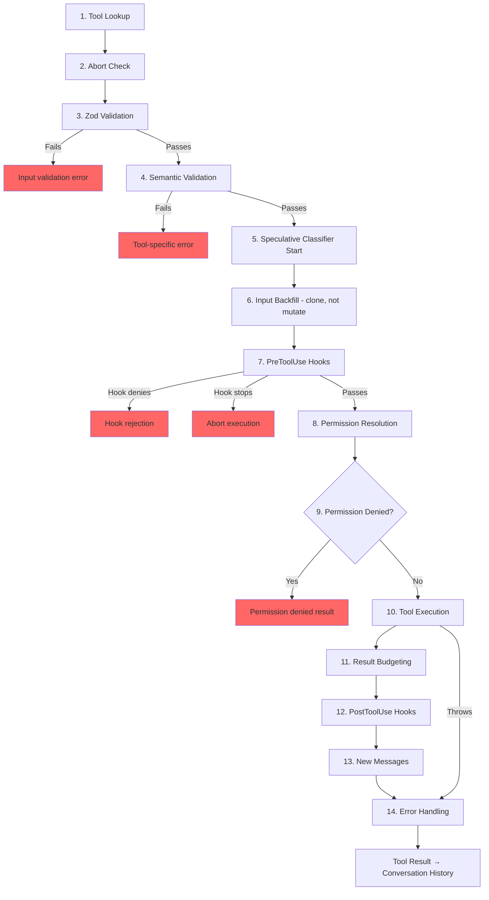

# 第六章：工具——從定義到執行

## 神經系統

第五章展示了 agent loop——那個持續串流模型回應、收集 tool call 並將結果回饋的 `while(true)` 迴圈。迴圈是心跳。但如果沒有神經系統將「模型想要執行 `git status`」轉化為實際的 shell 命令——包含權限檢查、結果預算控制和錯誤處理——心跳便毫無意義。

工具系統就是這個神經系統。它涵蓋 40 多個工具實作、一個具備 feature flag 閘控的集中式 registry、一條 14 步驟的執行 pipeline、一個具有七種模式的權限解析器，以及一個在模型完成回應之前就啟動工具的串流執行器。

Claude Code 中的每一次 tool call——每一次檔案讀取、每一條 shell 命令、每一次 grep、每一次 sub-agent 派遣——都流經同一條 pipeline。這種一致性正是重點：無論工具是內建的 Bash 執行器還是第三方 MCP 伺服器，都會得到相同的驗證、相同的權限檢查、相同的結果預算控制、相同的錯誤分類。

`Tool` 介面大約有 45 個成員。聽起來很嚇人，但理解系統運作只需要五個：

1. **`call()`**——執行工具
2. **`inputSchema`**——驗證並解析輸入
3. **`isConcurrencySafe()`**——這個工具能否平行執行？
4. **`checkPermissions()`**——這個操作是否被允許？
5. **`validateInput()`**——這個輸入在語意上是否合理？

其餘的一切——12 個渲染方法、分析鉤子、搜尋提示——都是為了支援 UI 和遙測層而存在。先掌握這五個，其餘自然水到渠成。

---

## Tool 介面

### 三個型別參數

每個工具都以三個型別參數化：

```typescript
Tool<Input extends AnyObject, Output, P extends ToolProgressData>
```

`Input` 是一個 Zod 物件 schema，具有雙重用途：它生成發送給 API 的 JSON Schema（讓模型知道該提供哪些參數），同時在執行時透過 `safeParse` 驗證模型的回應。`Output` 是工具結果的 TypeScript 型別。`P` 是工具執行期間發出的進度事件型別——BashTool 發出 stdout chunk、GrepTool 發出匹配計數、AgentTool 發出 sub-agent 對話記錄。

### buildTool() 與失敗封閉預設值

沒有任何工具定義直接建構 `Tool` 物件。每個工具都通過 `buildTool()`，一個在工具特定定義下展開預設物件的工廠函式：

```typescript
// Pseudocode — illustrates the fail-closed defaults pattern
const SAFE_DEFAULTS = {
  isEnabled:         () => true,
  isParallelSafe:    () => false,   // Fail-closed: new tools run serially
  isReadOnly:        () => false,   // Fail-closed: treated as writes
  isDestructive:     () => false,
  checkPermissions:  (input) => ({ behavior: 'allow', updatedInput: input }),
}

function buildTool(definition) {
  return { ...SAFE_DEFAULTS, ...definition }  // Definition overrides defaults
}
```

預設值在安全相關的地方刻意採用失敗封閉設計。一個忘記實作 `isConcurrencySafe` 的新工具會預設為 `false`——它串行執行，永遠不會平行。一個忘記 `isReadOnly` 的工具預設為 `false`——系統將其視為寫入操作。一個忘記 `toAutoClassifierInput` 的工具回傳空字串——自動模式安全分類器會跳過它，這意味著由通用權限系統處理，而非自動化旁路。

唯一*不是*失敗封閉的預設值是 `checkPermissions`，它回傳 `allow`。這看似矛盾，直到你理解分層權限模型：`checkPermissions` 是工具特定邏輯，在通用權限系統已經評估過規則、hook 和基於模式的策略*之後*才執行。工具從 `checkPermissions` 回傳 `allow` 是在說「我沒有工具特定的異議」——而非授予全面存取權。將成員分組到子物件中（`options`、命名欄位如 `readFileState`）提供了聚焦介面所能提供的結構，卻不需要在 40 多個呼叫點宣告、實作和串連五個獨立的介面型別。

### 並行安全取決於輸入

`isConcurrencySafe(input: z.infer<Input>): boolean` 的簽名接受已解析的輸入，因為同一個工具對不同輸入可能是安全的，也可能不安全。BashTool 是典型的例子：`ls -la` 是唯讀且並行安全的，但 `rm -rf /tmp/build` 不是。工具會解析命令，將每個子命令與已知安全集合進行比對，只有當所有非中性部分都是搜尋或讀取操作時才回傳 `true`。

### ToolResult 回傳型別

每個 `call()` 都回傳一個 `ToolResult<T>`：

```typescript
type ToolResult<T> = {
  data: T
  newMessages?: (UserMessage | AssistantMessage | AttachmentMessage | SystemMessage)[]
  contextModifier?: (context: ToolUseContext) => ToolUseContext
}
```

`data` 是被序列化為 API 的 `tool_result` 內容區塊的型別化輸出。`newMessages` 讓工具能將額外訊息注入對話中——AgentTool 用它來附加 sub-agent 對話記錄。`contextModifier` 是一個為後續工具修改 `ToolUseContext` 的函式——這就是 `EnterPlanMode` 切換權限模式的方式。Context modifier 只對非並行安全的工具生效；如果你的工具平行執行，其 modifier 會被排入佇列，直到批次完成。

---

## ToolUseContext：上帝物件

`ToolUseContext` 是貫穿每個 tool call 的龐大 context 包。它大約有 40 個欄位。以任何合理的定義來看，它都是一個 god object。它之所以存在，是因為替代方案更糟。

像 BashTool 這樣的工具需要 abort controller、檔案狀態快取、應用程式狀態、訊息歷史、工具集合、MCP 連線，以及半打 UI callback。將這些作為獨立參數傳遞會產生 15 個以上參數的函式簽名。務實的解決方案是一個按關注點分組的單一 context 物件：

**組態**（`options` 子物件）：工具集合、模型名稱、MCP 連線、除錯旗標。在查詢開始時設定一次，大致不可變。

**執行狀態**：用於取消的 `abortController`、用於 LRU 檔案快取的 `readFileState`、完整對話歷史的 `messages`。這些在執行期間會改變。

**UI callback**：`setToolJSX`、`addNotification`、`requestPrompt`。只在互動式（REPL）環境中連接。SDK 和 headless 模式下它們是 undefined。

**Agent 上下文**：`agentId`、`renderedSystemPrompt`（為 fork sub-agent 凍結的父級 prompt——重新渲染可能因 feature flag 預熱而產生偏差並破壞快取）。

`ToolUseContext` 的 sub-agent 變體特別能說明問題。當 `createSubagentContext()` 為子 agent 建構 context 時，它對哪些欄位共享、哪些欄位隔離做出了刻意的選擇：`setAppState` 對 async agent 變成空操作、`localDenialTracking` 取得一個全新物件、`contentReplacementState` 從父級複製。每個選擇都編碼了一個從生產環境 bug 中學到的教訓。

---

## Registry

### getAllBaseTools()：唯一事實來源

函式 `getAllBaseTools()` 回傳當前程序中可能存在的所有工具的完整列表。始終存在的工具排在前面，然後是由 feature flag 閘控的條件性工具：

```typescript
const SleepTool = feature('PROACTIVE') || feature('KAIROS')
  ? require('./tools/SleepTool/SleepTool.js').SleepTool
  : null
```

從 `bun:bundle` 匯入的 `feature()` 在打包時解析。當 `feature('AGENT_TRIGGERS')` 被靜態判定為 false 時，打包器會消除整個 `require()` 呼叫——dead code elimination 使二進位檔保持精簡。

### assembleToolPool()：合併內建與 MCP 工具

到達模型的最終工具集來自 `assembleToolPool()`：

1. 取得內建工具（經過 deny rule 過濾、REPL 模式隱藏和 `isEnabled()` 檢查）
2. 透過 deny rule 過濾 MCP 工具
3. 按名稱字母順序排序每個分區
4. 串接內建工具（前綴）+ MCP 工具（後綴）

這種先排序再串接的方式不是美學偏好。API 伺服器在最後一個內建工具之後設置 prompt cache 中斷點。如果對所有工具做扁平排序，MCP 工具會穿插到內建工具列表中，而新增或移除一個 MCP 工具會移動內建工具的位置，從而使快取失效。

---

## 14 步驟執行 Pipeline

函式 `checkPermissionsAndCallTool()` 是意圖轉化為行動的地方。每個 tool call 都經過這 14 個步驟。



### 步驟 1-4：驗證

**Tool Lookup** 回退到 `getAllBaseTools()` 進行別名匹配，處理來自舊版 session 中工具被重新命名的對話記錄。**Abort Check** 防止對在 Ctrl+C 傳播之前已排入佇列的 tool call 浪費運算。**Zod Validation** 捕捉型別不匹配；對於 deferred tool，錯誤會附加提示先呼叫 ToolSearch。**Semantic Validation** 超越 schema 一致性——FileEditTool 拒絕無操作的編輯，BashTool 在 MonitorTool 可用時阻止單獨的 `sleep`。

### 步驟 5-6：準備

**Speculative Classifier Start** 為 Bash 命令平行啟動自動模式安全分類器，在常見路徑上節省數百毫秒。**Input Backfill** 複製已解析的輸入並加入衍生欄位（將 `~/foo.txt` 展開為絕對路徑）供 hook 和權限使用，同時保留原始輸入以維持對話記錄的穩定性。

### 步驟 7-9：權限

**PreToolUse Hook** 是擴展機制——它們可以做出權限決策、修改輸入、注入上下文或完全停止執行。**Permission Resolution** 橋接 hook 和通用權限系統：如果 hook 已經做出決定，那就是最終結果；否則 `canUseTool()` 會觸發規則匹配、工具特定檢查、基於模式的預設值和互動式提示。**Permission Denied Handling** 建構錯誤訊息並執行 `PermissionDenied` hook。

### 步驟 10-14：執行與清理

**Tool Execution** 使用原始輸入執行實際的 `call()`。**Result Budgeting** 將超大輸出持久化到 `~/.claude/tool-results/{hash}.txt` 並替換為預覽。**PostToolUse Hook** 可以修改 MCP 輸出或阻止繼續。**New Messages** 被附加（sub-agent 對話記錄、系統提醒）。**Error Handling** 為遙測分類錯誤、從可能被混淆的名稱中提取安全字串，並發出 OTel 事件。

---

## 權限系統

### 七種模式

| 模式 | 行為 |
|------|------|
| `default` | 工具特定檢查；對未識別的操作提示使用者 |
| `acceptEdits` | 自動允許檔案編輯；對其他操作提示 |
| `plan` | 唯讀——拒絕所有寫入操作 |
| `dontAsk` | 自動拒絕任何正常情況下會提示的操作（背景 agent） |
| `bypassPermissions` | 無需提示即允許一切 |
| `auto` | 使用對話記錄分類器來決定（feature flag 控制） |
| `bubble` | 用於 sub-agent 向父級上報的內部模式 |

### 解析鏈

當 tool call 到達權限解析時：

1. **Hook 決策**：如果 PreToolUse hook 已經回傳 `allow` 或 `deny`，那就是最終結果。
2. **規則匹配**：三組規則——`alwaysAllowRules`、`alwaysDenyRules`、`alwaysAskRules`——根據工具名稱和可選的內容模式進行匹配。`Bash(git *)` 匹配任何以 `git` 開頭的 Bash 命令。
3. **工具特定檢查**：工具的 `checkPermissions()` 方法。大多數回傳 `passthrough`。
4. **基於模式的預設值**：`bypassPermissions` 允許一切。`plan` 拒絕寫入。`dontAsk` 拒絕提示。
5. **互動式提示**：在 `default` 和 `acceptEdits` 模式中，未解析的決策會顯示提示。
6. **Auto 模式分類器**：兩階段分類器（快速模型，然後對模糊案例使用 extended thinking）。

`safetyCheck` 變體有一個 `classifierApprovable` 布林值：`.claude/` 和 `.git/` 編輯的 `classifierApprovable` 為 `true`（不尋常但有時合理），而 Windows 路徑繞過嘗試為 `false`（幾乎總是惡意的）。

### 權限規則與匹配

權限規則以 `PermissionRule` 物件儲存，包含三個部分：追蹤來源的 `source`（userSettings、projectSettings、localSettings、cliArg、policySettings、session 等）、`ruleBehavior`（allow、deny、ask）以及包含工具名稱和可選內容模式的 `ruleValue`。

`ruleContent` 欄位支援細粒度匹配。`Bash(git *)` 允許任何以 `git` 開頭的 Bash 命令。`Edit(/src/**)` 僅允許在 `/src` 內的編輯。`Fetch(domain:example.com)` 允許從特定網域擷取。沒有 `ruleContent` 的規則匹配該工具的所有呼叫。

BashTool 的權限匹配器透過 `parseForSecurity()`（一個 bash AST 解析器）解析命令，並將複合命令拆分為子命令。如果 AST 解析失敗（包含 heredoc 或巢狀子 shell 的複雜語法），匹配器回傳 `() => true`——失敗安全，意味著 hook 總是執行。其假設是：如果命令太複雜而無法解析，那它也太複雜而無法自信地排除在安全檢查之外。

### Sub-Agent 的 Bubble 模式

在 coordinator-worker 模式中的 sub-agent 無法顯示權限提示——它們沒有終端機。`bubble` 模式會使權限請求向上傳播到父級 context。在主執行緒中具有終端機存取權的 coordinator agent 處理提示並將決策傳回。

---

## 工具延遲載入

設定了 `shouldDefer: true` 的工具在發送到 API 時帶有 `defer_loading: true`——只有名稱和描述，沒有完整的參數 schema。這減少了初始 prompt 大小。要使用延遲工具，模型必須先呼叫 `ToolSearchTool` 載入其 schema。失敗模式很有啟發性：在未載入的情況下呼叫延遲工具會導致 Zod 驗證失敗（所有型別化參數都以字串形式到達），系統會附加一個有針對性的恢復提示。

延遲載入還提升了快取命中率：以 `defer_loading: true` 發送的工具只貢獻其名稱到 prompt，因此新增或移除一個 deferred MCP 工具只改變幾個 token 而非數百個。

---

## 結果預算控制

### 每個工具的大小限制

每個工具宣告 `maxResultSizeChars`：

| 工具 | maxResultSizeChars | 原因 |
|------|-------------------|------|
| BashTool | 30,000 | 足以涵蓋大多數有用的輸出 |
| FileEditTool | 100,000 | Diff 可能很大，但模型需要它們 |
| GrepTool | 100,000 | 帶有上下文行的搜尋結果累積很快 |
| FileReadTool | Infinity | 透過自身的 token 限制自我約束；持久化會造成循環 Read 迴圈 |

當結果超過閾值時，完整內容會被儲存到磁碟，並替換為包含預覽和檔案路徑的 `<persisted-output>` 包裝器。模型可以在需要時使用 `Read` 存取完整輸出。

### 每次對話的聚合預算

除了每個工具的限制之外，`ContentReplacementState` 追蹤整個對話的聚合預算，防止千刀萬剮式的消耗——許多工具各自回傳其個別限制的 90% 仍然可能壓垮 context window。

---

## 各工具亮點

### BashTool：最複雜的工具

BashTool 是系統中迄今為止最複雜的工具。它解析複合命令、將子命令分類為唯讀或寫入、管理背景任務、透過 magic bytes 偵測圖片輸出，並實作 sed 模擬以進行安全的編輯預覽。

複合命令解析特別有趣。`splitCommandWithOperators()` 將像 `cd /tmp && mkdir build && ls build` 這樣的命令拆分為單獨的子命令。每個子命令都會與已知安全的命令集合（`BASH_SEARCH_COMMANDS`、`BASH_READ_COMMANDS`、`BASH_LIST_COMMANDS`）進行比對。複合命令只有在所有非中性部分都是安全的情況下才是唯讀的。中性集合（echo、printf）被忽略——它們不會使命令成為唯讀，但也不會使其成為寫入。

sed 模擬（`_simulatedSedEdit`）值得特別關注。當使用者在權限對話框中批准一個 sed 命令時，系統會透過在沙箱中執行 sed 命令並擷取輸出來預先計算結果。預先計算的結果被注入到輸入中作為 `_simulatedSedEdit`。當 `call()` 執行時，它直接套用編輯，繞過 shell 執行。這保證了使用者預覽的內容與實際寫入的完全一致——而不是重新執行可能因為檔案在預覽和執行之間發生變化而產生不同結果。

### FileEditTool：過時偵測

FileEditTool 與 `readFileState` 整合——這是跨對話維護的檔案內容和時間戳 LRU 快取。在套用編輯之前，它會檢查自模型上次讀取以來檔案是否已被修改。如果檔案是過時的——被背景程序、其他工具或使用者修改——編輯會被拒絕，並附帶訊息告訴模型先重新讀取檔案。

`findActualString()` 中的模糊匹配處理了模型稍微搞錯空白的常見情況。它在匹配之前正規化空白和引號樣式，因此帶有尾隨空格的 `old_string` 編輯目標仍然能匹配檔案的實際內容。`replace_all` 旗標啟用批次替換；沒有它，非唯一的匹配會被拒絕，要求模型提供足夠的上下文來識別單一位置。

### FileReadTool：多功能讀取器

FileReadTool 是唯一一個 `maxResultSizeChars: Infinity` 的內建工具。如果 Read 輸出被持久化到磁碟，模型就需要 Read 那個持久化檔案，而那個檔案本身可能超過限制，造成無限迴圈。該工具改為透過 token 估算自我約束，並在源頭進行截斷。

該工具功能極其多樣：它讀取帶有行號的文字檔、圖片（回傳 base64 多模態內容區塊）、PDF（透過 `extractPDFPages()`）、Jupyter notebook（透過 `readNotebook()`）和目錄（回退到 `ls`）。它封鎖危險的設備路徑（`/dev/zero`、`/dev/random`、`/dev/stdin`），並處理 macOS 截圖檔名怪癖（U+202F 窄不間斷空格 vs 一般空格在 "Screen Shot" 檔名中的差異）。

### GrepTool：透過 head_limit 分頁

GrepTool 包裝了 `ripGrep()` 並透過 `head_limit` 加入了分頁機制。預設值為 250 個條目——足以提供有用的結果，但又小到足以避免 context 膨脹。當截斷發生時，回應包含 `appliedLimit: 250`，向模型發出信號，在下一次呼叫中使用 `offset` 來分頁。明確設定 `head_limit: 0` 可完全停用限制。

GrepTool 自動排除六個 VCS 目錄（`.git`、`.svn`、`.hg`、`.bzr`、`.jj`、`.sl`）。搜尋 `.git/objects` 內部幾乎從來不是模型想要的，而意外包含二進位 pack 檔案會耗盡 token 預算。

### AgentTool 與 Context Modifier

AgentTool 產生執行自己查詢迴圈的 sub-agent。它的 `call()` 回傳包含 sub-agent 對話記錄的 `newMessages`，以及可選的將狀態變更傳播回父級的 `contextModifier`。因為 AgentTool 預設不是並行安全的，單一回應中的多個 Agent tool call 會串行執行——每個 sub-agent 的 context modifier 在下一個 sub-agent 啟動前就已套用。在 coordinator 模式中，模式反轉：coordinator 為獨立任務派遣 sub-agent，而 `isAgentSwarmsEnabled()` 檢查解鎖了平行 agent 執行。

---

## 工具如何與訊息歷史互動

工具結果不只是簡單地將資料回傳給模型。它們作為結構化訊息參與對話。

API 期望工具結果是 `ToolResultBlockParam` 物件，透過 ID 參照原始的 `tool_use` 區塊。大多數工具序列化為文字。FileReadTool 可以序列化為圖片內容區塊（base64 編碼）以用於多模態回應。BashTool 透過檢查 stdout 中的 magic bytes 偵測圖片輸出，並據此切換到圖片區塊。

`ToolResult.newMessages` 是工具將對話擴展到簡單的呼叫與回應模式之外的方式。**Agent 對話記錄**：AgentTool 將 sub-agent 的訊息歷史作為 attachment message 注入。**系統提醒**：Memory 工具注入出現在 tool result 之後的系統訊息——在下一輪對模型可見，但在 `normalizeMessagesForAPI` 邊界處被剝離。**Attachment message**：Hook 結果、額外上下文和錯誤詳情攜帶結構化 metadata，模型可在後續輪次中參照。

`contextModifier` 函式是工具改變執行環境的機制。當 `EnterPlanMode` 執行時，它回傳一個將權限模式設為 `'plan'` 的 modifier。當 `ExitWorktree` 執行時，它修改工作目錄。這些 modifier 是工具影響後續工具的唯一方式——直接修改 `ToolUseContext` 是不可能的，因為 context 在每次 tool call 之前都會被展開複製。串行限制由編排層強制執行：如果兩個並行工具都修改工作目錄，哪個贏？

---

## 實踐應用：設計工具系統

**失敗封閉預設值。** 新工具在被明確標記之前應該保持保守。忘記設定旗標的開發者會得到安全的行為，而非危險的。

**依賴輸入的安全性。** `isConcurrencySafe(input)` 和 `isReadOnly(input)` 接受已解析的輸入，因為同一個工具在不同輸入下有不同的安全特性。將 BashTool 標記為「始終串行」的工具 registry 是正確的但浪費的。

**分層你的權限。** 工具特定檢查、基於規則的匹配、基於模式的預設值、互動式提示和自動化分類器各自處理不同的情況。沒有任何單一機制是充分的。

**預算控制結果，而非僅僅輸入。** 輸入的 token 限制是標準做法。但工具結果可以任意大，且它們會跨輪次累積。每個工具的限制防止個別爆炸。整體對話限制防止累積溢出。

**使錯誤分類對遙測安全。** 在壓縮構建中，`error.constructor.name` 會被混淆。`classifyToolError()` 函式提取最具資訊量的安全字串——遙測安全的訊息、errno 代碼、穩定的錯誤名稱——而不會將原始錯誤訊息記錄到分析中。

---

## 下一章預告

本章追蹤了單個 tool call 如何從定義經過驗證、權限、執行到結果預算控制的完整流程。但模型很少一次只請求一個工具。工具如何被編排成並行批次是第七章的主題。
