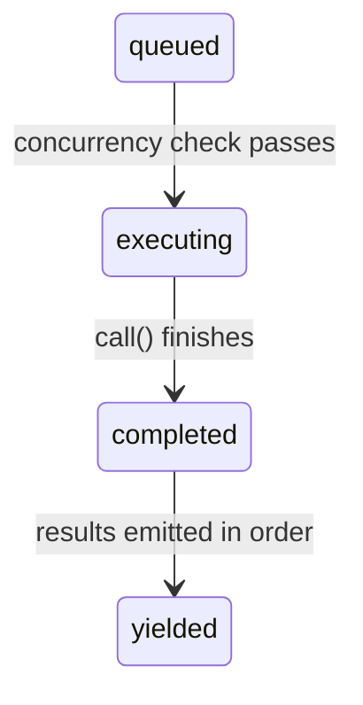

# 第七章：並行工具執行

## 等待的代價

第六章追溯了單一工具呼叫的完整生命週期——從 API 回應中的原始 `tool_use` 區塊，經過輸入驗證、權限檢查、執行，到結果格式化。那條管線處理的是一個工具。但模型很少只請求一個。

一個典型的 Claude Code 互動每輪涉及三到五次工具呼叫。「讀取這兩個檔案、grep 這個模式、然後編輯這個函式。」模型在單一回應中發出所有這些請求。如果每個工具耗時 200 毫秒，依序執行要花整整一秒。如果 Read 和 Grep 呼叫是獨立的——而它們確實是——並行執行只需 200 毫秒。五倍的提升，零成本。

但並非所有工具都是獨立的。修改 `config.ts` 的 Edit 不能與另一個同樣修改 `config.ts` 的 Edit 並行執行。建立目錄的 Bash 命令必須在將檔案寫入該目錄的 Bash 命令之前完成。Concurrency 不是工具的全域屬性，而是特定工具在特定輸入下的呼叫屬性。

這就是驅動整個 concurrency 系統的核心洞見：**安全性是按呼叫決定的，而非按工具類型。** `Bash("ls -la")` 可以安全並行化。`Bash("rm -rf build/")` 則不行。同樣的工具、不同的輸入、不同的 concurrency 分類。系統必須在決定之前檢查輸入。

Claude Code 實作了兩層 concurrency 最佳化。第一層是 **批次編排（batch orchestration）**：在模型的回應完全接收後，將工具呼叫分割為並行和序列群組，然後適當地執行每個群組。第二層是 **推測性執行（speculative execution）**：在*模型仍在 streaming 回應的同時*開始執行工具，在回應完成之前就取得結果。這兩種機制結合起來，消除了大部分原本需要花在等待上的時鐘時間。

---

## 分割演算法

入口點是 `toolOrchestration.ts` 中的 `partitionToolCalls()`。它接收一個有序的 `ToolUseBlock` 訊息陣列，產生一個批次陣列，其中每個批次要嘛是「全部 concurrency-safe」，要嘛是「單一序列工具」。

```typescript
// Pseudocode — illustrates the partition algorithm
type Group = { parallel: boolean; calls: ToolCall[] }

function groupBySafety(calls: ToolCall[], registry: ToolRegistry): Group[] {
  return calls.reduce((groups, call) => {
    const def = registry.lookup(call.name)
    const input = def?.schema.safeParse(call.input)
    // Fail-closed: parse failure or exception → serial
    const safe = input?.success
      ? tryCatch(() => def.isParallelSafe(input.data), false)
      : false
    // Merge consecutive safe calls into one group
    if (safe && groups.at(-1)?.parallel) {
      groups.at(-1)!.calls.push(call)
    } else {
      groups.push({ parallel: safe, calls: [call] })
    }
    return groups
  }, [] as Group[])
}
```

演算法從左到右走訪陣列。對於每個工具呼叫：

1. **透過名稱查找工具定義。**
2. **使用工具的 Zod schema 透過 `safeParse()` 解析輸入。** 如果解析失敗，工具會被保守地分類為非 concurrency-safe。
3. **在工具定義上呼叫 `isConcurrencySafe(parsedInput)`。** 這就是按輸入分類發生的地方。Bash 工具會解析命令字串、檢查每個子命令是否為唯讀（`ls`、`grep`、`cat`、`git status`），只有在整個複合命令是純讀取時才回傳 `true`。Read 工具始終回傳 `true`。Edit 工具始終回傳 `false`。呼叫被包在 try-catch 中——如果 `isConcurrencySafe` 拋出異常（比如 Bash 命令字串無法被 shell-quote 函式庫解析），工具預設為序列執行。
4. **合併或建立批次。** 如果當前工具是 concurrency-safe 且最近的批次也是 concurrency-safe，則追加到該批次。否則，開始一個新批次。

結果是一系列在並行群組和個別序列項目之間交替的批次。讓我們走過一個具體範例：

```
Model requests: [Read, Read, Grep, Edit, Read]

Step 1: Read  → concurrent-safe → new batch {safe, [Read]}
Step 2: Read  → concurrent-safe → append   {safe, [Read, Read]}
Step 3: Grep  → concurrent-safe → append   {safe, [Read, Read, Grep]}
Step 4: Edit  → NOT safe        → new batch {serial, [Edit]}
Step 5: Read  → concurrent-safe → new batch {safe, [Read]}

Result: 3 batches
  Batch 1: [Read, Read, Grep]  — run concurrently
  Batch 2: [Edit]              — run alone
  Batch 3: [Read]              — run concurrently (just one tool)
```

分割是貪婪且保序的。連續的 safe 工具會累積到單一批次中。任何 unsafe 工具都會中斷當前批次並開始新的。這意味著模型發出工具呼叫的順序很重要——如果它在兩個 Read 之間穿插一個 Write，你會得到三個批次而非兩個。在實務上，模型傾向於把讀取操作聚集在一起，這正是演算法最佳化的常見情況。

---

## 批次執行

`runTools()` generator 遍歷分割後的批次，並將每個批次分派到適當的執行器。

### 並行批次

對於並行批次，`runToolsConcurrently()` 使用一個 `all()` 工具函式來並行觸發所有工具，該工具函式將活動 generator 數量限制在 concurrency 上限：

```typescript
// Pseudocode — illustrates the concurrent dispatch pattern
async function* dispatchParallel(calls, context) {
  yield* boundedAll(
    calls.map(async function* (call) {
      context.markInProgress(call.id)
      yield* executeSingle(call, context)
      context.markComplete(call.id)
    }),
    MAX_CONCURRENCY,  // Default: 10
  )
}
```

Concurrency 上限預設為 10，可透過 `CLAUDE_CODE_MAX_TOOL_USE_CONCURRENCY` 設定。十個已經很充裕——你很少在單一模型回應中看到超過五或六個工具呼叫。這個限制作為病態情況的安全閥存在，而非典型約束。

`all()` 工具函式是 `Promise.all` 的 generator 感知變體，具有有界 concurrency。它同時啟動最多 N 個 generator，從先完成的那個 yield 結果，並在每個完成時啟動下一個排隊的 generator。機制類似於 semaphore 守衛的任務池，但適配了會 yield 中間結果的 async generator。

**Context modifier 佇列排程**是微妙的部分。某些工具會產生 *context modifier*——轉換 `ToolUseContext` 以供後續工具使用的函式。當工具並行執行時，你不能立即套用這些 modifier，因為同批次中的其他工具正在讀取相同的 context。取而代之的是，modifier 被收集到一個以工具使用 ID 為鍵的 map 中：

```typescript
const queuedContextModifiers: Record<
  string,
  ((context: ToolUseContext) => ToolUseContext)[]
> = {}
```

在整個並行批次完成後，modifier 按工具順序（而非完成順序）套用，確保 context 演進的確定性：

```typescript
for (const block of blocks) {
  const modifiers = queuedContextModifiers[block.id]
  if (!modifiers) continue
  for (const modifier of modifiers) {
    currentContext = modifier(currentContext)
  }
}
```

在實務上，目前沒有任何 concurrency-safe 工具會產生 context modifier——程式碼庫中的註解明確承認了這一點。但基礎設施之所以存在，是因為工具可以由 MCP server 新增，而一個自訂的唯讀 MCP 工具可能合理地想要修改 context（例如更新「已查看檔案」集合）。

### 序列批次

序列執行很直接。每個工具執行後，其 context modifier 立即套用，下一個工具看到的是更新後的 context：

```typescript
for (const toolUse of toolUseMessages) {
  for await (const update of runToolUse(toolUse, /* ... */)) {
    if (update.contextModifier) {
      currentContext = update.contextModifier.modifyContext(currentContext)
    }
    yield { message: update.message, newContext: currentContext }
  }
}
```

這是關鍵差異。序列工具可以為後續工具改變世界。Edit 修改了一個檔案；下一個 Read 看到的是修改後的版本。Bash 命令建立了一個目錄；下一個 Bash 命令寫入其中。Context modifier 是這種依賴關係的形式化表達：它們讓工具可以說「執行環境已經改變，改變方式如下。」

---

## Streaming 工具執行器

批次編排消除了模型回應*到達之後*不必要的序列化。但還有更大的機會：模型的回應需要時間來 stream。一個典型的多工具回應可能需要 2-3 秒才能完全到達。第一個工具呼叫在 500 毫秒後就可以解析。為什麼要等剩下的 2 秒？

`StreamingToolExecutor` 類別實作了推測性執行。當模型 stream 其回應時，每個 `tool_use` 區塊在完全解析的那一刻就被交給執行器。執行器立即開始執行——此時模型仍在產生下一個工具呼叫。等到回應 streaming 結束時，數個工具可能已經完成了。

```mermaid
gantt
    title Sequential vs Streaming Tool Execution
    dateFormat X
    axisFormat %Ls

    section Sequential
    Model streams response     :a1, 0, 2500
    Tool 1 (0.2s)              :a2, after a1, 200
    Tool 2 (0.3s)              :a3, after a2, 300
    Tool 3 (0.1s)              :a4, after a3, 100

    section Streaming Executor
    Model streams response     :b1, 0, 2500
    Tool 1 starts at 0.5s      :b2, 500, 700
    Tool 2 starts at 1.2s      :b3, 1200, 1500
    Tool 3 drain after stream  :b4, 2500, 2600
```



序列執行總計：3.1 秒。Streaming 執行總計：2.6 秒——工具 1 和 2 在 streaming 期間完成，節省了 16% 的時鐘時間。

節省效果是複合的。當模型請求五個唯讀工具且回應需要 3 秒來 stream 時，所有五個工具都可以在這 3 秒內啟動並完成。Stream 結束後的排空階段無事可做。使用者在模型回應最後一個字元出現後幾乎立即看到結果。

### 工具生命週期

執行器追蹤的每個工具會經過四個狀態：



- **queued**：`tool_use` 區塊已被解析並註冊。等待 concurrency 條件允許執行。
- **executing**：工具的 `call()` 函式正在執行。結果累積在緩衝區中。
- **completed**：執行完成。結果已準備好 yield 到對話中。
- **yielded**：結果已發出。終態。

### addTool()：Stream 期間的排隊

```typescript
addTool(block: ToolUseBlock, assistantMessage: AssistantMessage): void
```

每當一個完整的 `tool_use` 區塊到達時，由 streaming 回應解析器呼叫。此方法：

1. 查找工具定義。如果找不到，立即建立一個帶有錯誤訊息的 `completed` 項目——沒有必要排隊一個不存在的工具。
2. 解析輸入並使用與 `partitionToolCalls()` 相同的邏輯判斷 `isConcurrencySafe`。
3. 推入一個狀態為 `'queued'` 的 `TrackedTool`。
4. 呼叫 `processQueue()`——這可能會立即啟動該工具。

對 `processQueue()` 的呼叫是 fire-and-forget 的（`void this.processQueue()`）。執行器不會 await 它。這是刻意的：`addTool()` 是從 streaming 解析器的事件處理器中呼叫的，在那裡阻塞會使回應解析停滯。工具在背景開始執行，而解析器繼續消費 stream。

### processQueue()：准入檢查

准入檢查是一個單一述詞：

```typescript
// Pseudocode — illustrates the mutual exclusion rule
canRun = noToolsRunning || (newToolIsSafe && allRunningAreSafe)
```

一個工具可以開始執行，若且唯若：
- **目前沒有工具在執行**（佇列為空），或
- **新工具和所有正在執行的工具都是 concurrency-safe。**

這是一個互斥契約。非並行工具需要獨佔存取——不能有其他東西在執行。並行工具可以與其他並行工具共享跑道，但執行集合中的一個非並行工具會阻塞所有人。

`processQueue()` 方法按順序遍歷所有工具。對於每個排隊的工具，它檢查 `canExecuteTool()`。如果工具可以執行，它就啟動。如果一個非並行工具還不能執行，迴圈會 *break*——它完全停止檢查後續工具，因為非並行工具必須維持順序。如果一個並行工具不能執行（被正在執行的非並行工具阻塞），迴圈會 *continue*——但在實務上這很少有幫助，因為非並行阻塞器之後的並行工具通常依賴於它的結果。

### executeTool()：核心執行迴圈

這個方法是真正複雜度所在。它管理 abort controller、錯誤級聯、進度報告和 context modifier。

**子 abort controller。** 每個工具都有自己的 `AbortController`，它是共享 sibling 級 controller 的子級。

層級有三層深：query 級 controller（由 REPL 擁有，在使用者按 Ctrl+C 時觸發）是 sibling controller（由 streaming 執行器擁有，在 Bash 錯誤時觸發）的父級，而 sibling controller 又是每個工具個別 controller 的父級。中止 sibling controller 會終止所有正在執行的工具。中止一個工具的個別 controller 只會終止該工具——但如果中止原因不是 sibling 錯誤，它也會向上冒泡到 query controller。這個冒泡機制防止系統在例如權限拒絕應該結束整個回合時，靜默地丟棄執行器。

這個冒泡對於權限拒絕至關重要。當使用者在權限對話框中拒絕一個工具時，該工具的 abort controller 觸發。該信號必須到達 query 迴圈，以便它可以結束該回合。沒有它，query 迴圈會繼續運作，就好像什麼都沒發生，向模型發送一個過時的拒絕訊息。

**Sibling 錯誤級聯。** 當一個工具產生錯誤結果時，執行器檢查是否要取消 sibling 工具。規則是：**只有 Bash 錯誤會級聯。** 當 shell 命令出錯時，執行器記錄失敗、捕獲出錯工具的描述，並中止 sibling controller——這會取消批次中所有其他正在執行的工具。

理由很務實。Bash 命令通常形成隱式的依賴鏈：`mkdir build && cp src/* build/ && tar -czf dist.tar.gz build/`。如果 `mkdir` 失敗，執行 `cp` 和 `tar` 毫無意義。立即取消 sibling 節省時間並避免令人困惑的錯誤訊息。

相反地，Read 和 Grep 的錯誤是獨立的。如果一個檔案讀取因為檔案被刪除而失敗，這對正在搜尋不同目錄的並行 grep 沒有影響。取消 grep 會浪費工作而毫無理由。

錯誤級聯會為 sibling 工具產生合成的錯誤訊息：

```
Cancelled: parallel tool call Bash(mkdir build) errored
```

描述包含出錯工具命令或檔案路徑的前 40 個字元，為模型提供足夠的 context 來理解出了什麼問題。

**進度訊息**與結果分開處理。結果被緩衝並按順序 yield，而進度訊息（如「正在讀取檔案...」或「正在搜尋...」的狀態更新）進入 `pendingProgress` 陣列並透過 `getCompletedResults()` 立即 yield。一個 resolve callback 在新進度到達時喚醒 `getRemainingResults()` 迴圈，防止 UI 在長時間執行的工具期間看起來凍結。

**佇列重新處理。** 每個工具完成後，`processQueue()` 會再次被呼叫：

```typescript
void promise.finally(() => {
  void this.processQueue()
})
```

這就是被並行批次阻塞的序列工具如何被啟動的。當最後一個並行工具完成時，後續非並行工具的 `canExecuteTool()` 檢查通過，它開始執行。

### 結果收割

Streaming 執行器暴露兩個收割方法，設計用於回應生命週期的兩個不同階段。

**`getCompletedResults()` —— stream 中期收割。** 這是一個同步 generator，在 streaming API 回應的 chunk 之間被呼叫。它按順序走訪工具陣列，並為任何已完成的工具 yield 結果：

`getCompletedResults()` 是一個同步 generator，按提交順序走訪工具陣列。對於每個工具，它首先排空所有待處理的進度訊息。如果工具已完成，它 yield 結果並標記為已 yield。關鍵規則：如果一個非並行工具仍在執行，走訪會 **break**——它之後的任何東西都不能被 yield，即使後續工具已經完成。序列工具之後的結果可能依賴於其 context 修改，所以它們必須等待。對於並行工具，此限制不適用；迴圈會跳過正在執行的並行工具並繼續檢查後續項目。

這個 break 就是保序機制。如果一個非並行工具仍在執行，它之後的任何東西都不能被 yield——即使後續工具已經完成。序列工具之後的結果可能依賴於其 context 修改，所以它們必須等待。對於並行工具，此限制不適用；迴圈會跳過正在執行的並行工具並繼續檢查後續項目。

**`getRemainingResults()` —— stream 結束後排空。** 在模型的回應完全接收後呼叫。這個 async generator 迴圈直到每個工具都被 yield：

`getRemainingResults()` 是 stream 結束後的排空機制。它迴圈直到每個工具都被 yield。每次迭代中，它處理佇列（啟動任何新解除阻塞的工具），透過 `getCompletedResults()` yield 任何已完成的結果，然後——如果工具仍在執行但沒有新的完成——使用 `Promise.race` 空閒等待先完成的那個：任何正在執行的工具的 promise，或進度可用的信號。這避免了忙碌輪詢，同時在有事發生的那一刻就喚醒。當沒有工具完成且無法啟動新的時，執行器等待任何正在執行的工具完成（或進度到達）。這避免了忙碌輪詢，同時在有事發生的那一刻就喚醒。

### 保序

結果按工具*接收*的順序 yield，而非*完成*的順序。這是一個刻意的設計選擇。

考慮一個模型回應請求 `[Read("a.ts"), Read("b.ts"), Read("c.ts")]`。三個同時啟動。`c.ts` 先完成（它比較小），然後 `a.ts`，然後 `b.ts`。如果結果按完成順序 yield，對話會顯示：

```
Tool result: c.ts contents
Tool result: a.ts contents
Tool result: b.ts contents
```

但模型是以 a-b-c 的順序發出的。對話歷史必須匹配模型的預期，否則下一輪會搞不清楚哪個結果對應哪個請求。透過按到達順序 yield，對話保持連貫：

```
Tool result: a.ts contents  (completed second, yielded first)
Tool result: b.ts contents  (completed third, yielded second)
Tool result: c.ts contents  (completed first, yielded third)
```

代價很小：如果工具 1 很慢而工具 2-5 很快，快的結果會在緩衝區中等到工具 1 完成。但替代方案——對話不連貫——遠更糟糕。

### discard()：Streaming Fallback 逃生口

當 API 回應 stream 在中途失敗（網路錯誤、伺服器斷線）時，系統會用新的 API 呼叫重試。但 streaming 執行器可能已經從失敗的嘗試中啟動了工具。那些結果現在成了孤兒——它們對應的是一個從未完全接收的回應。

```typescript
discard(): void {
  this.discarded = true
}
```

設定 `discarded = true` 會導致：
- `getCompletedResults()` 立即返回，不帶任何結果。
- `getRemainingResults()` 立即返回，不帶任何結果。
- 任何開始執行的工具檢查 `getAbortReason()`，看到 `streaming_fallback`，並得到合成錯誤而非實際執行。

被丟棄的執行器就此廢棄。重試嘗試會建立一個全新的執行器。

---

## 工具 Concurrency 屬性

每個內建工具透過 `isConcurrencySafe()` 方法宣告其 concurrency 特性。這個分類不是隨意的——它反映了工具對共享狀態的實際影響。

| Tool | Concurrency Safe | Condition | Rationale |
|------|-----------------|-----------|-----------|
| **Read** | Always | -- | Pure read. No side effects. |
| **Grep** | Always | -- | Pure read. Wraps ripgrep. |
| **Glob** | Always | -- | Pure read. File listing. |
| **Fetch** | Always | -- | HTTP GET. No local side effects. |
| **WebSearch** | Always | -- | API call to search provider. |
| **Bash** | Sometimes | Read-only commands only | `isReadOnly()` parses the command and classifies subcommands. `ls`, `git status`, `cat`, `grep` are safe. `rm`, `mkdir`, `mv` are not. |
| **Edit** | Never | -- | Modifies files. Two concurrent edits to the same file corrupt it. |
| **Write** | Never | -- | Creates or overwrites files. Same corruption risk. |
| **NotebookEdit** | Never | -- | Modifies `.ipynb` files. |

Bash 工具的分類值得詳細說明。它使用 `splitCommandWithOperators()` 來分解複合命令（`&&`、`||`、`;`、`|`），然後將每個子命令與已知安全集合進行比對：

- **搜尋命令**：`grep`、`rg`、`find`、`fd`、`ag`、`ack`
- **讀取命令**：`cat`、`head`、`tail`、`wc`、`jq`、`less`、`file`、`stat`
- **列表命令**：`ls`、`tree`、`du`、`df`
- **中性命令**：`echo`、`printf`（無副作用但不算「讀取」）

一個複合命令只有在每個非中性子命令都在搜尋、讀取或列表集合中時才是唯讀的。`ls -la && cat README.md` 是安全的。`ls -la && rm -rf build/` 不是——`rm` 汙染了整個命令。

---

## 中斷行為契約

當工具正在執行時，使用者可以輸入新訊息。應該發生什麼？答案取決於工具。

每個工具宣告一個 `interruptBehavior()` 方法，回傳 `'cancel'` 或 `'block'`：

- **`'cancel'`**：立即停止工具、丟棄部分結果、處理新的使用者訊息。用於部分執行無害的工具（讀取、搜尋）。
- **`'block'`**：讓工具繼續執行到完成。使用者的新訊息等待。用於中斷會使系統處於不一致狀態的工具（進行中的寫入、長時間執行的 bash 命令）。這是預設值。

Streaming 執行器追蹤當前工具集合的可中斷狀態：

可中斷狀態透過檢查所有當前正在執行的工具來更新：只有當每個正在執行的工具都支援取消時，該集合才是可中斷的。如果哪怕一個工具的中斷行為是 `'block'`，整個集合就被視為不可中斷。

UI 只在所有正在執行的工具都支援取消時才顯示「可中斷」指示器。如果哪怕一個工具是 `'block'`，整個集合就被視為不可中斷。這是保守但正確的：你無法有意義地中斷一個其中某個工具仍會繼續執行的批次。

當使用者確實中斷且所有工具都可取消時，abort controller 以原因 `'interrupt'` 觸發。執行器的 `getAbortReason()` 方法個別檢查每個工具的中斷行為——`'cancel'` 工具得到合成的 `user_interrupted` 錯誤，而 `'block'` 工具（在完全可中斷的集合中不會出現，但程式碼處理了這個邊界情況）繼續執行。

---

## Context Modifier：僅限序列的契約

Context modifier 是類型為 `(context: ToolUseContext) => ToolUseContext` 的函式。它們讓工具可以說「我改變了執行環境中後續工具需要知道的某些東西。」

契約很簡單：**context modifier 只為序列（非 concurrency-safe）工具套用。** 這在原始碼中被明確說明：

```typescript
// NOTE: we currently don't support context modifiers for concurrent
//       tools. None are actively being used, but if we want to use
//       them in concurrent tools, we need to support that here.
if (!tool.isConcurrencySafe && contextModifiers.length > 0) {
  for (const modifier of contextModifiers) {
    this.toolUseContext = modifier(this.toolUseContext)
  }
}
```

在批次編排路徑（`toolOrchestration.ts`）中，並行批次的 modifier 被收集並在批次完成後按工具提交順序套用。這意味著同一批次中的並行工具無法看到彼此的 context 變更，但它們之後的批次可以。

這種不對稱是刻意的。如果工具 A 修改了 context 而工具 B 讀取了該 context，它們就有資料依賴。資料依賴意味著它們不能並行執行。根據定義，如果兩個工具是 concurrency-safe 的，任何一個都不應該依賴另一個的 context 修改。系統透過延遲套用來強制執行這一點。

---

## 應用指南

Claude Code 中的 concurrency 模式可以推廣到任何編排多個獨立操作的系統。有三個原則值得提取。

**按安全性分割，而非按類型。** `isConcurrencySafe(input)` 方法接收解析後的輸入，而非僅僅是工具名稱。這種按呼叫的分類比靜態的「這個工具類型總是安全的」宣告更精確。在你自己的系統中，在決定是否並行化之前，檢查操作的參數。資料庫讀取可以安全並行化；對同一行的資料庫寫入則不行。僅靠操作類型不足以告訴你足夠的資訊。

**在 I/O 等待期間推測性執行。** Streaming 執行器在 API 回應仍在到達時就開始執行工具。同樣的模式適用於任何你有慢生產者和快消費者的場景：在後續項目仍在生成時就開始處理早期項目。HTTP/2 server push、編譯器管線平行化和 CPU 推測性執行都共享這種結構。關鍵要求是你能在完整指令集可用之前識別獨立的工作。

**在結果中保持提交順序。** 按完成順序 yield 結果很誘人——它將首個結果的延遲降到最低。但如果消費者（在這個案例中是語言模型）期望結果按特定順序，重新排序會造成比延遲節省更多的混淆。緩衝已完成的結果，並按請求的順序釋放它們。實作成本是簡單的陣列走訪；正確性收益是絕對的。

Streaming 執行器模式對 agent 系統特別強大。任何時候你的 agent 迴圈涉及一個「思考，然後行動」的循環，其中思考階段產生多個獨立動作，你都可以將思考的尾部與行動的開始重疊。節省的程度與思考時間對行動時間的比率成正比。對於語言模型 agent，其中思考時間（API 回應生成）佔主導，節省是可觀的。

---

## 總結

Claude Code 的 concurrency 系統在兩個層級運作。分割演算法（`partitionToolCalls`）將連續的 concurrency-safe 工具分組為並行執行的批次，同時將 unsafe 工具隔離到序列批次中，使每個工具都能看到前一個工具的效果。Streaming 工具執行器（`StreamingToolExecutor`）更進一步，在模型回應 streaming 期間，工具一到達就推測性地開始執行，將工具執行與回應生成重疊。

安全模型在設計上是保守的。Concurrency 安全性透過檢查解析後的輸入按呼叫決定。未知工具預設為序列。解析失敗預設為序列。安全檢查中的異常預設為序列。系統從不猜測某個東西可以安全並行化——工具必須肯定地宣告它。

錯誤處理遵循工具的依賴結構。Bash 錯誤會級聯到 sibling，因為 shell 命令通常形成隱式的管線。Read 和搜尋錯誤是隔離的，因為它們是獨立的操作。Abort controller 層級——query controller、sibling controller、per-tool controller——讓每個層級都能取消其範圍而不干擾上層。

結果是一個系統，它從模型的工具請求中提取最大的平行性，同時維持對話歷史反映一個連貫、有序的動作序列的不變式。模型看到的是按請求順序排列的結果。使用者看到的是工具以底層操作允許的最快速度完成。這兩者之間的差距——執行速度與呈現順序——由緩衝來彌合，而那個緩衝區是整個系統中最簡單的部分。
