# 第八章：生成 Sub-Agent

## 智慧的倍增

單一 agent 很強大。它能讀取檔案、編輯程式碼、執行測試、搜尋網路，並對結果進行推理。但一個 agent 在單次對話中的能力存在硬性上限：context window 會被填滿、任務分支到需要不同能力的方向，而且 tool 的序列執行方式成為瓶頸。解決方案不是更大的模型，而是更多的 agent。

Claude Code 的 sub-agent 系統讓模型能夠請求協助。當 parent agent 遇到適合委派的任務——一個不應污染主對話的程式碼搜尋、一個需要對抗性思維的驗證流程、一組可以平行執行的獨立編輯——它會呼叫 `Agent` tool。該呼叫會生成一個 child：一個完全獨立的 agent，擁有自己的對話迴圈、自己的 tool 集合、自己的權限邊界和自己的 abort controller。Child 完成工作並回傳結果。Parent 永遠看不到 child 的內部推理過程，只看到最終輸出。

這不是一個便利功能。它是從平行檔案探索到 coordinator-worker 階層架構到多 agent swarm 團隊的一切架構基礎。而這一切都流經兩個檔案：`AgentTool.tsx`（定義模型面向的介面）和 `runAgent.ts`（實作生命週期）。

設計挑戰非常顯著。Sub-agent 需要足夠的 context 來完成工作，但又不能多到在不相關資訊上浪費 token。它需要足夠嚴格以確保安全、但又足夠靈活以保持實用的權限邊界。它需要生命週期管理來清理它接觸過的每一項資源，而不需要呼叫者記住要清理什麼。而且這一切必須適用於各種 agent 類型——從便宜、快速、唯讀的 Haiku 搜尋器到昂貴、徹底、由 Opus 驅動的驗證 agent（在背景執行對抗性測試）。

本章追溯從模型的「我需要幫助」到一個完全運作的 child agent 的路徑。我們將檢視模型看到的 tool 定義、建立執行環境的十五步生命週期、六種內建 agent 類型及各自的最佳化方向、允許使用者定義自訂 agent 的 frontmatter 系統，以及從這一切中浮現的設計原則。

關於術語的說明：在本章中，「parent」指的是呼叫 `Agent` tool 的 agent，而「child」指的是被生成的 agent。Parent 通常（但不一定）是頂層的 REPL agent。在 coordinator 模式下，coordinator 生成 worker，而 worker 就是 child。在巢狀場景中，child 本身可以生成 grandchildren——相同的生命週期遞迴套用。

整個協調層橫跨大約 40 個檔案，分布在 `tools/AgentTool/`、`tasks/`、`coordinator/`、`tools/SendMessageTool/` 和 `utils/swarm/` 中。本章聚焦於生成機制——AgentTool 定義和 runAgent 生命週期。下一章涵蓋執行時期：進度追蹤、結果擷取和多 agent 協調模式。

---

## AgentTool 定義

`AgentTool` 以名稱 `"Agent"` 註冊，並有一個 legacy 別名 `"Task"` 用於向後相容較舊的 transcript、權限規則和 hook 設定。它使用標準的 `buildTool()` 工廠建構，但其 schema 比系統中任何其他 tool 都更具動態性。

### Input Schema

Input schema 透過 `lazySchema()` 惰性建構——這是我們在第六章看到的模式，將 zod 編譯延遲到首次使用時。有兩層：一個基本 schema 和一個添加了多 agent 及隔離參數的完整 schema。

基本欄位始終存在：

| Field | Type | Required | Purpose |
|-------|------|----------|---------|
| `description` | `string` | Yes | 任務的 3-5 字簡短摘要 |
| `prompt` | `string` | Yes | 給 agent 的完整任務描述 |
| `subagent_type` | `string` | No | 要使用的特定 agent 類型 |
| `model` | `enum('sonnet','opus','haiku')` | No | 此 agent 的模型覆寫 |
| `run_in_background` | `boolean` | No | 非同步啟動 |

完整 schema 添加了多 agent 參數（當 swarm 功能啟用時）和隔離控制：

| Field | Type | Purpose |
|-------|------|---------|
| `name` | `string` | 使 agent 可透過 `SendMessage({to: name})` 定址 |
| `team_name` | `string` | 生成時的團隊 context |
| `mode` | `PermissionMode` | 生成的 teammate 的權限模式 |
| `isolation` | `enum('worktree','remote')` | 檔案系統隔離策略 |
| `cwd` | `string` | 工作目錄的絕對路徑覆寫 |

多 agent 欄位啟用了第九章涵蓋的 swarm 模式：具名 agent 可以在並行執行時透過 `SendMessage({to: name})` 互相傳送訊息。隔離欄位啟用檔案系統安全性：worktree 隔離建立臨時的 git worktree，使 agent 在儲存庫的副本上操作，防止多個 agent 同時在同一程式碼庫上工作時產生衝突的編輯。

使此 schema 不尋常的是它**由 feature flag 動態塑形**：

```typescript
// Pseudocode — illustrates the feature-gated schema pattern
inputSchema = lazySchema(() => {
  let schema = baseSchema()
  if (!featureEnabled('ASSISTANT_MODE')) schema = schema.omit({ cwd: true })
  if (backgroundDisabled || forkMode)    schema = schema.omit({ run_in_background: true })
  return schema
})
```

當 fork 實驗啟用時，`run_in_background` 會從 schema 中完全消失，因為在該路徑下所有生成都被強制為非同步。當背景任務被停用時（透過 `CLAUDE_CODE_DISABLE_BACKGROUND_TASKS`），該欄位也會被移除。當 KAIROS feature flag 關閉時，`cwd` 會被省略。模型永遠看不到它不能使用的欄位。

這是一個微妙但重要的設計選擇。Schema 不僅是驗證——它是模型的操作手冊。Schema 中的每個欄位都在模型讀取的 tool 定義中被描述。移除模型不應使用的欄位比在 prompt 中添加「不要使用此欄位」更有效。模型無法誤用它看不到的東西。

### Output Schema

Output 是一個帶有兩個公開變體的 discriminated union：

- `{ status: 'completed', prompt, ...AgentToolResult }` —— 同步完成，包含 agent 的最終輸出
- `{ status: 'async_launched', agentId, description, prompt, outputFile }` —— 背景啟動確認

另外兩個內部變體（`TeammateSpawnedOutput` 和 `RemoteLaunchedOutput`）存在但被排除在匯出的 schema 之外，以實現外部建置中的 dead code elimination。Bundler 在對應的 feature flag 停用時會移除這些變體及其相關的程式碼路徑，使分發的二進位檔更小。

`async_launched` 變體值得注意的是它包含的內容：`outputFile` 路徑，指向 agent 完成時其結果將被寫入的位置。這讓 parent（或任何其他消費者）可以 poll 或 watch 該檔案以取得結果，提供一個基於檔案系統的通訊通道，可以在 process 重啟後存活。

### 動態 Prompt

`AgentTool` 的 prompt 由 `getPrompt()` 產生，具有 context 敏感性。它根據可用的 agent（以行內列表或 attachment 形式列出，以避免破壞 prompt cache）、fork 是否啟用（添加「何時 fork」的指引）、session 是否在 coordinator 模式下（精簡 prompt，因為 coordinator 的 system prompt 已涵蓋用法）以及訂閱層級來調整。非 Pro 使用者會看到關於同時啟動多個 agent 的提示。

基於 attachment 的 agent 列表值得特別說明。程式碼庫的註解提到「大約 10.2% 的 fleet cache_creation token」是由動態 tool 描述造成的。將 agent 列表從 tool 描述移到 attachment message 中可以保持 tool 描述為靜態，這樣連接 MCP server 或載入 plugin 就不會在每次後續 API 呼叫時破壞 prompt cache。

這是一個值得內化的模式，適用於任何使用含有動態內容的 tool 定義的系統。Anthropic API 會快取 prompt 前綴——system prompt、tool 定義和對話歷史——並在後續共享相同前綴的請求中重複使用快取的計算。如果 tool 定義在 API 呼叫之間發生變化（因為添加了 agent 或連接了 MCP server），整個 cache 就會失效。將易變內容從 tool 定義（屬於快取前綴的一部分）移到 attachment message（附加在快取部分之後）可以在保留 cache 的同時仍然將資訊傳遞給模型。

理解了 tool 定義之後，我們現在可以追蹤模型實際呼叫它時會發生什麼。

### Feature Gating

Sub-agent 系統擁有程式碼庫中最複雜的 feature gating。至少十二個 feature flag 和 GrowthBook 實驗控制哪些 agent 可用、哪些參數出現在 schema 中，以及走哪條程式碼路徑：

| Feature Gate | Controls |
|-------------|----------|
| `FORK_SUBAGENT` | Fork agent 路徑 |
| `BUILTIN_EXPLORE_PLAN_AGENTS` | Explore 和 Plan agent |
| `VERIFICATION_AGENT` | Verification agent |
| `KAIROS` | `cwd` 覆寫，assistant 強制非同步 |
| `TRANSCRIPT_CLASSIFIER` | Handoff 分類，`auto` 模式覆寫 |
| `PROACTIVE` | Proactive 模組整合 |

每個 gate 使用 Bun 的 dead code elimination 系統中的 `feature()`（編譯時期）或 GrowthBook 的 `getFeatureValue_CACHED_MAY_BE_STALE()`（執行時期 A/B 測試）。編譯時期的 gate 在建置期間進行字串替換——當 `FORK_SUBAGENT` 為 `'ant'` 時，整個 fork 程式碼路徑被包含；當它為 `'external'` 時，可能被完全排除。GrowthBook 的 gate 允許即時實驗：`tengu_amber_stoat` 實驗可以 A/B 測試移除 Explore 和 Plan agent 是否改變使用者行為，而不需要發布新的二進位檔。

### call() 決策樹

在 `runAgent()` 被呼叫之前，`AgentTool.tsx` 中的 `call()` 方法將請求路由通過一個決策樹，決定要生成*什麼類型*的 agent 以及*如何*生成它：

```
1. Is this a teammate spawn? (team_name + name both set)
   YES -> spawnTeammate() -> return teammate_spawned
   NO  -> continue

2. Resolve effective agent type
   - subagent_type provided -> use it
   - subagent_type omitted, fork enabled -> undefined (fork path)
   - subagent_type omitted, fork disabled -> "general-purpose" (default)

3. Is this the fork path? (effectiveType === undefined)
   YES -> Recursive fork guard check -> Use FORK_AGENT definition

4. Resolve agent definition from activeAgents list
   - Filter by permission deny rules
   - Filter by allowedAgentTypes
   - Throw if not found or denied

5. Check required MCP servers (wait up to 30s for pending)

6. Resolve isolation mode (param overrides agent def)
   - "remote" -> teleportToRemote() -> return remote_launched
   - "worktree" -> createAgentWorktree()
   - null -> normal execution

7. Determine sync vs async
   shouldRunAsync = run_in_background || selectedAgent.background ||
                    isCoordinator || forceAsync || isProactiveActive

8. Assemble worker tool pool

9. Build system prompt and prompt messages

10. Execute (async -> registerAsyncAgent + void lifecycle; sync -> iterate runAgent)
```

步驟 1 到 6 是純路由——尚未建立任何 agent。實際的生命週期從 `runAgent()` 開始，同步路徑直接迭代它，非同步路徑將其包裝在 `runAsyncAgentLifecycle()` 中。

路由在 `call()` 而非 `runAgent()` 中進行是有原因的：`runAgent()` 是一個純生命週期函式，不了解 teammate、remote agent 或 fork 實驗。它接收一個已解析的 agent 定義並執行它。決定*解析哪個*定義、*如何*隔離 agent、以及*是否*同步或非同步執行，屬於上層的責任。這種分離保持了 `runAgent()` 的可測試性和可重用性——它同時從正常的 AgentTool 路徑和從非同步生命週期 wrapper 恢復背景 agent 時被呼叫。

步驟 3 中的 fork guard 值得關注。Fork children 在其 tool pool 中保留 `Agent` tool（以便與 parent 有 cache-identical 的 tool 定義），但遞迴 fork 將是病態的。兩個 guard 防止這種情況：`querySource === 'agent:builtin:fork'`（設定在 child 的 context options 上，在 autocompact 中存活）和 `isInForkChild(messages)`（掃描對話歷史中的 `<fork-boilerplate>` 標籤作為 fallback）。Belt and suspenders——主要 guard 快速且可靠；fallback 捕捉 querySource 未被傳遞的邊界情況。

---

## runAgent 生命週期

`runAgent.ts` 中的 `runAgent()` 是一個 async generator，驅動 sub-agent 的整個生命週期。它在 agent 工作時 yield `Message` 物件。每個 sub-agent——fork、built-in、custom、coordinator worker——都流經這個單一函式。該函式大約 400 行，每一行的存在都有其理由。

函式簽名揭示了問題的複雜性：

```typescript
export async function* runAgent({
  agentDefinition,       // What kind of agent
  promptMessages,        // What to tell it
  toolUseContext,        // Parent's execution context
  canUseTool,           // Permission callback
  isAsync,              // Background or blocking?
  canShowPermissionPrompts,
  forkContextMessages,  // Parent's history (fork only)
  querySource,          // Origin tracking
  override,             // System prompt, abort controller, agent ID overrides
  model,                // Model override from caller
  maxTurns,             // Turn limit
  availableTools,       // Pre-assembled tool pool
  allowedTools,         // Permission scoping
  onCacheSafeParams,    // Callback for background summarization
  useExactTools,        // Fork path: use parent's exact tools
  worktreePath,         // Isolation directory
  description,          // Human-readable task description
  // ...
}: { ... }): AsyncGenerator<Message, void>
```

十七個參數。每一個都代表生命週期必須處理的一個變化維度。這不是過度工程——這是單一函式服務 fork agent、built-in agent、custom agent、sync agent、async agent、worktree 隔離 agent 和 coordinator worker 的自然結果。替代方案是七個不同的生命週期函式加上重複的邏輯，那更糟。

`override` 物件特別重要——它是 fork agent 和 resumed agent 注入預計算值（system prompt、abort controller、agent ID）到生命週期中而不需重新推導的逃生艙口。

以下是十五個步驟。

### 步驟 1：模型解析

```typescript
const resolvedAgentModel = getAgentModel(
  agentDefinition.model,                    // Agent's declared preference
  toolUseContext.options.mainLoopModel,      // Parent's model
  model,                                    // Caller's override (from input)
  permissionMode,                           // Current permission mode
)
```

解析鏈是：**caller 覆寫 > agent 定義 > parent 模型 > 預設值**。`getAgentModel()` 函式處理像 `'inherit'`（使用 parent 使用的任何模型）這樣的特殊值和針對特定 agent 類型的 GrowthBook-gated 覆寫。例如，Explore agent 對外部使用者預設使用 Haiku——最便宜、最快的模型，適合每週執行 3,400 萬次的唯讀搜尋專家。

為什麼這個順序很重要：caller（parent 模型）可以透過在 tool call 中傳遞 `model` 參數來覆寫 agent 定義的偏好。這讓 parent 可以將通常便宜的 agent 提升到更有能力的模型以處理特別複雜的搜尋，或在任務簡單時降級昂貴的 agent。但 agent 定義的模型是預設值，不是 parent 的——一個 Haiku Explore agent 不應該僅僅因為沒有人另外指定就意外繼承 parent 的 Opus 模型。

理解模型解析鏈很重要，因為它建立了一個貫穿整個生命週期的設計原則：**明確覆寫優先於宣告，宣告優先於繼承，繼承優先於預設值。** 相同的原則管理權限模式、abort controller 和 system prompt。這種一致性使系統可預測——一旦你理解了一個解析鏈，你就理解了所有的。

### 步驟 2：Agent ID 建立

```typescript
const agentId = override?.agentId ? override.agentId : createAgentId()
```

Agent ID 遵循 `agent-<hex>` 模式，其中 hex 部分從 `crypto.randomUUID()` 衍生。Branded type `AgentId` 在型別層級防止意外的字串混淆。Override 路徑存在是為了需要保留原始 ID 以維持 transcript 連續性的 resumed agent。

### 步驟 3：Context 準備

Fork agent 和全新 agent 在這裡分歧：

```typescript
const contextMessages: Message[] = forkContextMessages
  ? filterIncompleteToolCalls(forkContextMessages)
  : []
const initialMessages: Message[] = [...contextMessages, ...promptMessages]

const agentReadFileState = forkContextMessages !== undefined
  ? cloneFileStateCache(toolUseContext.readFileState)
  : createFileStateCacheWithSizeLimit(READ_FILE_STATE_CACHE_SIZE)
```

對於 fork agent，parent 的整個對話歷史被複製到 `contextMessages` 中。但有一個關鍵的過濾器：`filterIncompleteToolCalls()` 會移除任何缺少對應 `tool_result` block 的 `tool_use` block。沒有這個過濾器，API 會拒絕格式不正確的對話。這發生在 parent 在 fork 的那一刻正在執行 tool 時——tool_use 已經發出但結果尚未到達。

File state cache 遵循相同的 fork-or-fresh 模式。Fork children 獲得 parent cache 的 clone（它們已經「知道」哪些檔案被讀取過）。全新 agent 從空的開始。Clone 是淺拷貝——file content 字串透過引用共享，不會被複製。這對記憶體很重要：一個有 50 個檔案 cache 的 fork child 不會複製 50 個檔案內容，它複製 50 個指標。LRU 驅逐行為是獨立的——每個 cache 根據自己的存取模式進行驅逐。

### 步驟 4：CLAUDE.md 剝離

唯讀 agent 如 Explore 和 Plan 在其定義中有 `omitClaudeMd: true`：

```typescript
const shouldOmitClaudeMd =
  agentDefinition.omitClaudeMd &&
  !override?.userContext &&
  getFeatureValue_CACHED_MAY_BE_STALE('tengu_slim_subagent_claudemd', true)
const { claudeMd: _omittedClaudeMd, ...userContextNoClaudeMd } = baseUserContext
const resolvedUserContext = shouldOmitClaudeMd
  ? userContextNoClaudeMd
  : baseUserContext
```

CLAUDE.md 檔案包含關於 commit message、PR 慣例、lint 規則和編碼標準的專案特定指令。唯讀搜尋 agent 不需要這些——它不能 commit、不能建立 PR、不能編輯檔案。Parent agent 擁有完整的 context 並會解讀搜尋結果。在此處去除 CLAUDE.md 每週可以在整個 fleet 上節省數十億個 token——一個足以證明條件式 context 注入的額外複雜性合理的總體成本降低。

類似地，Explore 和 Plan agent 的 system context 中 `gitStatus` 也被移除。在 session 開始時獲取的 git status 快照可能高達 40KB 且被明確標示為過時的。如果這些 agent 需要 git 資訊，它們可以自行執行 `git status` 以取得最新資料。

這些不是過早最佳化。以每週 3,400 萬次 Explore 生成來計算，每一個不必要的 token 都會累積成可衡量的成本。Kill-switch（`tengu_slim_subagent_claudemd`）預設為 true，但可以透過 GrowthBook 切換，以防剝離造成回歸。

### 步驟 5：權限隔離

這是最複雜的步驟。每個 agent 都獲得一個自訂的 `getAppState()` wrapper，將其權限配置疊加在 parent 的 state 之上：

```typescript
const agentGetAppState = () => {
  const state = toolUseContext.getAppState()
  let toolPermissionContext = state.toolPermissionContext

  // Override mode unless parent is in bypassPermissions, acceptEdits, or auto
  if (agentPermissionMode && canOverride) {
    toolPermissionContext = {
      ...toolPermissionContext,
      mode: agentPermissionMode,
    }
  }

  // Auto-deny prompts for agents that can't show UI
  const shouldAvoidPrompts =
    canShowPermissionPrompts !== undefined
      ? !canShowPermissionPrompts
      : agentPermissionMode === 'bubble'
        ? false
        : isAsync
  if (shouldAvoidPrompts) {
    toolPermissionContext = {
      ...toolPermissionContext,
      shouldAvoidPermissionPrompts: true,
    }
  }

  // Scope tool allow rules
  if (allowedTools !== undefined) {
    toolPermissionContext = {
      ...toolPermissionContext,
      alwaysAllowRules: {
        cliArg: state.toolPermissionContext.alwaysAllowRules.cliArg,
        session: [...allowedTools],
      },
    }
  }

  return { ...state, toolPermissionContext, effortValue }
}
```

有四個不同的關注點疊加在一起：

**權限模式級聯。** 如果 parent 處於 `bypassPermissions`、`acceptEdits` 或 `auto` 模式，parent 的模式始終優先——agent 定義不能弱化它。否則，套用 agent 定義的 `permissionMode`。這防止了當使用者為 session 明確設定了寬鬆模式時，自訂 agent 降低安全等級。

**Prompt 迴避。** 背景 agent 無法顯示權限對話框——沒有附加的終端機。所以 `shouldAvoidPermissionPrompts` 被設為 `true`，使權限系統自動拒絕而非阻塞。例外是 `bubble` 模式：這些 agent 將 prompt 浮現到 parent 的終端機，所以無論同步/非同步狀態，它們始終可以顯示 prompt。

**自動化檢查排序。** *能*顯示 prompt 的背景 agent（bubble 模式）設定 `awaitAutomatedChecksBeforeDialog`。這意味著 classifier 和 permission hook 先執行；只有在自動化解決失敗時才會中斷使用者。對於背景工作，多等一秒讓 classifier 處理是可以的——使用者不應被不必要地打擾。

**Tool 權限範圍界定。** 當提供 `allowedTools` 時，它會完全替換 session 層級的 allow 規則。這防止 parent 的核准洩漏到範圍受限的 agent。但 SDK 層級的權限（來自 `--allowedTools` CLI flag）會被保留——那些代表嵌入應用程式的明確安全政策，應該在所有地方適用。

### 步驟 6：Tool 解析

```typescript
const resolvedTools = useExactTools
  ? availableTools
  : resolveAgentTools(agentDefinition, availableTools, isAsync).resolvedTools
```

Fork agent 使用 `useExactTools: true`，將 parent 的 tool 陣列原封不動地傳遞。這不僅僅是方便——這是一個 cache 最佳化。不同的 tool 定義序列化方式不同（不同的權限模式產生不同的 tool metadata），tool block 中的任何差異都會破壞 prompt cache。Fork children 需要位元組相同的前綴。

對於普通 agent，`resolveAgentTools()` 套用分層過濾器：
- `tools: ['*']` 表示所有 tool；`tools: ['Read', 'Bash']` 表示僅那些
- `disallowedTools: ['Agent', 'FileEdit']` 從 pool 中移除那些
- Built-in agent 和 custom agent 有不同的基本 disallowed tool 集合
- Async agent 會透過 `ASYNC_AGENT_ALLOWED_TOOLS` 過濾

結果是每種 agent 類型恰好看到它應該擁有的 tool。Explore agent 不能呼叫 FileEdit。Verification agent 不能呼叫 Agent（驗證器不可遞迴生成）。Custom agent 比 built-in 有更嚴格的預設 deny 列表。

### 步驟 7：System Prompt

```typescript
const agentSystemPrompt = override?.systemPrompt
  ? override.systemPrompt
  : asSystemPrompt(
      await getAgentSystemPrompt(
        agentDefinition, toolUseContext,
        resolvedAgentModel, additionalWorkingDirectories, resolvedTools
      )
    )
```

Fork agent 透過 `override.systemPrompt` 接收 parent 預先渲染的 system prompt。這是從 `toolUseContext.renderedSystemPrompt` 傳遞的——parent 在其最後一次 API 呼叫中使用的確切位元組。透過 `getSystemPrompt()` 重新計算 system prompt 可能會產生差異。GrowthBook feature 可能在 parent 的呼叫和 child 的呼叫之間從 cold 轉換到 warm。System prompt 中一個位元組的差異就會破壞整個 prompt cache 前綴。

對於普通 agent，`getAgentSystemPrompt()` 呼叫 agent 定義的 `getSystemPrompt()` 函式，然後用環境細節增強——絕對路徑、emoji 指引（Claude 在某些情境下傾向過度使用 emoji），以及模型特定的指令。

### 步驟 8：Abort Controller 隔離

```typescript
const agentAbortController = override?.abortController
  ? override.abortController
  : isAsync
    ? new AbortController()
    : toolUseContext.abortController
```

三行，三種行為：

- **Override**：用於恢復背景 agent 或特殊的生命週期管理。具有最高優先權。
- **Async agent 獲得新的、未連結的 controller。** 當使用者按下 Escape 時，parent 的 abort controller 會觸發。Async agent 應該存活下來——它們是使用者選擇委派的背景工作。它們獨立的 controller 意味著它們繼續執行。
- **Sync agent 共享 parent 的 controller。** Escape 同時終止兩者。Child 正在阻塞 parent；如果使用者想停止，他們想停止所有東西。

這是那些事後看來顯而易見但如果做錯會是災難性的決策之一。一個在 parent abort 時也 abort 的 async agent 會在使用者每次按 Escape 詢問後續問題時丟失所有工作。一個忽略 parent abort 的 sync agent 會讓使用者對著凍結的終端機發呆。

### 步驟 9：Hook 註冊

```typescript
if (agentDefinition.hooks && hooksAllowedForThisAgent) {
  registerFrontmatterHooks(
    rootSetAppState, agentId, agentDefinition.hooks,
    `agent '${agentDefinition.agentType}'`, true
  )
}
```

Agent 定義可以在 frontmatter 中宣告自己的 hook（PreToolUse、PostToolUse 等）。這些 hook 透過 `agentId` 被限定在 agent 的生命週期範圍內——它們只對此 agent 的 tool call 觸發，並在 agent 終止時在 `finally` block 中自動清理。

`isAgent: true` 旗標（最後的 `true` 參數）將 `Stop` hook 轉換為 `SubagentStop` hook。Sub-agent 觸發 `SubagentStop` 而非 `Stop`，所以轉換確保 hook 在正確的事件觸發。

安全性在這裡很重要。當 `strictPluginOnlyCustomization` 對 hook 啟用時，只有 plugin、built-in 和 policy-settings 的 agent hook 會被註冊。使用者控制的 agent（來自 `.claude/agents/`）的 hook 會被靜默跳過。這防止惡意或配置錯誤的 agent 定義注入繞過安全控制的 hook。

### 步驟 10：Skill 預載入

```typescript
const skillsToPreload = agentDefinition.skills ?? []
if (skillsToPreload.length > 0) {
  const allSkills = await getSkillToolCommands(getProjectRoot())
  // resolve names, load content, prepend to initialMessages
}
```

Agent 定義可以在其 frontmatter 中指定 `skills: ["my-skill"]`。解析嘗試三種策略：精確匹配、以 agent 的 plugin 名稱為前綴（例如 `"my-skill"` 變成 `"plugin:my-skill"`）、以及 `":skillName"` 的後綴匹配用於 plugin 命名空間的 skill。三策略解析確保 skill 引用無論 agent 作者使用完全限定名稱、短名稱還是 plugin 相對名稱都能運作。

載入的 skill 成為前置到 agent 對話的 user message。這意味著 agent 在看到任務 prompt 之前先「閱讀」其 skill 指令——與主 REPL 中用於 slash command 的相同機制，被重新用於自動化 skill 注入。當指定多個 skill 時，skill 內容透過 `Promise.all()` 並行載入以最小化啟動延遲。

### 步驟 11：MCP 初始化

```typescript
const { clients: mergedMcpClients, tools: agentMcpTools, cleanup: mcpCleanup } =
  await initializeAgentMcpServers(agentDefinition, toolUseContext.options.mcpClients)
```

Agent 可以在 frontmatter 中定義自己的 MCP server，累加到 parent 的 client 上。支援兩種形式：

- **按名稱引用**：`"slack"` 查找現有的 MCP 設定並獲得共享的、memoized 的 client
- **行內定義**：`{ "my-server": { command: "...", args: [...] } }` 建立一個在 agent 完成時清理的新 client

只有新建立的（行內）client 會被清理。共享的 client 在 parent 層級被 memoize，存續超過 agent 的生命週期。這個區別防止 agent 意外拆除其他 agent 或 parent 仍在使用的 MCP 連線。

MCP 初始化發生在 hook 註冊和 skill 預載入*之後*但 context 建立*之前*。這個順序很重要：MCP tool 必須在 `createSubagentContext()` 將 tool 快照到 agent 的 options 之前被合併到 tool pool 中。重新排列這些步驟意味著 agent 要嘛沒有 MCP tool，要嘛有但它們不在其 tool pool 中。

### 步驟 12：Context 建立

```typescript
const agentToolUseContext = createSubagentContext(toolUseContext, {
  options: agentOptions,
  agentId,
  agentType: agentDefinition.agentType,
  messages: initialMessages,
  readFileState: agentReadFileState,
  abortController: agentAbortController,
  getAppState: agentGetAppState,
  shareSetAppState: !isAsync,
  shareSetResponseLength: true,
  criticalSystemReminder_EXPERIMENTAL:
    agentDefinition.criticalSystemReminder_EXPERIMENTAL,
  contentReplacementState,
})
```

`utils/forkedAgent.ts` 中的 `createSubagentContext()` 組裝新的 `ToolUseContext`。關鍵的隔離決策：

- **Sync agent 與 parent 共享 `setAppState`**。State 變更（如權限核准）對兩者立即可見。使用者看到一個一致的 state。
- **Async agent 獲得隔離的 `setAppState`**。Parent 的副本對 child 的寫入是 no-op。但 `setAppStateForTasks` 到達 root store——child 仍然可以更新 UI 觀察的 task state（進度、完成）。
- **兩者共享 `setResponseLength`** 用於回應指標追蹤。
- **Fork agent 繼承 `thinkingConfig`** 以獲得 cache-identical 的 API 請求。普通 agent 獲得 `{ type: 'disabled' }`——thinking（extended reasoning token）被停用以控制輸出成本。Parent 負擔思考；children 負責執行。

`createSubagentContext()` 函式值得檢視它*隔離*什麼與*共享*什麼。隔離邊界不是全有或全無——它是一組精心選擇的共享和隔離通道：

| Concern | Sync Agent | Async Agent |
|---------|-----------|-------------|
| `setAppState` | Shared (parent sees changes) | Isolated (parent's copy is no-op) |
| `setAppStateForTasks` | Shared | Shared (task state must reach root) |
| `setResponseLength` | Shared | Shared (metrics need global view) |
| `readFileState` | Own cache | Own cache |
| `abortController` | Parent's | Independent |
| `thinkingConfig` | Fork: inherited / Normal: disabled | Fork: inherited / Normal: disabled |
| `messages` | Own array | Own array |

`setAppState`（async 隔離）和 `setAppStateForTasks`（始終共享）之間的不對稱性是一個關鍵設計決策。Async agent 不能將 state 變更推送到 parent 的 reactive store——那會導致 parent 的 UI 意外跳動。但 agent 必須仍然能夠更新全域 task 登錄，因為那是 parent 知道背景 agent 已完成的方式。分離通道同時解決了兩個需求。

### 步驟 13：Cache-Safe Params Callback

```typescript
if (onCacheSafeParams) {
  onCacheSafeParams({
    systemPrompt: agentSystemPrompt,
    userContext: resolvedUserContext,
    systemContext: resolvedSystemContext,
    toolUseContext: agentToolUseContext,
    forkContextMessages: initialMessages,
  })
}
```

此 callback 被背景摘要服務消費。當 async agent 正在執行時，摘要服務可以 fork agent 的對話——使用這些確切的 params 來建構 cache-identical 前綴——並在不干擾主對話的情況下生成定期進度摘要。這些 params 是「cache-safe」的，因為它們產生與 agent 正在使用的相同 API 請求前綴，最大化 cache 命中。

### 步驟 14：Query 迴圈

```typescript
try {
  for await (const message of query({
    messages: initialMessages,
    systemPrompt: agentSystemPrompt,
    userContext: resolvedUserContext,
    systemContext: resolvedSystemContext,
    canUseTool,
    toolUseContext: agentToolUseContext,
    querySource,
    maxTurns: maxTurns ?? agentDefinition.maxTurns,
  })) {
    // Forward API request starts for metrics
    // Yield attachment messages
    // Record to sidechain transcript
    // Yield recordable messages to caller
  }
}
```

第三章中相同的 `query()` 函式驅動 sub-agent 的對話。Sub-agent 的 message 被 yield 回呼叫者——對於 sync agent 是 `AgentTool.call()`（行內迭代 generator），對於 async agent 是 `runAsyncAgentLifecycle()`（在 detached async context 中消費 generator）。

每個 yield 的 message 透過 `recordSidechainTranscript()` 被記錄到 sidechain transcript——每個 agent 一個 append-only 的 JSONL 檔案。這實現了恢復：如果 session 被中斷，agent 可以從其 transcript 重建。記錄是每個 message `O(1)` 的，僅附加新 message 並帶有對前一個 UUID 的引用以維持鏈的連續性。

### 步驟 15：清理

`finally` block 在正常完成、abort 或錯誤時執行。它是程式碼庫中最全面的清理序列：

```typescript
finally {
  await mcpCleanup()                              // Tear down agent-specific MCP servers
  clearSessionHooks(rootSetAppState, agentId)      // Remove agent-scoped hooks
  cleanupAgentTracking(agentId)                    // Prompt cache tracking state
  agentToolUseContext.readFileState.clear()         // Release file state cache memory
  initialMessages.length = 0                        // Release fork context (GC hint)
  unregisterPerfettoAgent(agentId)                 // Perfetto trace hierarchy
  clearAgentTranscriptSubdir(agentId)              // Transcript subdir mapping
  rootSetAppState(prev => {                        // Remove agent's todo entries
    const { [agentId]: _removed, ...todos } = prev.todos
    return { ...prev, todos }
  })
  killShellTasksForAgent(agentId, ...)             // Kill orphaned bash processes
}
```

Agent 在其生命週期中接觸的每個子系統都會被清理。MCP 連線、hook、cache 追蹤、file state、Perfetto tracing、todo 項目和孤立的 shell process。關於「whale session」生成數百個 agent 的註解很有說服力——沒有這個清理，每個 agent 都會留下小的洩漏，累積成長時間 session 中可衡量的記憶體壓力。

`initialMessages.length = 0` 這行是一個手動的 GC 提示。對於 fork agent，`initialMessages` 包含 parent 的整個對話歷史。將長度設為零釋放那些引用，讓垃圾收集器可以回收記憶體。在一個有 200K token context 且生成五個 fork children 的 session 中，那是每個 child 一兆位元組的重複 message 物件。

這裡有一個關於長時間執行的 agent 系統中資源管理的教訓。每個清理步驟處理不同類型的洩漏：MCP 連線（file descriptor）、hook（app state store 中的記憶體）、file state cache（記憶體中的檔案內容）、Perfetto 註冊（tracing metadata）、todo 項目（reactive state key）和 shell process（作業系統層級的 process）。Agent 在其生命週期中與許多子系統互動，每個子系統都必須在 agent 完成時被通知。`finally` block 是所有這些通知發生的單一位置，而 generator 協定保證它會執行。這就是為什麼基於 generator 的架構不僅是方便——它是正確性需求。

### Generator 鏈

在檢視 built-in agent 類型之前，值得退後一步看看使這一切運作的結構模式。整個 sub-agent 系統建立在 async generator 之上。鏈的流向：

```mermaid
graph TD
    subgraph Sync Path
        S1[AgentTool.call] -->|iterates inline| S2[runAgent generator]
        S2 -->|yield* query| S3[Child query loop]
        S3 -->|messages| S2
        S2 -->|final result| S1
        S1 -->|tool_result| S4[Parent query loop]
    end

    subgraph Async Path
        A1[AgentTool.call] -->|detaches| A2[runAsyncAgentLifecycle]
        A2 -->|wraps| A3[runAgent generator]
        A3 -->|yield* query| A4[Child query loop]
        A1 -->|immediate return| A5[Parent continues]
        A4 -->|completion| A6[Task notification]
        A6 -->|injected| A5
    end

    subgraph Fork Path
        F1[AgentTool.call] -->|detaches, forced async| F2[runAsyncAgentLifecycle]
        F2 -->|wraps| F3[runAgent generator]
        F3 -->|yield* query with\nbyte-identical prefix| F4[Child query loop]
        F1 -->|immediate return| F5[Parent continues]
        F4 -->|completion| F6[Task notification]
    end
```



這種基於 generator 的架構實現了四個關鍵能力：

**串流。** Message 以增量方式流過系統。Parent（或 async 生命週期 wrapper）可以在每個 message 產生時觀察它——更新進度指示器、轉發指標、記錄 transcript——而不需要緩衝整個對話。

**取消。** 返回 async iterator 會觸發 `runAgent()` 中的 `finally` block。無論 agent 是正常完成、被使用者 abort 還是拋出錯誤，十五步清理都會執行。JavaScript 的 async generator 協定保證這一點。

**背景化。** 一個耗時太久的 sync agent 可以在執行中途被背景化。Iterator 從前景（`AgentTool.call()` 正在迭代它）移交到 async context（`runAsyncAgentLifecycle()` 接手）。Agent 不會重新啟動——它從它所在的地方繼續。

**進度追蹤。** 每個 yield 的 message 都是一個觀察點。Async 生命週期 wrapper 使用這些觀察點來更新 task state machine、計算進度百分比，並在 agent 完成時生成通知。

---

## Built-In Agent 類型

Built-in agent 透過 `builtInAgents.ts` 中的 `getBuiltInAgents()` 註冊。登錄是動態的——哪些 agent 可用取決於 feature flag、GrowthBook 實驗和 session 的進入點類型。系統附帶六種 built-in agent，每種都針對特定類別的工作進行最佳化。

### General-Purpose

當 `subagent_type` 被省略且 fork 未啟用時的預設 agent。完整 tool 存取，不省略 CLAUDE.md，模型由 `getDefaultSubagentModel()` 決定。其 system prompt 將它定位為以完成為導向的 worker：「完全完成任務——不要過度打磨，但不要做一半就停。」它包含搜尋策略的指導方針（先廣後窄）和檔案建立紀律（除非任務需要，否則不要建立檔案）。

這是主力 agent。當模型不知道它需要什麼類型的 agent 時，它會得到一個 general-purpose agent，可以做 parent 能做的一切，減去生成自己的 sub-agent。「減去生成」的限制很重要：沒有它，一個 general-purpose child 可以生成自己的 children，而那些又可以生成自己的，造成指數級扇出，在幾秒鐘內燒光 API 預算。`Agent` tool 在預設的 disallowed 列表中是有充分理由的。

### Explore

唯讀搜尋專家。使用 Haiku（最便宜、最快的模型）。省略 CLAUDE.md 和 git status。從其 tool pool 中移除了 `FileEdit`、`FileWrite`、`NotebookEdit` 和 `Agent`，在 tooling 層級和 system prompt 中的 `=== CRITICAL: READ-ONLY MODE ===` 段落同時強制執行。

Explore agent 是最積極最佳化的 built-in，因為它是最頻繁生成的——整個 fleet 每週 3,400 萬次。它被標記為 one-shot agent（`ONE_SHOT_BUILTIN_AGENT_TYPES`），意味著 agentId、SendMessage 指令和使用量 trailer 從其 prompt 中被跳過，每次呼叫節省大約 135 個字元。以 3,400 萬次呼叫計算，那 135 個字元每週累計約 46 億個省下的 prompt token 字元。

可用性由 `BUILTIN_EXPLORE_PLAN_AGENTS` feature flag 和 `tengu_amber_stoat` GrowthBook 實驗共同控制，後者 A/B 測試移除這些特化 agent 的影響。

### Plan

軟體架構師 agent。與 Explore 相同的唯讀 tool 集，但模型使用 `'inherit'`（與 parent 相同的能力）。其 system prompt 引導它通過結構化的四步流程：理解需求、徹底探索、設計解決方案、細化計劃。它必須以「Critical Files for Implementation」列表結尾。

Plan agent 繼承 parent 的模型，因為架構設計需要與實作相同的推理能力。你不會想讓 Haiku 等級的模型做出 Opus 等級模型必須執行的設計決策。模型不匹配會產生執行 agent 無法遵循的計劃——或更糟的是，聽起來合理但在只有更強能力模型才能發現的方面有微妙錯誤的計劃。

與 Explore 相同的可用性 gate（`BUILTIN_EXPLORE_PLAN_AGENTS` + `tengu_amber_stoat`）。

### Verification

對抗性測試者。唯讀 tool，`'inherit'` 模型，始終在背景執行（`background: true`），在終端機中以紅色顯示。其 system prompt 是所有 built-in agent 中最精細的，約 130 行。

使 Verification agent 有趣的是它的反迴避程式設計。Prompt 明確列出模型可能找到的藉口，並指示它「辨識它們並做相反的事」。每個檢查必須包含一個帶有實際終端機輸出的「Command run」block——不許含糊帶過，不許「這應該可以運作」。Agent 必須包含至少一個對抗性探測（並行性、邊界條件、冪等性、orphan 清理）。而且在回報失敗之前，它必須檢查該行為是否為刻意的或在其他地方處理。

`criticalSystemReminder_EXPERIMENTAL` 欄位在每個 tool result 後注入提醒，強化這僅是驗證。這是一個防止模型從「驗證」漂移到「修復」的護欄——這種傾向會破壞獨立驗證流程的整個目的。語言模型有很強的傾向去「幫忙」，而「幫忙」在大多數情境下意味著「修復問題」。Verification agent 的整個價值主張取決於抵抗那種傾向。

`background: true` 旗標意味著 Verification agent 始終非同步執行。Parent 不會等待驗證結果——它在驗證器在背景探測時繼續工作。當驗證器完成時，會出現一個帶有結果的通知。這鏡像了人類 code review 的運作方式：開發者不會在 reviewer 閱讀他們的 PR 時停止寫程式。

可用性由 `VERIFICATION_AGENT` feature flag 和 `tengu_hive_evidence` GrowthBook 實驗共同控制。

### Claude Code Guide

一個文件取得 agent，用於關於 Claude Code 本身、Claude Agent SDK 和 Claude API 的問題。使用 Haiku，以 `dontAsk` 權限模式執行（不需要使用者 prompt——它只讀取文件），並有兩個硬編碼的文件 URL。

其 `getSystemPrompt()` 是獨特的，因為它接收 `toolUseContext` 並動態包含關於專案自訂 skill、自訂 agent、已配置的 MCP server、plugin 命令和使用者設定的 context。這讓它能透過知道已配置什麼來回答「我如何配置 X？」。

當進入點是 SDK（TypeScript、Python 或 CLI）時被排除，因為 SDK 使用者不是在問 Claude Code 如何使用 Claude Code。他們在其上建構自己的工具。

Guide agent 是 agent 設計的有趣案例研究，因為它是唯一一個 system prompt 以依賴使用者專案的方式動態化的 built-in agent。它需要知道已配置什麼才能有效回答「我如何配置 X？」。這使其 `getSystemPrompt()` 函式比其他的更複雜，但這個取捨是值得的——一個不知道使用者已設定什麼的文件 agent 比知道的給出更差的答案。

### Statusline Setup

一個用於配置終端機 status line 的特化 agent。使用 Sonnet，以橘色顯示，僅限於 `Read` 和 `Edit` tool。知道如何將 shell PS1 escape sequence 轉換為 shell 命令，寫入 `~/.claude/settings.json`，並處理 `statusLine` 命令的 JSON 輸入格式。

這是範圍最窄的 built-in agent——它的存在是因為 status line 配置是一個自包含的領域，有特定的格式規則，放在 general-purpose agent 的 context 中會造成雜亂。始終可用，沒有 feature gate。

Statusline Setup agent 闡明了一個重要原則：**有時候特化 agent 比帶有更多 context 的 general-purpose agent 更好。** 給定 status line 文件作為 context 的 general-purpose agent 可能可以正確配置它。但它也會更昂貴（更大的模型）、更慢（更多 context 要處理），而且更容易被 status line 語法與手邊任務之間的互動搞混。一個專用的 Sonnet agent 搭配 Read 和 Edit tool 以及聚焦的 system prompt 可以更快、更便宜、更可靠地完成工作。

### Worker Agent（Coordinator 模式）

不在 `built-in/` 目錄中，而是在 coordinator 模式啟用時動態載入：

```typescript
if (isEnvTruthy(process.env.CLAUDE_CODE_COORDINATOR_MODE)) {
  const { getCoordinatorAgents } = require('../../coordinator/workerAgent.js')
  return getCoordinatorAgents()
}
```

Worker agent 在 coordinator 模式下取代所有標準 built-in agent。它有單一類型 `"worker"` 和完整 tool 存取。這種簡化是刻意的——當 coordinator 在編排 worker 時，coordinator 決定每個 worker 做什麼。Worker 不需要 Explore 或 Plan 的特化；它需要做 coordinator 指派之任務的彈性。

---

## Fork Agent

Fork agent——child 繼承 parent 的完整對話歷史、system prompt 和 tool 陣列以利用 prompt cache——是第九章的主題。當模型在 Agent tool call 中省略 `subagent_type` 且 fork 實驗啟用時，fork 路徑就會觸發。Fork 系統中的每個設計決策都追溯到單一目標：跨平行 children 的位元組相同 API 請求前綴，實現共享 context 90% 的 cache 折扣。

---

## 來自 Frontmatter 的 Agent 定義

使用者和 plugin 可以透過在 `.claude/agents/` 中放置 markdown 檔案來定義自訂 agent。Frontmatter schema 支援完整的 agent 配置範圍：

```yaml
---
description: "When to use this agent"
tools:
  - Read
  - Bash
  - Grep
disallowedTools:
  - FileWrite
model: haiku
permissionMode: dontAsk
maxTurns: 50
skills:
  - my-custom-skill
mcpServers:
  - slack
  - my-inline-server:
      command: node
      args: ["./server.js"]
hooks:
  PreToolUse:
    - command: "echo validating"
      event: PreToolUse
color: blue
background: false
isolation: worktree
effort: high
---

# My Custom Agent

You are a specialized agent for...
```

Markdown 本體成為 agent 的 system prompt。Frontmatter 欄位直接對應到 `runAgent()` 消費的 `AgentDefinition` 介面。`loadAgentsDir.ts` 中的載入管線根據 `AgentJsonSchema` 驗證 frontmatter，解析來源（user、plugin 或 policy），並在可用 agent 列表中註冊該 agent。

四個 agent 定義來源，按優先順序：

1. **Built-in agent** —— 在 TypeScript 中硬編碼，始終可用（受 feature gate 約束）
2. **User agent** —— `.claude/agents/` 中的 markdown 檔案
3. **Plugin agent** —— 透過 `loadPluginAgents()` 載入
4. **Policy agent** —— 透過組織 policy 設定載入

當模型以 `subagent_type` 呼叫 `Agent` 時，系統針對這個合併列表解析名稱，按權限規則（`Agent(AgentName)` 的 deny 規則）和 tool spec 中的 `allowedAgentTypes` 過濾。如果請求的 agent 類型未找到或被拒絕，tool call 以錯誤失敗。

這個設計意味著組織可以透過 plugin 發布自訂 agent（code review agent、安全稽核 agent、部署 agent），並讓它們與 built-in agent 無縫並列。模型在相同列表中看到它們，使用相同介面，以相同方式委派給它們。

Frontmatter 定義 agent 的強大之處在於不需要任何 TypeScript。一個想要「PR review」agent 的團隊領導寫一個帶有正確 frontmatter 的 markdown 檔案，放入 `.claude/agents/`，它就會在下次 session 出現在每個團隊成員的 agent 列表中。System prompt 是 markdown 本體。Tool 限制、模型偏好和權限模式在 YAML 中宣告。`runAgent()` 生命週期處理其餘一切——相同的十五個步驟、相同的清理、相同的隔離保證。

這也意味著 agent 定義與程式碼庫一起進行版本控制。一個儲存庫可以附帶針對其架構、慣例和工具量身定制的 agent。Agent 隨程式碼一起演進。當團隊採用新的測試框架時，verification agent 的 prompt 在添加框架相依性的同一個 commit 中被更新。

有一個重要的安全考量：信任邊界。User agent（來自 `.claude/agents/`）是使用者控制的——當那些政策啟用時，它們的 hook、MCP server 和 tool 配置受到 `strictPluginOnlyCustomization` 限制。Plugin agent 和 policy agent 是管理員信任的，繞過這些限制。Built-in agent 是 Claude Code 二進位檔本身的一部分。系統精確追蹤每個 agent 定義的 `source`，以便安全政策可以區分「使用者寫了這個」和「組織核准了這個」。

`source` 欄位不僅僅是 metadata——它控制實際行為。當 plugin-only 政策對 MCP 啟用時，宣告 MCP server 的 user agent frontmatter 會被靜默跳過（MCP 連線不會建立）。當 plugin-only 政策對 hook 啟用時，user agent frontmatter 的 hook 不會被註冊。Agent 仍然執行——只是在沒有不受信任的擴展的情況下執行。這是一個優雅降級的原則：即使 agent 的完整能力被政策限制，它仍然有用。

---

## 實踐應用：設計 Agent 類型

Built-in agent 展示了 agent 設計的模式語言。如果你正在建構一個生成 sub-agent 的系統——無論是直接使用 Claude Code 的 AgentTool 還是設計自己的多 agent 架構——設計空間可以分解為五個維度。

### 維度 1：它能看到什麼？

`omitClaudeMd`、git status 剝離和 skill 預載入的組合控制 agent 的感知範圍。唯讀 agent 看到更少（它們不需要專案慣例）。特化 agent 看到更多（預載入的 skill 注入領域知識）。

關鍵洞察是 context 不是免費的。System prompt、user context 或對話歷史中的每個 token 都要花錢並佔用工作記憶體。Claude Code 從 Explore agent 剝離 CLAUDE.md 不是因為那些指令有害，而是因為它們不相關——而在每週 3,400 萬次生成的規模下，不相關性成為基礎設施帳單上的一個項目。在設計你自己的 agent 類型時，問：「這個 agent 需要知道什麼才能完成它的工作？」然後剝離其他一切。

### 維度 2：它能做什麼？

`tools` 和 `disallowedTools` 欄位設定硬性邊界。Verification agent 不能編輯檔案。Explore agent 不能寫入任何東西。General-Purpose agent 可以做所有事情，除了生成自己的 sub-agent。

Tool 限制有兩個目的：**安全性**（Verification agent 不能意外「修復」它發現的東西，保持其獨立性）和**聚焦**（工具更少的 agent 花更少時間決定使用哪個 tool）。將 tool 層級限制與 system prompt 指引（Explore 的 `=== CRITICAL: READ-ONLY MODE ===`）結合的模式是縱深防禦——tool 機械性地強制邊界，而 prompt 解釋邊界*為什麼*存在，使模型不會浪費回合嘗試繞過它。

### 維度 3：它如何與使用者互動？

`permissionMode` 和 `canShowPermissionPrompts` 設定決定 agent 是否要求權限、自動拒絕，或將 prompt 浮現到 parent 的終端機。無法中斷使用者的背景 agent 必須在預先核准的邊界內工作或使用 bubble。

`awaitAutomatedChecksBeforeDialog` 設定是一個值得理解的細微差別。*能*顯示 prompt 的背景 agent（bubble 模式）在中斷使用者之前等待 classifier 和 permission hook 執行。這意味著使用者只會被真正有歧義的權限中斷——而不是自動化系統本可以解決的事情。在五個背景 agent 同時執行的多 agent 系統中，這是可用介面和權限 prompt 轟炸之間的差別。

### 維度 4：它與 Parent 的關係如何？

Sync agent 阻塞 parent 並共享其 state。Async agent 以自己的 abort controller 獨立執行。Fork agent 繼承完整的對話 context。選擇塑造使用者體驗（parent 是否等待？）和系統行為（Escape 是否終止 child？）。

步驟 8 中的 abort controller 決策具體化了這一點：sync agent 共享 parent 的 controller（Escape 同時終止兩者），async agent 獲得自己的（Escape 讓它們繼續執行）。Fork agent 更進一步——它們繼承 parent 的 system prompt、tool 陣列和 message 歷史以最大化 prompt cache 共享。每種關係類型都有明確的使用場景：sync 用於序列委派（「做這個然後我繼續」），async 用於平行工作（「在我做其他事情時做這個」），fork 用於 context 密集的委派（「你知道我知道的一切，現在去處理這部分」）。

### 維度 5：它有多昂貴？

模型選擇、thinking 配置和 context 大小都影響成本。Haiku 用於便宜的唯讀工作。Sonnet 用於中等任務。Inherit-from-parent 用於需要 parent 推理能力的任務。Non-fork agent 停用 thinking 以控制輸出 token 成本——parent 負擔推理；children 負責執行。

經濟維度在多 agent 系統設計中常是事後考量，但它是 Claude Code 架構的核心。使用 Opus 而非 Haiku 的 Explore agent 對任何單次呼叫都能正常運作。但以每週 3,400 萬次呼叫計算，模型選擇是一個乘法成本因子。每次 Explore 呼叫節省 135 個字元的 one-shot 最佳化每週轉化為 46 億個省下的 prompt token 字元。這些不是微最佳化——它們是可行產品和負擔不起的產品之間的差別。

### 統一生命週期

`runAgent()` 生命週期透過其十五個步驟實現所有五個維度，從相同的建構塊集為每種 agent 類型組裝唯一的執行環境。結果是一個系統，其中生成 sub-agent 不是「執行 parent 的另一個副本」。它是建立一個精確範圍界定、資源受控、隔離的執行 context——針對手邊的工作量身定制，並在工作完成時完全清理。

架構的優雅之處在於一致性。無論 agent 是 Haiku 驅動的唯讀搜尋器還是 Opus 驅動的 fork child（擁有完整 tool 存取和 bubble 權限），它都流經相同的十五個步驟。步驟不會基於 agent 類型分支——它們參數化。模型解析挑選正確的模型。Context 準備挑選正確的 file state。權限隔離挑選正確的模式。Agent 類型不編碼在控制流中；它編碼在配置中。這就是使系統可擴展的原因：添加新的 agent 類型意味著編寫定義，而非修改生命週期。

### 設計空間總結

六種 built-in agent 涵蓋一個光譜：

| Agent | Model | Tools | Context | Sync/Async | Purpose |
|-------|-------|-------|---------|------------|---------|
| General-Purpose | Default | All | Full | Either | 主力委派 |
| Explore | Haiku | Read-only | Stripped | Sync | 快速、便宜的搜尋 |
| Plan | Inherit | Read-only | Stripped | Sync | 架構設計 |
| Verification | Inherit | Read-only | Full | Always async | 對抗性測試 |
| Guide | Haiku | Read + Web | Dynamic | Sync | 文件查閱 |
| Statusline | Sonnet | Read + Edit | Minimal | Sync | 配置任務 |

沒有兩個 agent 在所有五個維度上做出相同的選擇。每個都針對其特定使用場景最佳化。而 `runAgent()` 生命週期透過相同的十五個步驟處理所有這些，由 agent 定義參數化。這就是架構的力量：生命週期是一台通用機器，而 agent 定義是在上面執行的程式。

下一章深入檢視 fork agent——使平行委派在經濟上可行的 prompt cache 利用機制。第十章接著講述協調層：async agent 如何透過 task state machine 回報進度、parent 如何擷取結果，以及 coordinator 模式如何編排數十個 agent 朝向單一目標協作。如果本章是關於*建立* agent，第九章是關於讓它們便宜，第十章是關於*管理*它們。
