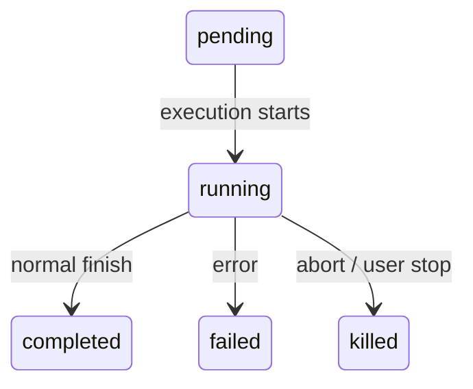
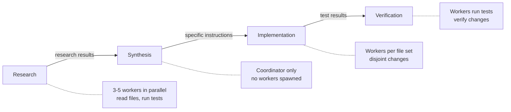
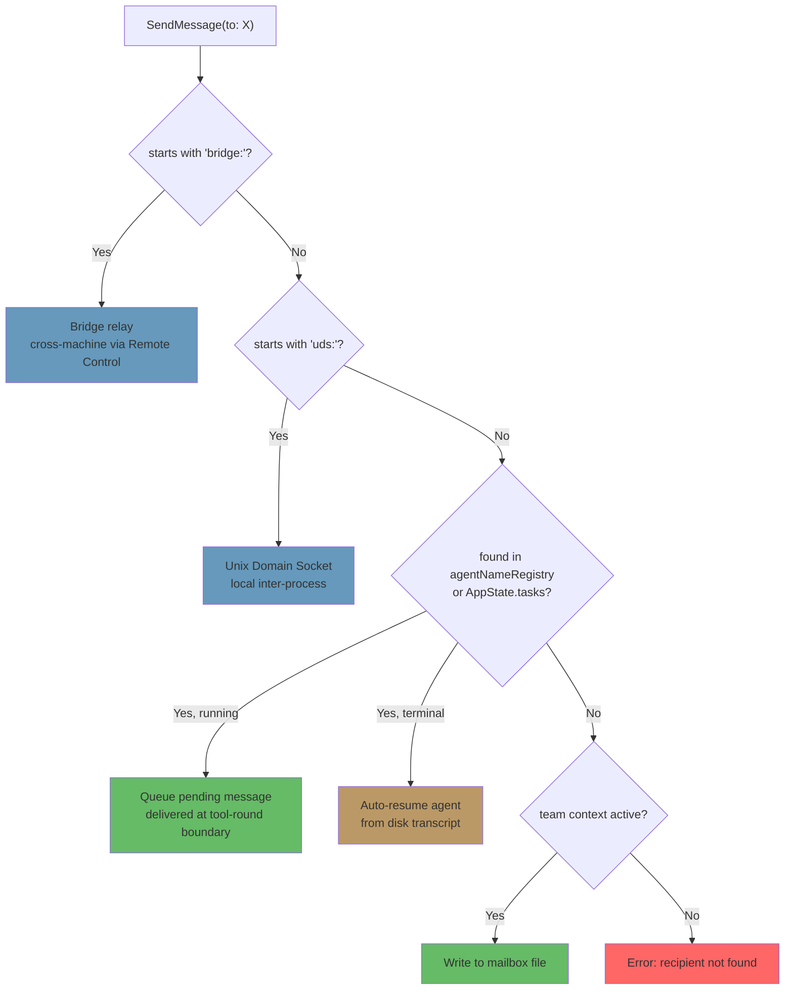

# 第十章：任務、協調與 Swarm

## 單一執行緒的極限

第八章展示了如何建立 sub-agent——透過十五個步驟的生命週期，從 agent 定義建構出一個隔離的執行環境。第九章則展示了如何利用 prompt cache 讓平行產生的 agent 更為經濟。但建立 agent 與管理 agent 是兩個不同的問題。本章要處理的是後者。

單一 agent loop——一個模型、一段對話、一次一個工具——可以完成驚人的工作量。它可以讀取檔案、編輯程式碼、執行測試、搜尋網頁，並推理複雜問題。但它終究會觸及天花板。

天花板不在於智慧，而在於平行性與作業範圍。一位開發者在進行大規模重構時，需要更新 40 個檔案、在每批修改後執行測試、並驗證沒有東西壞掉。一次程式碼庫遷移會同時涉及前端、後端和資料庫層。一次徹底的 code review 需要在背景執行測試套件的同時閱讀數十個檔案。這些不是更困難的問題——而是更寬廣的問題。它們需要同時做多件事的能力、將工作委派給專家的能力，以及協調結果的能力。

Claude Code 對這個問題的答案不是單一機制，而是一套分層的編排模式堆疊，每一層適用於不同形狀的工作。Background tasks 用於 fire-and-forget 的命令。Coordinator mode 用於 manager-worker 層級架構。Swarm teams 用於 peer-to-peer 協作。而一套統一的通訊協定將它們全部串連在一起。

編排層橫跨大約 40 個檔案，分布在 `tools/AgentTool/`、`tasks/`、`coordinator/`、`tools/SendMessageTool/` 和 `utils/swarm/` 之中。儘管範圍如此之廣，設計卻錨定在所有模式共用的單一 state machine 上。理解這個 state machine——`Task.ts` 中的 `Task` 抽象——是理解其他一切的前提。

本章將追蹤完整的堆疊，從基礎的 task state machine 一路到最精密的多 agent 拓撲。

---

## Task State Machine

Claude Code 中的每個背景操作——一個 shell 命令、一個 sub-agent、一個遠端 session、一個 workflow 腳本——都被追蹤為一個 *task*。Task 抽象位於 `Task.ts` 中，提供了編排層其餘部分所建構的統一狀態模型。

### 七種類型

系統定義了七種 task 類型，每種代表不同的執行模型：

七種 task 類型為：`local_bash`（背景 shell 命令）、`local_agent`（背景 sub-agent）、`remote_agent`（遠端 session）、`in_process_teammate`（swarm 隊友）、`local_workflow`（workflow 腳本執行）、`monitor_mcp`（MCP 伺服器監控）和 `dream`（推測性背景思考）。

`local_bash` 和 `local_agent` 是主力——分別是背景 shell 命令和背景 sub-agent。`in_process_teammate` 是 swarm 的基本單元。`remote_agent` 銜接至遠端的 Claude Code Runtime 環境。`local_workflow` 執行多步驟腳本。`monitor_mcp` 監控 MCP 伺服器健康狀態。`dream` 是最不尋常的——一個讓 agent 在等待使用者輸入時進行推測性思考的背景任務。

每種類型都有一個單字元 ID 前綴，用於即時視覺識別：

| Type | Prefix | Example ID |
|------|--------|------------|
| `local_bash` | `b` | `b4k2m8x1` |
| `local_agent` | `a` | `a7j3n9p2` |
| `remote_agent` | `r` | `r1h5q6w4` |
| `in_process_teammate` | `t` | `t3f8s2v5` |
| `local_workflow` | `w` | `w6c9d4y7` |
| `monitor_mcp` | `m` | `m2g7k1z8` |
| `dream` | `d` | `d5b4n3r6` |

Task ID 使用單字元前綴（a 代表 agent、b 代表 bash、t 代表 teammate 等），後接 8 個隨機英數字元，取自大小寫不敏感安全字母表（數字加小寫字母）。這產生了約 2.8 兆種組合——足以抵擋針對磁碟上 task 輸出檔的暴力 symlink 攻擊。

當你在日誌行中看到 `a7j3n9p2` 時，你立刻知道它是一個背景 agent。看到 `b4k2m8x1` 時，就是一個 shell 命令。前綴是為人類讀者做的微優化，但在一個可能有數十個並行 task 的系統中，這很重要。

### 五種狀態

生命週期是一個簡單的有向圖，沒有循環：



`pending` 是註冊到首次執行之間的短暫狀態。`running` 表示 task 正在積極工作。三個終端狀態分別是 `completed`（成功）、`failed`（錯誤）和 `killed`（被使用者、coordinator 或 abort 信號明確終止）。一個輔助函式防止與已死亡 task 的互動：

```typescript
export function isTerminalTaskStatus(status: TaskStatus): boolean {
  return status === 'completed' || status === 'failed' || status === 'killed'
}
```

這個函式無處不在——在訊息注入防護、驅逐邏輯、孤兒清理，以及決定是將訊息排入佇列還是恢復已死亡 agent 的 SendMessage 路由中。

### 基礎狀態

每個 task 狀態都繼承自 `TaskStateBase`，其中包含所有七種類型共用的欄位：

```typescript
export type TaskStateBase = {
  id: string              // Prefixed random ID
  type: TaskType          // Discriminator
  status: TaskStatus      // Current lifecycle position
  description: string     // Human-readable summary
  toolUseId?: string      // The tool_use block that spawned this task
  startTime: number       // Creation timestamp
  endTime?: number        // Terminal-state timestamp
  totalPausedMs?: number  // Accumulated pause time
  outputFile: string      // Disk path for streaming output
  outputOffset: number    // Read cursor for incremental output
  notified: boolean       // Whether completion was reported to parent
}
```

有兩個欄位值得關注。`outputFile` 是非同步執行與父級對話之間的橋樑——每個 task 將其輸出寫入磁碟上的檔案，而父級可以透過 `outputOffset` 增量讀取。`notified` 防止重複的完成訊息；一旦父級被告知 task 已完成，旗標就翻轉為 `true`，通知不會再次發送。如果沒有這個防護，一個在兩次連續 notification queue 輪詢之間完成的 task 會產生重複通知，讓模型誤以為兩個 task 完成了，但實際上只有一個。

### Agent Task State

`LocalAgentTaskState` 是最複雜的變體，攜帶了管理背景 sub-agent 完整生命週期所需的一切：

```typescript
export type LocalAgentTaskState = TaskStateBase & {
  type: 'local_agent'
  agentId: string
  prompt: string
  selectedAgent?: AgentDefinition
  agentType: string
  model?: string
  abortController?: AbortController
  pendingMessages: string[]       // Queued via SendMessage
  isBackgrounded: boolean         // Was this originally a foreground agent?
  retain: boolean                 // UI is holding this task
  diskLoaded: boolean             // Sidechain transcript loaded
  evictAfter?: number             // GC deadline
  progress?: AgentProgress
  lastReportedToolCount: number
  lastReportedTokenCount: number
  // ... additional lifecycle fields
}
```

三個欄位揭示了重要的設計決策。`pendingMessages` 是收件匣——當 `SendMessage` 指向一個正在執行的 agent 時，訊息會被排入這裡而非立即注入。訊息在 tool-round 邊界被清空，這保留了 agent 的回合結構。`isBackgrounded` 區分了天生就是非同步的 agent 與最初作為前景同步 agent 啟動、後來被使用者按鍵轉為背景的 agent。`evictAfter` 是一個垃圾回收機制：未被保留的已完成 task 會有一個寬限期，之後其狀態才從記憶體中清除。

所有 task 狀態都以 `Record<string, TaskState>` 的形式儲存在 `AppState.tasks` 中，以帶前綴的 ID 為鍵。這是一個扁平的 map，不是樹——系統不在狀態儲存中建模父子關係。父子關係隱含在對話流程中：父級持有產生子級的 `toolUseId`。

### Task Registry

每個 task 類型都由一個具有最小介面的 `Task` 物件支持：

```typescript
export type Task = {
  name: string
  type: TaskType
  kill(taskId: string, setAppState: SetAppState): Promise<void>
}
```

Registry 收集所有 task 實作：

```typescript
export function getAllTasks(): Task[] {
  return [
    LocalShellTask,
    LocalAgentTask,
    RemoteAgentTask,
    DreamTask,
    ...(LocalWorkflowTask ? [LocalWorkflowTask] : []),
    ...(MonitorMcpTask ? [MonitorMcpTask] : []),
  ]
}
```

注意條件性的包含——`LocalWorkflowTask` 和 `MonitorMcpTask` 受 feature gate 控制，在執行期可能不存在。`Task` 介面刻意保持最小化。早期的迭代包含了 `spawn()` 和 `render()` 方法，但當團隊發現 spawning 和 rendering 從未被多態地呼叫時，便將它們移除了。每種 task 類型都有自己的 spawn 邏輯、自己的狀態管理和自己的渲染。唯一真正需要依類型分派的操作是 `kill()`，因此這就是介面所要求的全部。

這是一個透過減法進行介面演進的範例。最初的設計設想所有 task 類型會共用一個通用的生命週期介面。實際上，各類型的差異足夠大，共享介面成了虛構——`spawn()` 對 shell 命令和 `spawn()` 對 in-process teammate 幾乎沒有共同點。與其維護一個有漏洞的抽象，團隊移除了除真正受益於多態的那一個方法之外的一切。

---

## 通訊模式

在背景執行的 task 只有在父級能觀察其進度並接收其結果時才有用。Claude Code 支援三個通訊通道，每個通道都針對不同的存取模式進行了優化。

### 前景：Generator Chain

當 agent 同步執行時，父級直接迭代其 `runAgent()` async generator，將每條訊息向上 yield 回呼叫堆疊。這裡有趣的機制是背景逃逸口——同步迴圈在「agent 的下一條訊息」和「背景信號」之間競賽：

```typescript
const agentIterator = runAgent({ ...params })[Symbol.asyncIterator]()

while (true) {
  const nextMessagePromise = agentIterator.next()
  const raceResult = backgroundPromise
    ? await Promise.race([nextMessagePromise.then(...), backgroundPromise])
    : { type: 'message', result: await nextMessagePromise }

  if (raceResult.type === 'background') {
    // User triggered backgrounding -- transition to async
    await agentIterator.return(undefined)
    void runAgent({ ...params, isAsync: true })
    return { data: { status: 'async_launched' } }
  }

  agentMessages.push(message)
}
```

如果使用者在執行過程中決定將同步 agent 轉為背景任務，前景 iterator 會被乾淨地 return（觸發其 `finally` 區塊進行資源清理），然後 agent 以相同的 ID 重新作為非同步 task 產生。這個轉換是無縫的——不會丟失任何工作，agent 會從中斷處繼續執行，帶有一個與父級 ESC 鍵解除關聯的非同步 abort controller。

這是一個真正難以正確實作的狀態轉換。前景 agent 共用父級的 abort controller（ESC 會同時終止兩者）。背景 agent 需要自己的 controller（ESC 不應終止它）。Agent 的訊息需要從前景 generator 串流轉移到背景通知系統。Task 狀態需要翻轉 `isBackgrounded`，讓 UI 知道要在背景面板中顯示它。而所有這一切必須以原子方式發生——轉換中不能丟失訊息，不能有殭屍 iterator 繼續執行。`Promise.race` 在下一條訊息和背景信號之間的競賽就是實現這一切的機制。

### 背景：三個通道

背景 agent 透過磁碟、通知和佇列訊息進行通訊。

**磁碟輸出檔案。** 每個 task 都寫入一個 `outputFile` 路徑——一個指向 agent 轉錄稿的 JSONL 格式 symlink。父級（或任何觀察者）可以使用 `outputOffset` 增量讀取此檔案，該 offset 追蹤檔案已被消費到的位置。`TaskOutputTool` 將此功能暴露給模型：

```typescript
inputSchema = z.strictObject({
  task_id: z.string(),
  block: z.boolean().default(true),
  timeout: z.number().default(30000),
})
```

當 `block: true` 時，工具會輪詢直到 task 達到終端狀態或逾時。這是 coordinator 產生 worker 並等待其結果的主要機制。

**Task 通知。** 當背景 agent 完成時，系統生成一個 XML 通知並將其排入佇列，等待送入父級的對話中：

```xml
<task-notification>
  <task-id>a7j3n9p2</task-id>
  <tool-use-id>toolu_abc123</tool-use-id>
  <output-file>/path/to/output</output-file>
  <status>completed</status>
  <summary>Agent "Investigate auth bug" completed</summary>
  <result>Found null pointer in src/auth/validate.ts:42...</result>
  <usage>
    <total_tokens>15000</total_tokens>
    <tool_uses>8</tool_uses>
    <duration_ms>12000</duration_ms>
  </usage>
</task-notification>
```

通知以 user-role 訊息注入父級的對話中，這意味著模型在其正常的訊息流程中看到它。它不需要特殊工具來檢查完成狀態——結果作為上下文自動到達。Task 狀態上的 `notified` 旗標防止重複傳送。

**命令佇列。** `LocalAgentTaskState` 上的 `pendingMessages` 陣列是第三個通道。當 `SendMessage` 指向一個正在執行的 agent 時，訊息會被排入佇列：

```typescript
if (isLocalAgentTask(task) && task.status === 'running') {
  queuePendingMessage(agentId, input.message, setAppState)
  return { data: { success: true, message: 'Message queued...' } }
}
```

這些訊息在 tool-round 邊界由 `drainPendingMessages()` 清空，並作為 user 訊息注入 agent 的對話中。這是一個關鍵的設計選擇——訊息在 tool round 之間到達，而非在執行中途。Agent 完成當前的思考，然後接收新資訊。不會有 race condition，不會有損壞的狀態。

### 進度追蹤

`ProgressTracker` 提供了 agent 活動的即時可見性：

```typescript
export type ProgressTracker = {
  toolUseCount: number
  latestInputTokens: number        // Cumulative (latest value, not sum)
  cumulativeOutputTokens: number   // Summed across turns
  recentActivities: ToolActivity[] // Last 5 tool uses
}
```

Input 和 output token 追蹤之間的區別是刻意的，反映了 API 計費模型的一個微妙之處。Input token 在每次 API 呼叫中是累計的，因為完整的對話每次都會重新發送——第 15 個回合包含了前面全部 14 個回合，所以 API 回報的 input token 數已經反映了總數。保留最新值是正確的聚合方式。Output token 是每回合獨立的——模型每次都生成新的 token——所以加總是正確的聚合方式。搞錯這一點會導致嚴重高估（累加累計的 input token）或嚴重低估（僅保留最新的 output token）。

`recentActivities` 陣列（上限 5 筆）提供了 agent 正在做什麼的人類可讀串流：「Read src/auth/validate.ts」、「Bash: npm test」、「Edit src/auth/validate.ts」。這會出現在 VS Code 的 subagent 面板和終端機的背景 task 指示器中，讓使用者無需閱讀完整轉錄稿即可看到 agent 的工作狀態。

對於背景 agent，進度透過 `updateAsyncAgentProgress()` 寫入 `AppState`，並透過 `emitTaskProgress()` 作為 SDK 事件發出。VS Code 的 subagent 面板消費這些事件來渲染即時的進度條、工具計數和活動串流。進度追蹤不只是裝飾——它是告訴使用者背景 agent 是在取得進展還是陷入迴圈的主要回饋機制。

---

## Coordinator Mode

Coordinator mode 將 Claude Code 從一個帶有背景輔助程式的單一 agent，轉變為真正的 manager-worker 架構。它是系統中最具主見的編排模式，其設計揭示了關於 LLM 應該如何以及不應該如何委派工作的深思熟慮。

### Coordinator Mode 解決的問題

標準的 agent loop 有單一對話和單一 context window。當它產生背景 agent 時，背景 agent 獨立執行並透過 task notification 回報結果。這對簡單的委派很有效——「在我繼續編輯時執行測試」——但在複雜的多步驟工作流程中就會崩壞。

以程式碼庫遷移為例。Agent 需要：(1) 理解 200 個檔案中的現有模式，(2) 設計遷移策略，(3) 對每個檔案套用變更，以及 (4) 驗證沒有東西壞掉。步驟 1 和 3 受益於平行處理。步驟 2 需要綜合步驟 1 的結果。步驟 4 依賴於步驟 3。一個單一 agent 依序執行這些操作，會將大部分的 token 預算花在重新讀取檔案上。多個背景 agent 在沒有協調的情況下執行，會產生不一致的變更。

Coordinator mode 透過將「思考」agent 和「執行」agent 分開來解決這個問題。Coordinator 處理步驟 1 和 2（分派研究 worker，然後綜合結果）。Worker 處理步驟 3 和 4（套用變更、執行測試）。Coordinator 看到全貌；worker 只看到自己的特定任務。

### 啟動方式

一個環境變數就能啟動它：

```typescript
export function isCoordinatorMode(): boolean {
  if (feature('COORDINATOR_MODE')) {
    return isEnvTruthy(process.env.CLAUDE_CODE_COORDINATOR_MODE)
  }
  return false
}
```

在 session 恢復時，`matchSessionMode()` 會檢查恢復的 session 所儲存的模式是否與當前環境一致。如果不一致，環境變數會被翻轉以匹配。這防止了令人困惑的情境：coordinator session 以普通 agent 身份恢復（失去對其 worker 的感知），或普通 session 以 coordinator 身份恢復（失去對其工具的存取）。Session 的模式是真實來源；環境變數是執行期信號。

### 工具限制

Coordinator 的力量不是來自擁有更多工具，而是來自擁有更少工具。在 coordinator mode 中，coordinator agent 只有三個工具：

- **Agent** —— 產生 worker
- **SendMessage** —— 與現有 worker 通訊
- **TaskStop** —— 終止正在執行的 worker

就是這樣。沒有檔案讀取。沒有程式碼編輯。沒有 shell 命令。Coordinator 不能直接觸碰程式碼庫。這個限制不是缺陷——它是核心設計原則。Coordinator 的工作是思考、規劃、分解和綜合。Worker 做實際的工作。

相對地，worker 得到完整的工具集，但排除了內部協調工具：

```typescript
const INTERNAL_WORKER_TOOLS = new Set([
  TEAM_CREATE_TOOL_NAME,
  TEAM_DELETE_TOOL_NAME,
  SEND_MESSAGE_TOOL_NAME,
  SYNTHETIC_OUTPUT_TOOL_NAME,
])
```

Worker 不能產生自己的子團隊，也不能向 peer 發送訊息。它們透過正常的 task 完成機制回報結果，由 coordinator 跨結果進行綜合。

### 370 行的 System Prompt

Coordinator 的 system prompt 逐行來看，是程式碼庫中關於如何使用 LLM 進行編排最具啟發性的文件。它大約有 370 行，編碼了來之不易的委派模式經驗。其核心教導：

**「永遠不要委派理解。」** 這是中心論點。Coordinator 必須將研究發現綜合成具體的 prompt，包含檔案路徑、行號和確切的變更。Prompt 明確指出了反模式，例如「根據你的研究發現，修復這個 bug」——這種 prompt 將*理解*委派給了 worker，迫使它重新推導 coordinator 已經擁有的上下文。正確的模式是：「在 `src/auth/validate.ts` 的第 42 行，`userId` 參數在從 OAuth 流程呼叫時可能為 null。加入一個 null 檢查，回傳 401 回應。」

**「平行處理是你的超能力。」** Prompt 建立了清晰的並行模型。唯讀任務可以自由平行執行——研究、探索、檔案讀取。寫入密集的任務按檔案集合序列化。Coordinator 被期望推理哪些任務可以重疊、哪些必須依序執行。一個好的 coordinator 同時產生五個研究 worker、等待它們全部完成、綜合結果，然後產生三個處理不相交檔案集的實作 worker。一個差的 coordinator 產生一個 worker、等待、再產生下一個、再等待——將可以平行處理的工作序列化了。

**任務工作流程階段。** Prompt 定義了四個階段：



1. **Research** —— worker 平行探索程式碼庫，讀取檔案、執行測試、收集資訊
2. **Synthesis** —— coordinator（不是 worker）讀取所有研究結果並建構統一的理解
3. **Implementation** —— worker 接收從 synthesis 推導出的精確指令
4. **Verification** —— worker 執行測試並驗證變更

Coordinator 不應跳過階段。最常見的失敗模式是從 research 直接跳到 implementation 而沒有 synthesis。當這種情況發生時，coordinator 將理解委派給了 implementation worker——每個 worker 必須從零開始重新推導上下文，導致不一致的變更和浪費的 token。

**Continue-vs-spawn 決策。** 當 worker 完成且 coordinator 有後續工作時，應該向現有 worker 發送訊息（透過 SendMessage）還是產生新的（透過 Agent）？決策取決於上下文重疊程度：

- **高重疊、相同檔案**：繼續。Worker 已經在其上下文中有檔案內容，理解模式，可以在先前的工作基礎上建構。重新產生會強制重新讀取相同的檔案並重新推導相同的理解。
- **低重疊、不同領域**：產生新的。一個剛調查完認證系統的 worker 攜帶了 20,000 個 token 的 auth 特定上下文，這對 CSS 重構任務來說是死重。從乾淨的狀態開始更便宜。
- **高重疊但 worker 失敗了**：產生新的，附帶關於哪裡出錯的明確指導。繼續一個失敗的 worker 往往意味著在混亂的上下文中掙扎。帶著「上一次嘗試失敗是因為 X，避免 Y」的全新開始更可靠。
- **後續工作需要 worker 的輸出**：繼續，並在 SendMessage 中包含輸出。Worker 不需要重新推導自己的結果。

**Worker prompt 撰寫與反模式。** Prompt 教導 coordinator 如何撰寫有效的 worker prompt，並明確標記不良模式：

反模式：*「根據你的研究發現，實作修復。」* 這委派了理解。Worker 不是做研究的那個——coordinator 才是讀取研究結果的人。

反模式：*「修復 auth 模組中的 bug。」* 沒有檔案路徑、沒有行號、沒有 bug 的描述。Worker 必須從零開始搜尋整個程式碼庫。

反模式：*「對所有其他檔案做同樣的變更。」* 哪些檔案？什麼變更？Coordinator 知道；它應該列舉出來。

好的模式：*「在 `src/auth/validate.ts` 的第 42 行，`userId` 參數在從 `src/oauth/callback.ts:89` 呼叫時可能為 null。加入 null 檢查：如果 `userId` 為 null，回傳 `{ error: 'unauthorized', status: 401 }`。然後更新 `src/auth/__tests__/validate.test.ts` 中的測試以涵蓋 null 的情況。」*

撰寫具體 prompt 的成本只由 coordinator 承擔一次。而好處——一個在第一次就正確執行的 worker——是巨大的。含糊的 prompt 創造了虛假的經濟效益：coordinator 省了 30 秒的 prompt 撰寫時間，worker 卻浪費了 5 分鐘的探索時間。

### Worker Context

Coordinator 將可用工具的資訊注入自己的上下文中，讓模型知道 worker 能做什麼：

```typescript
export function getCoordinatorUserContext(mcpClients, scratchpadDir?) {
  return {
    workerToolsContext: `Workers spawned via Agent have access to: ${workerTools}`
      + (mcpClients.length > 0
        ? `\nWorkers also have MCP tools from: ${serverNames}` : '')
      + (scratchpadDir ? `\nScratchpad: ${scratchpadDir}` : '')
  }
}
```

Scratchpad 目錄（受 `tengu_scratch` feature flag 控制）是一個共享的檔案系統位置，worker 可以在此讀寫而無需權限提示。它實現了持久的跨 worker 知識共享——一個 worker 的研究筆記成為另一個 worker 的輸入，透過檔案系統而非 coordinator 的 token 視窗進行中介。

這很重要，因為它解決了 coordinator 模式的一個根本限制。沒有 scratchpad 時，所有資訊都流經 coordinator：Worker A 產出發現，coordinator 透過 TaskOutput 讀取它們，將它們綜合到 Worker B 的 prompt 中。Coordinator 的 context window 成為瓶頸——它必須保留所有中間結果足夠長的時間以進行綜合。有了 scratchpad，Worker A 將發現寫入 `/tmp/scratchpad/auth-analysis.md`，而 coordinator 告訴 Worker B：「讀取 `/tmp/scratchpad/auth-analysis.md` 中的 auth 分析，並將該模式應用到 OAuth 模組。」Coordinator 透過引用而非值來傳遞資訊。

### 與 Fork 的互斥

Coordinator mode 和基於 fork 的 subagent 是互斥的：

```typescript
export function isForkSubagentEnabled(): boolean {
  if (feature('FORK_SUBAGENT')) {
    if (isCoordinatorMode()) return false
    // ...
  }
}
```

這個衝突是根本性的。Fork agent 繼承父級的整個對話上下文——它們是共用 prompt cache 的廉價克隆。Coordinator worker 是擁有全新上下文和特定指令的獨立 agent。這是兩種對立的委派哲學，系統在 feature flag 層級強制執行這個選擇。

---

## Swarm 系統

Coordinator mode 是層級式的：一個管理者、多個 worker、由上而下的控制。Swarm 系統則是 peer-to-peer 的替代方案——多個 Claude Code 實例作為團隊工作，由一個 leader 透過訊息傳遞協調多個 teammate。

### Team Context

團隊由 `teamName` 識別，並在 `AppState.teamContext` 中追蹤：

```typescript
teamContext?: {
  teamName: string
  teammates: {
    [id: string]: { name: string; color?: string; ... }
  }
}
```

每個 teammate 有一個名稱（用於定址）和一個顏色（用於 UI 中的視覺區分）。團隊檔案持久化在磁碟上，使得團隊成員資格在 process 重啟後仍能存續。

### Agent Name Registry

背景 agent 可以在產生時被賦予名稱，使它們可以透過人類可讀的識別符而非隨機 task ID 被定址：

```typescript
if (name) {
  rootSetAppState(prev => {
    const next = new Map(prev.agentNameRegistry)
    next.set(name, asAgentId(asyncAgentId))
    return { ...prev, agentNameRegistry: next }
  })
}
```

`agentNameRegistry` 是一個 `Map<string, AgentId>`。當 `SendMessage` 解析 `to` 欄位時，會先檢查 registry：

```typescript
const registered = appState.agentNameRegistry.get(input.to)
const agentId = registered ?? toAgentId(input.to)
```

這意味著你可以向 `"researcher"` 而非 `a7j3n9p2` 發送訊息。這個間接層很簡單，但它讓 coordinator 能以角色而非 ID 來思考——這對模型推理多 agent 工作流程的能力是顯著的提升。

### In-Process Teammates

In-process teammate 在與 leader 相同的 Node.js process 中執行，透過 `AsyncLocalStorage` 隔離。它們的狀態擴展了基礎狀態，加入了團隊特定的欄位：

```typescript
export type InProcessTeammateTaskState = TaskStateBase & {
  type: 'in_process_teammate'
  identity: TeammateIdentity
  prompt: string
  messages?: Message[]                  // Capped at 50
  pendingUserMessages: string[]
  isIdle: boolean
  shutdownRequested: boolean
  awaitingPlanApproval: boolean
  permissionMode: PermissionMode
  onIdleCallbacks?: Array<() => void>
  currentWorkAbortController?: AbortController
}
```

`messages` 上限 50 筆值得解釋。在開發過程中，分析發現每個 in-process agent 在 500+ 回合後累積約 20MB 的 RSS。Whale session——長時間執行擴展工作流程的重度使用者——被觀察到在 2 分鐘內啟動了 292 個 agent，將 RSS 推到 36.8GB。UI 表示的 50 筆訊息上限是記憶體安全閥。Agent 的實際對話以完整歷史繼續；只有面向 UI 的快照被截斷。

`isIdle` 旗標啟用了 work-stealing 模式。一個閒置的 teammate 不消耗 token 或 API 呼叫——它只是等待下一條訊息。`onIdleCallbacks` 陣列讓系統能掛鉤從活躍到閒置的轉換，啟用如「等待所有 teammate 完成，然後繼續」之類的編排模式。

`currentWorkAbortController` 與 teammate 的主要 abort controller 是不同的。中止當前工作 controller 會取消 teammate 正在進行的回合，但不會終止 teammate。這啟用了一種「重新導向」模式：leader 發送更高優先級的訊息，teammate 的當前工作被中止，teammate 接收新訊息。主要 abort controller 被中止時，則會完全終止 teammate。兩個層次的中斷對應兩個層次的意圖。

`shutdownRequested` 旗標實現了合作式終止。當 leader 發送 shutdown 請求時，此旗標被設定。Teammate 可以在自然的停止點檢查它並優雅地結束——完成當前的檔案寫入、提交變更，或發送最終狀態更新。這比硬性終止更溫和，硬性終止可能會讓檔案處於不一致的狀態。

### 信箱系統

Teammate 透過基於檔案的信箱系統通訊。當 `SendMessage` 指向一個 teammate 時，訊息會被寫入接收者的信箱檔案：

```typescript
await writeToMailbox(recipientName, {
  from: senderName,
  text: content,
  summary,
  timestamp: new Date().toISOString(),
  color: senderColor,
}, teamName)
```

訊息可以是純文字、結構化協定訊息（shutdown 請求、plan 核准），或廣播（`to: "*"` 發送給所有團隊成員，排除發送者本人）。一個輪詢 hook 處理傳入的訊息並將它們路由到 teammate 的對話中。

基於檔案的方式是刻意簡單的。沒有 message broker、沒有 event bus、沒有共享記憶體通道。檔案是持久的（在 process 崩潰後仍存活）、可檢視的（你可以 `cat` 一個信箱）、且便宜（沒有基礎設施依賴）。對於一個訊息量以每 session 數十筆而非每秒數千筆計的系統，這是正確的取捨。一個基於 Redis 的 message queue 會增加操作複雜度、依賴項和故障模式——全部是為了一個檔案系統呼叫就能輕鬆處理的吞吐量需求。

廣播機制值得一提。當訊息發送到 `"*"` 時，發送者遍歷團隊檔案中的所有成員，跳過自身（大小寫不敏感比較），然後分別寫入每個成員的信箱：

```typescript
for (const member of teamFile.members) {
  if (member.name.toLowerCase() === senderName.toLowerCase()) continue
  recipients.push(member.name)
}
for (const recipientName of recipients) {
  await writeToMailbox(recipientName, { from: senderName, text: content, ... }, teamName)
}
```

沒有 fan-out 優化——每個接收者都有一次獨立的檔案寫入。同樣，在 agent 團隊的規模下（通常 3-8 個成員），這完全足夠。如果團隊有 100 個成員，這就需要重新思考。但防止 36GB RSS 場景的 50 筆訊息記憶體上限也隱含地限制了有效的團隊規模。

### 權限轉發

Swarm worker 以受限權限運作，但可以在需要敏感操作核准時向 leader 升級：

```typescript
const request = createPermissionRequest({
  toolName, toolUseId, input, description, permissionSuggestions
})
registerPermissionCallback({ requestId, toolUseId, onAllow, onReject })
void sendPermissionRequestViaMailbox(request)
```

流程是：worker 觸及需要權限的工具，bash classifier 嘗試自動核准，如果失敗，請求透過信箱系統轉發給 leader。Leader 在其 UI 中看到請求，可以核准或拒絕。Callback 觸發，worker 繼續執行。這讓 worker 能在安全操作上自主運作，同時對危險操作維持人類監督。

---

## Agent 間通訊：SendMessage

`SendMessageTool` 是通用的通訊原語。它透過單一工具介面處理四種不同的路由模式，由 `to` 欄位的形狀來選擇。

### Input Schema

```typescript
inputSchema = z.object({
  to: z.string(),
  // "teammate-name", "*", "uds:<socket>", "bridge:<session-id>"
  summary: z.string().optional(),
  message: z.union([
    z.string(),
    z.discriminatedUnion('type', [
      z.object({ type: z.literal('shutdown_request'), reason: z.string().optional() }),
      z.object({ type: z.literal('shutdown_response'), request_id, approve, reason }),
      z.object({ type: z.literal('plan_approval_response'), request_id, approve, feedback }),
    ]),
  ]),
})
```

`message` 欄位是純文字和結構化協定訊息的聯合型別。這意味著 SendMessage 同時承擔雙重職責——它既是非正式的聊天通道（「這是我的發現」），也是正式的協定層（「我核准你的計畫」/「請關閉」）。

### 路由分派

`call()` 方法遵循一個優先級排序的分派鏈：



**1. Bridge 訊息**（`bridge:<session-id>`）。透過 Anthropic 的 Remote Control 伺服器進行跨機器通訊。這是最廣泛的覆蓋範圍——兩個位於不同機器、可能在不同大陸的 Claude Code 實例，透過 relay 進行通訊。系統要求使用者在發送 bridge 訊息前明確同意——這是一個安全檢查，防止一個 agent 單方面與遠端實例建立通訊。沒有這個門檻，一個被入侵或混亂的 agent 可能會將資訊外洩到遠端 session。同意檢查使用 `postInterClaudeMessage()`，它處理序列化和透過 Remote Control relay 的傳輸。

**2. UDS 訊息**（`uds:<socket-path>`）。透過 Unix Domain Socket 進行本地 inter-process 通訊。這用於在同一台機器上但不同 process 中執行的 Claude Code 實例——例如，一個 VS Code 擴充功能託管一個實例，一個終端機託管另一個。UDS 通訊是快速的（沒有網路往返）、安全的（檔案系統權限控制存取）且可靠的（kernel 處理傳送）。`sendToUdsSocket()` 函式序列化訊息並寫入 `to` 欄位指定的 socket 路徑。Peer 透過掃描活躍 UDS 端點的 `ListPeers` 工具來發現彼此。

**3. In-process subagent 路由**（純名稱或 agent ID）。這是最常見的路徑。路由邏輯：

- 在 `agentNameRegistry` 中查詢 `input.to`
- 如果找到且正在執行：`queuePendingMessage()` —— 訊息等待下一個 tool-round 邊界
- 如果找到但處於終端狀態：`resumeAgentBackground()` —— agent 被透明地重新啟動
- 如果不在 `AppState` 中：嘗試從磁碟轉錄稿恢復

**4. Team mailbox**（當 team context 啟用時的 fallback）。具名接收者的訊息被寫入其信箱檔案。`"*"` 萬用字元觸發向所有團隊成員的廣播。

### 結構化協定

除了純文字，SendMessage 還承載兩個正式的協定。

**Shutdown 協定。** Leader 向 teammate 發送 `{ type: 'shutdown_request', reason: '...' }`。Teammate 回應 `{ type: 'shutdown_response', request_id, approve: true/false, reason }`。如果核准，in-process teammate 中止其 controller；基於 tmux 的 teammate 接收 `gracefulShutdown()` 呼叫。這個協定是合作式的——如果 teammate 正在進行關鍵工作，可以拒絕 shutdown 請求，而 leader 必須處理這種情況。

**Plan approval 協定。** 在 plan mode 中運作的 teammate 必須在執行前取得核准。它們提交計畫，leader 回應 `{ type: 'plan_approval_response', request_id, approve, feedback }`。只有 team lead 可以發出核准。這創造了一個審查門檻——leader 可以在任何檔案被觸碰之前檢查 worker 的預期方法，及早發現誤解。

### Auto-Resume 模式

路由系統最優雅的特性是透明的 agent 恢復。當 `SendMessage` 指向一個已完成或已終止的 agent 時，它不會回傳錯誤，而是復活 agent：

```typescript
if (task.status !== 'running') {
  const result = await resumeAgentBackground({
    agentId,
    prompt: input.message,
    toolUseContext: context,
    canUseTool,
  })
  return {
    data: {
      success: true,
      message: `Agent "${input.to}" was stopped; resumed with your message`
    }
  }
}
```

`resumeAgentBackground()` 函式從磁碟轉錄稿重建 agent：

1. 讀取 sidechain JSONL 轉錄稿
2. 重建訊息歷史，過濾孤立的 thinking block 和未解析的 tool use
3. 重建 content replacement 狀態以維持 prompt cache 穩定性
4. 從儲存的 metadata 解析原始 agent 定義
5. 以全新的 abort controller 重新註冊為背景 task
6. 以恢復的歷史加上新訊息作為 prompt 呼叫 `runAgent()`

從 coordinator 的角度來看，向死亡 agent 發送訊息和向活躍 agent 發送訊息是相同的操作。路由層處理了複雜性。這意味著 coordinator 不需要追蹤哪些 agent 還活著——它們只需發送訊息，系統會搞定一切。

其影響是顯著的。沒有 auto-resume 的話，coordinator 需要維護一個 agent 存活狀態的心智模型：「`researcher` 還在執行嗎？讓我檢查一下。它完成了。我需要產生新的 agent。但等等，我應該用相同的名稱嗎？它會有相同的上下文嗎？」有了 auto-resume，所有這一切收斂為：「向 `researcher` 發送訊息。」如果它還活著，訊息被排入佇列。如果它已死，它會帶著完整歷史被復活。Coordinator 的 prompt 複雜度大幅下降。

當然有成本。從磁碟轉錄稿恢復意味著重新讀取可能數千條訊息、重建內部狀態，以及用完整的 context window 進行新的 API 呼叫。對於一個長期存活的 agent，這在延遲和 token 方面可能都很昂貴。但替代方案——要求 coordinator 手動管理 agent 生命週期——更糟。Coordinator 是一個 LLM。它擅長推理問題和撰寫指令。它不擅長記帳。Auto-resume 透過完全消除一個記帳類別來發揮 LLM 的優勢。

---

## TaskStop：終止開關

`TaskStopTool` 是 Agent 和 SendMessage 的互補——它終止正在執行的 task：

```typescript
inputSchema = z.strictObject({
  task_id: z.string().optional(),
  shell_id: z.string().optional(),  // Deprecated backward compat
})
```

實作委派給 `stopTask()`，它根據 task 類型進行分派：

1. 在 `AppState.tasks` 中查詢 task
2. 呼叫 `getTaskByType(task.type).kill(taskId, setAppState)`
3. 對 agent：中止 controller、將狀態設為 `'killed'`、啟動驅逐計時器
4. 對 shell：終止 process group

這個工具有一個遺留別名 `"KillShell"` ——提醒我們 task 系統是從更簡單的起源演進而來的，當時唯一的背景操作是 shell 命令。

終止機制因 task 類型而異，但模式是一致的。對 agent 而言，終止意味著中止 abort controller（這導致 `query()` 迴圈在下一個 yield 點退出）、將狀態設為 `'killed'`，以及啟動驅逐計時器，使 task 狀態在寬限期後被清理。對 shell 而言，終止意味著向 process group 發送信號——先 `SIGTERM`，如果 process 在逾時內未退出，再 `SIGKILL`。對 in-process teammate 而言，終止還會觸發向團隊的 shutdown 通知，讓其他成員知道該 teammate 已離開。

驅逐計時器值得注意。當 agent 被終止時，其狀態不會立即被清除。它在 `AppState.tasks` 中停留一個寬限期（由 `evictAfter` 控制），以便 UI 可以顯示已終止狀態、最終輸出可以被讀取，以及透過 SendMessage 的 auto-resume 仍然可能。寬限期過後，狀態被垃圾回收。這與已完成 task 使用的模式相同——系統區分「已完成」（結果可用）和「已遺忘」（狀態被清除）。

---

## 選擇模式

（關於命名的一個註解：程式碼庫中還包含 `TaskCreate`/`TaskGet`/`TaskList`/`TaskUpdate` 工具，它們管理一個結構化的待辦清單——與這裡描述的背景 task state machine 是完全不同的系統。`TaskStop` 操作 `AppState.tasks`；`TaskUpdate` 操作專案追蹤資料儲存。命名上的重疊是歷史原因，也是模型反覆混淆的根源。）

有三種編排模式可用——背景委派、coordinator mode 和 swarm teams——自然的問題是何時使用哪一種。

**簡單委派**（使用 `run_in_background: true` 的 Agent 工具）適用於父級有一兩個獨立任務要卸載的情況。在繼續編輯的同時在背景執行測試。在等待 build 的同時搜尋程式碼庫。父級保持控制，在準備好時檢查結果，永遠不需要複雜的通訊協定。開銷最小——一個 task 狀態條目、一個磁碟輸出檔案、完成時一個通知。

**Coordinator mode** 適用於問題可以分解為研究階段、綜合階段和實作階段——且 coordinator 需要在多個 worker 的結果之間進行推理後再指導下一步的情況。Coordinator 不能觸碰檔案，這迫使關注點的乾淨分離：思考在一個 context 中發生，執行在另一個中發生。370 行的 system prompt 不是形式主義——它編碼了防止 LLM 委派最常見失敗模式的模式，即委派理解而非委派行動。

**Swarm teams** 適用於長時間執行的協作 session，其中 agent 需要 peer-to-peer 通訊，工作是持續性的而非批次導向的，agent 可能需要基於傳入訊息而閒置和恢復。信箱系統支援 coordinator mode（同步的 spawn-wait-synthesize）所不支援的非同步模式。Plan approval 門檻增加了審查層。權限轉發在維持安全性的同時不要求每個 agent 都有完整權限。

一個實用的決策表：

| 場景 | 模式 | 原因 |
|------|------|------|
| 在編輯時執行測試 | 簡單委派 | 一個背景 task，不需要協調 |
| 搜尋程式碼庫中的所有用法 | 簡單委派 | Fire-and-forget，完成時讀取輸出 |
| 跨 3 個模組重構 40 個檔案 | Coordinator | Research 階段找到模式，synthesis 規劃變更，worker 按模組平行執行 |
| 帶審查門檻的多日功能開發 | Swarm | 長存活 agent、plan approval 協定、peer 通訊 |
| 修復已知位置的 bug | 都不需要——單一 agent | 對於專注的、循序的工作，編排的開銷超過了收益 |
| 遷移資料庫 schema + 更新 API + 更新前端 | Coordinator | 在共享的 research/planning 階段後有三個獨立的工作流 |
| 帶使用者監督的結對程式設計 | 帶 plan mode 的 Swarm | Worker 提議、leader 核准、worker 執行 |

這些模式在原則上不互斥，但在實踐中是互斥的。Coordinator mode 停用了 fork subagent。Swarm teams 有自己的通訊協定，不與 coordinator 的 task notification 混合。選擇在 session 啟動時透過環境變數和 feature flag 做出，它塑造了整個互動模型。

最後一個觀察：最簡單的模式幾乎總是正確的起點。大多數任務不需要 coordinator mode 或 swarm teams。一個帶有偶爾背景委派的單一 agent 就能處理絕大多數開發工作。精密的模式存在於那 5% 的情況——問題真正是寬廣的、真正是平行的，或真正是長時間執行的。對單一檔案的 bug 修復使用 coordinator mode，就像為靜態網站部署 Kubernetes——技術上可行，架構上不合適。

---

## 編排的成本

在探討編排層從哲學上揭示了什麼之前，值得先承認它在實踐中的成本。

每個背景 agent 都是一個獨立的 API 對話。它有自己的 context window、自己的 token 預算和自己的 prompt cache slot。一個產生 5 個研究 worker 的 coordinator 正在進行 6 個並行 API 呼叫，每個都有自己的 system prompt、工具定義和 CLAUDE.md 注入。Token 開銷不是微不足道的——僅 system prompt 就可能是數千個 token，每個 worker 重新讀取其他 worker 可能已經讀過的檔案。

通訊通道增加了延遲。磁碟輸出檔案需要檔案系統 I/O。Task notification 在 tool-round 邊界傳送，而非即時。命令佇列引入了完整的往返延遲——coordinator 發送訊息，訊息等待 worker 完成當前的 tool use，worker 處理訊息，結果寫入磁碟供 coordinator 讀取。

狀態管理增加了複雜度。七種 task 類型、五種狀態，以及每個 task 狀態數十個欄位。驅逐邏輯、垃圾回收計時器、記憶體上限——所有這一切存在是因為無限的狀態成長導致了真實的生產事故（36.8GB RSS）。

這些都不意味著編排是錯的。它意味著編排是一個有成本的工具，成本應該與收益權衡。執行 5 個平行 worker 來搜尋程式碼庫，在搜尋原本需要 5 分鐘的情況下是值得的。執行 coordinator 來修復一個檔案中的錯字，純粹是開銷。

---

## 編排層揭示了什麼

這個系統最有趣的面向不是任何單一機制——task 狀態、信箱和 notification XML 都是直截了當的工程。有趣的是它們組合在一起時浮現的*設計哲學*。

Coordinator prompt 的「永遠不要委派理解」不只是 LLM 編排的好建議。它是關於基於 context window 推理的根本限制的陳述。一個擁有全新 context window 的 worker 無法理解 coordinator 在讀取 50 個檔案並綜合三份研究報告後所理解的內容。彌合這個差距的唯一方式是 coordinator 將其理解萃取為具體的、可行動的 prompt。含糊的委派不只是低效的——它在資訊論上是有損的。

SendMessage 中的 auto-resume 模式揭示了一種偏好：*表面上的簡單優於實際上的簡單*。實作是複雜的——讀取磁碟轉錄稿、重建 content replacement 狀態、重新解析 agent 定義。但介面是簡單的：發送訊息，無論接收者是活的還是死的，它都能運作。複雜性被基礎設施吸收，使得模型（和使用者）可以用更簡單的術語進行推理。

而 in-process teammate 的 50 筆訊息記憶體上限提醒我們，編排系統運作在真實的物理約束下。292 個 agent 在 2 分鐘內達到 36.8GB RSS 不是理論上的擔憂——它在生產環境中發生了。抽象是優雅的，但它們運行在記憶體有限的硬體上，系統必須在使用者將其推向極限時優雅降級。

分層架構本身也有一個教訓。Task state machine 是不可知的——它不知道 coordinator 或 swarm 的存在。通訊通道是不可知的——SendMessage 不知道它是被 coordinator、swarm leader 還是獨立 agent 呼叫的。Coordinator prompt 疊加在上面，增加了方法論而不改變底層的機制。每一層都可以獨立理解、獨立測試、獨立演進。當團隊加入 swarm 系統時，他們不需要修改 task state machine。當他們加入 coordinator prompt 時，他們不需要修改 SendMessage。

這是良好分解的編排的標誌：原語是通用的，模式從它們組合而來。Coordinator 只是一個擁有受限工具和詳細 system prompt 的 agent。Swarm leader 只是一個擁有 team context 和信箱存取的 agent。背景 worker 只是一個擁有獨立 abort controller 和磁碟輸出檔案的 agent。七種 task 類型、五種狀態和四種路由模式組合起來，產生了大於部分之和的編排模式。

編排層是 Claude Code 從單一執行緒工具執行器轉變為更接近開發團隊的地方。Task state machine 提供了記帳。通訊通道提供了資訊流。Coordinator prompt 提供了方法論。而 swarm 系統為不適合嚴格層級的問題提供了 peer-to-peer 拓撲。它們共同使得語言模型能夠做到單次模型呼叫無法做到的事情：在平行中處理寬廣的問題，且有協調。

下一章將探討權限系統——決定這些 agent 中的哪些可以做什麼，以及危險操作如何從 worker 升級到人類的安全層。沒有權限控制的編排會成為錯誤的力量倍增器。權限系統確保更多 agent 意味著更多能力，而非更多風險。
