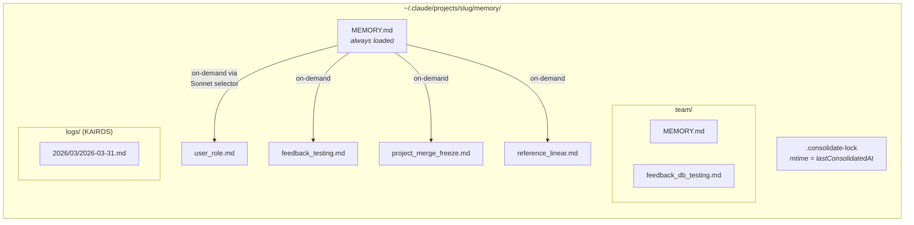
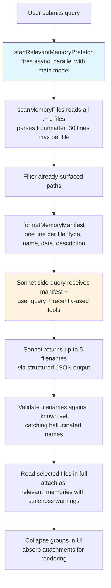
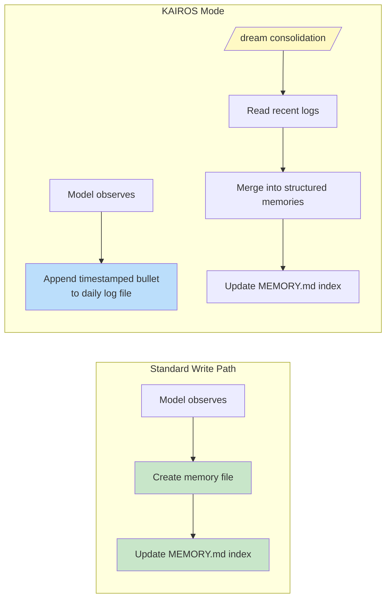

# 第十一章：Memory —— 跨對話學習

## 無狀態問題

到目前為止，每一章描述的機制都存在於單一 session 之內。Agent loop 執行、tools 運行、sub-agents 協調，而當 process 退出時，一切都煙消雲散。下一次對話以相同的 system prompt、相同的 tool 定義、相同的 model 開始——對之前發生的事情一無所知。

這是無狀態架構的根本限制。開發者在週一糾正了 model 的測試方法，週二 model 又犯了同樣的錯誤。使用者解釋了他們的角色、專案的限制條件、程式碼風格的偏好，而每個新的 session 都要求他們再解釋一遍。Model 不是健忘——它從來就不知道。每次對話都是一個獨立的宇宙。

這個問題不是理論性的。它以具體的方式侵蝕信任。使用者說「記住，我們在測試中使用真實的資料庫實例，不用 mocks」——下週 model 卻生成了 mocked 測試。使用者解釋他們是資深工程師，不需要初學者級的解說——下個 session 卻以教學式的入門介紹開場。沒有 memory，每個 session 都從零開始。Agent 永遠是第一天上班的新人。

業界的標準解決方案是檢索增強生成（Retrieval-Augmented Generation，RAG）：將文件嵌入為向量、儲存在向量資料庫中，在查詢時檢索相關片段。這對知識庫效果很好——文件、FAQ、參考資料。但它在架構上與 agent 真正需要跨 session 記憶的內容不匹配。Agent 的 memory 不是知識庫，而是一系列觀察：使用者是誰、他們糾正了什麼、專案目前的限制是什麼、在哪裡找到東西。這些觀察規模小、變化頻繁，且必須可由人類編輯。向量資料庫解決的是錯誤的問題。

Claude Code 的 memory 系統是一個完全不同的賭注：磁碟上的檔案、Markdown 格式、LLM 驅動的 recall、零基礎設施。這個賭注是：儲存的簡單性加上檢索的智慧，會產生比兩者都複雜化更好的系統。

這個設計哲學帶來了塑造整個系統的後果：

- **人類可讀。** 想查看 Claude Code 記住了什麼的使用者可以在任何文字編輯器中打開 `~/.claude/projects/<slug>/memory/MEMORY.md`。不需要特殊工具、不需要解密、不需要匯出指令。
- **人類可編輯。** 過時的 memory 可以用 vim 修正。錯誤的 memory 可以用 `rm` 刪除。使用者對 agent 的知識擁有完全的掌控權。
- **可版本控制。** 團隊 memory 可以 commit 到 git。Memory 變更可以乾淨地 diff，因為它們是 Markdown。
- **零基礎設施。** Memory 系統可以離線工作、不需要伺服器、可以在任何有檔案系統的作業系統上運行。沒有遷移路徑，因為沒有 schema。
- **可除錯。** 當 memory 行為異常時，診斷路徑是 `ls` 和 `cat`，而不是查詢日誌和資料庫檢查。

Model 使用 `FileWriteTool` 和 `FileEditTool` 來讀寫 memory——與它用來編輯原始碼的工具相同（在第六章介紹）。不存在特殊的 memory API。System prompt 教會 model 一個兩步驟的寫入協議（建立檔案、更新索引），而 model 在新的指令下使用其既有能力執行。這是作為架構原則的工具重用——memory 系統不是螺栓式地安裝在 agent 上的子系統，而是 agent 使用其既有能力所產生的湧現行為。

檔案式選擇在此有效，有一個更深層的原因。對於 AI agent 來說，memory 與傳統應用中的記憶根本不同。傳統應用的資料庫保存的是權威狀態——系統資料的真實來源。Agent 的 memory 保存的是*觀察*——在某個時間點為真、未來可能為真也可能不再為真的事物。檔案自然地傳達了這種認識論上的狀態。它們有修改時間，揭示觀察被記錄的時間。它們可以被知道觀察有誤的人類讀取、編輯和刪除。資料庫暗示永久性和權威性；一個 Markdown 檔案暗示的是某人寫下的筆記，可能需要更新。儲存媒介傳達了資料的本質——這些是工作筆記，不是聖旨。

### 按專案範圍劃分

Memory 的範圍是按 git repository root 劃分的，而不是工作目錄。如果使用者在 `src/components/` 打開一個終端，在 `tests/` 打開另一個，兩個 session 共享相同的 memory 目錄。解析邏輯先找到規範的 git root，再退回到專案根目錄：

基本路徑解析先找到規範的 git root，退回到專案根目錄。這確保同一 repository 的所有 git worktree 共享單一 memory 目錄。

`findCanonicalGitRoot` 呼叫確保同一 repository 的所有 git worktree 共享單一 memory 目錄。Git root 被消毒處理（斜線變成破折號，透過 `sanitizePath()`）以產生扁平的目錄名稱：

```
~/.claude/projects/-Users-alex-code-myapp/memory/
```

一個完整填充的 memory 目錄揭示了系統的結構：



命名慣例是語意化的：`<type>_<topic>.md`。類型前綴不是由程式碼強制執行的，而是 prompt 指令的一部分，使得目視掃描目錄並理解 memory 全景變得容易。

---

## 四種類型分類法

不是所有東西都值得記住。Memory 系統將所有 memory 限制為恰好四種類型：

四種類型是：**user**、**feedback**、**project** 和 **reference**。

分類法圍繞一個標準設計：**這個知識是否可以從目前的專案狀態中推導出來？** 程式碼模式、架構、檔案結構、git history——這些都可以透過閱讀程式碼庫重新推導。它們被排除在外。四種類型捕捉的是無法重新推導的內容。

**User memories** 記錄關於使用者的資訊：他們的角色、目標、職責、專業水準。一個精通 Go 但剛接觸 React 的資深工程師得到的解釋，和一個初次接觸程式設計的人不同。

**Feedback memories** 捕捉關於如何進行工作的指導——包括糾正和確認。系統明確指示 model 記錄兩者：「如果你只儲存糾正，你會偏離使用者已經驗證過的方法。」每個 feedback memory 有特定的結構：規則本身，然後是帶有原因的 `**Why:**` 行（通常是過去的事件），然後是帶有觸發條件的 `**How to apply:**` 行。

**Project memories** 記錄進行中的工作脈絡——誰在做什麼、為什麼、截止日期是什麼時候。Prompt 強調將相對日期轉換為絕對日期：「Thursday」變成「2026-03-05」，這樣 memory 在數週後仍然可以被解讀。

**Reference memories** 是書籤——指向外部系統中資訊位置的指標。一個 Linear 專案 URL、一個 Grafana dashboard、一個 Slack channel。這些告訴 model 去哪裡找，而不是找什麼。

### 分類法作為過濾器

四種類型不只是分類——它們是過濾器。透過精確定義什麼算是 memory，系統隱含地定義了什麼不算。如果沒有分類法，一個積極的 model 會什麼都存：程式碼模式、架構圖、錯誤訊息。全都可以從程式碼庫推導出來。儲存它們會創建一個平行的、可能過時的資訊副本，而這些資訊最好從其來源獲取。

分類法還防止了一個更微妙的失敗：memory 作為拐杖。如果 model 將架構決策存為 memory，它就會停止閱讀程式碼庫來理解架構。透過排除可推導的資訊，系統迫使 model 始終基於程式碼的當前狀態。

排除清單是明確的：程式碼模式、git history、除錯解決方案、CLAUDE.md 中的任何內容、短暫的任務細節。即使使用者明確要求儲存，這些排除也適用。如果使用者說「記住這個 PR 列表」，model 被指示推回——「其中有什麼是*令人驚訝的*或*非顯而易見的*？」那個令人驚訝的部分值得保留。原始列表不值得。這個指令通過 eval 驗證，從 0/2 提升到 3/3（當加入排除覆蓋指令時）。

### Frontmatter 作為契約

每個 memory 檔案使用 YAML frontmatter，有三個必填欄位：

```markdown
---
name: {{memory name}}
description: {{one-line description -- used to decide relevance}}
type: {{user, feedback, project, reference}}
---
```

`description` 是最關鍵的欄位。它是相關性選擇器（一個 Sonnet side-query，在下面討論）用來決定是否呈現這個 memory 的依據。一個模糊的描述如「testing stuff」要麼匹配太廣泛，要麼完全無法匹配。一個具體的描述如「Integration tests must hit real DB, not mocks -- burned by mock divergence Q4」恰好匹配那些它重要的對話。Description 是 memory 的搜尋索引——不是被搜尋引擎消費，而是被一個能理解細微差異、上下文和意圖的語言模型消費。

Frontmatter 也是掃描系統在 recall 期間讀取的唯一部分。`scanMemoryFiles()` 讀取每個檔案時，只讀取前 30 行以提取 header。Body 在檔案被明確選取並載入之前是私有的。

---

## 寫入路徑

寫入一個 memory 是一個使用標準檔案工具執行的兩步驟流程。

**步驟 1：寫入 memory 檔案。** Model 在 memory 目錄中建立一個帶有 YAML frontmatter 的 `.md` 檔案：

```markdown
---
name: Testing Policy
description: Integration tests must hit real DB, not mocks
type: feedback
---

Don't mock the database in integration tests.

**Why:** We got burned last quarter when mocked tests passed but production
queries hit edge cases the mocks didn't cover.

**How to apply:** Any test file under `__tests__/` that touches database
operations should use the real PGlite instance from test-utils.
```

**步驟 2：更新索引。** Model 在 `MEMORY.md` 中添加一行指標：

```markdown
- [Testing Policy](feedback_testing.md) -- integration tests must hit real DB
```

每個條目必須保持在大約 150 個字元以下。索引是目錄，不是知識庫。

當 model 學到修改已有 memory 的新資訊時，它使用 `FileEditTool` 更新既有檔案，而不是建立重複項。系統不在內部對 memory 做版本控制——檔案在本地檔案系統上，如果使用者想要版本控制，他們有 `git`。在 prompt 建構之前，`ensureMemoryDirExists()` 建立 memory 目錄，prompt 告訴 model 目錄已經存在，避免在 `ls` 和 `mkdir -p` 上浪費 turn。

---

## 回憶路徑

寫入 memory 是必要的但不充分的。更困難的問題是檢索：給定使用者的查詢，在可能數百個 memory 檔案中，哪些應該載入到 model 的 context 中？載入全部會耗盡 token 預算。不載入則失去意義。載入錯誤的則會在無關資訊上浪費 token，同時遺漏那些本來會改變 model 行為的知識。

Recall 系統分為兩個層級運作。`MEMORY.md` 索引在 session 開始時總是載入到 context 中，提供方向。個別 memory 檔案透過一個 LLM 驅動的相關性查詢按需呈現，每個 turn 最多選擇五個 memory。

### 完整的 Recall 管線



步驟 2 中的 async prefetch 是關鍵的效能決策。當主 model 到達 recalled context 有用的時點時，side-query 通常已經完成。使用者不會感受到額外的延遲。

### Sonnet Side-Query

Manifest 作為 side-query 發送給 Sonnet model。這個 selector 的 system prompt 很精確：

Selector 的 system prompt 指示它保守行事：只包含對當前查詢有用的 memory，不確定時跳過，避免選擇已在使用中的工具的 API/使用文件（因為 model 已經載入了這些工具）——但仍然呈現關於這些工具的警告、陷阱或已知問題。

回應使用 structured output——`{ selected_memories: string[] }`——檔名會根據已知集合進行驗證。

這種方法用延遲換取精確度，而權衡分析很有啟發性。**關鍵字匹配**速度快但不理解上下文——它無法表達「不要選擇已在使用中的工具的 memory」。**Embedding similarity** 處理語意匹配但引入基礎設施（embedding model、向量儲存、更新管線），且在否定方面表現不佳——「do NOT use database mocks」的 embedding 與「use database mocks」非常接近。**Sonnet side-query** 理解語意相關性、能推理上下文、處理否定，且不需要任何基礎設施。延遲成本是有界的（數百毫秒）且隱藏在主 model 的初始處理之後。

遙測系統即使在沒有選擇任何 memory 時也追蹤選擇率。0/150 的選擇率與 0/3 的含義不同——前者指出精確度問題，後者指出覆蓋率問題。

---

## 過時性

過時性系統解決了一個從實際使用中浮現的失敗模式。使用者報告說，舊的 memory——包含指向已更改程式碼的 file:line 引用——被 model 當作事實斷言。引用使過時的主張聽起來*更*權威，而非更不可靠。

解決方案不是過期刪除。舊的 memory 不會被刪除——它們可能包含多年有效的機構知識。相反，系統附加年齡警告：

過時性函式計算 memory 的年齡天數。今天或昨天的 memory 不會收到警告（函式回傳空字串）。更早的都會得到一個與 memory 內容一起注入的警告：一條說明年齡天數的訊息，警告程式碼行為聲明或 file:line 引用可能已過時，建議對照當前程式碼驗證。

今天或昨天的 memory 不會收到警告。更早的一切都會得到過時性警告，注入在 memory 內容旁邊。人類可讀的格式——「today」、「yesterday」、「47 days ago」——之所以存在，是因為 model 不擅長日期算術。原始的 ISO 時間戳不會像「47 days ago」那樣觸發過時性推理。這是關於 model 行為的經驗觀察，通過 eval 驗證：行動導向的框架「Before recommending from memory」得分 3/3，而更抽象的「Trusting what you recall」得分 0/3，body 文字完全相同。

這裡有一個值得指出的哲學張力。過時性系統將 memory 視為假設，而非事實。但 model 的自然傾向是自信地呈現資訊。過時性警告是在對抗 model 自己的聲音——使用其指令遵循能力來覆蓋其信心生成傾向。

---

## MEMORY.md 作為常駐載入索引

每次對話都以 `MEMORY.md` 在 context 中開始。它不是一個 memory——它是一個索引，是實際 memory 檔案的目錄。

索引有兩個硬上限：

索引有兩個硬上限：200 行和 25,000 bytes。

200 行上限捕捉正常的增長。25KB byte 上限捕捉一個觀察到的失敗模式：使用者塞入很長的行，保持在 200 行以下但消耗巨量的 token 預算。在第 97 百分位，一個只有 197 行的 MEMORY.md 重達 197KB。當任一上限觸發時，可操作的指引會告訴使用者該修正什麼：「Keep index entries to one line under ~200 chars; move detail into topic files.」

這種兩層架構——輕量的常駐索引加上重量級的按需內容——是讓 memory 能夠擴展的設計。一個有 150 個 memory 的專案擁有一個 150 行的索引，大概消耗 3,000 個 token，而不是 150 個完整檔案消耗 100,000 個。

---

從個人 memory 到共享知識的過渡是自然的。一個測試策略、一個部署慣例、一個建構系統中的已知陷阱——這些需要在團隊間共享。

## 團隊 Memory

團隊 memory 是自動 memory 目錄下的子目錄，位於 `<autoMemPath>/team/`，由 feature flag 控制且需要啟用 auto-memory。架構上的嵌套是刻意的：停用 auto-memory 會連帶停用團隊 memory。

### 縱深防禦

團隊 memory 引入了個人 memory 所沒有的攻擊面。團隊同步的檔案來自其他使用者，惡意的隊友可能嘗試路徑遍歷攻擊。安全模型使用三層防禦。

**第一層：輸入消毒。** `sanitizePathKey()` 函式驗證是否存在 null bytes、URL 編碼的遍歷（`%2e%2e%2f`）、Unicode 正規化攻擊（全形字元正規化為 `../`）、反斜線和絕對路徑。

**第二層：字串級路徑驗證。** 消毒後，`path.resolve()` 正規化剩餘的 `..` 片段，解析後的路徑會根據團隊目錄前綴進行檢查（包含尾端分隔符以防止 `team-evil/` 匹配到 `team/`）。

**第三層：符號連結解析。** `realpathDeepestExisting()` 在最深的既有祖先上解析 symlink，捕捉字串級驗證無法偵測的攻擊。如果 `team/evil` 是一個指向 `/etc/` 的 symlink，字串驗證看到的是有效前綴，但 `realpath` 揭示了真正的目標。

所有驗證失敗都產生 `PathTraversalError`。沒有部分成功，沒有 fallback。失敗即關閉。

### 範圍指引

Prompt 教會 model 區分私有和共享 memory。User memories 總是私有的。Reference memories 通常是團隊的。Feedback memories 預設為私有，除非它們代表全專案的慣例。交叉檢查指令——「在儲存私有 feedback memory 之前，檢查它是否與團隊 feedback memory 矛盾」——防止衝突的指引因為哪個 memory 先被 recall 而不可預測地浮現。

---

## KAIROS 模式：僅追加的每日日誌

標準 memory 假設離散的 session。KAIROS 模式（Claude Code 的 assistant 模式）打破了這個假設——session 是長期存活的，可能運行數天。兩步驟寫入模式無法擴展到持續運行。

解決方案是捕獲與整合之間的架構分離：



在 KAIROS 模式中，model 追加到以日期命名的日誌檔案（`<autoMemPath>/logs/YYYY/MM/YYYY-MM-DD.md`）。每個條目是一個簡短的帶時間戳的項目。Model 被指示：「Do not rewrite or reorganize the log」——在捕獲階段重組會丟失整合所需的時序信號。

Prompt 中的路徑描述為*模式*而非今天的實際日期。這是一個快取優化：memory prompt 被快取，不會在午夜日期更改時失效。Model 從單獨的 `date_change` attachment 推導當前日期。

### /dream 整合

整合分四個階段執行：**Orient**（列出目錄、讀取索引、瀏覽既有檔案）、**Gather**（搜尋日誌、檢查已偏移的 memory）、**Consolidate**（寫入或更新檔案、合併而非重複）、**Prune**（將索引更新到 200 行以下、移除過時的指標）。強調合併到既有檔案而非建立新檔案很重要——否則 memory 目錄會隨使用量線性增長。

### 整合鎖

鎖檔案 `.consolidate-lock` 有雙重用途：其內容是持有者的 PID（互斥鎖），其 mtime *就是* `lastConsolidatedAt`（排程狀態）。Auto-dream 在三個閘門通過時觸發，按最便宜優先評估：自上次整合以來的小時數超過 24、此後修改的 session 數超過 5、且沒有其他 process 持有鎖。當機恢復透過 `process.kill(pid, 0)` 偵測死掉的 PID，並以一小時的過時超時作為防止 PID 重用的防禦。

---

## 背景提取

主 agent 有完整的指令來主動寫入 memory。但 agent 並不完美——而且這種不完美是可預測的。當使用者說「記住永遠使用整合測試」然後立即問「現在修復登入 bug」時，model 的注意力完全轉移到 bug 上。Memory 儲存指令被處理了，但可能不會執行。

在每個完整查詢循環結束時，一個 fork agent——共享 parent 的 prompt cache——分析近期訊息並寫入主 agent 遺漏的任何 memory。當主 agent 已在當前 turn 範圍內寫入 memory 時，提取 agent 跳過該範圍。提取 agent 有受限的工具預算：唯讀工具加上僅對 memory 目錄路徑的寫入權限。其 prompt 指示兩 turn 策略：turn 1 平行讀取，turn 2 平行寫入。

這種互動是合作性的，不是競爭性的。主 agent 的 prompt 始終包含完整的儲存指令。當主 agent 儲存時，背景 agent 讓步。當它沒有儲存時，背景 agent 填補缺口。這種模式——主要路徑加上背景安全網——使 memory 捕獲更可靠，而不會給主要互動增加負擔。兩者單獨都不足夠。

---

## 路徑解析與安全性

Auto-memory 路徑通過優先鏈解析：

1. **`CLAUDE_COWORK_MEMORY_PATH_OVERRIDE`** —— Cowork 的完整路徑覆蓋。
2. **`settings.json` 中的 `autoMemoryDirectory`** —— 僅限受信任的設定來源。專案設定被刻意排除。
3. **預設計算路徑** —— `~/.claude/projects/<sanitized-git-root>/memory/`。

排除專案設定是一個安全決策。惡意的 repository 可以 commit `.claude/settings.json` 並設定 `autoMemoryDirectory: "~/.ssh"`，而 memory 檔案的權限豁免將授予 model 對 SSH 金鑰的自動寫入權限。透過將覆蓋限制在 policy、flag、local 和 user settings——這些都無法 commit 到 repository——這個攻擊向量被關閉了。

`isAutoMemPath()` 函式在前綴檢查前正規化路徑以防止遍歷，尾端分隔符慣例確保前綴匹配要求目錄邊界。

### 啟用/停用鏈

Auto-memory 是否啟用由 `isAutoMemoryEnabled()` 決定，實作其自己的優先鏈：環境變數、bare mode、沒有持久儲存的 CCR、settings、預設啟用。停用時，prompt 部分被移除（model 不會收到 memory 指令）且背景 process 停止（extract-memories、auto-dream、team sync）。兩個閘門必須一致——僅移除 prompt 不會停止提取 agent，因為它有自己的 prompt。

---

## 應用實踐：設計 Agent Memory

Memory 系統的複雜度在行為層——prompt 指令、LLM 驅動的 recall、過時性管理、背景提取——而不是在儲存基礎設施。這種複雜度的分佈本身就是一個設計原則。

**對於 agent memory，檔案勝過資料庫。** 檔案是可檢查的、可編輯的、可版本控制的。透明度建立信任。當替代方案是使用者無法輕易讀取的資料庫時，檔案僅憑信任就能勝出。

**約束儲存的內容，而不僅是方式。** 可推導性測試——這個知識是否可以從目前的專案狀態重新推導出來？——消除了大多數潛在的 memory，同時保留了真正重要的那些。

**使用 LLM 進行 recall，而非關鍵字或 embedding。** LLM side-query 理解上下文、推理對話中已有的內容、處理否定，且不需要索引維護。延遲成本是真實的但有界的，且隱藏在主 model 的處理之後。

**警告過時性，而非過期刪除。** 機構知識可能多年有效。附加年齡警告讓 model 將舊的 memory 視為假設而非事實。人類可讀的年齡格式以原始時間戳做不到的方式觸發正確的推理。

**為捕獲建構安全網。** 主 agent 會遺漏 memory。一個審查近期對話的背景提取 agent 使系統更可靠，而不會給主要互動增加負擔。當主 agent 儲存時，背景 agent 讓步。

---

Agent 現在可以跨 session 學習——累積關於使用者、他們的偏好、專案狀態和所做糾正的知識。Memory 系統做出了一個哲學承諾：agent 與使用者的關係應該隨時間深化，而不是在每次互動時重置。基於檔案的實作使這個承諾變得具體——在磁碟上可見、人類可編輯、與程式碼一起進行版本控制。Agent 的 memory 不是黑箱。它是資料夾中的一系列筆記，以 model 和人類都能讀懂的語言書寫。

下一章探討 Claude Code 如何擴展其核心之外的能力：教會 model 新行為的 skills 系統，以及讓外部程式碼在超過二十個生命週期節點約束和修改這些行為的 hooks 系統。
