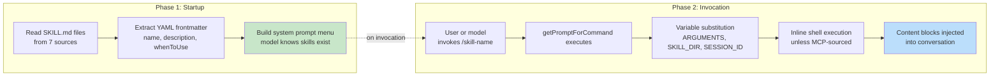
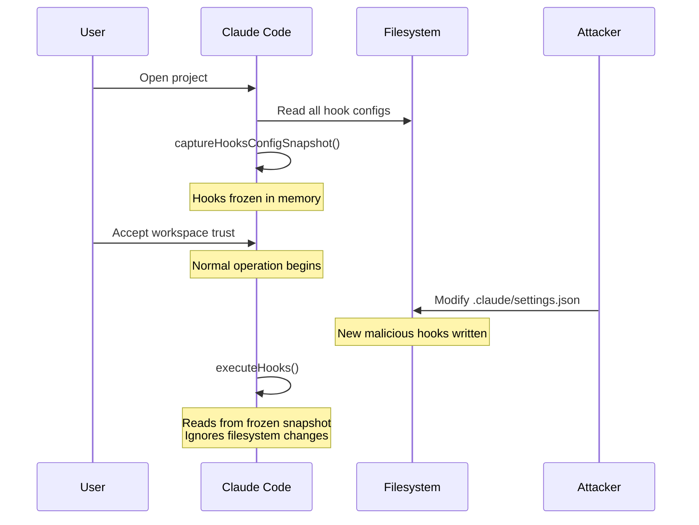
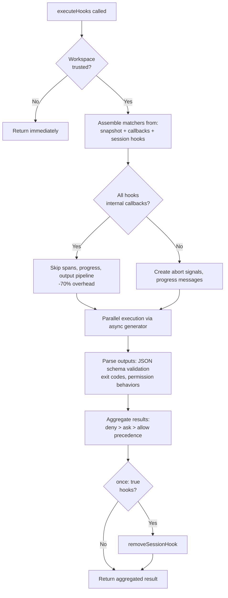

# 第十二章：可擴展性 -- Skills 與 Hooks

## 擴展的兩個維度

每個可擴展性系統都需要回答兩個問題：系統能做什麼，以及它何時去做。大多數框架將兩者混為一談——一個 plugin 在同一個物件中同時註冊能力和 lifecycle callback，「新增功能」與「攔截功能」之間的界線模糊成了一個單一的註冊 API。

Claude Code 將兩者清楚地分開。Skills 擴展模型能做的事。它們是 markdown 檔案，成為 slash command，在被調用時將新的指令注入對話。Hooks 擴展事情發生的時機與方式。它們是 lifecycle 攔截器，在 session 期間超過二十多個不同的時間點觸發，執行任意程式碼來阻擋操作、修改輸入、強制繼續，或靜默觀察。

這種分離並非偶然。Skills 是內容——它們透過新增 prompt 文字來擴展模型的知識和能力。Hooks 是控制流——它們修改執行路徑而不改變模型所知道的東西。一個 skill 可能教模型如何執行你團隊的部署流程。一個 hook 可能確保沒有部署命令在測試套件通過之前執行。Skill 增加能力；hook 增加約束。

本章深入介紹兩個系統，然後檢視它們的交集：skill 宣告的 hooks，在 skill 被調用時註冊為 session 範圍的 lifecycle 攔截器。

---

## Skills：教模型新把戲

### 兩階段載入

Skills 系統的核心最佳化在於：frontmatter 在啟動時載入，但完整內容僅在調用時才載入。



**第一階段**讀取每個 `SKILL.md` 檔案，將 YAML frontmatter 從 markdown 本文分離，並提取 metadata。Frontmatter 欄位成為 system prompt 的一部分，讓模型知道該 skill 的存在。Markdown 本文被捕獲在 closure 中但不做處理。一個有 50 個 skills 的專案只需支付 50 個簡短描述的 token 成本，而非 50 份完整文件。

**第二階段**在模型或使用者調用 skill 時觸發。`getPromptForCommand` 前綴基礎目錄、替換變數（`$ARGUMENTS`、`${CLAUDE_SKILL_DIR}`、`${CLAUDE_SESSION_ID}`），並執行行內 shell 命令（以 `!` 為前綴的反引號）。結果以 content block 的形式注入對話中。

### 七個來源與優先順序

Skills 來自七個不同的來源，平行載入並按優先順序合併：

| 優先順序 | 來源 | 位置 | 備註 |
|----------|--------|----------|-------|
| 1 | Managed (Policy) | `<MANAGED_PATH>/.claude/skills/` | 企業控管 |
| 2 | User | `~/.claude/skills/` | 個人的，隨處可用 |
| 3 | Project | `.claude/skills/`（向上遍歷至 home） | 納入版本控制 |
| 4 | Additional Dirs | `<add-dir>/.claude/skills/` | 透過 `--add-dir` 旗標 |
| 5 | Legacy Commands | `.claude/commands/` | 向下相容 |
| 6 | Bundled | 編譯進二進位檔 | Feature-gated |
| 7 | MCP | MCP server prompts | 遠端、不受信任 |

去重使用 `realpath` 來解析符號連結和重疊的父目錄。先被看到的來源優先。`getFileIdentity` 函式透過 `realpath` 解析為正規路徑，而非依賴 inode 值——inode 在容器/NFS 掛載和 ExFAT 上不可靠。

### Frontmatter 契約

控制 skill 行為的關鍵 frontmatter 欄位：

| YAML 欄位 | 用途 |
|-----------|---------|
| `name` | 面向使用者的顯示名稱 |
| `description` | 顯示在自動完成和 system prompt 中 |
| `when_to_use` | 詳細使用場景，供模型探索 |
| `allowed-tools` | 該 skill 可使用的工具 |
| `disable-model-invocation` | 阻止模型自主使用 |
| `context` | `'fork'` 以子代理方式執行 |
| `hooks` | 調用時註冊的 lifecycle hooks |
| `paths` | 用於條件啟動的 glob 模式 |

`context: 'fork'` 選項將 skill 作為子代理執行，擁有自己的 context window，這對需要大量工作但不應污染主對話 token 預算的 skill 至關重要。`disable-model-invocation` 和 `user-invocable` 欄位控制兩條不同的存取路徑——將兩者都設為 true 會使 skill 不可見，適用於僅含 hooks 的 skills。

### MCP 安全邊界

在變數替換之後，行內 shell 命令會執行。安全邊界是絕對的：**MCP skills 絕不執行行內 shell 命令。** MCP server 是外部系統。一個包含 `` !`rm -rf /` `` 的 MCP prompt 如果被允許執行，將以使用者的完整權限運行。系統將 MCP skills 視為純內容。這個信任邊界與第十五章討論的更廣泛 MCP 安全模型相連。

### 動態發現

Skills 不僅在啟動時載入。當模型觸及檔案時，`discoverSkillDirsForPaths` 從每個路徑向上遍歷尋找 `.claude/skills/` 目錄。帶有 `paths` frontmatter 的 skills 儲存在 `conditionalSkills` map 中，僅在被觸及的路徑匹配其模式時才啟動。一個宣告 `paths: "packages/database/**"` 的 skill 在模型讀取或編輯資料庫檔案之前保持不可見——這是上下文敏感的能力擴展。

---

## Hooks：控制事情何時發生

Hooks 是 Claude Code 在 lifecycle 時間點攔截和修改行為的機制。主執行引擎超過 4,900 行。這個系統服務三類受眾：個人開發者（自訂 linting、驗證）、團隊（納入專案版本控制的共享品質閘門）、以及企業（由政策管理的合規規則）。

### 實際範例：防止提交到 Main

在深入機制之前，先看一個 hook 在實務中的樣子。假設你的團隊想防止模型直接提交到 `main` 分支。

**步驟一：settings.json 設定：**

```json
{
  "hooks": {
    "PreToolUse": [
      {
        "matcher": "Bash",
        "hooks": [
          {
            "type": "command",
            "command": "/path/to/check-not-main.sh",
            "if": "Bash(git commit*)"
          }
        ]
      }
    ]
  }
}
```

**步驟二：Shell 腳本：**

```bash
#!/bin/bash
BRANCH=$(git rev-parse --abbrev-ref HEAD 2>/dev/null)
if [ "$BRANCH" = "main" ]; then
  echo "Cannot commit directly to main. Create a feature branch first." >&2
  exit 2  # Exit 2 = blocking error
fi
exit 0
```

**步驟三：模型的體驗。** 當模型嘗試在 `main` 分支上執行 `git commit` 時，hook 在命令執行前觸發。腳本檢查分支，寫入 stderr，並以 exit code 2 退出。模型看到一條系統訊息：「Cannot commit directly to main. Create a feature branch first.」提交從未執行。模型改為建立分支並在那裡提交。

`if: "Bash(git commit*)"` 條件意味著腳本僅在 git commit 命令時執行——而非每次 Bash 調用都執行。Exit code 2 阻擋；exit code 0 通過；其他任何 exit code 產生非阻擋式警告。這就是完整的協議。

### 四種使用者可設定的類型

Claude Code 定義了六種 hook 類型——四種使用者可設定，兩種內部使用。

**Command hooks** 產生一個 shell 程序。Hook 輸入 JSON 透過管道傳入 stdin；hook 透過 exit code 和 stdout/stderr 回傳結果。這是主力類型。

**Prompt hooks** 進行單次 LLM 呼叫，回傳 `{"ok": true}` 或 `{"ok": false, "reason": "..."}`。輕量級的 AI 驅動驗證，無需完整的 agent loop。

**Agent hooks** 執行多輪 agentic loop（最多 50 輪，`dontAsk` 權限，thinking 停用）。每個都有自己的 session 範圍。這是「驗證測試套件通過並覆蓋新功能」的重型機制。

**HTTP hooks** 將 hook 輸入 POST 到一個 URL。支援遠端政策伺服器和稽核日誌，無需在本地產生程序。

兩種內部類型是 **callback hooks**（以程式方式註冊，透過跳過 span 追蹤的快速路徑在熱路徑上減少 70% 開銷）和 **function hooks**（session 範圍的 TypeScript callback，用於 agent hooks 中的結構化輸出強制）。

### 五個最重要的 Lifecycle 事件

Hook 系統在超過二十多個 lifecycle 時間點觸發。五個主導了實際使用：

**PreToolUse** ——在每次工具執行前觸發。可以阻擋、修改輸入、自動核准或注入上下文。權限行為遵循嚴格的優先順序：deny > ask > allow。最常見的品質閘門 hook 掛載點。

**PostToolUse** ——在成功執行後觸發。可以注入上下文或完全替換 MCP 工具輸出。適用於對工具結果的自動化回饋。

**Stop** ——在 Claude 結束回應前觸發。阻擋式 hook 強制繼續。這是自動化驗證迴圈的機制：「你真的完成了嗎？」

**SessionStart** ——在 session 開始時觸發。可以設定環境變數、覆寫第一條使用者訊息，或註冊檔案監視路徑。不能阻擋（hook 不能阻止 session 啟動）。

**UserPromptSubmit** ——在使用者提交 prompt 時觸發。可以阻擋處理，在模型看到之前啟用輸入驗證或內容過濾。

**參考表——其餘事件：**

| 類別 | 事件 |
|----------|--------|
| Tool lifecycle | PostToolUseFailure, PermissionDenied, PermissionRequest |
| Session | SessionEnd（1.5 秒超時）, Setup |
| Subagent | SubagentStart, SubagentStop |
| Compaction | PreCompact, PostCompact |
| Notification | Notification, Elicitation, ElicitationResult |
| Configuration | ConfigChange, InstructionsLoaded, CwdChanged, FileChanged, TaskCreated, TaskCompleted, TeammateIdle |

阻擋的不對稱性是刻意的。代表可恢復決策的事件（工具呼叫、停止條件）支援阻擋。代表不可逆事實的事件（session 已啟動、API 失敗）則不支援。

### Exit Code 語意

對於 command hooks，exit code 帶有特定含義：

| Exit Code | 含義 | 是否阻擋 |
|-----------|---------|--------|
| 0 | 成功，stdout 解析為 JSON（如適用） | 否 |
| 2 | 阻擋式錯誤，stderr 顯示為系統訊息 | 是 |
| 其他 | 非阻擋式警告，僅顯示給使用者 | 否 |

Exit code 2 是刻意選擇的。Exit code 1 太常見了——任何未處理的例外、斷言失敗或語法錯誤都會產生 exit 1。使用 exit 2 可防止意外的強制執行。

### 六個 Hook 來源

| 來源 | 信任等級 | 備註 |
|--------|-------------|-------|
| `userSettings` | User | `~/.claude/settings.json`，最高優先順序 |
| `projectSettings` | Project | `.claude/settings.json`，版本控制 |
| `localSettings` | Local | `.claude/settings.local.json`，gitignored |
| `policySettings` | Enterprise | 不可被覆寫 |
| `pluginHook` | Plugin | 優先順序 999（最低） |
| `sessionHook` | Session | 僅存在於記憶體中，由 skills 註冊 |

---

## 快照安全模型

Hooks 執行任意程式碼。專案的 `.claude/settings.json` 可以定義在每次工具呼叫前觸發的 hooks。如果惡意儲存庫在使用者接受工作區信任對話框之後修改了它的 hooks，會發生什麼？

什麼都不會。Hooks 設定在啟動時被凍結。



`captureHooksConfigSnapshot()` 在啟動時被呼叫一次。從那時起，`executeHooks()` 從快照讀取，永遠不會隱式重新讀取設定檔。快照僅透過明確的管道更新：`/hooks` 命令或檔案監視器偵測，兩者都透過 `updateHooksConfigSnapshot()` 重建。

政策強制執行級聯：policy settings 中的 `disableAllHooks` 清除一切。`allowManagedHooksOnly` 排除 user 和 project hooks。使用者可以透過設定 `disableAllHooks` 停用自己的 hooks，但不能停用企業管理的 hooks。政策層永遠勝出。

信任檢查本身（`shouldSkipHookDueToTrust()`）是在兩個漏洞之後引入的：SessionEnd hooks 在使用者*拒絕*信任對話框時仍然執行，以及 SubagentStop hooks 在信任提示出現之前觸發。兩者共享相同的根本原因——hooks 在使用者尚未同意工作區程式碼執行的 lifecycle 狀態下觸發。修復方案是在 `executeHooks()` 頂部設置一個集中式閘門。

---

## 執行流程



內部 callback 的快速路徑是一項重要最佳化。當所有匹配的 hooks 都是內部的（檔案存取分析、commit 歸因），系統跳過 span 追蹤、abort signal 建立、進度訊息和完整的輸出處理管線。大多數 PostToolUse 調用僅命中內部 callback。

Hook 輸入 JSON 透過惰性的 `getJsonInput()` closure 序列化一次，並在所有平行 hooks 之間重用。環境注入設定 `CLAUDE_PROJECT_DIR`、`CLAUDE_PLUGIN_ROOT`，以及對於特定事件，設定 `CLAUDE_ENV_FILE` 供 hooks 寫入環境匯出。

---

## 整合：Skills 與 Hooks 的交會

當一個 skill 被調用時，其 frontmatter 宣告的 hooks 註冊為 session 範圍的 hooks。`skillRoot` 成為 hook shell 命令的 `CLAUDE_PLUGIN_ROOT`：

```
my-skill/
  SKILL.md          # The skill content
  validate.sh       # Called by a PreToolUse hook declared in frontmatter
```

Skill 的 frontmatter 宣告：

```yaml
hooks:
  PreToolUse:
    - matcher: "Bash"
      hooks:
        - type: command
          command: "${CLAUDE_PLUGIN_ROOT}/validate.sh"
          once: true
```

當使用者調用 `/my-skill` 時，skill 內容載入對話中，同時 PreToolUse hook 註冊。下一次 Bash 工具呼叫觸發 `validate.sh`。因為設定了 `once: true`，hook 在第一次成功執行後自行移除。

對於 agent，frontmatter 中宣告的 `Stop` hooks 會自動轉換為 `SubagentStop` hooks，因為子代理觸發的是 `SubagentStop` 而非 `Stop`。若無此轉換，agent 的停止驗證 hook 將永遠不會觸發。

### 權限行為優先順序

`executePreToolHooks()` 可以阻擋（透過 `blockingError`）、自動核准（透過 `permissionBehavior: 'allow'`）、強制詢問（透過 `'ask'`）、拒絕（透過 `'deny'`）、修改輸入（透過 `updatedInput`），或新增上下文（透過 `additionalContext`）。當多個 hooks 回傳不同行為時，deny 永遠勝出。這是安全相關決策的正確預設值。

### Stop Hooks：強制繼續

當 Stop hook 回傳 exit code 2 時，stderr 作為回饋顯示給模型，對話繼續。這將單次的 prompt-response 轉變為目標導向的迴圈。Stop hook 可以說是整個系統中最強大的整合點。

---

## 應用指南：設計可擴展性系統

**將內容與控制流分開。** Skills 新增能力；hooks 約束行為。將兩者混為一談會使得無法推理一個 plugin 做了什麼與它阻止了什麼。

**在信任邊界處凍結設定。** 快照機制在同意的那一刻捕獲 hooks，且永遠不會隱式重新讀取。如果你的系統執行使用者提供的程式碼，這能消除 TOCTOU 攻擊。

**使用不常見的 exit code 作為語意信號。** Exit code 1 是雜訊——每個未處理的錯誤都會產生它。以 Exit code 2 作為阻擋信號可防止意外的強制執行。選擇需要刻意意圖的信號。

**在 socket 層級驗證，而非應用層級。** SSRF 防護在 DNS 查詢時執行，而非作為預檢查。這消除了 DNS rebinding 的時間窗口。驗證網路目的地時，檢查必須與連線原子性地執行。

**針對常見情況最佳化。** 內部 callback 快速路徑（減少 70% 開銷）認識到大多數 hook 調用僅命中內部 callback。兩階段 skill 載入認識到大多數 skills 在給定 session 中從未被調用。每項最佳化都針對實際的使用分佈。

可擴展性系統反映了對力量與安全之間張力的成熟理解。Skills 賦予模型新能力，受 MCP 安全邊界約束（第十五章）。Hooks 賦予外部程式碼影響模型行動的能力，受快照機制、exit code 語意和政策級聯約束。兩個系統都不信任對方——而這種相互不信任正是使這個組合能安全地大規模部署的原因。

下一章轉向視覺層：Claude Code 如何以 60fps 渲染響應式終端 UI，並在五種終端協議之間處理輸入。
