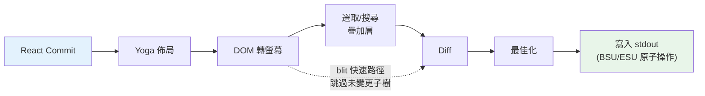
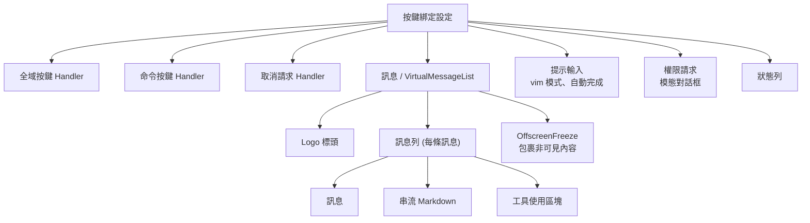

# 第十三章：終端機 UI

## 為什麼要建構自訂渲染器？

終端機不是瀏覽器。沒有 DOM、沒有 CSS 引擎、沒有合成器、沒有保留模式圖形管線。只有一條通往 stdout 的位元組串流，以及一條來自 stdin 的位元組串流。在這兩條串流之間的一切——佈局、樣式、diff、命中測試、滾動、選取——都必須從零開始發明。

Claude Code 需要一個響應式 UI。它有提示輸入、串流 markdown 輸出、權限對話框、進度旋轉器、可捲動的訊息列表、搜尋高亮，以及一個 vim 模式編輯器。React 是宣告這種元件樹的顯而易見的選擇。但 React 需要一個宿主環境來渲染，而終端機並不提供。

Ink 是標準答案：一個基於 Yoga 佈局的 React 終端機渲染器。Claude Code 最初使用 Ink，然後將其 fork 到面目全非。原版每幀為每個 cell 分配一個 JavaScript 物件——在 200x120 的終端機上，這是 24,000 個物件每 16ms 被建立和垃圾回收。它在字串層級做 diff，比較整列 ANSI 編碼的文字。它沒有 blit 最佳化的概念，沒有雙緩衝，沒有 cell 級別的髒標記追蹤。對於一個每秒重新整理一次的簡單 CLI 儀表板，這沒問題。但對於一個以 60fps 串流 token 同時使用者在數百條訊息的對話中捲動的 LLM agent，這完全不可行。

Claude Code 中保留下來的是一個自訂渲染引擎，它共享 Ink 的概念 DNA——React reconciler、Yoga 佈局、ANSI 輸出——但重新實作了關鍵路徑：以打包的 typed array 取代 object-per-cell、以池化 string interning 取代 string-per-frame、以 cell 級別 diff 的雙緩衝渲染，以及一個將相鄰終端機寫入合併為最少 escape sequence 的最佳化器。

結果是在 200 欄的終端機上串流 Claude 的 token 時能以 60fps 運行。要理解如何做到，我們需要檢視四個層：React reconciler 操作的自訂 DOM、將 DOM 轉換為終端機輸出的渲染管線、讓系統在數小時 session 中不被垃圾回收淹沒的池化記憶體管理，以及將一切串起來的元件架構。

---

## 自訂 DOM

React 的 reconciler 需要一個調和對象。在瀏覽器中，那是 DOM。在 Claude Code 的終端機中，它是一棵自訂的記憶體內樹，有七種元素類型和一種文字節點類型。

元素類型直接映射到終端機渲染概念：

- **`ink-root`**——文件根節點，每個 Ink 實例一個
- **`ink-box`**——一個 flexbox 容器，終端機中的 `<div>` 等價物
- **`ink-text`**——帶有 Yoga 測量函式用於自動換行的文字節點
- **`ink-virtual-text`**——另一個文字節點內部的巢狀樣式文字（在文字上下文中時從 `ink-text` 自動提升）
- **`ink-link`**——超連結，透過 OSC 8 escape sequence 渲染
- **`ink-progress`**——進度指示器
- **`ink-raw-ansi`**——帶有已知尺寸的預渲染 ANSI 內容，用於語法高亮的程式碼區塊

每個 `DOMElement` 攜帶渲染管線所需的狀態：

```typescript
// Illustrative — actual interface extends this significantly
interface DOMElement {
  yogaNode: YogaNode;           // Flexbox layout node
  style: Styles;                // CSS-like properties mapped to Yoga
  attributes: Map<string, DOMNodeAttribute>;
  childNodes: (DOMElement | TextNode)[];
  dirty: boolean;               // Needs re-rendering
  _eventHandlers: EventHandlerMap; // Separated from attributes
  scrollTop: number;            // Imperative scroll state
  pendingScrollDelta: number;
  stickyScroll: boolean;
  debugOwnerChain?: string;     // React component stack for debug
}
```

將 `_eventHandlers` 從 `attributes` 中分離是刻意的。在 React 中，handler 身份在每次渲染時都會改變（除非手動 memoize）。如果 handler 被儲存為屬性，每次渲染都會將節點標記為髒並觸發完整重繪。透過將它們分開儲存，reconciler 的 `commitUpdate` 可以更新 handler 而不將節點標記為髒。

`markDirty()` 函式是 DOM 變更與渲染管線之間的橋樑。當任何節點的內容改變時，`markDirty()` 向上遍歷所有祖先節點，在每個元素上設定 `dirty = true`，並在葉子文字節點上呼叫 `yogaNode.markDirty()`。這就是一個深層巢狀文字節點中的單一字元變更如何排程整條到根節點路徑的重新渲染——但只有那條路徑。兄弟子樹保持乾淨，可以從上一幀 blit。

`ink-raw-ansi` 元素類型值得特別提及。當一個程式碼區塊已經被語法高亮（產生 ANSI escape sequence），重新解析那些序列以提取字元和樣式將是浪費。取而代之的是，預先高亮的內容被包裝在一個帶有 `rawWidth` 和 `rawHeight` 屬性的 `ink-raw-ansi` 節點中，告訴 Yoga 精確的尺寸。渲染管線直接將原始 ANSI 內容寫入輸出緩衝區，無需將其分解為單獨的帶樣式字元。這使得語法高亮的程式碼區塊在初始高亮處理後基本上是零成本的——UI 中最昂貴的視覺元素也是最便宜的渲染對象。

`ink-text` 節點的測量函式值得理解，因為它在 Yoga 的佈局處理中執行，而這是同步且阻塞的。函式接收可用寬度並必須返回文字的尺寸。它執行自動換行（遵循 `wrap` 樣式屬性：`wrap`、`truncate`、`truncate-start`、`truncate-middle`），考慮 grapheme cluster 邊界（因此不會在多碼位 emoji 之間斷行），正確測量 CJK 全寬字元（每個計為 2 欄），並從寬度計算中去除 ANSI escape code（escape sequence 的視覺寬度為零）。所有這些都必須在每個節點的微秒內完成，因為一個有 50 個可見文字節點的對話意味著每次佈局處理有 50 次測量函式呼叫。

---

## React Fiber 容器

reconciler 橋接使用 `react-reconciler` 建立自訂 host config。這與 React DOM 和 React Native 使用的 API 相同。關鍵差異：Claude Code 在 `ConcurrentRoot` 模式下運行。

```typescript
createContainer(rootNode, ConcurrentRoot, ...)
```

ConcurrentRoot 啟用 React 的並行功能——用於延遲載入語法高亮的 Suspense、用於串流期間非阻塞狀態更新的 transition。替代方案 `LegacyRoot` 會強制同步渲染，在繁重的 markdown 重新解析期間阻塞事件迴圈。

host config 方法將 React 操作映射到自訂 DOM：

- **`createInstance(type, props)`** 透過 `createNode()` 建立 `DOMElement`，套用初始樣式和屬性，附加事件 handler，並捕獲 React 元件 owner chain 用於除錯歸因。owner chain 被儲存為 `debugOwnerChain`，被 `CLAUDE_CODE_DEBUG_REPAINTS` 模式用來將全螢幕重置歸因到特定元件
- **`createTextInstance(text)`** 建立 `TextNode`——但僅在文字上下文內部。reconciler 強制要求原始字串必須包裹在 `<Text>` 中。嘗試在文字上下文外建立文字節點會拋出例外，在調和階段而非渲染階段捕獲一類錯誤
- **`commitUpdate(node, type, oldProps, newProps)`** 透過淺比較 diff 新舊 props，然後只套用變更的部分。樣式、屬性和事件 handler 各有自己的更新路徑。diff 函式在沒有變更時返回 `undefined`，完全避免不必要的 DOM 變更
- **`removeChild(parent, child)`** 從樹中移除節點，遞迴釋放 Yoga 節點（在 `free()` 前呼叫 `unsetMeasureFunc()` 以避免存取已釋放的 WASM 記憶體），並通知焦點管理器
- **`hideInstance(node)` / `unhideInstance(node)`** 切換 `isHidden` 並在 `Display.None` 和 `Display.Flex` 之間切換 Yoga 節點。這是 React 的 Suspense fallback 過渡機制
- **`resetAfterCommit(container)`** 是關鍵 hook：它呼叫 `rootNode.onComputeLayout()` 執行 Yoga，然後呼叫 `rootNode.onRender()` 排程終端機繪製

reconciler 在每個 commit 週期追蹤兩個效能計數器：Yoga 佈局時間（`lastYogaMs`）和總 commit 時間（`lastCommitMs`）。這些流入 Ink class 報告的 `FrameEvent`，實現生產環境中的效能監控。

事件系統鏡像瀏覽器的捕獲/冒泡模型。一個 `Dispatcher` class 實作完整的事件傳播，包含三個階段：捕獲（根到目標）、目標處，以及冒泡（目標到根）。事件類型映射到 React 排程優先順序——discrete 用於鍵盤和點擊（最高優先順序，立即處理），continuous 用於滾動和調整大小（可延遲）。dispatcher 將所有事件處理包裹在 `reconciler.discreteUpdates()` 中以實現正確的 React 批次處理。

當你在終端機中按下按鍵時，產生的 `KeyboardEvent` 通過自訂 DOM 樹分派，從焦點元素向上冒泡到根節點，就像鍵盤事件在瀏覽器 DOM 元素中冒泡一樣。路徑上的任何 handler 都可以呼叫 `stopPropagation()` 或 `preventDefault()`，語意與瀏覽器規範完全相同。

---

## 渲染管線

每一幀經歷七個階段，每個階段獨立計時：



每個階段的計時被獨立記錄並在 `FrameEvent.phases` 中報告。這種逐階段的檢測對診斷效能問題至關重要：當一幀花費 30ms 時，你需要知道瓶頸是 Yoga 重新測量文字（階段 2）、渲染器遍歷大型髒子樹（階段 3），還是來自慢速終端機的 stdout 背壓（階段 7）。答案決定了修復方案。

**階段 1：React commit 與 Yoga 佈局。** reconciler 處理狀態更新並呼叫 `resetAfterCommit`。這將根節點的寬度設定為 `terminalColumns` 並執行 `yogaNode.calculateLayout()`。Yoga 在一次處理中計算整棵 flexbox 樹，遵循 CSS flexbox 規範：它解析所有節點的 flex-grow、flex-shrink、padding、margin、gap、alignment 和 wrapping。結果——`getComputedWidth()`、`getComputedHeight()`、`getComputedLeft()`、`getComputedTop()`——在每個節點上快取。對於 `ink-text` 節點，Yoga 在佈局期間呼叫自訂測量函式（`measureTextNode`），它透過自動換行和 grapheme 測量計算文字尺寸。這是最昂貴的逐節點操作：它必須處理 Unicode grapheme cluster、CJK 全寬字元、emoji 序列，以及嵌入在文字內容中的 ANSI escape code。

**階段 2：DOM 轉螢幕。** 渲染器以深度優先遍歷 DOM 樹，將字元和樣式寫入 `Screen` 緩衝區。每個字元成為一個打包的 cell。輸出是完整的一幀：終端機上的每個 cell 都有定義的字元、樣式和寬度。

**階段 3：疊加層。** 文字選取和搜尋高亮就地修改螢幕緩衝區，翻轉匹配 cell 上的樣式 ID。選取套用反轉影片以建立熟悉的「高亮文字」外觀。搜尋高亮套用更強烈的視覺處理：當前匹配使用反轉 + 黃色前景 + 粗體 + 底線，其他匹配僅使用反轉。這會汙染緩衝區——由 `prevFrameContaminated` 旗標追蹤，讓下一幀知道要跳過 blit 快速路徑。這種汙染是刻意的取捨：就地修改緩衝區避免分配獨立的疊加層緩衝區（在 200x120 的終端機上節省 48KB），代價是在疊加層清除後產生一幀完整損壞。

**階段 4：Diff。** 新螢幕與前端幀的螢幕逐 cell 比較。只有變更的 cell 產生輸出。比較是每個 cell 兩次整數比較（兩個打包的 `Int32` word），且 diff 遍歷損壞矩形而非整個螢幕。在穩態幀上（只有旋轉器在跳動），這可能在 24,000 個 cell 中只為 3 個 cell 產生 patch。每個 patch 是一個 `{ type: 'stdout', content: string }` 物件，包含游標移動序列和 ANSI 編碼的 cell 內容。

**階段 5：最佳化。** 同一列上相鄰的 patch 被合併為單一寫入。冗餘的游標移動被消除——如果 patch N 在第 10 欄結束而 patch N+1 從第 11 欄開始，游標已在正確位置，不需要移動序列。樣式轉換透過 `StylePool.transition()` 快取預序列化，因此從「粗體紅色」變為「暗色綠色」是單一快取字串查找，而非 diff 並序列化的操作。最佳化器通常相比逐 cell 輸出減少 30-50% 的位元組數。

**階段 6：寫入。** 最佳化的 patch 被序列化為 ANSI escape sequence，在單一 `write()` 呼叫中寫入 stdout，在支援的終端機上包裹在同步更新標記（BSU/ESU）中。BSU（Begin Synchronized Update，`ESC [ ? 2026 h`）告訴終端機緩衝所有後續輸出，ESU（`ESC [ ? 2026 l`）告訴它刷新。這在支援該協議的終端機上消除了可見的撕裂——整個幀原子性地出現。

每一幀透過 `FrameEvent` 物件報告其計時分解：

```typescript
interface FrameEvent {
  durationMs: number;
  phases: {
    renderer: number;    // DOM-to-screen
    diff: number;        // Screen comparison
    optimize: number;    // Patch merging
    write: number;       // stdout write
    yoga: number;        // Layout computation
  };
  yogaVisited: number;   // Nodes traversed
  yogaMeasured: number;  // Nodes that ran measure()
  yogaCacheHits: number; // Nodes with cached layout
  flickers: FlickerEvent[];  // Full-reset attributions
}
```

當 `CLAUDE_CODE_DEBUG_REPAINTS` 啟用時，全螢幕重置透過 `findOwnerChainAtRow()` 歸因到其源 React 元件。這是終端機版的 React DevTools「Highlight Updates」——它顯示哪個元件導致整個螢幕重繪，這是渲染管線中最昂貴的操作。

blit 最佳化值得特別關注。當一個節點不是髒的且其位置自上一幀以來沒有改變（透過節點快取檢查），渲染器直接從 `prevScreen` 複製 cell 到當前螢幕，而非重新渲染子樹。這使得穩態幀極其便宜——在一個典型的幀上，只有旋轉器在跳動，blit 覆蓋 99% 的螢幕，只有旋轉器的 3-4 個 cell 從頭重新渲染。

blit 在三種條件下被停用：

1. **`prevFrameContaminated` 為 true**——選取疊加層或搜尋高亮就地修改了前端幀的螢幕緩衝區，因此那些 cell 不能被信任為「正確的」先前狀態
2. **一個絕對定位的節點被移除**——絕對定位意味著該節點可能已經繪製在非兄弟 cell 上，那些 cell 需要由實際擁有它們的元素重新渲染
3. **佈局偏移**——任何節點的快取位置與其當前計算位置不同，意味著 blit 會將 cell 複製到錯誤的座標

損壞矩形（`screen.damage`）追蹤渲染期間所有已寫入 cell 的邊界框。diff 只檢查此矩形內的列，跳過完全未變更的區域。在一個 120 列的終端機上，串流訊息佔據第 80-100 列，diff 檢查 20 列而非 120 列——比較工作減少 6 倍。

---

## 雙緩衝渲染與幀排程

Ink class 維護兩個幀緩衝區：

```typescript
private frontFrame: Frame;  // Currently displayed on terminal
private backFrame: Frame;   // Being rendered into
```

每個 `Frame` 包含：

- `screen: Screen`——cell 緩衝區（打包的 `Int32Array`）
- `viewport: Size`——渲染時的終端機尺寸
- `cursor: { x, y, visible }`——終端機游標的停放位置
- `scrollHint`——用於 alt-screen 模式的 DECSTBM（scroll region）最佳化提示
- `scrollDrainPending`——ScrollBox 是否有剩餘的滾動差值需要處理

每次渲染後，幀交換：`backFrame = frontFrame; frontFrame = newFrame`。舊的前端幀成為下一個後端幀，為 blit 最佳化提供 `prevScreen`，並為 cell 級別 diff 提供基準線。

這種雙緩衝設計消除了分配。渲染器不是每幀建立新的 `Screen`，而是重用後端幀的緩衝區。交換是一次指標賦值。這個模式借鏡自圖形程式設計，其中雙緩衝透過確保顯示器從完整幀讀取、同時渲染器寫入另一個來防止撕裂。在終端機的情境中，撕裂不是問題（BSU/ESU 協議處理了這個）；問題是每 16ms 分配和丟棄包含 48KB+ typed array 的 `Screen` 物件所產生的 GC 壓力。

渲染排程使用 lodash `throttle`，間隔 16ms（約 60fps），前沿和後沿都啟用：

```typescript
const deferredRender = () => queueMicrotask(this.onRender);
this.scheduleRender = throttle(deferredRender, FRAME_INTERVAL_MS, {
  leading: true,
  trailing: true,
});
```

microtask 延遲不是偶然的。`resetAfterCommit` 在 React 的 layout effects 階段之前執行。如果渲染器在此處同步執行，它會錯過在 `useLayoutEffect` 中設定的游標宣告。microtask 在 layout effects 之後但在同一個事件迴圈 tick 內執行——終端機看到的是單一、一致的幀。

對於滾動操作，一個獨立的 `setTimeout` 以 4ms（FRAME_INTERVAL_MS >> 2）提供更快的滾動幀，而不干擾 throttle。滾動變更完全繞過 React：`ScrollBox.scrollBy()` 直接修改 DOM 節點屬性，呼叫 `markDirty()`，並透過 microtask 排程渲染。沒有 React 狀態更新，沒有調和開銷，不會為單一滾輪事件重新渲染整個訊息列表。

**調整大小處理**是同步的，不做 debounce。當終端機調整大小時，`handleResize` 立即更新尺寸以保持佈局一致。對於 alt-screen 模式，它重置幀緩衝區並將 `ERASE_SCREEN` 延遲到下一個原子 BSU/ESU 繪製區塊中，而非立即寫入。同步寫入擦除會讓螢幕在渲染所需的約 80ms 內保持空白；延遲到原子區塊中意味著舊內容保持可見，直到新幀完全準備好。

**Alt-screen 管理**增加了另一層。`AlternateScreen` 元件在掛載時進入 DEC 1049 備用螢幕緩衝區，將高度限制為終端機行數。它使用 `useInsertionEffect`——而非 `useLayoutEffect`——確保 `ENTER_ALT_SCREEN` escape sequence 在第一個渲染幀之前到達終端機。使用 `useLayoutEffect` 會太晚：第一幀會渲染到主螢幕緩衝區，在切換前產生可見的閃爍。`useInsertionEffect` 在 layout effects 之前且在瀏覽器（或終端機）繪製之前執行，使過渡無縫。

---

## 池化記憶體：為什麼 Interning 很重要

一個 200 欄乘 120 列的終端機有 24,000 個 cell。如果每個 cell 都是一個帶有 `char` 字串、`style` 字串和 `hyperlink` 字串的 JavaScript 物件，那就是每幀 72,000 次字串分配——加上 24,000 次 cell 本身的物件分配。以 60fps 計算，那是每秒 576 萬次分配。V8 的垃圾回收器可以處理這個，但不是沒有以掉幀形式出現的暫停。GC 暫停通常是 1-5ms，但它們是不可預測的：它們可能在串流 token 更新期間發生，恰好在使用者觀看輸出時造成可見的卡頓。

Claude Code 透過打包 typed array 和三個 interning 池完全消除了這個問題。結果：cell 緩衝區的每幀物件分配為零。唯一的分配在池本身（攤銷的，因為大多數字元和樣式在第一幀就被 intern 並隨後重用）以及 diff 產生的 patch 字串中（不可避免的，因為 stdout.write 需要字串或 Buffer 參數）。

**cell 佈局**使用每個 cell 兩個 `Int32` word，儲存在連續的 `Int32Array` 中：

```
word0: charId        (32 bits, index into CharPool)
word1: styleId[31:17] | hyperlinkId[16:2] | width[1:0]
```

在同一緩衝區上的平行 `BigInt64Array` 視圖支援批量操作——清除一列是一次 64 位元 word 的 `fill()` 呼叫，而非逐個欄位清零。

**CharPool** 將字元字串 intern 為整數 ID。它有一條 ASCII 快速路徑：一個 128 項的 `Int32Array` 將字元碼直接映射到池索引，完全避免 `Map` 查找。多位元組字元（emoji、CJK 表意文字）回退到 `Map<string, number>`。索引 0 始終是空格，索引 1 始終是空字串。

```typescript
export class CharPool {
  private strings: string[] = [' ', '']
  private ascii: Int32Array = initCharAscii()

  intern(char: string): number {
    if (char.length === 1) {
      const code = char.charCodeAt(0)
      if (code < 128) {
        const cached = this.ascii[code]!
        if (cached !== -1) return cached
        const index = this.strings.length
        this.strings.push(char)
        this.ascii[code] = index
        return index
      }
    }
    // Map fallback for multi-byte characters
    ...
  }
}
```

**StylePool** 將 ANSI 樣式碼陣列 intern 為整數 ID。巧妙之處：每個 ID 的 bit 0 編碼該樣式對空格字元是否有可見效果（背景色、反轉、底線）。僅前景的樣式得到偶數 ID；對空格可見的樣式得到奇數 ID。這讓渲染器透過單一位元遮罩檢查跳過不可見的空格——`if (!(styleId & 1) && charId === 0) continue`——無需查找樣式定義。池還快取任意兩個樣式 ID 之間預序列化的 ANSI 轉換字串，因此從「粗體紅色」過渡到「暗色綠色」是快取的字串串接，而非 diff 並序列化的操作。

**HyperlinkPool** intern OSC 8 超連結 URI。索引 0 表示無超連結。

三個池在前端和後端幀之間共享。這是一個關鍵的設計決策。因為池是共享的，intern 的 ID 在幀之間有效：blit 最佳化可以直接從 `prevScreen` 複製打包的 cell word 到當前螢幕，無需重新 intern。diff 可以將 ID 作為整數比較，無需字串查找。如果每幀有自己的池，blit 需要重新 intern 每個複製的 cell（透過舊 ID 查找字串，然後在新池中 intern），這將抵消 blit 大部分的效能優勢。

池會定期重置（每 5 分鐘）以防止長時間 session 中的無限增長。一個遷移處理將前端幀的活躍 cell 重新 intern 到新池中。

**CellWidth** 用 2 位元分類處理全寬字元：

| 值 | 含義 |
|-------|---------|
| 0 (Narrow) | 標準單欄字元 |
| 1 (Wide) | CJK/emoji 頭部 cell，佔據兩欄 |
| 2 (SpacerTail) | 全寬字元的第二欄 |
| 3 (SpacerHead) | 軟換行續接標記 |

這儲存在 `word1` 的低 2 位元，使打包 cell 上的寬度檢查免費——常見情況下不需要欄位提取。

額外的逐 cell 中繼資料存在於平行陣列而非打包 cell 中：

- **`noSelect: Uint8Array`**——逐 cell 旗標，從文字選取中排除內容。用於不應出現在複製文字中的 UI 裝飾（邊框、指示器）
- **`softWrap: Int32Array`**——逐列標記，指示自動換行續接。當使用者跨越軟換行的列選取文字時，選取邏輯知道不要在換行點插入換行符
- **`damage: Rectangle`**——當前幀中所有已寫入 cell 的邊界框。diff 只檢查此矩形內的列，跳過完全未變更的區域

這些平行陣列避免了擴大打包 cell 格式（這會增加 diff 內迴圈中的快取壓力），同時提供選取、複製和最佳化所需的中繼資料。

`Screen` 還公開一個 `createScreen()` 工廠函式，接受尺寸和池參照。建立螢幕透過 `BigInt64Array` 視圖上的 `fill(0n)` 清零 `Int32Array`——一個在微秒內清除整個緩衝區的單一原生呼叫。這在調整大小（需要新幀緩衝區）和池遷移（舊螢幕的 cell 被重新 intern 到新池中）時使用。

---

## REPL 元件

REPL（`REPL.tsx`）大約有 5,000 行。它是程式碼庫中最大的單一元件，這是有充分理由的：它是整個互動體驗的協調器。一切都流經它。

元件大致組織為九個部分：

1. **Imports**（約 100 行）——引入 bootstrap state、命令、歷史記錄、hooks、元件、按鍵綁定、成本追蹤、通知、swarm/team 支援、語音整合
2. **Feature-flagged imports**——透過 `feature()` 守衛和 `require()` 有條件載入語音整合、proactive 模式、brief tool 和 coordinator agent
3. **狀態管理**——大量 `useState` 呼叫，涵蓋訊息、輸入模式、待處理權限、對話框、成本閾值、session 狀態、工具狀態和 agent 狀態
4. **QueryGuard**——管理活躍 API 呼叫的生命週期，防止並行請求互相干擾
5. **訊息處理**——處理來自查詢迴圈的傳入訊息，正規化順序，管理串流狀態
6. **工具權限流程**——協調工具使用區塊與 PermissionRequest 對話框之間的權限請求
7. **Session 管理**——恢復、切換、匯出對話
8. **按鍵綁定設定**——接線按鍵綁定 provider：`KeybindingSetup`、`GlobalKeybindingHandlers`、`CommandKeybindingHandlers`
9. **渲染樹**——從上述所有內容組合最終 UI

其渲染樹在全螢幕模式下組合完整介面：



`OffscreenFreeze` 是一個終端機渲染專有的效能最佳化。當訊息滾動到視窗區域之上時，其 React 元素被快取，其子樹被凍結。這防止了離螢幕訊息中的計時器更新（旋轉器、經過時間計數器）觸發終端機重置。沒有這個，訊息 3 中的旋轉指示器會導致完整重繪，即使使用者正在查看訊息 47。

該元件全程由 React Compiler 編譯。不使用手動 `useMemo` 和 `useCallback`，編譯器使用 slot 陣列插入逐表達式的 memoization：

```typescript
const $ = _c(14);  // 14 memoization slots
let t0;
if ($[0] !== dep1 || $[1] !== dep2) {
  t0 = expensiveComputation(dep1, dep2);
  $[0] = dep1; $[1] = dep2; $[2] = t0;
} else {
  t0 = $[2];
}
```

這個模式出現在程式碼庫中的每個元件。它提供比 `useMemo`（在 hook 層級 memoize）更細的粒度——渲染函式中的個別表達式獲得各自的依賴追蹤和快取。對於像 REPL 這樣的 5,000 行元件，這消除了每次渲染中數百個潛在的不必要重新計算。

---

## 選取與搜尋高亮

文字選取和搜尋高亮作為螢幕緩衝區疊加層運作，在主渲染之後但在 diff 之前套用。

**文字選取**僅在 alt-screen 中使用。Ink 實例持有一個 `SelectionState`，追蹤錨點和焦點位置、拖曳模式（字元/單字/行），以及已滾動離螢幕的捕獲列。當使用者點擊並拖曳時，選取 handler 更新這些座標。在 `onRender` 期間，`applySelectionOverlay` 遍歷受影響的列並使用 `StylePool.withSelectionBg()` 就地修改 cell 樣式 ID，它返回一個加入反轉影片的新樣式 ID。這種對螢幕緩衝區的直接修改就是 `prevFrameContaminated` 旗標存在的原因——前端幀的緩衝區已被疊加層修改，因此下一幀不能信任它用於 blit 最佳化，必須做完整損壞 diff。

滑鼠追蹤使用 SGR 1003 模式，它報告點擊、拖曳和移動的欄/列座標。`App` 元件實作多次點擊檢測：雙擊選取單字，三擊選取整行。檢測使用 500ms 逾時和 1-cell 位置容差（滑鼠可以在點擊之間移動一個 cell 而不重置多次點擊計數器）。超連結點擊被此逾時刻意延遲——雙擊連結選取單字而非開啟瀏覽器，匹配使用者從文字編輯器中預期的行為。

失去釋放恢復機制處理使用者在終端機內開始拖曳、將滑鼠移到視窗外、然後釋放的情況。終端機報告了按下和拖曳，但沒有報告釋放（發生在視窗外）。沒有恢復機制，選取會永遠卡在拖曳模式。恢復透過檢測無按鈕按下的滑鼠移動事件來運作——如果我們處於拖曳狀態並收到一個無按鈕的移動事件，我們推斷按鈕在視窗外被釋放並完成選取。

**搜尋高亮**有兩種並行運行的機制。基於掃描的路徑（`applySearchHighlight`）遍歷可見 cell 尋找查詢字串並套用 SGR 反轉樣式。基於位置的路徑使用來自 `scanElementSubtree()` 的預計算 `MatchPosition[]`，以訊息相對位置儲存，在已知偏移處套用帶有「當前匹配」黃色高亮的堆疊 ANSI 碼（反轉 + 黃色前景 + 粗體 + 底線）。黃色前景結合反轉變成黃色背景——終端機在反轉啟用時交換前景/背景。底線是在黃色與現有背景色衝突的主題中的備用可見性標記。

**游標宣告**解決了一個微妙的問題。終端機模擬器在物理游標位置渲染 IME（輸入法編輯器）預編輯文字。正在組合字元的 CJK 使用者需要游標在文字輸入的插入點，而不是在螢幕底部——那是終端機自然會停放游標的位置。`useDeclaredCursor` hook 讓元件在每幀後宣告游標應該在哪裡。Ink class 從 `nodeCache` 讀取宣告節點的位置，轉換為螢幕座標，並在 diff 之後發出游標移動序列。螢幕閱讀器和放大器也追蹤物理游標，因此這個機制除了 CJK 輸入外也有助於無障礙性。

在主螢幕模式下，宣告的游標位置與 `frame.cursor`（必須停在內容底部以維持 log-update 的相對移動不變量）分開追蹤。在 alt-screen 模式下，問題更簡單：每幀以 `CSI H`（游標歸位）開始，因此宣告的游標只是在幀結尾發出的絕對位置。

---

## 串流 Markdown

渲染 LLM 輸出是終端機 UI 面臨的最嚴苛任務。Token 一次一個到達，每秒 10-50 個，每個都改變一條可能包含程式碼區塊、列表、粗體文字和內聯程式碼的訊息內容。天真的做法——每個 token 重新解析整條訊息——在規模上會是災難性的。

Claude Code 使用三種最佳化：

**Token 快取。** 一個模組級 LRU 快取（500 項）儲存以內容雜湊為鍵的 `marked.lexer()` 結果。快取在虛擬滾動期間的 React 卸載/重新掛載週期中存活。當使用者滾動回到先前可見的訊息時，markdown token 從快取中提供而非重新解析。

**快速路徑檢測。** `hasMarkdownSyntax()` 透過單一正規表達式檢查前 500 個字元中的 markdown 標記。如果找不到語法，它直接建構一個單段落 token，繞過完整的 GFM 解析器。這在純文字訊息上每次渲染節省約 3ms——當你以每秒 60 幀渲染時這很重要。

**延遲語法高亮。** 程式碼區塊高亮透過 React `Suspense` 載入。`MarkdownBody` 元件以 `highlight={null}` 作為 fallback 立即渲染，然後以 cli-highlight 實例非同步解析。使用者立即看到程式碼（無樣式），然後一兩幀後它跳入有顏色的狀態。

串流情況增加了一個複雜因素。當 token 從模型到達時，markdown 內容逐漸增長。每個 token 重新解析整個內容在一條訊息的過程中將是 O(n²)。快速路徑檢測有幫助——大多數串流內容是純文字段落，完全繞過解析器——但對於有程式碼區塊和列表的訊息，LRU 快取提供了真正的最佳化。快取鍵是內容雜湊，因此當 10 個 token 到達而只有最後一段改變時，未改變前綴的快取解析結果被重用。markdown 渲染器只重新解析改變的尾部。

`StreamingMarkdown` 元件與靜態 `Markdown` 元件不同。它處理內容仍在生成中的情況：不完整的程式碼圍欄（一個 ` ``` ` 沒有結束圍欄）、部分粗體標記，以及截斷的列表項目。串流版本在解析上更寬容——它不會對未閉合的語法報錯，因為結束語法還沒到達。當訊息完成串流後，元件過渡到靜態 `Markdown` 渲染器，它套用完整的 GFM 解析和嚴格的語法檢查。

程式碼區塊的語法高亮是渲染管線中最昂貴的逐元素操作。一個 100 行的程式碼區塊用 cli-highlight 高亮可能需要 50-100ms。載入高亮函式庫本身需要 200-300ms（它打包了數十種語言的語法定義）。這兩個成本都隱藏在 React `Suspense` 後面：程式碼區塊立即作為純文字渲染，高亮函式庫非同步載入，當它解析完成時，程式碼區塊以彩色重新渲染。使用者立即看到程式碼，片刻後出現顏色——比函式庫載入時 300ms 的空白幀好得多。

---

## 應用指南：高效渲染串流輸出

終端機渲染管線是一個消除工作的案例研究。三個原則驅動設計：

**Intern 一切。** 如果你有一個出現在數千個 cell 中的值——樣式、字元、URL——儲存一次並以整數 ID 引用。整數比較是一個 CPU 指令。字串比較是一個迴圈。當你的內迴圈在 60fps 下每幀執行 24,000 次時，整數上的 `===` 和字串上的 `===` 之間的差異就是流暢滾動和可見延遲之間的差異。

**在正確的層級做 Diff。** Cell 級別的 diff 聽起來很昂貴——每幀 24,000 次比較。但它是每個 cell 兩次整數比較（打包的 word），且在穩態幀上，diff 在檢查第一個 cell 後就從大多數列提早退出。替代方案——重新渲染整個螢幕並寫入 stdout——每幀會產生 100KB+ 的 ANSI escape sequence。diff 通常產生不到 1KB。

**將熱路徑從 React 中分離。** 滾動事件以滑鼠輸入頻率到達（可能每秒數百次）。將每一個都通過 React 的 reconciler——狀態更新、調和、commit、佈局、渲染——每次事件增加 5-10ms 的延遲。透過直接修改 DOM 節點並通過 microtask 排程渲染，滾動路徑保持在 1ms 以下。React 只在最終的繪製中參與，而那是它無論如何都會執行的。

這些原則適用於任何串流輸出系統，不僅是終端機。如果你正在建構一個渲染即時資料的 web 應用——日誌檢視器、聊天客戶端、監控儀表板——同樣的取捨適用。Intern 重複的值。與上一幀做 diff。將熱路徑保持在你的響應式框架之外。

第四個原則，專門針對長時間運行的 session：**定期清理。** Claude Code 的池隨著新字元和樣式被 intern 而單調增長。在多小時的 session 中，池可能累積數千個不再被任何活躍 cell 參照的條目。5 分鐘的重置週期限制了這種增長：每 5 分鐘，建立新池，前端幀的 cell 被遷移（重新 intern 到新池中），舊池成為垃圾。這是在應用層級套用的分代回收策略，因為 JavaScript GC 對池條目的語意活躍性沒有可見性。

使用 `Int32Array` 而非普通物件的決定有一個超越 GC 壓力的更微妙優勢：記憶體局部性。當 diff 比較 24,000 個 cell 時，它遍歷連續的 typed array。現代 CPU 預取順序記憶體存取，因此整個螢幕比較在 L1/L2 快取內完成。object-per-cell 的佈局會將 cell 分散在 heap 上，使每次比較成為快取未命中。效能差異是可測量的：在 200x120 的螢幕上，typed-array diff 在 0.5ms 以內完成，而等價的物件 diff 需要 3-5ms——足以在與其他管線階段結合時超出 16ms 的幀預算。

第五個原則適用於任何渲染到固定大小格子的系統：**追蹤損壞邊界。** 每個螢幕上的 `damage` 矩形記錄渲染期間寫入的 cell 的邊界框。diff 查詢此矩形並完全跳過其外的列。當串流訊息佔據 120 列終端機的底部 20 列時，diff 檢查 20 列，而非 120 列。結合 blit 最佳化（它只為重新渲染的區域填充損壞矩形，而非 blit 的區域），這意味著常見情況——一條訊息在串流而其餘對話靜止——只觸及螢幕緩衝區的一小部分。

更廣泛的教訓：渲染系統中的效能不是關於讓任何單一操作變快。而是關於完全消除操作。blit 消除了重新渲染。損壞矩形消除了 diff。池共享消除了重新 interning。打包的 cell 消除了分配。每個最佳化都移除了一整個類別的工作，而它們乘法式地堆疊。

拿數字來說：一個最壞情況的幀（所有東西都是髒的、沒有 blit、全螢幕損壞）在 200x120 的終端機上大約花費 12ms。一個最佳情況的幀（一個髒節點、blit 其他所有東西、3 列損壞矩形）在 1ms 以內。系統大部分時間處於最佳情況。串流 token 的到達觸發一個髒文字節點，這使其祖先到訊息容器都變髒，通常是螢幕的 10-30 列。blit 處理另外 90-110 列。損壞矩形將 diff 限制在髒區域。池查找是整數操作。串流一個 token 的穩態成本由 Yoga 佈局（重新測量髒文字節點和其祖先）和 markdown 重新解析主導——而非渲染管線本身。


---

