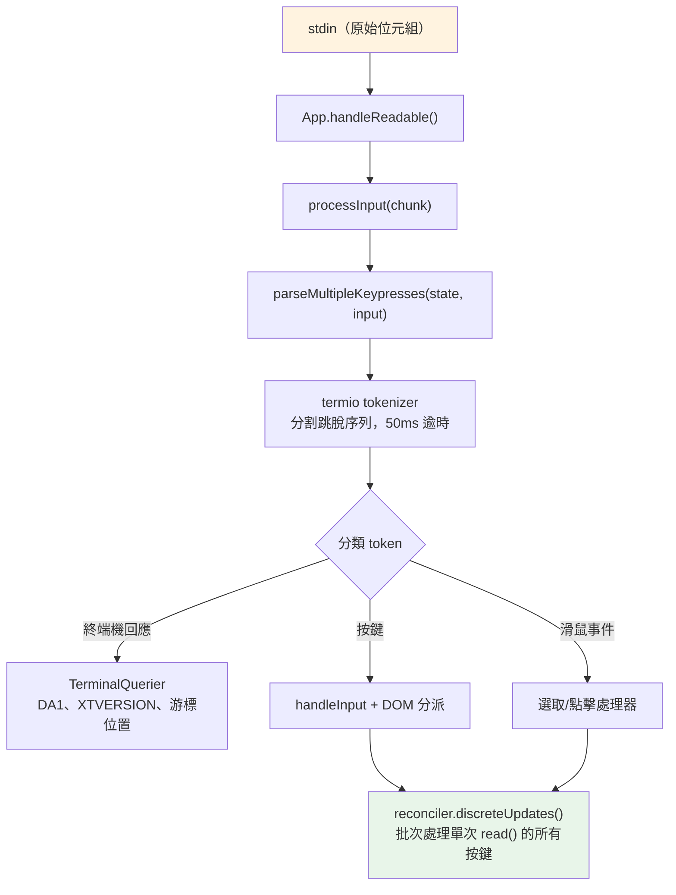
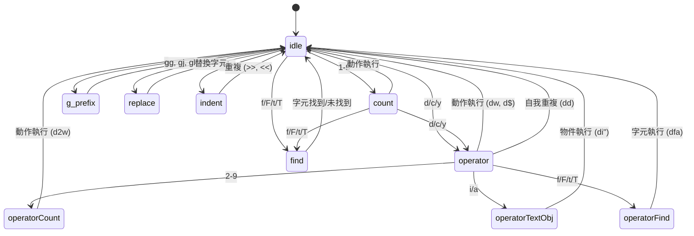

# 第十四章：輸入與互動

## 原始位元組，有意義的動作

當你在 Claude Code 中按下 Ctrl+X 接著 Ctrl+K，終端機會送出兩組位元組序列，間隔大約 200 毫秒。第一組是 `0x18`（ASCII CAN）。第二組是 `0x0B`（ASCII VT）。這兩個位元組本身除了「控制字元」之外不帶任何固有意義。輸入系統必須辨識這兩個按時序到達且在逾時視窗內的位元組，構成和弦鍵 `ctrl+x ctrl+k`，映射到動作 `chat:killAgents`，終止所有執行中的 sub-agent。

在原始位元組和被終止的 agent 之間，六個系統依序啟動：tokenizer 分割跳脫序列、解析器跨五種終端機協定進行分類、快捷鍵綁定解析器將序列比對情境特定的綁定、和弦鍵狀態機管理多鍵序列、處理器執行動作，以及 React 將產生的狀態更新批次處理為單次渲染。

困難不在於其中任何一個系統，而在於終端機多樣性的組合爆炸。iTerm2 發送 Kitty 鍵盤協定序列。macOS Terminal 發送舊式 VT220 序列。Ghostty 透過 SSH 發送 xterm modifyOtherKeys。tmux 可能會吃掉、轉換或透傳其中任何一種，取決於其設定。Windows Terminal 在 VT 模式下有自己的怪癖。輸入系統必須從所有這些中產生正確的 `ParsedKey` 物件，因為使用者不應該需要知道他們的終端機使用的是哪種鍵盤協定。

本章追溯從原始位元組到有意義動作的路徑，穿越這片紛雜的生態。

設計哲學是漸進增強搭配優雅降級。在支援 Kitty 鍵盤協定的現代終端機上，Claude Code 可以獲得完整的修飾鍵偵測（Ctrl+Shift+A 與 Ctrl+A 是可區分的）、super 鍵報告（Cmd 快捷鍵），以及明確的按鍵識別。在透過 SSH 連接的舊式終端機上，系統回退到最佳可用協定，損失一些修飾鍵區分能力但核心功能完好無損。使用者永遠不會看到關於終端機不受支援的錯誤訊息。他們可能無法使用 `ctrl+shift+f` 做全域搜尋，但 `ctrl+r` 的歷史搜尋在任何地方都能運作。

---

## 按鍵解析管線

輸入以位元組區塊的形式到達 stdin。管線分階段處理：



tokenizer 是基礎。終端機輸入是一串混合了可印字元、控制碼和多位元組跳脫序列的位元組串流，沒有明確的框架分界。一次從 stdin 的 `read()` 可能返回 `\x1b[1;5A`（Ctrl+上箭頭），也可能在一次 read 中返回 `\x1b`、在下一次返回 `[1;5A`，取決於位元組從 PTY 到達的速度。tokenizer 維護一個狀態機，緩衝部分跳脫序列並發出完整的 token。

不完整序列問題是根本性的。當 tokenizer 看到一個單獨的 `\x1b`，它無法知道這是 Escape 鍵還是 CSI 序列的開頭。它緩衝該位元組並啟動一個 50ms 計時器。如果沒有後續位元組到達，緩衝區被刷出，`\x1b` 成為一次 Escape 按鍵。但在刷出之前，tokenizer 會檢查 `stdin.readableLength`——如果核心緩衝區中有位元組等待，計時器會重新啟動而非刷出。這處理了事件迴圈被阻塞超過 50ms、後續位元組已經在緩衝區但尚未被讀取的情況。

對於貼上操作，逾時延長至 500ms。貼上的文字可能很大且分多個區塊到達。

來自單次 `read()` 的所有已解析按鍵在一次 `reconciler.discreteUpdates()` 呼叫中處理。這將 React 狀態更新批次處理，使得貼上 100 個字元只產生一次重新渲染，而非 100 次。批次處理至關重要：沒有它，貼上中的每個字元都會觸發一個完整的調和循環——狀態更新、調和、commit、Yoga 佈局、渲染、diff、寫入。以每個循環 5ms 計算，100 個字元的貼上需要 500ms 來處理。有了批次處理，同樣的貼上只需一個 5ms 的循環。

### stdin 管理

`App` 元件透過參照計數管理 raw 模式。當任何元件需要原始輸入（提示框、對話框、vim 模式），它呼叫 `setRawMode(true)`，遞增計數器。當它不再需要原始輸入時，呼叫 `setRawMode(false)`，遞減計數器。raw 模式只在計數器歸零時才被停用。這防止了終端機應用程式中的一個常見 bug：元件 A 啟用 raw 模式、元件 B 啟用 raw 模式、元件 A 停用 raw 模式，突然元件 B 的輸入壞了，因為 raw 模式被全域停用。

當 raw 模式首次啟用時，App：

1. 停止早期輸入捕獲（引導階段的機制，在 React 掛載前收集按鍵）
2. 將 stdin 設為 raw 模式（無行緩衝、無回顯、無信號處理）
3. 附加 `readable` 監聽器進行非同步輸入處理
4. 啟用括號貼上（使貼上的文字可識別）
5. 啟用焦點報告（讓應用程式知道終端機視窗何時獲得/失去焦點）
6. 啟用延伸按鍵報告（Kitty 鍵盤協定 + xterm modifyOtherKeys）

停用時，所有這些以相反順序還原。謹慎的排序防止跳脫序列洩漏——在停用 raw 模式之前先停用延伸按鍵報告，確保終端機不會在應用程式已停止解析後繼續發送 Kitty 編碼的序列。

`onExit` 信號處理器（透過 `signal-exit` 套件）確保即使在意外終止時也會進行清理。如果程序收到 SIGTERM 或 SIGINT，處理器會停用 raw 模式、還原終端機狀態、退出替代螢幕（如果啟用中），並在程序退出前重新顯示游標。沒有這些清理，崩潰的 Claude Code session 會讓終端機停留在 raw 模式、沒有游標、沒有回顯——使用者需要盲打 `reset` 來恢復終端機。

---

## 多協定支援

終端機在如何編碼鍵盤輸入上沒有共識。像 Kitty 這樣的現代終端機模擬器發送帶有完整修飾鍵資訊的結構化序列。透過 SSH 的舊式終端機發送需要上下文才能解讀的模糊位元組序列。Claude Code 的解析器同時處理五種不同的協定，因為使用者的終端機可能是其中任何一種。

**CSI u（Kitty 鍵盤協定）**是現代標準。格式：`ESC [ codepoint [; modifier] u`。例如：`ESC[13;2u` 是 Shift+Enter，`ESC[27u` 是無修飾鍵的 Escape。碼位明確識別按鍵——Escape 按鍵和 Escape 作為序列前綴之間沒有歧義。修飾鍵字將 shift、alt、ctrl 和 super（Cmd）編碼為獨立位元。Claude Code 在支援此協定的終端機上透過啟動時的 `ENABLE_KITTY_KEYBOARD` 跳脫序列啟用它，並在退出時透過 `DISABLE_KITTY_KEYBOARD` 停用。協定透過查詢/回應握手偵測：應用程式發送 `CSI ? u`，終端機回應 `CSI ? flags u`，其中 `flags` 指示支援的協定等級。

**xterm modifyOtherKeys** 是在 Kitty 協定未被協商的終端機（如透過 SSH 的 Ghostty）上的退路。格式：`ESC [ 27 ; modifier ; keycode ~`。注意參數順序與 CSI u 相反——修飾鍵在前，然後才是鍵碼。這是解析器 bug 的常見來源。協定透過 `CSI > 4 ; 2 m` 啟用，在終端機的 TERM 識別未被偵測到時（透過 SSH 時常見，因為 `TERM_PROGRAM` 不會被轉發）由 Ghostty、tmux 和 xterm 發出。

**舊式終端機序列**涵蓋其他一切：透過 `ESC O` 和 `ESC [` 序列的功能鍵、方向鍵、數字鍵盤、Home/End/Insert/Delete，以及 40 年終端機演進中累積的完整 VT100/VT220/xterm 變體動物園。解析器使用兩個正規表達式來匹配：`FN_KEY_RE` 用於 `ESC O/N/[/[[` 前綴模式（匹配功能鍵、方向鍵及其修飾變體），`META_KEY_CODE_RE` 用於 meta 鍵碼（`ESC` 後跟一個英數字元，傳統的 Alt+鍵編碼）。

舊式序列的挑戰在於歧義。`ESC [ 1 ; 2 R` 可能是 Shift+F3，也可能是游標位置報告，取決於上下文。解析器透過私有標記檢查來解決：游標位置報告使用 `CSI ? row ; col R`（帶 `?` 私有標記），而修飾功能鍵使用 `CSI params R`（不帶）。這種消歧義正是 Claude Code 請求 DECXCPR（擴展游標位置報告）而非標準 CPR 的原因——擴展形式是明確的。

終端機識別增加了另一層複雜性。啟動時，Claude Code 發送 `XTVERSION` 查詢（`CSI > 0 q`）來探知終端機的名稱和版本。回應（`DCS > | name ST`）能穿越 SSH 連線——不像 `TERM_PROGRAM` 是一個不會透過 SSH 傳播的環境變數。知道終端機身份讓解析器能處理終端機特有的怪癖。例如，xterm.js（用於 VS Code 整合終端機）與原生 xterm 有不同的跳脫序列行為，識別字串（`xterm.js(X.Y.Z)`）讓解析器能考慮這些差異。

**SGR 滑鼠事件**使用格式 `ESC [ < button ; col ; row M/m`，其中 `M` 是按下、`m` 是放開。按鈕碼編碼動作：0/1/2 對應左鍵/中鍵/右鍵點擊，64/65 對應滾輪上/下（0x40 OR 滾輪位元），32+ 對應拖曳（0x20 OR 移動位元）。滾輪事件被轉換為 `ParsedKey` 物件，使其流經快捷鍵綁定系統；點擊和拖曳事件成為 `ParsedMouse` 物件，路由到選取處理器。

**括號貼上**將貼上內容包裹在 `ESC [200~` 和 `ESC [201~` 標記之間。標記之間的所有內容成為一個帶有 `isPasted: true` 的單一 `ParsedKey`，不論貼上的文字可能包含什麼跳脫序列。這防止貼上的程式碼被解讀為命令——當使用者貼上包含 `\x03`（作為原始位元組的 Ctrl+C）的程式碼片段時，這是一項關鍵的安全功能。

解析器的輸出型別形成一個乾淨的判別聯合型別：

```typescript
type ParsedKey = {
  kind: 'key';
  name: string;        // 'return', 'escape', 'a', 'f1', etc.
  ctrl: boolean; meta: boolean; shift: boolean;
  option: boolean; super: boolean;
  sequence: string;    // Raw escape sequence for debugging
  isPasted: boolean;   // Inside bracketed paste
}

type ParsedMouse = {
  kind: 'mouse';
  button: number;      // SGR button code
  action: 'press' | 'release';
  col: number; row: number;  // 1-indexed terminal coordinates
}

type ParsedResponse = {
  kind: 'response';
  response: TerminalResponse;  // Routed to TerminalQuerier
}
```

`kind` 判別式確保下游程式碼明確處理每種輸入類型。按鍵不會被意外當作滑鼠事件處理；終端機回應不會被意外解讀為按鍵。`ParsedKey` 型別還攜帶原始 `sequence` 字串用於除錯——當使用者報告「按 Ctrl+Shift+A 沒有反應」時，除錯日誌可以顯示終端機確切發送了什麼位元組序列，使得診斷問題是出在終端機的編碼、解析器的識別，還是快捷鍵綁定的設定成為可能。

`ParsedKey` 上的 `isPasted` 旗標對安全至關重要。當括號貼上啟用時，終端機用標記序列包裹貼上的內容。解析器在結果按鍵事件上設定 `isPasted: true`，快捷鍵綁定解析器會跳過貼上按鍵的綁定匹配。沒有這個，貼上包含 `\x03`（作為原始位元組的 Ctrl+C）或跳脫序列的文字會觸發應用程式命令。有了它，貼上的內容無論其位元組內容如何，都被視為字面文字輸入。

解析器還能識別終端機回應——終端機自身回答查詢時發送的序列。這些包括設備屬性（DA1、DA2）、游標位置報告、Kitty 鍵盤旗標回應、XTVERSION（終端機識別）和 DECRPM（模式狀態）。這些被路由到 `TerminalQuerier` 而非輸入處理器：

```typescript
type TerminalResponse =
  | { type: 'decrpm'; mode: number; status: number }
  | { type: 'da1'; params: number[] }
  | { type: 'da2'; params: number[] }
  | { type: 'kittyKeyboard'; flags: number }
  | { type: 'cursorPosition'; row: number; col: number }
  | { type: 'osc'; code: number; data: string }
  | { type: 'xtversion'; version: string }
```

**修飾鍵解碼**遵循 XTerm 慣例：修飾鍵字為 `1 + (shift ? 1 : 0) + (alt ? 2 : 0) + (ctrl ? 4 : 0) + (super ? 8 : 0)`。`ParsedKey` 中的 `meta` 欄位映射到 Alt/Option（位元 2）。`super` 欄位是獨立的（位元 8，macOS 上的 Cmd）。這個區分很重要，因為 Cmd 快捷鍵被作業系統保留，終端機應用程式無法捕獲——除非終端機使用 Kitty 協定，它會報告其他協定默默吞掉的 super 修飾按鍵。

一個 stdin 間隙偵測器在 5 秒無輸入後觸發終端機模式重新宣告。這處理 tmux 重新連接和筆電喚醒的場景，其中終端機的鍵盤模式可能已被多工器或作業系統重設。重新宣告觸發時，它會重新發送 `ENABLE_KITTY_KEYBOARD`、`ENABLE_MODIFY_OTHER_KEYS`、括號貼上和焦點報告序列。沒有這個，從 tmux session 分離再重新連接會默默將鍵盤協定降級為舊式模式，在 session 剩餘時間裡破壞修飾鍵偵測。

### 終端機 I/O 層

解析器之下是 `ink/termio/` 中的結構化終端機 I/O 子系統：

- **csi.ts**——CSI（Control Sequence Introducer）序列：游標移動、擦除、捲動區域、括號貼上啟用/停用、焦點事件啟用/停用、Kitty 鍵盤協定啟用/停用
- **dec.ts**——DEC 私有模式序列：替代螢幕緩衝區（1049）、滑鼠追蹤模式（1000/1002/1003）、游標可見性、括號貼上（2004）、焦點事件（1004）
- **osc.ts**——作業系統命令：剪貼簿存取（OSC 52）、標籤狀態、iTerm2 進度指示器、tmux/screen 多工器包裝（DCS passthrough，用於需要穿越多工器邊界的序列）
- **sgr.ts**——SGR（Select Graphic Rendition）：ANSI 樣式碼系統（顏色、粗體、斜體、底線、反轉）
- **tokenize.ts**——用於跳脫序列邊界偵測的有狀態 tokenizer

多工器包裝值得一提。當 Claude Code 在 tmux 內執行時，某些跳脫序列（如 Kitty 鍵盤協定協商）必須透傳到外部終端機。tmux 使用 DCS passthrough（`ESC P ... ST`）來轉發它不理解的序列。`osc.ts` 中的 `wrapForMultiplexer` 函式偵測多工器環境並適當包裝序列。沒有這個，Kitty 鍵盤模式會在 tmux 內默默失敗，使用者永遠不會知道為什麼他們的 Ctrl+Shift 綁定停止運作。

### 事件系統

`ink/events/` 目錄實作了一個與瀏覽器相容的事件系統，包含七種事件類型：`KeyboardEvent`、`ClickEvent`、`FocusEvent`、`InputEvent`、`TerminalFocusEvent` 和基底 `TerminalEvent`。每個都攜帶 `target`、`currentTarget`、`eventPhase`，並支援 `stopPropagation()`、`stopImmediatePropagation()` 和 `preventDefault()`。

包裝 `ParsedKey` 的 `InputEvent` 存在是為了向後相容舊的 `EventEmitter` 路徑，較舊的元件可能仍在使用。新元件使用帶有捕獲/冒泡階段的 DOM 風格鍵盤事件分派。兩條路徑都從同一個已解析的按鍵觸發，所以它們始終一致——到達 stdin 的按鍵產生恰好一個 `ParsedKey`，它同時產生一個 `InputEvent`（給舊式監聽器）和一個 `KeyboardEvent`（給 DOM 風格分派）。這種雙路徑設計允許從 EventEmitter 模式漸進遷移到 DOM 事件模式，而不破壞現有元件。

---

## 快捷鍵綁定系統

快捷鍵綁定系統分離了三個經常糾纏在一起的關注點：什麼鍵觸發什麼動作（綁定）、動作觸發時發生什麼（處理器），以及哪些綁定目前處於啟用狀態（情境）。

### 綁定：宣告式設定

預設綁定在 `defaultBindings.ts` 中定義為 `KeybindingBlock` 物件的陣列，每個都限定在一個情境範圍內：

```typescript
export const DEFAULT_BINDINGS: KeybindingBlock[] = [
  {
    context: 'Global',
    bindings: {
      'ctrl+c': 'app:interrupt',
      'ctrl+d': 'app:exit',
      'ctrl+l': 'app:redraw',
      'ctrl+r': 'history:search',
    },
  },
  {
    context: 'Chat',
    bindings: {
      'escape': 'chat:cancel',
      'ctrl+x ctrl+k': 'chat:killAgents',
      'enter': 'chat:submit',
      'up': 'history:previous',
      'ctrl+x ctrl+e': 'chat:externalEditor',
    },
  },
  // ... 14 more contexts
]
```

平台特定的綁定在定義時處理。圖片貼上在 macOS/Linux 上是 `ctrl+v`，但在 Windows 上是 `alt+v`（因為 `ctrl+v` 是系統貼上）。模式切換在支援 VT 模式的終端機上是 `shift+tab`，但在不支援的 Windows Terminal 上是 `meta+m`。功能旗標綁定（快速搜尋、語音模式、終端機面板）是有條件包含的。

使用者可以透過 `~/.claude/keybindings.json` 覆寫任何綁定。解析器接受修飾鍵別名（`ctrl`/`control`、`alt`/`opt`/`option`、`cmd`/`command`/`super`/`win`）、按鍵別名（`esc` -> `escape`、`return` -> `enter`）、和弦鍵記法（空格分隔的步驟如 `ctrl+k ctrl+s`），以及 null 動作來解除預設綁定。null 動作與不定義綁定不同——它明確阻止預設綁定觸發，這對於想要回收某個按鍵給終端機使用的使用者很重要。

### 情境：16 個活動範圍

每個情境代表一種互動模式，其中一組特定的綁定適用：

| 情境 | 啟用時機 |
|------|---------|
| Global | 始終啟用 |
| Chat | 提示輸入聚焦時 |
| Autocomplete | 自動完成選單可見時 |
| Confirmation | 權限對話框顯示時 |
| Scroll | 替代螢幕有可捲動內容時 |
| Transcript | 唯讀逐字稿檢視器 |
| HistorySearch | 反向歷史搜尋（ctrl+r） |
| Task | 背景任務執行中 |
| Help | 說明覆蓋層顯示時 |
| MessageSelector | 回退對話框 |
| MessageActions | 訊息游標導航 |
| DiffDialog | diff 檢視器 |
| Select | 通用選取列表 |
| Settings | 設定面板 |
| Tabs | 分頁導航 |
| Footer | 頁尾指示器 |

當按鍵到達時，解析器從目前啟用的情境（由 React 元件狀態決定）建構情境列表，去重並保留優先順序，然後搜尋匹配的綁定。最後匹配的綁定勝出——這就是使用者覆寫如何優先於預設值。情境列表在每次按鍵時重建（代價低廉：最多 16 個字串的陣列串接和去重），所以情境變更立即生效，不需要任何訂閱或監聽機制。

情境設計處理了一個棘手的互動模式：巢狀模態。當權限對話框在執行中的任務期間出現時，`Confirmation` 和 `Task` 情境可能同時啟用。`Confirmation` 情境優先（它在元件樹中較晚註冊），所以 `y` 觸發「核准」而非任何任務級別的綁定。當對話框關閉時，`Confirmation` 情境停用，`Task` 綁定恢復。這種堆疊行為自然地從情境列表的優先順序中產生——不需要特殊的模態處理程式碼。

### 保留快捷鍵

並非所有按鍵都能重新綁定。系統強制執行三層保留：

**不可重新綁定**（硬編碼行為）：`ctrl+c`（中斷/退出）、`ctrl+d`（退出）、`ctrl+m`（在所有終端機中等同 Enter——重新綁定它會破壞 Enter）。

**終端機保留**（警告）：`ctrl+z`（SIGTSTP）、`ctrl+\`（SIGQUIT）。這些在技術上可以被綁定，但在大多數設定中終端機會在應用程式看到它們之前攔截。

**macOS 保留**（錯誤）：`cmd+c`、`cmd+v`、`cmd+x`、`cmd+q`、`cmd+w`、`cmd+tab`、`cmd+space`。作業系統在它們到達終端機之前就攔截了。綁定它們會建立一個永遠不會觸發的快捷鍵。

### 解析流程

當按鍵到達時，解析路徑為：

1. 建構情境列表：元件註冊的啟用情境加上 Global，去重並保留優先順序
2. 針對合併的綁定表呼叫 `resolveKeyWithChordState(input, key, contexts)`
3. `match` 時：清除任何待定和弦鍵，呼叫處理器，對事件呼叫 `stopImmediatePropagation()`
4. `chord_started` 時：儲存待定按鍵，停止傳播，啟動和弦鍵逾時
5. `chord_cancelled` 時：清除待定和弦鍵，讓事件繼續傳遞
6. `unbound` 時：清除和弦鍵——這是明確的解除綁定（使用者將動作設為 `null`），所以傳播被停止但不執行任何處理器
7. `none` 時：繼續傳遞給其他處理器

「最後勝出」的解析策略意味著，如果預設綁定和使用者綁定都在 `Chat` 情境中定義了 `ctrl+k`，使用者的綁定優先。這在匹配時透過按定義順序迭代綁定並保留最後一個匹配來評估，而非在載入時建構覆寫映射。優點：情境特定的覆寫自然組合。使用者可以覆寫 `Chat` 中的 `enter` 而不影響 `Confirmation` 中的 `enter`。

---

## 和弦鍵支援

`ctrl+x ctrl+k` 綁定是一個和弦鍵：兩次按鍵共同構成一個動作。解析器透過狀態機管理這個過程。

當按鍵到達時：

1. 解析器將其附加到任何待定的和弦鍵前綴
2. 它檢查是否有任何綁定的和弦鍵以此前綴開頭。如果是，返回 `chord_started` 並儲存待定按鍵
3. 如果完整和弦鍵精確匹配某個綁定，返回 `match` 並清除待定狀態
4. 如果和弦鍵前綴沒有匹配任何東西，返回 `chord_cancelled`

一個 `ChordInterceptor` 元件在和弦鍵等待狀態期間攔截所有輸入。它有 1000ms 的逾時——如果第二次按鍵沒有在一秒內到達，和弦鍵被取消，第一次按鍵被丟棄。`KeybindingContext` 提供一個 `pendingChordRef` 用於同步存取待定狀態，避免 React 狀態更新延遲導致第二次按鍵在第一次按鍵的狀態更新完成前就被處理。

和弦鍵設計避免了遮蔽 readline 編輯鍵。沒有和弦鍵的話，「終止 agent」的快捷鍵綁定可能是 `ctrl+k`——但那是 readline 的「刪除到行尾」，使用者在終端機文字輸入中期望這個功能。透過使用 `ctrl+x` 作為前綴（符合 readline 自身的和弦鍵前綴慣例），系統獲得了一個不與單鍵編輯快捷鍵衝突的綁定命名空間。

實作處理了一個大多數和弦鍵系統遺漏的邊界情況：當使用者按下 `ctrl+x` 然後輸入一個不屬於任何和弦鍵的字元會怎樣？如果沒有仔細處理，那個字元會被吞掉——和弦鍵攔截器消費了輸入、和弦鍵被取消，字元就消失了。Claude Code 的 `ChordInterceptor` 在這種情況下返回 `chord_cancelled`，導致待定輸入被丟棄，但允許不匹配的字元繼續傳遞到正常輸入處理。字元不會遺失；只有和弦鍵前綴被丟棄。這符合使用者對 Emacs 風格和弦鍵前綴的預期行為。

---

## Vim 模式

### 狀態機

vim 實作是一個純狀態機，帶有窮舉型別檢查。型別本身就是文件：

```typescript
export type VimState =
  | { mode: 'INSERT'; insertedText: string }
  | { mode: 'NORMAL'; command: CommandState }

export type CommandState =
  | { type: 'idle' }
  | { type: 'count'; digits: string }
  | { type: 'operator'; op: Operator; count: number }
  | { type: 'operatorCount'; op: Operator; count: number; digits: string }
  | { type: 'operatorFind'; op: Operator; count: number; find: FindType }
  | { type: 'operatorTextObj'; op: Operator; count: number; scope: TextObjScope }
  | { type: 'find'; find: FindType; count: number }
  | { type: 'g'; count: number }
  | { type: 'operatorG'; op: Operator; count: number }
  | { type: 'replace'; count: number }
  | { type: 'indent'; dir: '>' | '<'; count: number }
```

這是一個包含 12 個變體的判別聯合型別。TypeScript 的窮舉檢查確保每個針對 `CommandState.type` 的 `switch` 語句處理所有 12 種情況。向聯合型別添加新狀態會導致每個不完整的 switch 產生編譯錯誤。狀態機不可能有死狀態或遺漏的轉換——型別系統禁止了這種情況。

注意每個狀態如何恰好攜帶下一次轉換所需的資料。`operator` 狀態知道哪個運算子（`op`）和之前的計數。`operatorCount` 狀態添加了數字累加器（`digits`）。`operatorTextObj` 狀態添加了範圍（`inner` 或 `around`）。沒有狀態攜帶它不需要的資料。這不只是好品味——它防止了處理器讀取前一個命令的陳舊資料這整個類別的 bug。如果你在 `find` 狀態，你有一個 `FindType` 和一個 `count`。你沒有運算子，因為沒有待定的運算子。型別使不可能的狀態無法表示。

狀態圖講述了這個故事：



從 `idle` 開始，按下 `d` 進入 `operator` 狀態。從 `operator`，按下 `w` 以 `w` 動作執行 `delete`。再按一次 `d`（`dd`）觸發整行刪除。按下 `2` 進入 `operatorCount`，所以 `d2w` 變成「刪除下兩個單字」。按下 `i` 進入 `operatorTextObj`，所以 `di"` 變成「刪除引號內」。每個中間狀態恰好攜帶下一次轉換所需的情境——不多也不少。

### 轉換作為純函式

`transition()` 函式根據目前狀態類型分派到 10 個處理器函式之一。每個返回一個 `TransitionResult`：

```typescript
type TransitionResult = {
  next?: CommandState;    // New state (omitted = stay in current)
  execute?: () => void;   // Side effect (omitted = no action yet)
}
```

副作用被返回，而非被執行。轉換函式是純的——給定一個狀態和一個按鍵，它返回下一個狀態和可選的執行動作的閉包。呼叫者決定何時執行效果。這使得狀態機可以輕易測試：餵入狀態和按鍵，斷言返回的狀態，忽略閉包。這也意味著轉換函式不依賴於編輯器狀態、游標位置或緩衝區內容。這些細節在建立閉包時被捕獲，而非在轉換時被狀態機消費。

`fromIdle` 處理器是入口點，涵蓋完整的 vim 詞彙：

- **計數前綴**：`1-9` 進入 `count` 狀態，累積數字。`0` 是特殊的——它是「行首」動作，不是計數數字，除非已經有數字被累積
- **運算子**：`d`、`c`、`y` 進入 `operator` 狀態，等待動作或文字物件來定義範圍
- **尋找**：`f`、`F`、`t`、`T` 進入 `find` 狀態，等待要搜尋的字元
- **G 前綴**：`g` 進入 `g` 狀態，用於複合命令（`gg`、`gj`、`gk`）
- **替換**：`r` 進入 `replace` 狀態，等待替換字元
- **縮排**：`>`、`<` 進入 `indent` 狀態（用於 `>>` 和 `<<`）
- **簡單動作**：`h/j/k/l/w/b/e/W/B/E/0/^/$` 立即執行，移動游標
- **即時命令**：`x`（刪除字元）、`~`（切換大小寫）、`J`（合併行）、`p/P`（貼上）、`D/C/Y`（運算子快捷鍵）、`G`（跳到結尾）、`.`（點重複）、`;/,`（尋找重複）、`u`（復原）、`i/I/a/A/o/O`（進入插入模式）

### 動作、運算子與文字物件

**動作**是將按鍵映射到游標位置的純函式。`resolveMotion(key, cursor, count)` 將動作套用 `count` 次，如果游標停止移動則提前中斷（你無法向左移動超過第 0 欄）。這個提前中斷對於在行尾執行 `3w` 很重要——它停在最後一個單字而不是環繞或報錯。

動作按照與運算子的互動方式分類：

- **排他的**（預設）——目標位置的字元不包含在範圍內。`dw` 刪除到下一個單字的第一個字元之前（不含）
- **包含的**（`e`、`E`、`$`）——目標位置的字元包含在範圍內。`de` 刪除到當前單字的最後一個字元（含）
- **整行的**（`j`、`k`、`G`、`gg`、`gj`、`gk`）——與運算子一起使用時，範圍擴展以涵蓋完整行。`dj` 刪除當前行和下一行，而不僅是兩個游標位置之間的字元

**運算子**作用於一個範圍。`delete` 移除文字並儲存到暫存器。`change` 移除文字並進入插入模式。`yank` 複製到暫存器而不修改。`cw`/`cW` 特例遵循 vim 慣例：change-word 移動到當前單字的結尾，而不是下一個單字的開頭（與 `dw` 不同）。

一個有趣的邊界情況：`[Image #N]` 晶片吸附。當單字動作落在圖片參考晶片內部（在終端機中渲染為單一視覺單元）時，範圍擴展以涵蓋整個晶片。這防止了使用者認知為原子元素的部分刪除——你不能刪除 `[Image #3]` 的一半，因為動作系統將整個晶片視為單一單字。

額外命令涵蓋完整的預期 vim 詞彙：`x`（刪除字元）、`r`（替換字元）、`~`（切換大小寫）、`J`（合併行）、`p`/`P`（帶整行/字元感知的貼上）、`>>` / `<<`（以 2 空格為單位的縮排/反縮排）、`o`/`O`（在下方/上方開新行並進入插入模式）。

**文字物件**找到游標周圍的邊界。它們回答的問題是：「游標內部的『東西』是什麼？」

單字物件（`iw`、`aw`、`iW`、`aW`）將文字分割為 grapheme，將每個分類為單字字元、空白或標點符號，並擴展選取到單字邊界。`i`（inner）變體僅選取單字。`a`（around）變體包含周圍空白——偏好尾隨空白，如果在行尾則回退到前導空白。大寫變體（`W`、`aW`）將任何非空白序列視為一個單字，忽略標點邊界。

引號物件（`i"`、`a"`、`i'`、`a'`、`` i` ``、`` a` ``）在當前行尋找成對引號。配對按順序匹配（第一個和第二個引號組成一對，第三個和第四個組成下一對，以此類推）。如果游標在第一個和第二個引號之間，那就是匹配。`a` 變體包含引號字元；`i` 變體排除它們。

括號物件（`ib`/`i(`、`ab`/`a(`、`i[`/`a[`、`iB`/`i{`/`aB`/`a{`、`i<`/`a<`）執行深度追蹤搜尋以尋找匹配的分隔符。它們從游標向外搜尋，維護巢狀計數，直到找到深度為零的匹配對。這正確處理了巢狀括號——在 `foo((bar))` 內執行 `d i (` 刪除 `bar`，而非 `(bar)`。

### 持久狀態與點重複

vim 模式維護一個跨命令存續的 `PersistentState`——使 vim 感覺像 vim 的「記憶」：

```typescript
interface PersistentState {
  lastChange: RecordedChange;   // For dot-repeat
  lastFind: { type: FindType; char: string };  // For ; and ,
  register: string;             // Yank buffer
  registerIsLinewise: boolean;  // Paste behavior flag
}
```

每個變更命令將自身記錄為 `RecordedChange`——一個涵蓋插入、運算子+動作、運算子+文字物件、運算子+尋找、替換、刪除字元、切換大小寫、縮排、開新行和合併行的判別聯合型別。`.` 命令從持久狀態重放 `lastChange`，使用記錄的計數、運算子和動作在當前游標位置重現完全相同的編輯。

尋找重複（`;` 和 `,`）使用 `lastFind`。`;` 命令按相同方向重複上次尋找。`,` 命令翻轉方向：`f` 變成 `F`、`t` 變成 `T`，反之亦然。這意味著在 `fa`（向前尋找 'a'）之後，`;` 向前尋找下一個 'a'，`,` 向後尋找下一個 'a'——使用者不需要記住他們搜尋的方向。

暫存器追蹤被複製（yank）和刪除的文字。當暫存器內容以 `\n` 結尾時，它被標記為整行式，這改變了貼上行為：`p` 在當前行下方插入（而非游標之後），`P` 在上方插入。這個區分對使用者不可見，但對 vim 使用者不斷依賴的「刪除一行，貼到別處」工作流程至關重要。

---

## 虛擬捲動

漫長的 Claude Code session 會產生很長的對話。一次繁重的除錯 session 可能產生 200 則以上的訊息，每則包含 markdown、程式碼區塊、工具使用結果和權限記錄。沒有虛擬化，React 會在記憶體中維護 200 個以上的元件子樹，每個都有自己的狀態、效果和 memoization 快取。DOM 樹會包含數千個節點。Yoga 佈局會在每幀造訪所有節點。終端機將變得無法使用。

`VirtualMessageList` 元件透過只渲染視埠中可見的訊息加上上下方的小量緩衝來解決這個問題。在有數百則訊息的對話中，這是掛載 500 個 React 子樹（每個都有 markdown 解析、語法高亮和工具使用區塊）與掛載 15 個之間的差異。

該元件維護：

- 每則訊息的**高度快取**，在終端機欄數變更時失效
- 用於逐字稿搜尋導航的 **jump handle**（跳到索引、下一個/上一個匹配）
- 帶暖快取支援的**搜尋文字提取**（使用者輸入 `/` 時預先將所有訊息轉小寫）
- **黏性提示追蹤**——當使用者捲動離開輸入區時，他們的上次提示文字會出現在頂部作為情境
- **訊息動作導航**——基於游標的訊息選取，用於回退功能

`useVirtualScroll` hook 根據 `scrollTop`、`viewportHeight` 和累積訊息高度計算要掛載哪些訊息。它在 `ScrollBox` 上維護捲動夾緊邊界，防止突發的 `scrollTo` 呼叫超過 React 非同步重新渲染時出現空白畫面——這是虛擬化列表的經典問題，捲動位置可能超過 DOM 更新的速度。

虛擬捲動和 markdown token 快取之間的互動值得注意。當訊息捲出視埠時，其 React 子樹卸載。當使用者捲回時，子樹重新掛載。沒有快取，這意味著使用者捲過的每則訊息都要重新解析 markdown。模組級別的 LRU 快取（500 個條目，以內容雜湊為鍵）確保昂貴的 `marked.lexer()` 呼叫每個唯一訊息內容最多發生一次，無論元件掛載和卸載多少次。

`ScrollBox` 元件本身透過 `useImperativeHandle` 提供命令式 API：

- `scrollTo(y)`——絕對捲動，中斷黏性捲動模式
- `scrollBy(dy)`——累積到 `pendingScrollDelta`，由渲染器以有上限的速率消耗
- `scrollToElement(el, offset)`——透過 `scrollAnchor` 將位置讀取延遲到渲染時
- `scrollToBottom()`——重新啟用黏性捲動模式
- `setClampBounds(min, max)`——約束虛擬捲動視窗

所有捲動變更直接操作 DOM 節點屬性並透過 microtask 排程渲染，繞過 React 的 reconciler。`markScrollActivity()` 呼叫通知背景間隔（旋轉器、計時器）跳過下一個 tick，減少主動捲動期間的事件迴圈競爭。這是一個協作排程模式：捲動路徑告訴背景工作「我正在執行延遲敏感的操作，請讓步」。背景間隔在排程下一個 tick 前檢查這個旗標，如果捲動正在進行則延遲一幀。結果是即使有多個旋轉器和計時器在背景執行，捲動仍然始終流暢。

---

## 應用指南：建構情境感知的快捷鍵系統

Claude Code 的快捷鍵綁定架構為任何有模態輸入的應用程式提供了模板——編輯器、IDE、繪圖工具、終端機多工器。關鍵洞見：

**將綁定與處理器分離。** 綁定是資料（哪個鍵映射到哪個動作名稱）。處理器是程式碼（動作觸發時發生什麼）。保持它們分離意味著綁定可以序列化為 JSON 供使用者自訂，而處理器保留在擁有相關狀態的元件中。使用者可以將 `ctrl+k` 重新綁定到 `chat:submit` 而不觸碰任何元件程式碼。

**情境作為一等概念。** 不要使用一個扁平的鍵映射，而是定義根據應用程式狀態啟用和停用的情境。當對話框開啟時，`Confirmation` 情境啟用，其綁定優先於 `Chat` 綁定。當對話框關閉時，`Chat` 綁定恢復。這消除了散佈在事件處理器中的 `if (dialogOpen && key === 'y')` 條件湯。

**和弦鍵狀態作為明確的狀態機。** 多鍵序列（和弦鍵）不是單鍵綁定的特例——它們是一種不同的綁定，需要帶有逾時和取消語義的狀態機。使之明確（透過專用的 `ChordInterceptor` 元件和 `pendingChordRef`）防止微妙的 bug，例如和弦鍵的第二次按鍵被不同的處理器消費，因為 React 的狀態更新尚未傳播。

**提早保留，清楚警告。** 在定義時而非解析時識別不能重新綁定的按鍵（系統快捷鍵、終端機控制字元）。當使用者嘗試綁定 `ctrl+c` 時，在設定載入期間顯示錯誤，而不是默默接受一個永遠不會觸發的綁定。這是一個「能運作」的快捷鍵綁定系統和一個產生神秘 bug 報告的系統之間的差異。

**為終端機多樣性而設計。** Claude Code 的快捷鍵綁定系統在綁定層級定義平台特定的替代方案，而非處理器層級。圖片貼上是 `ctrl+v` 或 `alt+v`，取決於作業系統。模式切換是 `shift+tab` 或 `meta+m`，取決於 VT 模式支援。每個動作的處理器不論由哪個鍵觸發都相同。這意味著測試每個動作只需覆蓋一條程式碼路徑，而非每個平台-按鍵組合一條。當新的終端機怪癖出現時（例如 Node 24.2.0 之前的 Windows Terminal 缺乏 VT 模式），修復只是綁定定義中的一個條件，而不是處理器程式碼中散落的 `if (platform === 'windows')` 檢查。

**提供逃生艙口。** null 動作解除綁定機制雖小但重要。在終端機多工器中執行 Claude Code 的使用者可能發現 `ctrl+t`（切換待辦事項）與他們多工器的分頁切換快捷鍵衝突。透過在 keybindings.json 中添加 `{ "ctrl+t": null }`，他們完全停用該綁定。按鍵傳遞到多工器。沒有 null 解除綁定，使用者唯一的選擇是將 `ctrl+t` 重新綁定到某個他們不想要的其他動作，或重新設定他們的多工器——兩者都不是好的體驗。

vim 模式實作再添加一課：**讓型別系統強制你的狀態機**。12 個變體的 `CommandState` 聯合型別使得在 switch 語句中忘記一個狀態成為不可能。`TransitionResult` 型別將狀態變更與副作用分離，使狀態機可以作為純函式測試。如果你的應用程式有模態輸入，將模式表達為判別聯合型別並讓編譯器驗證窮舉性。花在定義型別上的時間會在消除執行期 bug 中得到回報。

考慮替代方案：一個使用可變狀態和命令式條件的 vim 實作。`fromOperator` 處理器會是一堆 `if (mode === 'operator' && pendingCount !== null && isDigit(key))` 檢查的巢狀，每個分支都修改共享變數。添加新狀態（比如巨集錄製模式）需要審核每個分支以確保新狀態被處理。有了判別聯合型別，編譯器代勞——添加新變體的 PR 在每個 switch 語句都處理它之前不會通過建構。

這是 Claude Code 輸入系統更深層的教訓：在每一層——tokenizer、解析器、快捷鍵綁定解析器、vim 狀態機——架構都盡早將非結構化輸入轉換為型別化、窮舉處理的結構。原始位元組在解析器邊界變成 `ParsedKey`。`ParsedKey` 在快捷鍵綁定邊界變成動作名稱。動作名稱在元件邊界變成型別化的處理器。每次轉換縮窄可能狀態的空間，每次縮窄都由 TypeScript 的型別系統強制執行。當按鍵到達應用程式邏輯時，歧義已消失。不存在「如果鍵是 undefined 怎麼辦？」不存在「如果修飾鍵組合是不可能的怎麼辦？」型別已經禁止了這些狀態的存在。

這兩章共同講述一個故事。第十三章展示了渲染系統如何消除不必要的工作——blit 未變更區域、intern 重複值、cell 級別 diff、追蹤損壞邊界。第十四章展示了輸入系統如何消除歧義——將五種協定解析為一個型別、針對情境綁定解析按鍵、將模態狀態表達為窮舉聯合型別。渲染系統回答「如何每秒 60 次繪製 24,000 個 cell？」輸入系統回答「如何在碎片化的生態系統中將位元組串流轉換為有意義的動作？」兩者的答案遵循同一原則：將複雜性推到邊界，在那裡它可以被處理一次且正確處理，使下游的一切都在乾淨、型別化、邊界明確的資料上運作。終端機是混沌的。應用程式是有序的。邊界程式碼承擔了將前者轉換為後者的艱苦工作。

---

## 總結：兩個系統，一個設計哲學

第十三章和第十四章涵蓋了終端機介面的兩半：輸出和輸入。儘管關注點不同，兩個系統遵循相同的架構原則。

**Intern 與間接引用。** 渲染系統將字元、樣式和超連結 intern 到池中，在熱路徑中以整數比較取代字串比較。輸入系統在解析器邊界將跳脫序列 intern 為結構化的 `ParsedKey` 物件，在整個處理器路徑中以型別化欄位存取取代位元組級別的模式匹配。

**分層消除工作。** 渲染系統堆疊五層最佳化（髒旗標、blit、損壞矩形、cell 級別 diff、補丁最佳化），每一層消除一類不必要的計算。輸入系統堆疊三層（tokenizer、協定解析器、快捷鍵綁定解析器），每一層消除一類歧義。

**純函式與型別化狀態機。** vim 模式是帶有型別化轉換的純狀態機。快捷鍵綁定解析器是從（按鍵、情境、和弦鍵狀態）到解析結果的純函式。渲染管線是從（DOM 樹、前一個螢幕）到（新螢幕、補丁）的純函式。副作用發生在邊界——寫入 stdout、分派到 React——而非核心邏輯中。

**跨環境的優雅降級。** 渲染系統適應終端機尺寸、替代螢幕支援和同步更新協定可用性。輸入系統適應 Kitty 鍵盤協定、xterm modifyOtherKeys、舊式 VT 序列和多工器透傳需求。兩個系統都不要求特定的終端機才能運作；兩者都在更有能力的終端機上表現更好。

這些原則並非終端機應用程式特有的。它們適用於任何必須處理高頻輸入並在多樣化執行環境中產生低延遲輸出的系統。終端機恰好是一個約束足夠尖銳的環境，違反這些原則會產生立即可見的降級——丟幀、吞掉的按鍵、閃爍。這種尖銳性使它成為極佳的教師。

下一章從 UI 層移到協定層：Claude Code 如何實作 MCP——讓任何外部服務成為一等工具的通用工具協定。終端機 UI 處理使用者體驗的最後一哩——將資料結構轉換為螢幕上的像素，將按鍵轉換為應用程式動作。MCP 處理可擴展性的第一哩——探索、連接和執行存在於 agent 自身程式碼庫之外的工具。在它們之間，記憶系統（第十一章）和技能/hooks 系統（第十二章）定義了智慧和控制層。整個系統的品質天花板取決於這四者：再多的模型智慧也無法彌補遲滯的 UI，再多的渲染效能也無法彌補一個無法觸及所需工具的模型。
