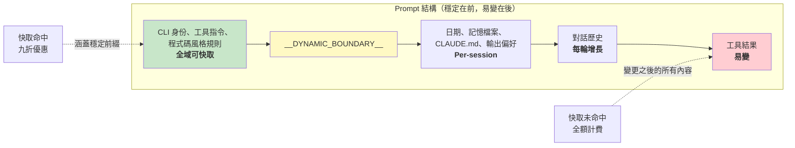

# 第十七章：效能——每一毫秒與每一個 Token 都重要

## 資深工程師的教戰手冊

Agentic 系統中的效能最佳化不是一個問題，而是五個：

1. **啟動延遲**——從按下按鍵到第一個有用輸出之間的時間。使用者會拋棄感覺啟動緩慢的工具。
2. **Token 效率**——上下文視窗中有用內容與開銷的比例。上下文視窗是最受限的資源。
3. **API 成本**——每一輪的美元金額。提示詞快取可以減少 90% 的成本，但前提是系統在各輪之間維持快取穩定性。
4. **渲染吞吐量**——串流輸出期間的每秒幀數。第十三章涵蓋了渲染架構；本章涵蓋保持其快速的效能測量與最佳化。
5. **搜尋速度**——在每次按鍵時，於一個包含 270,000 個路徑的程式碼庫中找到檔案的時間。

Claude Code 用從顯而易見的（memoization）到精妙的（用 26 位元 bitmap 來預篩選模糊搜尋）各種技術來攻克這五個問題。關於方法論的一個說明：這些不是理論上的最佳化。Claude Code 內建了 50 多個啟動分析檢查點，對 100% 的內部使用者和 0.5% 的外部使用者進行取樣。以下每一項最佳化都是由這些檢測數據驅動的，而非基於直覺。

---

## 在啟動時節省毫秒

### 模組層級的 I/O 平行化

進入點 `main.tsx` 刻意違反了「模組作用域不應有副作用」的原則：

```typescript
profileCheckpoint('main_tsx_entry');
startMdmRawRead();       // fires plutil/reg-query subprocesses
startKeychainPrefetch();  // fires both macOS keychain reads in parallel
```

兩個 macOS keychain 條目原本會造成約 65ms 的循序同步 spawn。透過在模組層級將兩者作為 fire-and-forget promise 啟動，它們與約 135ms 的模組載入同時執行——在此期間 CPU 原本會處於閒置狀態。

### API 預連線

`apiPreconnect.ts` 在初始化期間向 Anthropic API 發送一個 `HEAD` 請求，讓 TCP+TLS 握手（100-200ms）與設定工作重疊。在互動模式下，重疊是無限的——連線在使用者輸入時預熱。該請求在 `applyExtraCACertsFromConfig()` 和 `configureGlobalAgents()` 之後發送，確保預熱的連線使用正確的傳輸配置。

### 快速路徑分派與延遲匯入

CLI 進入點包含針對特化子命令的提前返回路徑——`claude mcp` 永遠不會載入 React REPL，`claude daemon` 永遠不會載入工具系統。重量級模組僅在需要時透過動態 `import()` 載入：OpenTelemetry（約 400KB + 約 700KB gRPC）、事件日誌、錯誤對話框、上游 proxy。`LazySchema` 將 Zod schema 的建構延遲到首次驗證時，把成本推移到啟動之後。

---

## 在上下文視窗中節省 Token

### 插槽保留：8K 預設值，64K 升級

影響最大的單一最佳化：

預設的輸出插槽保留為 8,000 個 token，在截斷時升級到 64,000。API 為模型的回應保留 `max_output_tokens` 的容量。SDK 的預設值是 32K-64K，但生產數據顯示 p99 輸出長度為 4,911 個 token。預設值過度保留了 8-16 倍，每輪浪費 24,000-59,000 個 token。Claude Code 將上限設為 8K，並在罕見的截斷情況下（不到 1% 的請求）以 64K 重試。對於 200K 的視窗，這是 12-28% 的可用上下文改善——而且是免費的。

### 工具結果預算

| 限制 | 值 | 用途 |
|------|-----|------|
| 單一工具字元數 | 50,000 | 超出時結果持久化到磁碟 |
| 單一工具 token 數 | 100,000 | 約 400KB 文字上限 |
| 單一訊息總計 | 200,000 字元 | 防止 N 個平行工具在一輪中耗盡預算 |

單一訊息總計是關鍵洞察。沒有它，「讀取 src/ 中的所有檔案」可能會產生 10 個平行讀取，每個返回 40K 字元。

### 上下文視窗大小調整

預設的 200K token 視窗可透過模型名稱的 `[1m]` 後綴或實驗處理擴展到 1M。當使用量接近上限時，一個 4 層壓縮系統會逐步摘要較舊的內容。Token 計數以 API 的實際 `usage` 欄位為錨點，而非用戶端估算——涵蓋提示詞快取額度、thinking token 和伺服器端轉換。

---

## 在 API 呼叫上省錢

### 提示詞快取架構



Anthropic 的提示詞快取基於精確的前綴匹配運作。如果前綴中間有一個 token 改變，之後的所有內容都是快取未命中。Claude Code 將整個 prompt 結構化為穩定的部分在前、易變的部分在後。

當 `shouldUseGlobalCacheScope()` 返回 true 時，動態邊界之前的 system prompt 條目會得到 `scope: 'global'`——兩個運行相同 Claude Code 版本的使用者共享前綴快取。當存在 MCP 工具時，全域作用域會被停用，因為 MCP schema 是 per-user 的。

### 黏性閂鎖欄位

五個布林欄位使用「黏性開啟」模式——一旦為 true，在整個 session 中保持 true：

| 閂鎖欄位 | 防止什麼 |
|----------|----------|
| `promptCache1hEligible` | Session 中途超額翻轉改變快取 TTL |
| `afkModeHeaderLatched` | Shift+Tab 切換破壞快取 |
| `fastModeHeaderLatched` | 冷卻期進入/退出雙重破壞快取 |
| `cacheEditingHeaderLatched` | Session 中途配置切換破壞快取 |
| `thinkingClearLatched` | 在確認快取未命中後翻轉思考模式 |

每一個都對應一個 header 或參數，如果在 session 中途改變，會破壞約 50,000-70,000 個 token 的快取 prompt。閂鎖犧牲了 session 中途的切換能力來保護快取。

### Memoized Session 日期

```typescript
const getSessionStartDate = memoize(getLocalISODate)
```

沒有這個，日期會在午夜改變，破壞整個快取前綴。過期的日期只是外觀問題；快取破壞則會重新處理整個對話。

### 區段 Memoization

System prompt 區段使用兩層快取。大部分內容使用 `systemPromptSection(name, compute)`，快取直到 `/clear` 或 `/compact`。核彈級選項 `DANGEROUS_uncachedSystemPromptSection(name, compute, reason)` 每輪都重新計算——命名慣例強制開發者記錄為什麼需要破壞快取。

---

## 在渲染中節省 CPU

第十三章深入涵蓋了渲染架構——打包的 typed array、基於池的 interning、雙緩衝，以及 cell 級別的 diff。這裡我們聚焦於保持其快速的效能測量和自適應行為。

終端機渲染器透過 `throttle(deferredRender, FRAME_INTERVAL_MS)` 節流至 60fps。當終端機失去焦點時，間隔加倍至 30fps。滾動排空幀以四分之一間隔運行以獲得最大滾動速度。這種自適應節流確保渲染永遠不會消耗超過必要的 CPU。

React Compiler（`react/compiler-runtime`）在整個程式碼庫中自動 memoize 元件渲染。手動的 `useMemo` 和 `useCallback` 容易出錯；compiler 從構造上就能做對。預先分配的凍結物件（`Object.freeze()`）消除了常見渲染路徑值的分配——在 alt-screen 模式下每幀節省一次分配，累積數千幀效果顯著。

完整的渲染管線細節——`CharPool`/`StylePool`/`HyperlinkPool` interning 系統、blit 最佳化、損壞矩形追蹤、OffscreenFreeze 元件——請見第十三章。

---

## 在搜尋中節省記憶體和時間

模糊檔案搜尋在每次按鍵時執行，搜尋 270,000 多個路徑。三個最佳化層將其控制在幾毫秒以內。

### Bitmap 預篩選器

每個被索引的路徑都有一個 26 位元的 bitmap，記錄它包含哪些小寫字母：

```typescript
// Pseudocode — illustrates the 26-bit bitmap concept
function buildCharBitmap(filepath: string): number {
  let mask = 0
  for (const ch of filepath.toLowerCase()) {
    const code = ch.charCodeAt(0)
    if (code >= 97 && code <= 122) mask |= 1 << (code - 97)
  }
  return mask  // Each bit represents presence of a-z
}
```

搜尋時：`if ((charBits[i] & needleBitmap) !== needleBitmap) continue`。任何缺少查詢字母的路徑會立即失敗——一次整數比較，沒有字串操作。拒絕率：對於像「test」這樣的廣泛查詢約 10%，對於包含罕見字母的查詢則超過 90%。成本：每個路徑 4 位元組，270,000 個路徑約 1MB。

### 分數上限拒絕與融合 indexOf 掃描

通過 bitmap 的路徑在昂貴的邊界/camelCase 評分之前會面臨分數上限檢查。如果最佳情況分數無法擊敗當前的 top-K 閾值，該路徑會被跳過。

實際的匹配將位置查找與間距/連續加分計算融合在一起，使用 `String.indexOf()`，這在 JSC（Bun）和 V8（Node）中都是 SIMD 加速的。引擎最佳化的搜尋比手動字元迴圈快得多。

### 非同步索引與部分可查詢性

對於大型程式碼庫，`loadFromFileListAsync()` 每約 4ms 的工作就讓出事件迴圈（基於時間而非計數——適應機器速度）。它返回兩個 promise：`queryable`（在第一個分塊時 resolve，啟用即時的部分結果）和 `done`（完整索引完成）。使用者可以在檔案列表可用後 5-10ms 內開始搜尋。

讓出檢查使用 `(i & 0xff) === 0xff`——一個無分支的模 256 運算，用來攤銷 `performance.now()` 的成本。

---

## 記憶相關性側查詢

有一項最佳化位於 token 效率和 API 成本的交叉點。如第十一章所述，記憶系統使用一個輕量的 Sonnet 模型呼叫——而非主要的 Opus 模型——來選擇要包含哪些記憶檔案。成本（在快速模型上最多 256 個輸出 token）與不包含不相關記憶檔案所節省的 token 相比微不足道。一個不相關的 2,000 token 記憶在浪費的上下文中的成本，比側查詢在 API 呼叫中的成本更高。

---

## 推測性工具執行

`StreamingToolExecutor` 在工具串流進入時就開始執行，在完整回應完成之前。唯讀工具（Glob、Grep、Read）可以平行執行；寫入工具需要獨佔存取。`partitionToolCalls()` 函式將連續的安全工具分組為批次：[Read, Read, Grep, Edit, Read, Read] 變成三個批次——[Read, Read, Grep] 並行、[Edit] 串行、[Read, Read] 並行。

結果始終按原始工具順序產出，以確保模型推理的確定性。一個兄弟 abort controller 會在 Bash 工具出錯時終止平行子行程，防止資源浪費。

---

## 串流與原始 API

Claude Code 使用原始串流 API 而非 SDK 的 `BetaMessageStream` 輔助工具。該輔助工具在每個 `input_json_delta` 上呼叫 `partialParse()`——在工具輸入長度上是 O(n²)。Claude Code 累積原始字串，在區塊完成時只解析一次。

一個串流看門狗（`CLAUDE_STREAM_IDLE_TIMEOUT_MS`，預設 90 秒）在沒有 chunk 到達時中止並重試，並在 proxy 失敗時回退到非串流的 `messages.create()`。

---

## 應用指南：Agentic 系統的效能

**審計你的上下文視窗預算。** 你的 `max_output_tokens` 保留與實際 p99 輸出長度之間的差距就是浪費的上下文。設定一個緊湊的預設值，在截斷時才升級。

**為快取穩定性而設計。** 你的 prompt 中的每個欄位要麼是穩定的，要麼是易變的。穩定的放前面，易變的放後面。將對話中途對穩定前綴的任何改變視為一個有美元成本的 bug。

**平行化啟動 I/O。** 模組載入是 CPU 密集型的。Keychain 讀取和網路握手是 I/O 密集型的。在 import 之前啟動 I/O。

**使用 bitmap 預篩選器進行搜尋。** 在昂貴的評分之前，一個廉價的預篩選器拒絕 10-90% 的候選項，這是一個顯著的勝利，每個條目只需 4 位元組。

**在重要的地方測量。** Claude Code 有 50 多個啟動檢查點，內部 100% 取樣，外部 0.5% 取樣。沒有測量的效能工作是猜測。

---

最後一個觀察：這些最佳化大多在演算法上並不複雜。Bitmap 預篩選器、環形緩衝區、memoization、interning——這些都是計算機科學基礎。精妙之處在於知道在哪裡應用它們。啟動分析器告訴你毫秒在哪裡。API 的 usage 欄位告訴你 token 在哪裡。快取命中率告訴你錢在哪裡。先測量，再最佳化，永遠如此。
